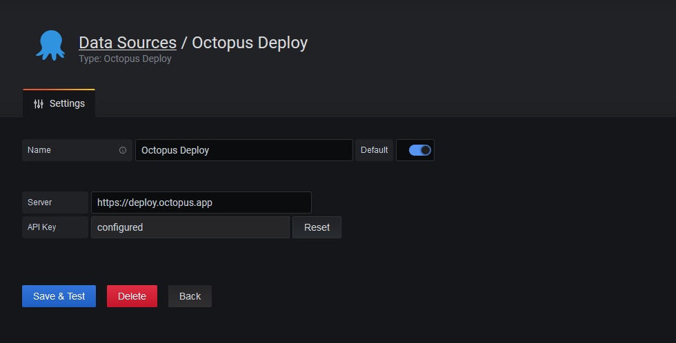
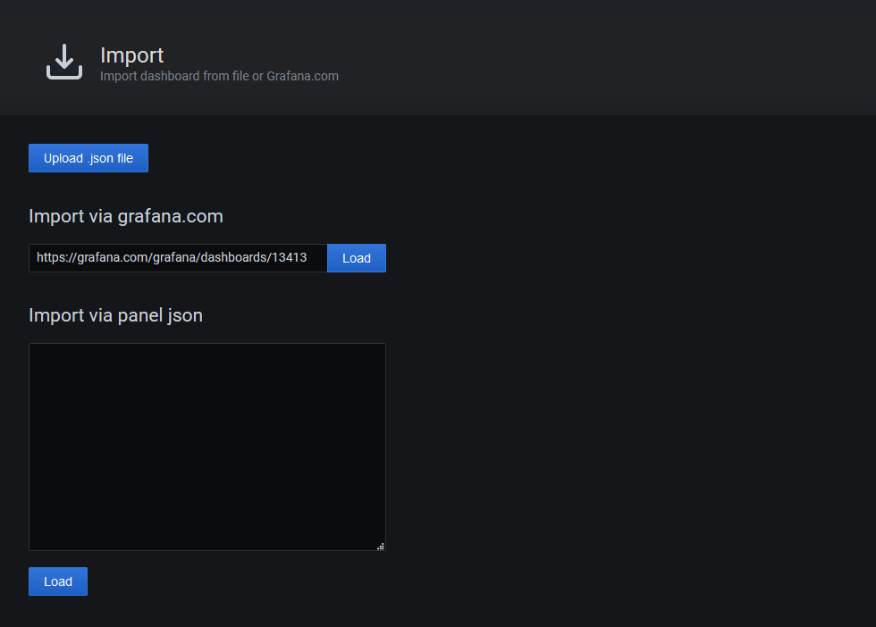
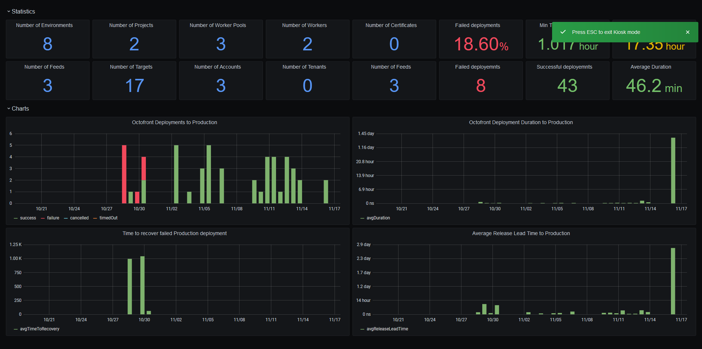
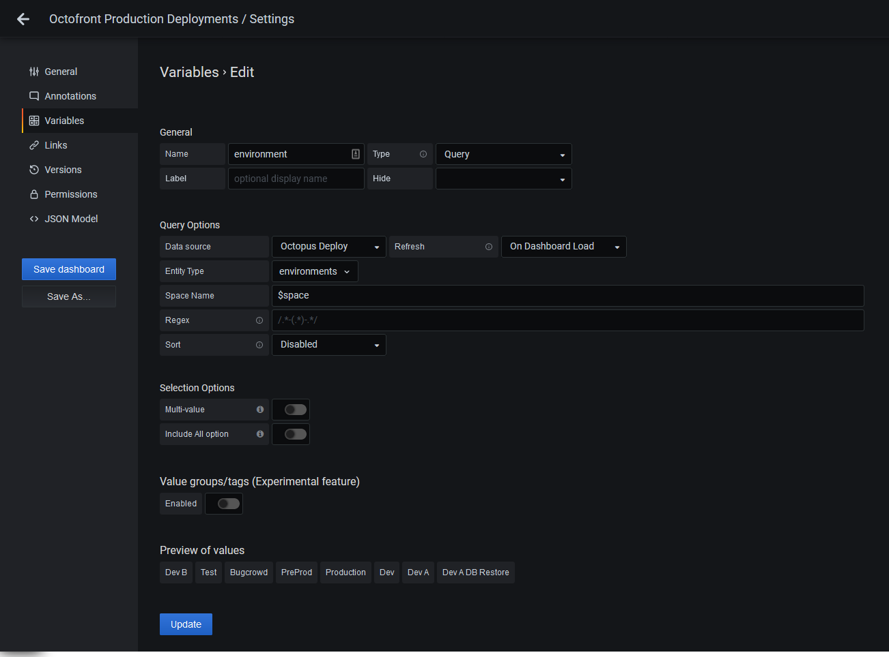
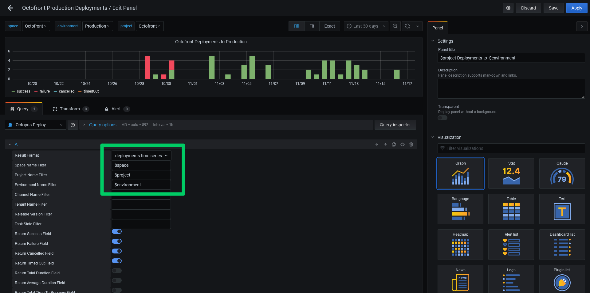

Octopus has long exposed data on deployments through the `/api/reporting/deployments/xml` API endpoint. With the EAP release of the Grafana datasource for Octopus, this information can be easily visualized, allowing teams to track their deployment success and frequency.

In this post and screencast, I'll show you how to install the Grafana plugin, import the sample dashboard, and customize the charts to show information important to you.

## Screencast

<iframe width="900" height="506" src="https://www.youtube.com/embed/bPmjJkkEa3g" frameborder="0" allow="accelerometer; autoplay; clipboard-write; encrypted-media; gyroscope; picture-in-picture" allowfullscreen></iframe>

## Installing the plugin

The plugin is made available through the project's [GitHub releases page](https://github.com/OctopusDeploy/OctopusGrafanaDataSource/releases).

The ZIP file needs to be extracted to a subdirectory under the Grafana plugin directory. On Linux this directory is typically `/var/lib/grafana/plugins`, and for Windows the default directory is `INSTALL_DIR\data\plugins`.

For this example I am deploying to Ubuntu 20.04, and I will extract the zip file with the command:

```
unzip octopus_grafana_datasource.zip -d /var/lib/grafana/plugins/octopus
```

## Allowing the unsigned plugin to be loaded

Grafana makes a distinction between signed and unsigned plugins. The Octopus plugin is unsigned and must be explicitly permitted in Grafana. This is done by editing the `grafana.ini` file. On my Ubuntu VM this is found at `/etc/grafana/grafana.ini`.

The setting we need to configure is `allow_loading_unsigned_plugins` under the `[plugins]` section. This setting must list the ID of the Octopus plugin:

```
[plugins]
allow_loading_unsigned_plugins = octopus-deploy-xmlfeed
```

Grafana must be restarted to load the new configuration and to then load the Octopus plugin.

## Configuring the datasource

The Octopus datasource has two properties:

* The Octopus server 
* The Octopus API key



*The Octopus datasource configuration.*

## Importing the sample dashboard

We have provided a sample dashboard that shows common deployment metrics. This dashboard is available from the [Grafana dashboard gallery](https://grafana.com/grafana/dashboards/13413). To import it, click the **Dashboards** icon on the left hand panel, click **Manage**, and then click **Import**. The sample dashboard URL of https://grafana.com/grafana/dashboards/13413 can be loaded under the **Import via grafana.com** option:



*Importing the sample dashboard.*

After you select the datasource created above and complete the import, the following dashboard is displayed:



*The sample dashboard.*

## Dashboard variables

The plugin exposes the spaces, environments, projects, channels and tenants as dashboard [query variables](https://grafana.com/docs/grafana/latest/variables/variable-types/add-query-variable/): 



*An example of the environments configured as a query variable.*

These variables are then presented at the top of the dashboard to customize which deployments are presented in the graphs. The variables can be referenced in the queries through the **Space Name Filter**, **Project Name Filter**, **Environment Name Filter**, **Channel Name Filter**, and **Tenant Name Filter** fields:



*Variables used in a query.*

## Available metrics

A number of metrics are exposed by the plugin:

* **Success**: set to 1 for successful deployments, and 0 otherwise.
* **Failure**: set to  1 for failed deployments, and 0 otherwise.
* **Cancelled**: set to 1 for cancelled deployments, and 0 otherwise.
* **Timed Out**: set to 1 for timed out deployments, and 0 otherwise.
* **Total Duration**: which is the total time deployments took within the given time bucket.
* **Average Duration**: which is the average time deployments took within the given time bucket.
* **Total Time to Recovery**: which is the total time between a failed deployment and the next successful deployment within a given time bucket.
* **Average Time to Recovery**: which is the average time between a failed deployment and the next successful deployment within a given time bucket.
* **Total Deployment Lead Time**: which is the total time between the creation of a release and the completed deployment within a given time bucket.
* **Average Deployment Lead Time**: which is the average time between the creation of a release and the completed deployment within a given time bucket.

:::hint
Calculating the **Total Deployment Lead Time** and **Average Deployment Lead Time** values requires additional calls to the Octopus API, and so if these values are not needed they should not be selected.
:::

## Conclusion

We hope the Grafana plugin provides insights into how well your deployments are progressing. This is an EAP release, so we do expect bugs and functionality gaps, and it is only recommended for testing at this stage, but if you have any suggestions or issues please reach out to us via the [usual support channels](https://octopus.com/support).

Happy deployments!
