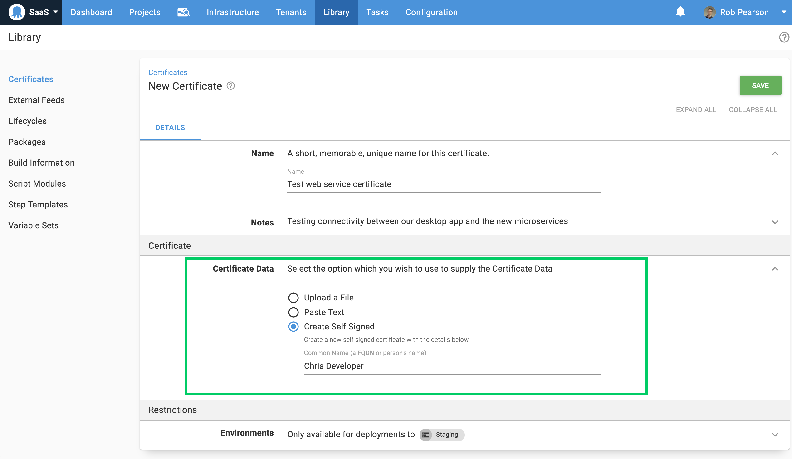
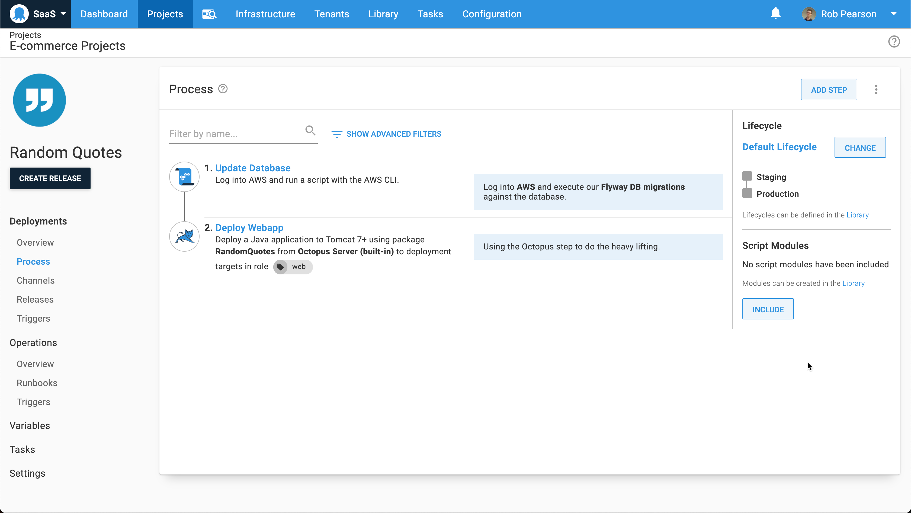
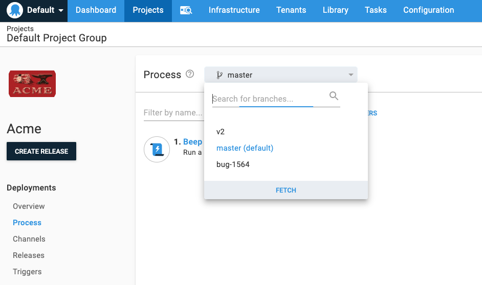

I'm pleased to share that Octopus 2020.5 is now available. This release has some solid improvements; however, it's a quieter release as we're doing a lot of behind-the-scenes work for our Config as Code feature.

Octopus 2020.5 is the [fifth of six releases in 2020](/blog/2020-03/releases-and-lts/index.md), and it includes six months of long-term support. The following table shows our current versions with long-term support:

| Release               | Long-term support  | LTS end date |
| --------------------- | ------------------ | ------------ |
| Octopus 2020.5        | Yes                | 2021-05-30   |
| Octopus 2020.4        | Yes                | 2021-03-21   |
| Octopus 2020.3        | Yes                | 2021-01-20   |
| Octopus 2020.2        | Expired            | 2020-09-30   |
| Octopus 2020.1        | Expired            | 2020-08-24   |

## Create self-signed certificates in the certificate library 

Creating a self-signed certificate for development and testing purposes isn't tricky, but Octopus now makes this fast and simple. You can now create a self-signed certificate in the certificate library (**{{ Library,Certificates }}**) and take advantage of it in your automation processes. This update makes it more convenient to test the execution of new or updated deployments and runbooks involving certificates. You can also download the certificate if you need to use it with command-line interfaces (CLI), desktop applications or other tasks.

[Learn more](https://octopus.com/docs/deployment-examples/certificates)

## GitHub container registry support 

Octopus now supports [GitHub container registry (GHCR)](https://docs.github.com/en/free-pro-team@latest/packages/getting-started-with-github-container-registry/about-github-container-registry) as a package source for automated deployment and runbook processes. We technically already supported GHCR, however, GitHub has not implemented the Docker catalog API to allow searching for repositories which produced confusing errors. We now handle these inconsistencies more gracefully so you can take advantage of GHCR feeds without any issues.

[Learn more](https://github.com/octopusdeploy/issues/issues/6567)

## Kubernetes updates

This release includes two small updates to improve our Kubernetes support driven by customer feedback.

**Expose envFrom fields in Deploy Kubernetes containers step**

Kubernetes 1.16 exposed the `envFrom` property to allow the contents of a secret or configmap to be created as environment variables. Octopus now supports `envFrom` fields to provide a way for multiple values to be included in a deployment.

[Learn more](/blog/2020-12/k8s-envfrom/index.md)  
  
**Allow DaemonSets and StatefulSets to be created and deployed**

The Deploy Kubernetes containers step allows Octopus to create Kubernetes deployments in a cluster. We have updated this step in the Octopus Web Portal to support `DaemonSets` and `StatefulSets` to make it more useful.

[Learn more](https://github.com/octopusdeploy/issues/issues/6551)

## Terraform update

Octopus now supports support HCL2 and Terraform 0.12+ for inline scripts. This update means you get rich syntax highlighting for modern Terraform scripts in the Octopus Web Portal.

[Learn more](https://github.com/octopusdeploy/issues/issues/6562)

## Add markdown notes to automation steps

You can now annotate your DevOps automation processes with markdown notes. Add text-based notes, with markdown formatting support to any deployment or runbook step, and the process summary will display it.

This change is useful to help your future-self, and other team members, to understand complex automated processes at a glance.

[Learn more](https://github.com/octopusdeploy/issues/issues/6608)

## Config as Code Update

We wanted to share a preview of our Config as Code feature in November 2020, but it’s not ready yet. We underestimated how long some of the core components would take to build, and this feature is an especially tricky one to ship incrementally.

Fortunately, we’re making excellent progress, and we’ve completed some significant parts of the overall feature.
* Configuring projects to use a git repository.
* Switching branches in the Octopus Web Portal, viewing and editing the deployment process on different branches.
* Changes can be committed, including adding a commit message.
* The resulting configuration is stored in git in a format based on HCL.
* The branch can be specified when creating releases, selecting the version of the deployment process to use. This will eventually support selecting tags or commits also.

What's outstanding? The short answer is a lot of small things. Moving a chunk of Octopus from the database, which has a single version, indexes, foreign keys, etc., to a git repository with text files and limitless branches, leaves a lot of loose ends.

Click the learn more link below to read more about the factors that have gone into designing and building our config as code support. We explicitly call out several anti-patterns that we have intentionally avoided. 

[Learn more](https://octopus.com/blog/shaping-config-as-code)

## Breaking changes

This release includes two breaking changes.

* Importing an Action Template with a package reference will now validate the Feed Id. This change means that [Feed View permission is required](https://github.com/OctopusDeploy/issues/issues/6582) to import an Action Template with a package reference.
* Octopus Cloud added the ability to record some metrics so we could do performance tuning. This functionality is no longer used, and we have removed this support. We have updated [Octopus DSC](https://github.com/OctopusDeploy/OctopusDSC/pull/266) to deprecate the `LogTaskMetrics` and `LogRequestMetrics` properties to reflect this.

## Upgrading

Octopus Cloud users are already running this release, and self-hosted Octopus customers can [download](https://octopus.com/downloads/2020.5.0) the latest version now.  

As usual, the [steps for upgrading Octopus Deploy](https://octopus.com/docs/administration/upgrading) apply. Please see the [release notes](https://octopus.com/downloads/compare?to=2020.5.0) for further information.

## What’s coming in Octopus 2020.6?

Check out our [public roadmap](https://octopus.com/roadmap) to see what’s coming next and register for updates.

## Conclusion

Octopus 2020.5 is now generally available, and it includes a collection of improvements to support self-signed certificates, Terraform updates, Kubernetes updates, automation step notes, and a ton of behind-the-scenes changes to support our upcoming Config as Code feature.

Feel free to leave a comment, and let us know what you think! Happy deployments!

## Related posts

* [Deconstructing blue/green deployments in Kubernetes](/blog/2020-12/deconstructing-blue-green-deployments/index.md)
* [Creating multi-environment Kubernetes deployments](/blog/2020-12/multi-environment-k8s-deployments/index.md)
* [Exposing Octopus variables to a Kubernetes container](/blog/2020-12/k8s-envfrom/index.md)
* [Shaping Config as Code](/blog/2020-11/shaping-config-as-code/index.md)
