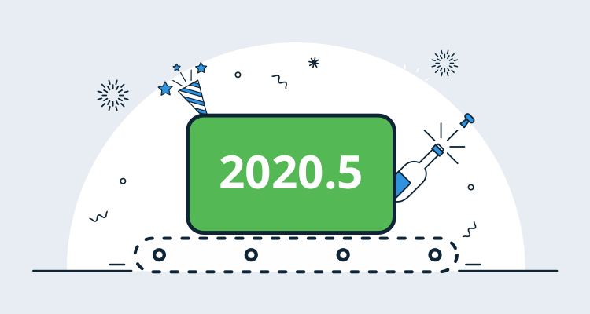

I'm pleased to share that Octopus 2020.5 is now available. This is a quieter release as we're doing a lot of behind-the-scenes work but it's still has some solid improvements.

This release is the [fifth of six in 2020](/blog/2020-03/releases-and-lts/index.md), and it includes six months of long-term support. The following table shows our current versions with long-term support:

| Release               | Long-term support  | LTS end date |
| --------------------- | ------------------ | ------------ |
| Octopus 2020.5        | Yes                | 2021-05-30   |
| Octopus 2020.4        | Yes                | 2021-03-21   |
| Octopus 2020.3        | Yes                | 2021-01-20   |
| Octopus 2020.2        | Expired            | 2020-09-30   |
| Octopus 2020.1        | Expired            | 2020-08-24   |

## Create self-signed certificates in the certificate library 

Creating a self-signed certificate for development and testing purposes isn't difficult but Octopus now makes this faster and simpler. You can create a self-signed certificate in the Certificate library (**{{ infrastructure,Deployment Targets }}**) and take advantage of it in your automation processes. This is very handy testing the deployment of new or updated services. You can also download it if you need to use it with command line interfaces (CLI), desktop applications or other tasks.

[Learn more](https://octopus.com/docs/deployment-examples/certificates)

## GitHub container registry support 

## Kubernetes Updates

This release includes two small updates to improve our Kubernetes support driven by customer feedback.

**Expose `envFrom` fields in Deploy Kubernetes containers step**

Kubernetes 1.16 exposed the envFrom property to allow the contents of a secret or configmap to be created as environment variables. Octopus now supports `envFrom` fields to provides a way for multiple values to be included in a deployment.

[Learn more](/blog/2020-12/k8s-envfrom/index.md)  
  
**Allow `Daemonsets` and `Statefulsets` to be created and deployed**

The Deploy Kubernetes containers step allows K8s deployments to be created and in a cluster. `DaemonSets` and `StatefulSets` are very similar in the fields the accept (the container definitions are the same for example). We have updated the Octopus Web Portal to provider an interface for these additional resources.

[Learn more](https://github.com/octopusdeploy/issues/issues/6551)

## Terraform update

Octopus now supports support HCL2 and Terraform 0.12+ for inline scripts. This means you get rich syntax highlighting for modern Terraform scripts in the Octopus Web Portal.

[Learn more](https://github.com/octopusdeploy/issues/issues/6562)

## Add markdown notes to automation steps

You can now annotate your DevOps automation processes with markdown notes. Add text-based notes, with markdown formatting support, to any deployment or runbook step and it will be displayed in the process summary.

This is a useful to help future-self or other team meber to understand complex automated processes at a glance.

## Config as Code Update

TODO: Steal a single screenshot from Michael's blog post.Screenshot

Keep reading to learn more about the updates.

[Learn more](/blog/2020-11/shaping-config-as-code/index.md)

## Breaking changes

This release doesn’t include any breaking changes.

## Upgrading

Octopus Cloud users are already running this release, and self-hosted Octopus customers can [download](https://octopus.com/downloads/2020.5.0) the latest version now.  

As usual, the [steps for upgrading Octopus Deploy](https://octopus.com/docs/administration/upgrading) apply. Please see the [release notes](https://octopus.com/downloads/compare?to=2020.5.0) for further information.

## What’s coming in Octopus 2020.6?

Check out our [public roadmap](https://octopus.com/roadmap) to see what’s coming next and register for updates. TODO

## Conclusion

Octopus 2020.5 is now generally available, and it includes 

Feel free to leave a comment, and let us know what you think! Happy deployments!

## Related posts

* [title](/blog/2020-12/title/index.md)
* [title](/blog/2020-12/title/index.md)
* [title](/blog/2020-12/title/index.md)
* [title](/blog/2020-12/title/index.md)
