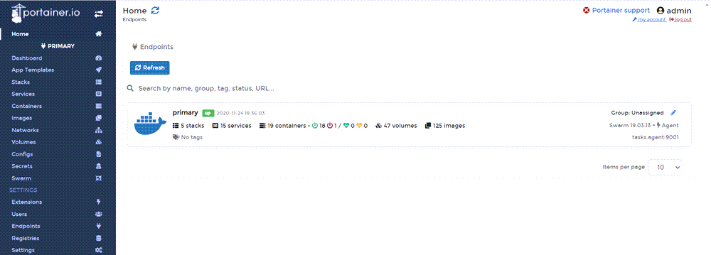
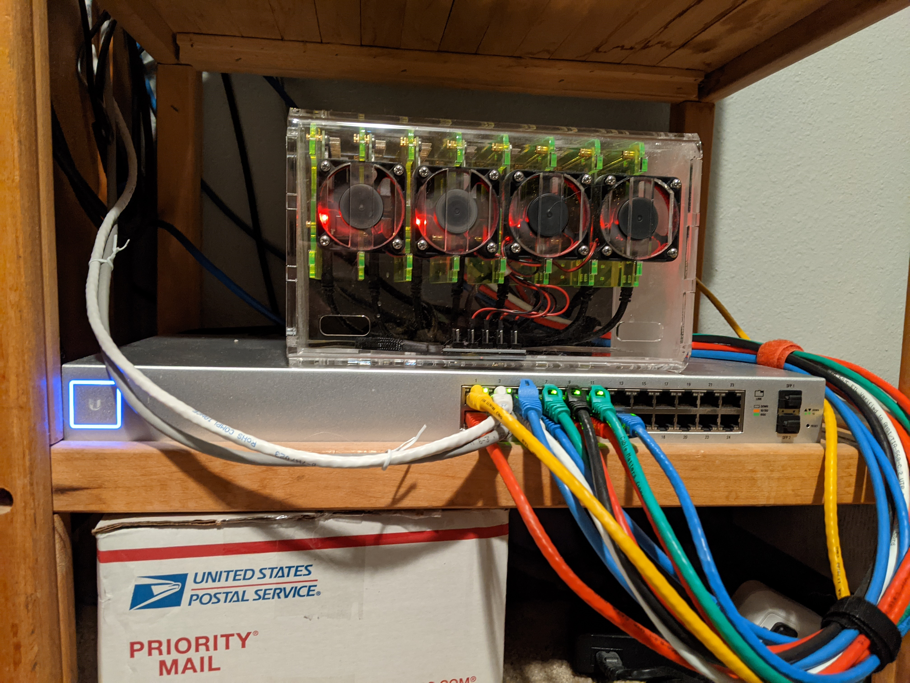

In a [previous post](https://octopus.com/blog/raspberry-pi-cluster-lessons-learned), I shared my lessons learned in using Raspberry Pi machines in a Docker Swarm.  Here are some more lessons I learned since the last post (numbering starts where the other post left off).

## Update to configuration and networking
If you recall, I had 5 Raspberry Pi machines in that cluster.  At the time, I was limited to 5 machines due to the 8-port network switch they were connected to being shared with other devices.  For various reasons, I decided to upgrade all of my network gear to [Unifi](https://www.ui.com).  I replaced the 8-port switch with a 24-port Unifi switch (the 16-port option was had PoE capability and was $100 more than the 24 and who doesn't want more ports, right?).  Now that I had more ports available, I filled the remaining 3 open slots in the case with more Raspberry Pi machines.  With a total of 8 machines to play with, I removed one Pi from the Docker Swarm so I could create a Kubernetes (K8s) cluster with 4 machines.  

## Lesson 5:  Raspberry Pi 4 has a 64-bit processor, but Raspberry Pi OS is still 32-bit
As I stated in the last post, not all containers will run in the ARM architecture.  However, I did find that there are a number of containers that will run on ARM64.  With my original project, I had attempted to run these ARM64 compatible containers, but they all failed claiming incompatible architecture.  This was something that confused me as I read that the processor in the Raspberry Pi 4 is 64-bit chip.  What I failed to realize was that the Raspberry Pi OS operating system is still only 32-bit, which makese sense because it wasn't until recently they offered a model with greater than 4GB of RAM.  With an 8GB model now available, Raspberry Pi OS does have a 64-bit version, but it's still in Beta.

I did some more research and found that [Ubuntu has a 64-bit, ARM compatible version](https://ubuntu.com/download/raspberry-pi) available.  Being somewhat familiar with Ubuntu, I loaded this OS on to 4 of my Raspberry Pi machines.

## Lesson 6: ARM64 compatible containers
Other than learning about cluster computer, the other goal of my Raspberry Pi project was to reduce the load on my Hypervisor by using containers instead of VMs.  One of the VMs I wanted to replace was the one that was running MySQL.  The only containers I could find on [Docker Hub](https://hub.docker.com) than ran on ARM were unofficial, old, and sparsely updated ports of MySQL for Raspberry Pi.  Unfortunately, the database deployment technologies I was using would complain that they were too old and required purchasing of licences ... boo!  As luck would have it, the [MySQL-Server](https://hub.docker.com/r/mysql/mysql-server) container happened to be ARM64 compatible!  With a couple of YAML files, I was able to quickly spin up MySQL containers running in my K8s cluster!

```yaml mysql-deployment.yaml
apiVersion: apps/v1
kind: Deployment
metadata:
  name: mysql-dev-deployment
spec:
  replicas: 1
  selector:
    matchLabels:
      component: mysqlserver-dev
  template:
    metadata:
      labels:
        component: mysqlserver-dev
    spec:
      containers:
        - name: mysqlserver-dev
          image: mysql/mysql-server
          ports:
            - containerPort: 3306
          env:
            - name: MYSQL_ROOT_PASSWORD
              value: "A_Password_I_will_not_share"
            - name: MYSQL_ROOT_HOST
              value: "%"
```
```yaml mysql-loadbalancer.yaml
apiVersion: v1
kind: Service
metadata:
  name: loadbalancer-dev-mysql
spec:
  selector:
    component: mysqlserver-dev
  ports:
    - port: 3306
      targetPort: 3306
      name: mysqldevport
  externalIPs:
    - 192.168.1.64
  type: LoadBalancer
```

With this container running, I was able to run a modern version of MySQL and test the various deployment methods (Dbup, Flyway, Liquibase, and RoundhousE)!

## Lesson 7: Better Swarm monitoring
For my original Swarm project, I had followed a [guide](https://howchoo.com/g/njy4zdm3mwy/how-to-run-a-raspberry-pi-cluster-with-docker-swarm) which had you run a container called Visualizer.  This container displayed which containers were running on which node within your cluster, but little else.  My colleague, Adam Close, told me about  [Portainer](https://www.portainer.io/), a tool for container management.



Portainer gives you the ability to not only see what containers are running in your Swarm, it gives you the ability to manage the swarm itself.  The left-hand navigation gives you an indication as to its capabilities


Needless to say, Portainer was a much nicer tool to use for container management.

## Conclusion
This project continues to be quite fun as I learn more and more about Linux, Docker, and Kubernetes.  It also gives me something to do while the COVID-19 issue drags on.



PS - I'm aware that my cable managment skill leave a bit to be desired ;)