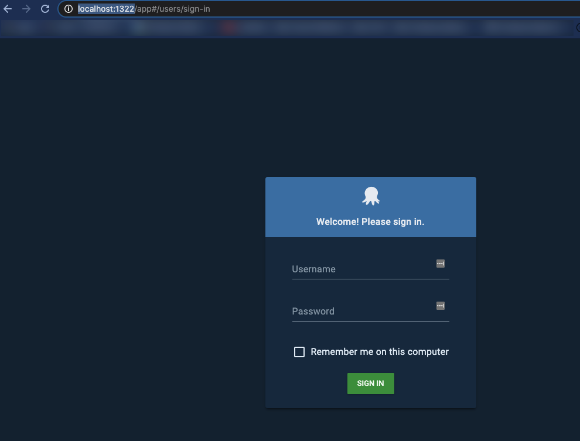
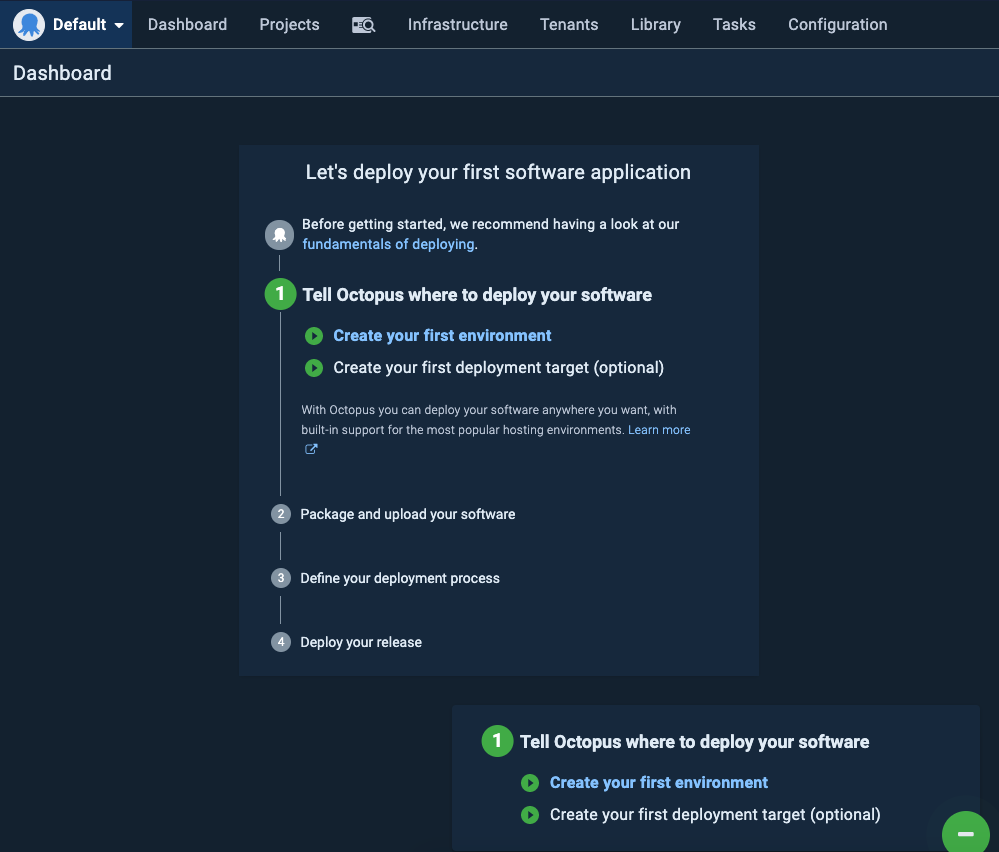

Running Octopus Deploy comes in all shapes and sizes. On-prem, cloud, and even in Docker. You can run Octopus Deploy on a Docker container for both testing and production environments.

Containerizing Octopus Deploy not only gives you a new standard approach instead of using an on-prem monolithic environment but allows you to use one of the smallest form-factors around for getting an application up and running.

In this blog post, you'll learn how to get a Docker container up and running in five minutes on localhost.

## Prerequisites

To follow along with this blog post, you'll need the following:

- Pre-existing knowledge of Octopus Deploy
- A [localhost](http://localhost) running Windows or MacOS
- Docker desktop installed, which you can find [here](https://www.docker.com/products/docker-desktop).
- A code editor like VS Code

## The Environment Configuration

The first step in creating a local containerized Octopus Deploy environment is setting up a `.env` configuration file. The `.env` allows you to save environment variables for certain values of the Docker Compose configuration. That way, you can set variables instead of hardcoding values.

1. Open up a text editor and create a new file called `.env`
2. Add in the following code to the `.env` file.

This containerized environment is supposed to be for testing/development purposes only, which is why you will see the passwords in the `.env` configuration file. This is not recommended for production-based deployments.

```bash
SA_PASSWORD=P@ssw0rd!
OCTOPUS_ADMIN_USERNAME=admin
OCTOPUS_ADMIN_PASSWORD=SecreTP@assw0rd
```

Once the values are added to the `.env` file, it's time to create the Docker Compose file.

## The Docker Compose File

The Docker Compose file is what creates a running container for the Octopus Deploy environment to run on localhost. The Compose file consists of two configurations:

- The SQL Docker image used for the Octopus Deploy backend
- The Octopus Deploy Docker image

1. Create a new file called `docker-compose.yml`. Ensure that it's saved in the same directory as the `.env` configuration file. This tells Docker that you're using a Compose file to create an environment.
2. The first section of the Docker Compose file will be to set up the configuration for the database. The database configuration is comprised of using the Linux SQL image. Then, you set up the environment by accepting the EULA and passing the SA password. After that, you specify the port that you want to use and the health check to confirm that the database comes up successfully.

```bash
version: '3'
services:
   db:
    image: mcr.microsoft.com/mssql/server
    environment:
      SA_PASSWORD: ${SA_PASSWORD}
      ACCEPT_EULA: 'Y'
    ports:
      - 1401:1433
    healthcheck:
      test: [ "CMD", "/opt/mssql-tools/bin/sqlcmd", "-U", "sa", "-P", "${SA_PASSWORD}", "-Q", "select 1"]
      interval: 10s
      retries: 10
```

  3. The second part of the Docker Compose file is where you configure the Octopus Deploy portion. The official Octopus Deploy image is used and the environment is set up to not only accept the EULA, but to set the Octopus Deploy username, password, and the database connection string to the SQL DB container that was set up previously. The ports are then specified for Octopus Deploy and there is a `depends_on` switch to ensure that the database is configured prior to the Octopus Deploy container running. The condition is the ensure that the database service is healthy.

```bash
octopus:
    image: octopusdeploy/octopusdeploy:latest
    environment:
       ACCEPT_EULA: "Y"
       OctopusAdminUsername: ${OCTOPUS_ADMIN_USERNAME
       OctopusAdminPassword: ${OCTOPUS_ADMIN_PASSWORD}"
       DB_CONNECTION_STRING: "Server=db,1433;Initial Catalog=Octopus;Persist Security Info=False;User=sa;Password=${SA_PASSWORD};MultipleActiveResultSets=False;Connection Timeout=30;"
    ports:
    - 1322:8080
    - 10943:10943
    depends_on:
      db:
        condition: service_healthy
    stdin_open: true
```

All said and done, the entire `docker-compose.yml` file should look like the below.

```bash
version: '3'
services:
   db:
    image: mcr.microsoft.com/mssql/server
    environment:
      SA_PASSWORD: ${SA_PASSWORD}
      ACCEPT_EULA: 'Y'
    ports:
      - 1401:1433
    healthcheck:
      test: [ "CMD", "/opt/mssql-tools/bin/sqlcmd", "-U", "sa", "-P", "${SA_PASSWORD}", "-Q", "select 1"]
      interval: 10s
      retries: 10

   octopus:
    image: octopusdeploy/octopusdeploy:latest
    environment:
       ACCEPT_EULA: "Y"
       ADMIN_USERNAME: ${OCTOPUS_ADMIN_USERNAME
       ADMIN_PASSWORD: ${OCTOPUS_ADMIN_PASSWORD}"
       DB_CONNECTION_STRING: "Server=db,1433;Initial Catalog=Octopus;Persist Security Info=False;User=sa;Password=${SA_PASSWORD};MultipleActiveResultSets=False;Connection Timeout=30;"
    ports:
    - 1322:8080
    - 10943:10943
    depends_on:
      db:
        condition: service_healthy
    stdin_open: true
```

## Run the Docker Compose File

Now that the Docker Compose and environment configurations are set, it's time to run the Docker Compose file.

From the directory where both the `.env` and `docker-compose.yml` files are, run the following command to create the Octopus Deploy and SQL containers.

```bash
docker-compose up
```

You will begin to see the Docker Compose file running.

Once the Docker Compose file runs, open up a web browser and go to the following URL to access the local Octopus Deploy instance.

```bash
http://localhost:1322/
```

You will now see the Octopus Deploy login page.



Log in using the Octopus deploy username and password specified in the `.env` configuration file.



You are now successfully log into Octopus Deploy and can start using it.

If you'd like to find this code in GitHub, you can go to the following repository: [https://github.com/AdminTurnedDevOps/OctopusDeploy-Local-Docker-Env](https://github.com/AdminTurnedDevOps/OctopusDeploy-Local-Docker-Env)