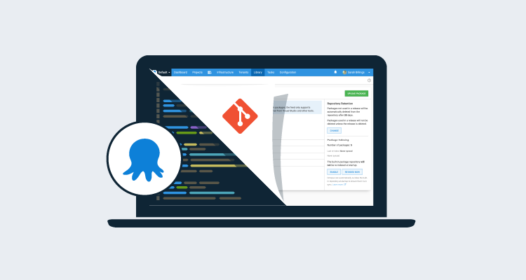
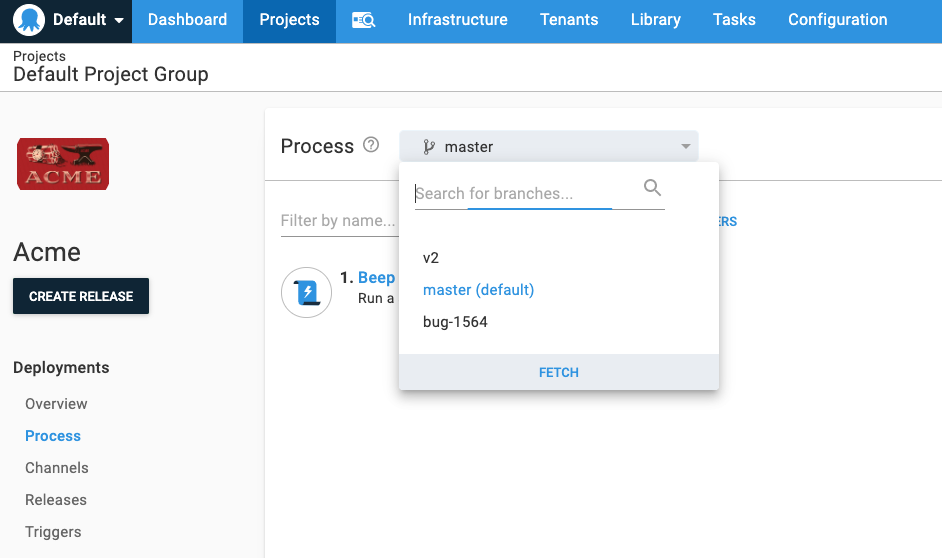
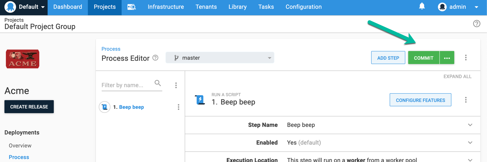
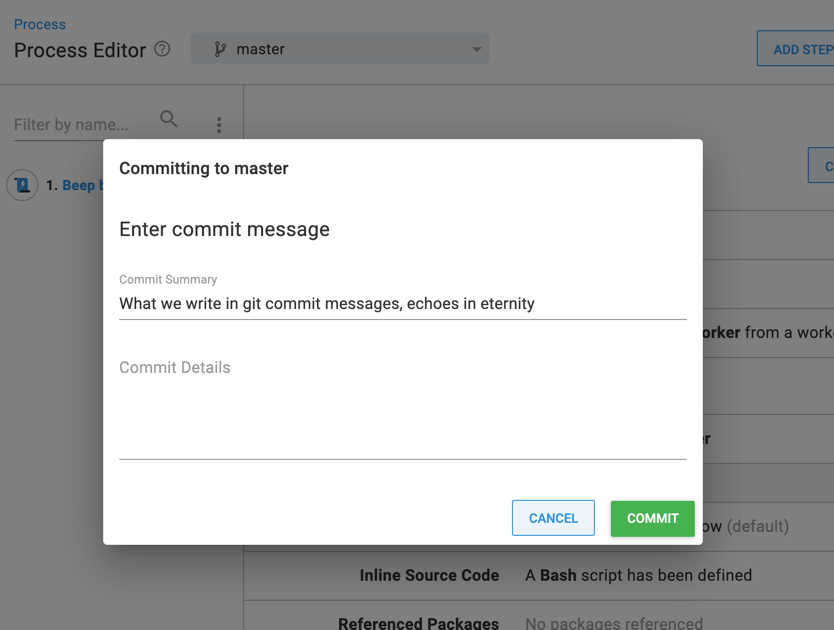
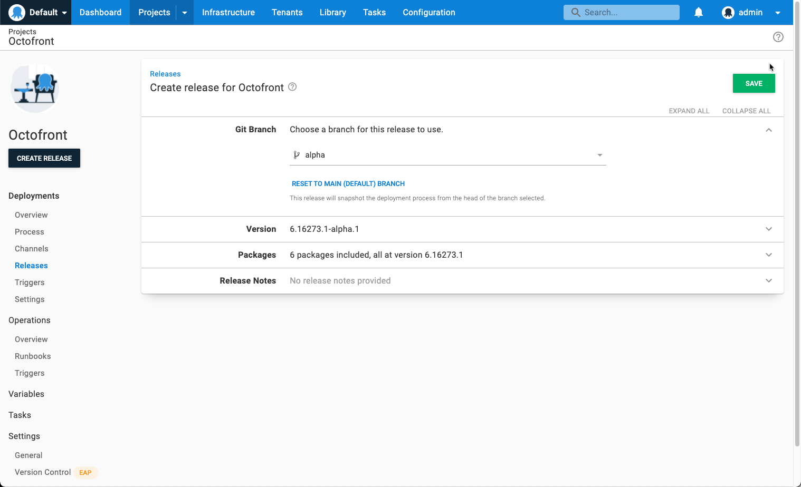
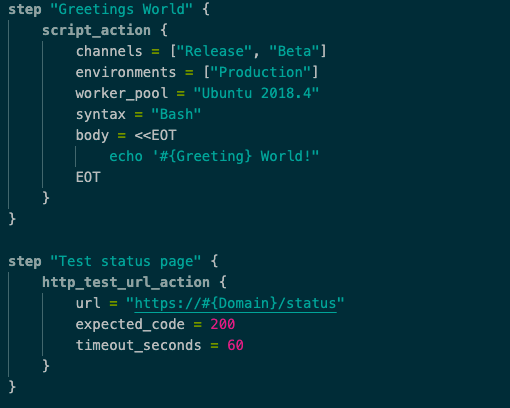

We’ve been busy recently building _Config as Code_ support for Octopus Deploy.  In this post, we’ll look at some of the factors that have affected the shaping of this feature: 

- Why we’re building Config as Code 
- Anti-patterns we wanted to avoid 
- Design decisions

But before we do, we should define what we mean by “Config as Code”. We are referring to a version-controlled (Git) text representation of an Octopus project. Today, when you configure a project in Octopus, the configuration is stored as records in a relational database. This feature is basically taking some of that data and persisting it as files in a Git repository rather than the database.  

## Why Config as Code?

Over the past few years, version-controlling Octopus configuration has been comfortably our most commonly requested feature. We understand why. The benefits are compelling and include:

- **History**: Git is a time-machine for code, and being able to view the what, when, and who for your Octopus configuration alongside application code is undeniably useful. 
- **Branching**: Today, there is a single instance of the deployment process. This makes testing changes difficult, as when a release is created it will use the current deployment process. Git branches make it possible to have as many versions of the deployment process as you like, allowing iterating on changes without impacting stability.   
- **Single source of truth**: Having application code, build scripts, and deployment configuration all living together makes everyone feel warm and fuzzy.
- **Cloning**: Imagine being able to copy a `.octopus` folder to a brand new Git repository (maybe change a few variables) and use that as the Octopus project starter.

There are two highly voted UserVoice suggestions ([1](https://octopusdeploy.uservoice.com/forums/170787-general/suggestions/15698781-version-control-configuration), [2](https://octopusdeploy.uservoice.com/forums/170787-general/suggestions/35362726-allow-variables-to-be-version-controlled)), but even more convincing were the many customer conversations. 

And finally, we want this! We use Octopus Deploy to deliver Octopus Deploy, and the first litmus test for a feature is whether we are excited about it. We are.  

## Anti-patterns 

We are certainly not the first product to implement this feature. Many of the tools in our ecosystem have Git integration. This gave us the opportunity to play with various implementations and to develop a sense of what made the difference between an enjoyable, and not so enjoyable, experience. 

It became clear that there are a few patterns we would like to avoid.

### Anti-pattern #1: Git DB

It is tempting to think of Git as "just another database", and to simply swap out one persistence layer for another. So changes are persisted in a Git repository, but none of the real power of Git is enabled. Branches aren’t supported, commit messages can’t be supplied, and text records may not be human-readable, etc.   

The only benefit of Git in this scenario is the historical record, which certainly isn’t nothing, but even this is compromised.

Replacing `dbTransaction.Commit()` with `gitRepo.Push()` might be the quickest way, but as a user, it’s rather disappointing.

### Anti-pattern #2: Baby with the bathwater 

In this anti-pattern, users can opt-in to Git integration, but only if they are willing to forfeit other features. 

Having spent the past several months building this feature, it’s very easy to see how this happens, and sometimes it’s inevitable. 

For an application built on a relational database, it’s difficult to ensure all the various features still function when a chunk of the application data is no longer stored in the database and no longer has a single version.

It’s tempting to simply disable them and convince yourself it’s the user’s choice. And honestly, in early releases of this feature, we will disable some functionality, but wherever possible, we are striving hard to ensure the decision to enable Git comes with as few compromises as possible. 

### Anti-pattern #3: Obfuscation via abstraction

In this pattern, Git concepts are abstracted in the application.  An example might be, branching exposed as a “draft” metaphor.

There’s nothing necessarily wrong with this, and done right, it can be very powerful. But it’s risky for an application like Octopus, where users are likely to have an understanding of Git concepts. 

Where possible, we’ve used Git terminology and concepts rather than trying to hide them under abstractions. 

### Anti-pattern #4: YAMSONXML hell

We firmly believe that wanting Git integration does not imply wanting to forgo all UI assistance. We decided early on that we were determined not to force a choice between Git integration and a good UX. 

Having a human-readable text representation of your config, which you can view history, branch, compare, and merge, is empowering.  Staring at a blinking cursor in an empty text file is not.

Even more than an _automation_ tool, Octopus is a _collaboration_ tool. Making editing a text file the only way to make changes locks many groups of people out. 

It just feels like a step backward.

## Design decisions

We decided we wanted the best of both worlds: the superpowers of Git _and_ the usability of Octopus. Let's take a look at some specific design decisions:  

### Branches as a first-class concept

Branches are Git’s superpower, and we want to leverage them as fully as possible. We are exposing the ability to switch branches in the Octopus UI: 

This allows easily switching to a new branch to make changes to a deployment process without impacting the main branch. It allows rapidly switching between branches when viewing a specific step.

### Commit messages when saving

Keeping with the _expose Git concepts_ principle, when Config as Code is enabled for a project, we have relabeled the `Save` buttons as `Commit`. 

We also observed there are two types of changes. Examples of these are: 

1. Making a surgical change to an existing deployment process 
2. Making the forty-ninth tweak to a process you have been trying to get working for the past three hours 

In situation #1, we felt it was likely you wanted to enter a meaningful commit message. In situation #2, being prompted for _another_ commit message was unlikely to result in a meaningful description (or at least one safe for work).  

We want to cater for both these scenarios, so we have introduced a split-button that when clicked will use a default message without prompting, but the `...` provides the ability to enter a commit message. 

### Releases and Git: A perfect match 

Config as Code fits perfectly with the concept of a [release](https://octopus.com/docs/releases) in Octopus.

Today, when you create a release, it takes a snapshot of the current deployment process, variables, and a few other things. With Config as Code enabled, when creating a release, it will allow selecting the Git branch (and soon the commit or tag) containing the deployment process:  

From this point, your release doesn’t change as it progresses through the environments in your project’s lifecycle, just as today.

### Not YAML, not JSON, not XML

An obvious question was _which configuration language will we use_? YAML, JSON, XML? Over the past few years, we have asked many people for their opinion. Our conclusion is that everyone hates all of them. It felt like asking _which cleaning product would you prefer to drink_?  Perhaps this is because the trade-offs each one makes are so apparent?  We accepted there no choice had anything close to majority acceptance.  

For our configuration language, we are using a language based on [Hashicorp’s HCL](https://github.com/hashicorp/hcl). 

Our primary considerations were:
- **Human readability**: The whole point of storing configuration in Git is so that humans can read and compare it. 
- **Complex documents**: Deployment processes are not trivial documents.  They often have dozens (or more) of steps and can be nested quite deeply. We don’t envisage people authoring these from scratch, but we do believe people will edit them, copy-pasting steps, adding environment scopes, etc. We want to support these types of edits as much as possible. 

The other obvious contenders were YAML, JSON, and XML.  We ruled JSON out; it is designed for representing serialized objects and isn’t particularly human-friendly (so many quotes!). We ruled XML out; as much fun as it would be to swim against the tide, XML is simply too verbose (so many angle-brackets!). YAML certainly ticks the human-readable box, but it is painful for editing complex documents, and we felt it is better suited to simpler documents (so much whitespace!). 

We like HCL. We feel it is the right tool for the job. Even though we have openly used HCL at the starting point, we are referring to our implementation as Octopus Configuration Language (OCL). We have built our own [parser/serializer](https://github.com/OctopusDeploy/Ocl), and there is no obligation on us to follow any direction Hashicorp takes HCL, and nothing preventing us from making changes. 

To be honest, we feel like the choice of configuration language is far from the most important part. The benefits would be similar, regardless of which we chose.

## What’s next?

The next step is to get this into your hands. We are rolling out an early access preview of config-as-code to Octopus Cloud instances over the coming months.  To stay updated, subscribe to the feature on our [roadmap page](https://octopus.com/company/roadmap). 