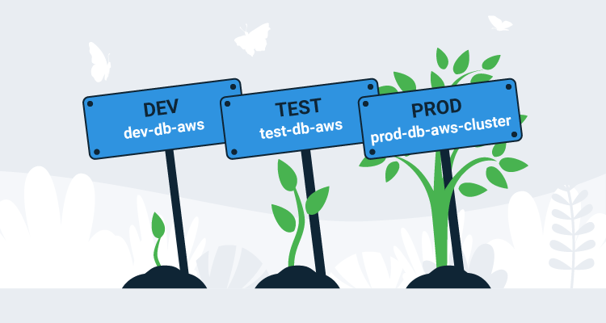

Spring has rich support for complex configurations. The built-in support for profiles and [externalized configuration](https://docs.spring.io/spring-boot/docs/current/reference/html/spring-boot-features.html#boot-features-external-config) gives you a good degree of freedom to construct environment specific configuration that can be bundled into a single, self-contained application archive.

But most developers will still face the fundamental question of how to develop an application locally, and then deploy that application to an environment where the configuration values, like the database connection strings (and especially the passwords they may embed), must be kept secret.

One solution is to push environment specific configuration into the environment in the form of environment variables. This is a perfectly valid choice, but when you have an application server hosting multiple applications, careful attention must be paid to the environment variable names to ensure application specific configurations don’t collide.

Another solution is to modify the application as it’s being deployed to inject application and environment specific configuration. For example, you may have a connection string for a database on `localhost` saved into a configuration file. This configuration can be safely checked into source control, providing developers with the ability to clone, build and run locally. But during deployment, the connection string for a particular environment overwrites the default value, resulting in an environment specific deployment with credentials that are kept hidden from prying eyes.

Octopus has long supported this kind of configuration file modification for .NET config files and JSON files. This was achieved either by understanding the specific format of the .NET XML files in order to make the appropriate modifications, or by allowing specially named variables to push values into JSON files. 

Typically though, Java and Spring applications have defined configuration in YAML, XML, or Properties files. With Octopus 2020.4.0, support has been added to push variables into XML, YAML, and Properties files, giving Java and Spring developers the ability to create environment specific deployments from generic application archives.

In this blog post, we’ll look at some common strategies for deploying environment agnostic Spring applications to specific environments.

## Modifying the Spring application.yml file

Let’s start with a simple example where we change the name of the active profile to match the environment. The code shown below comes from the [Random Quotes](https://github.com/OctopusSamples/RandomQuotes-Java) sample application.

In the `application.yml` file below we have set the `spring.profiles.active` property to `local` to indicate we are working in a local development environment:

```YAML
# The configuration defines the settings used in a local development environment
# to give developers the ability to clone, develop and build without any
# additional configuration.

server:
  port : 5555

spring:
  profiles:
    active: local
  h2:
    console:
      enabled: true
  jpa:
    database-platform: org.hibernate.dialect.H2Dialect
  datasource:
    url: jdbc:h2:mem:testdb
    dbcp2:
      driver-class-name: org.h2.Driver
  flyway:
    locations: classpath:db/migration/{vendor}
```

There are no secrets in this configuration file, making it safe to commit directly to source control, and removing any additional local configuration by developers to start working on the code.

The active profile can be exposed as a property on a Spring object by injecting a value with a [SpEL](https://docs.spring.io/spring/docs/4.3.10.RELEASE/spring-framework-reference/html/expressions.html) expression:

```Java
@Value("${spring.profiles.active:unknown}")
private String activeProfile;
```

Eventually this value is shown in the web page exposed by the application:


Let’s assume we want to replace the `spring.profiles.active` property value with the name of the environment where the application will be deployed. We start by enabling the **Structured Configuration Variables** feature on the step. 

:::success
This feature was previously called **JSON Configuration Variables**, but in 2020.4.0, we expanded the feature to support many new configuration files:
:::


We then configure the step to inject values into the `application.yml` file with the glob `**/application.yml`:


Finally, we define a variable called `spring:profiles:active` with the value `#{Octopus.Environment.Name}`:


During deployment, Octopus will extract the application archive (usually a JAR or WAR file), inject the value of the variable called `spring:profiles:active` into the YAML file, repackage the application, and upload the resulting archive to either an application server or save it on disk, depending on the particular step that was used. We can see the application now reports that it is running in the **Dev** environment:


## Modifying the web.xml file

Spring is flexible in its ability to define configuration files, but the traditional Java XML configuration files are quite limited in their ability to reference external data (like environment variables) or assume different file names. For example, the `web.xml` file, which is used in traditional Java web applications to define application settings, can only be called `web.xml` and does not include any expression language to load external values or conditionally define settings.

In the past, this has made the `web.xml` file a particularly difficult way to define environment specific configurations, but with the new ability to inject values into XML files, Octopus now makes it trivial to modify this file during deployment with environment specific values.

Here is the `web.xml` file from our sample application:

```xml
<web-app
        version="3.0"
        xmlns="http://java.sun.com/xml/ns/javaee"
        xmlns:xsi="http://www.w3.org/2001/XMLSchema-instance"
        xsi:schemaLocation="http://java.sun.com/xml/ns/javaee http://java.sun.com/xml/ns/javaee/web-app_3_0.xsd">

    <distributable />
    <display-name>Random Quotes</display-name>

</web-app>
```

To modify this file, we add it to the **Structured Configuration Variables** feature with the glob `**/web.xml`, and then define a variable with the name `//*:display-name` and a value `Random Quotes #{Octopus.Environment.Name}`, which will embed the Octopus environment into the display name of the application. We can see this application name in the Tomcat manager:

:::note
The XPath of `//*:display-name` uses the version 2 style of namespace selection. This is by far more convenient than the version 1 selector which would usually look like `//*[local-name()='display-name']`, but both styles can be used.
:::


## Complex configuration changes

So far we have injected variables into existing values in our configuration files in a one-to-one fashion. This is nice for simple configuration changes, but there will be cases where environment specific configuration will result in some significant changes with entirely new fields and old settings removed. For example, here is an `application.yml` file that configures an external Postgres database instead of the in-memory H2 database used when developing locally:

```yaml
server:
  port : 5555

spring:
  profiles:
    active: Dev
  jpa:
    database-platform: org.hibernate.dialect.PostgreSQLDialect
    properties:
      hibernate:
        default_schema: randomquotes
  datasource:
    url: jdbc:postgresql://databaseserver:5432/postgres
    username: postgres
    password: docker
  flyway:
    locations: classpath:db/migration/{vendor}
```

All H2 configuration has been removed, and the JPA configuration includes new nested properties. So how do we create this new configuration file?

We can get close enough by replacing the body of the `jpa` and `datasource` properties with new YAML objects.

Here is the value of the variable called `spring:datasource`:

```YAML
url: jdbc:postgresql://databaseserver:5432/postgres
username: postgres
password: docker
```

And here is the value of the variable called `spring:jpa`:

```YAML
database-platform: org.hibernate.dialect.PostgreSQLDialect
properties:
  hibernate:
    default_schema: randomquotes
```


Note that the variable values are standalone YAML documents. These documents are then used to replace the children of the `spring.datasource` and `spring.jpa` properties during deployment. The end result is an `application.yml` file that looks like this:

```YAML
# The configuration defines the settings used in a local development environment
# to give developers the ability to clone, develop and build without any
# additional configuration.
server:
  port: 5555
spring:
  profiles:
    active: Dev
  h2:
    console:
      enabled: true
  jpa:
    database-platform: org.hibernate.dialect.PostgreSQLDialect
    properties:
      hibernate:
        default_schema: randomquotes
  datasource:
    url: jdbc:postgresql://databaseserver:5432/postgres
    username: postgres
    password: docker
  flyway:
    locations: classpath:db/migration/{vendor}
```

This may get us the result we need, but the `h2` settings are still defined. We could of course replace the entire contents of the `spring` property to remove the unwanted properties, but for more radical transformations a better solution may be to have a second file that we use to replace the `application.yml` file during deployment.

## Configuration files and script hooks

Given that our environment specific configuration requires a mix of adding and removing content, we’ll create a second template file to represent this new structure called `postgres-application.yml`. This file contains the structure that we expect, but it has placeholder values for anything sensitive:

```YAML
server:
  port : 5555

spring:
  profiles:
    active: Dev
  jpa:
    database-platform: org.hibernate.dialect.PostgreSQLDialect
    properties:
      hibernate:
        default_schema: randomquotes
  datasource:
    url: jdbc:postgresql://replaceme:5432/postgres
    username: replaceme
    password: replaceme
  flyway:
    locations: classpath:db/migration/{vendor}
```

We can copy this template over the original `application.yml` file using a custom deployment script, which is enabled as a feature:


The **Pre-deployment script** of `cp WEB-INF\classes\postgres-application.yml WEB-INF\classes\application.yml` then copies the environment specific template over the default:


The variables are then injected into `application.yml` as normal, and the result is the environment specific configuration file with only the values we wanted.

## Templates

To this point we have been pushing variables into configuration files. This allows us to have a configuration file used for local development, and then replace it inline with any environment specific variables.

Having now seen how custom deployment scripts can be used to replace configuration files at deployment, we have the option to create templates that make use of Octopus variable substitution to pull variables into a file. For example, we may have an environment specific configuration file that looks like this:

```YAML
server:
  port : 5555

spring:
  profiles:
    active: Dev
  jpa:
    database-platform: org.hibernate.dialect.PostgreSQLDialect
    properties:
      hibernate:
        default_schema: randomquotes
  datasource:
    url: jdbc:postgresql://#{DatabaseServer}:5432/postgres
    username: '#{DatabaseUsername | YamlSingleQuoteEscape}'
    password: "#{DatabasePassword | YamlDoubleQuoteEscape}"
  flyway:
    locations: classpath:db/migration/{vendor}
```

This template expects the `DatabaseServer`, `DatabaseUsername`, and `DatabasePassword` variables to be defined in Octopus. These values are embedded into the YAML using the new [filters](https://octopus.com/docs/projects/variables/variable-filters#VariableSubstitutionSyntax-Providedfilters) `YamlSingleQuoteEscape` and `YamlDoubleQuoteEscape` to ensure that they are properly escaped given their context.

We then enable the `Substitute Variables in Templates` feature to allow the variables to be processed:


Instead of matching the file in the **Structured Configuration Variables** section, we now match it in the **Substitute Variables in Templates** section:


## Conclusion

Creating environment agnostic application packages that support local development with no special tooling provides developers with a straight forward clone, build, run workflow, while also allowing a single compiled application to be deployed in many environments with any specific configuration needed. In this post, we looked at a typical example of pushing variables into XML and YAML files, and pulling variables into a YAML template. We also saw how the custom deployment scripts can be used to replace a local development configuration file with an environment specific one.

With the ability in Octopus 2020.4 to push variables into XML, YAML, and Properties files, it is easier than ever to create environment agnostic Java packages. Meanwhile the new [Octostache filters](https://octopus.com/docs/projects/variables/variable-filters#VariableSubstitutionSyntax-Providedfilters) `YamlSingleQuoteEscape`, `YamlDoubleQuoteEscape`, `PropertiesKeyEscape`, and `PropertiesValueEscape` allow variables to be pulled into templates, taking care of any format specific escaping that is required.

We hope this new functionality will enhance your Java deployments by making deployments to multiple environments smooth and painless.

Happy deployments!
