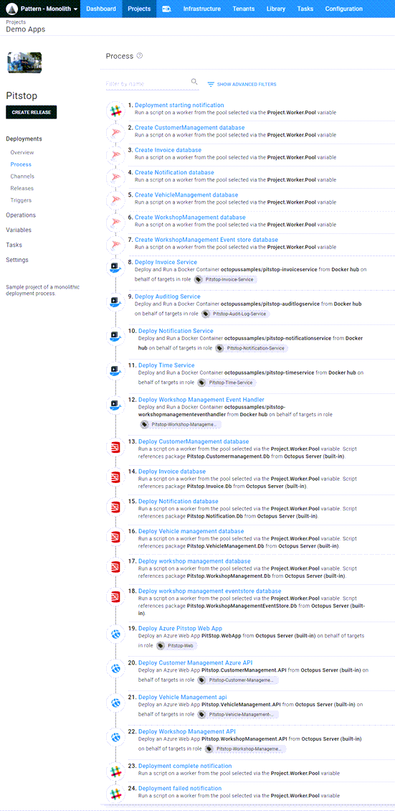
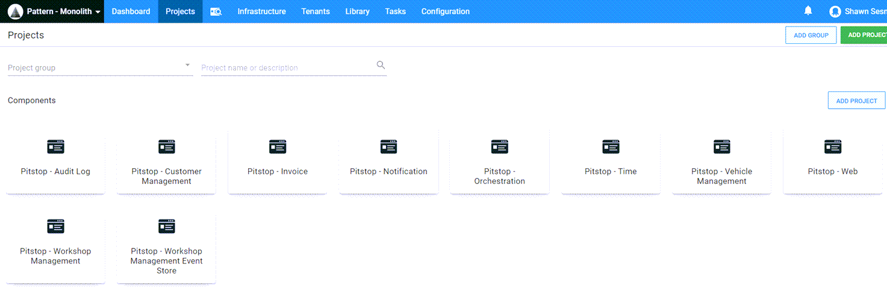
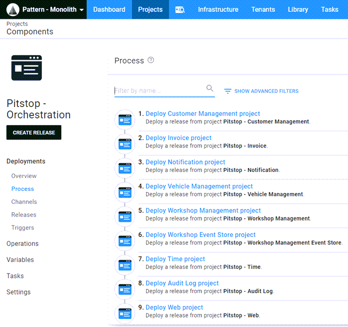

The term *monolithic deployment* often carries a negative connotation, however, monolithic deployments are the natural progression of an application that has grown over time.  In this post, I demonstrate breaking apart a monolithic process into smaller deployable components.

## Pitstop

For this post, I'm using the [Pitstop](https://github.com/EdwinVW/pitstop) application as an example. I chose Pitstop because it contains multiple moving parts:
- Web front end
- APIs
- Microservices
- Databases
- References third-party docker containers

The original version of this application embedded the database and table creation within the C# code itself.  To make a more useful demonstration, I extracted the database activities and placed them into the deployment process.  In addition, the APIs and web front end were all dockerized.  Again, I modified this so they could be deployed to Azure instead of containers.  Here's the [modified version](https://github.com/OctopusSamples/PitStop).

## Monolithic deployment process

The modifications to the Pitstop application were to add more pieces to the deployment process.  Deploying the Pitstop application consists of the following steps:
- Slack notification - starting deployment
- Create CustomerManagement database (if it does not exists)
- Create Invoice database (if it does not exists)
- Create Notification database (if it does not exists)
- Create VehicleManagement database (if it does not exists)
- Create WorkshopManagement database (if it does not exists)
- Create WorkshopManagementEventStore database (if it does not exists)
- Deploy Invoice micro service
- Deploy Auditlog micro service
- Deploy Notification micro service
- Deploy Time service micro service
- Deploy Workshop management micro service
- Deploy Customer management database
- Deploy Invoice database
- Deploy Notification database
- Deploy Vehicle management database
- Deploy Workshop management database
- Deploy Workshop management eventstore database
- Deploy Pistop web app
- Deploy Customer management API
- Deploy Vehicle management API
- Deploy Workshop management API
- Slack notification - deployment complete
- Slack notification - deployment failed (only in failure)

In this form, the deployment takes approximately 15 minutes to complete.  While not an astronomical number, it could be an eternity if a single component is down and needs to be updated.

## Breaking up the monolith

Looking at our deployment process, we can identify some of the steps that are related while others are independent.  For example, the steps for the invoice service are all related, so those can be broken out into their own Octopus project:

- Slack notification - starting deployment
- Create Invoice database (if it does not exists)
- Deploy Invoice micro service
- Deploy Invoice database
- Slack notification - deployment successful
- Slack notification - deployment failed (only on failure)

Deployment of the Invoice components now takes only 1 minute versus the 15 minutes in the monolith.  This is a significant time saving, especially in cases where the invoice components are the only pieces that need to be updated.

Breaking out the entire process into different projects would yield something similar to this:

Each component of the application has been broken out into their respective projects and can now be deployed individually.

## Deployment orchestration

Now that we have our application broken up into separate deployable components, we're faced with the issue of orchestrating several projects when we need to deploy the whole solution.  

### Create an orchestration project

Octopus Deploy contains a built-in step template called [Deploy a Release](https://octopus.com/docs/projects/coordinating-multiple-projects/deploy-release-step).  This feature allows you to choose a different project and deploy the latest release from it (the community template [Chain deployment](https://library.octopus.com/step-templates/18392835-d50e-4ce9-9065-8e15a3c30954/actiontemplate-chain-deployment) has similar functionality).  The **Deploy a Release** step comes with the ability to pass variables to the child project in the event it has prompted variables.

Using the **Deploy a Release** template does come with a couple of caveats:
- The child project release must be created prior to the orchestration project release creation.  This can be done with our build server plugins to create the release from the build or using the CLI.
- It is unable to choose specific release version of child projects.

## Conclusion

Automating the deployment of an application is a critical step in your DevOps journey.  If your deployment process has reached monolithic proportions, the next step is to identify which components can be deployed individually, which is often easier said than done.  A side-effect of this exercise is that the same components that can be deployed individually can usually be built individually, which can drastically cut down on build duration and result in lower lead times.  With build duration and deployment time lowered, you have the capability to deploy your application faster and more often.
