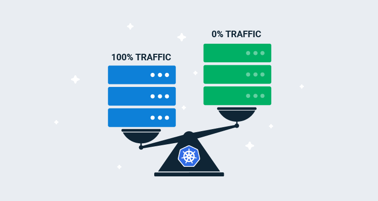
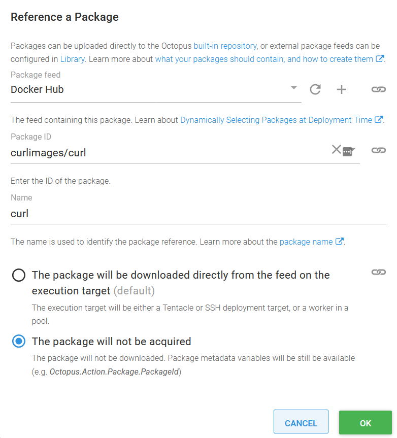

In addition to the recreate and rolling deployment strategies that are supported natively in Kubernetes, Octopus gives you the ability to perform blue/green deployments. This tick box option allows individual Kubernetes deployments to be deployed in a blue/green fashion, complete with service cut over and a cleanup of old resources.

But there are times when this checkbox approach is not flexible enough. If you want to halt the cut over to the new deployment to allow for manual testing, orchestrate multiple deployments (for example, a frontend and backend application), or use feature branches, then you need to recreate the blue/green deployment process for yourself.

In this blog post and associated screencast, I’ll show you how to recreate a blue/green deployment and deploy a mock feature branch as a demonstration of the process.

## Screencast

<iframe width="900" height="506" src="https://www.youtube.com/embed/BiaDsKAPSdU" frameborder="0" allow="accelerometer; autoplay; clipboard-write; encrypted-media; gyroscope; picture-in-picture" allowfullscreen></iframe>

## Create the initial deployment

For this demo, we will deploy the [httpd](https://hub.docker.com/_/httpd) docker image into Kubernetes. This gives us a web server we can point our browser and command-line tools at, and we’ll make use of tags like `2.4.46-alpine` as a way of simulating feature branches.

We start by deploying a new Kubernetes deployment resource with the **Deploy Kubernetes containers** step.

The deployment resource must have a unique name, which we create by appending the string `-#{Octopus.Deployment.Id | ToLower}` to the resource name. The `Octopus.Deployment.Id` variable is unique for each deployment, and so we can be sure that each new deployment will create a new Kubernetes resource.

We also define a label called `FeatureBranch` set to the value of a variable called `PackagePreRelease` we’ll create in the next section.

The YAML below can be pasted into the **Edit YAML** section of the **Deploy Kubernetes containers** step to configure the resource:

```YAML
apiVersion: apps/v1
kind: Deployment
metadata:
  name: 'httpd-#{Octopus.Deployment.Id | ToLower}'
  labels:
    FeatureBranch: '#{PackagePreRelease}'
spec:
  selector:
    matchLabels:
      octopusexport: OctopusExport
  replicas: 1
  strategy:
    type: Recreate
  template:
    metadata:
      labels:
        FeatureBranch: '#{PackagePreRelease}'
        octopusexport: OctopusExport
    spec:
      containers:
        - name: httpd
          image: index.docker.io/httpd
          ports:
            - name: web
              containerPort: 80
```

## Define the variables

We need to create two variables to capture the name of a feature branch.

The first variable is called `PackagePreRelease`, and the value is set to `#{Octopus.Action[Deploy HTTPD].Package[httpd].PackageVersion | VersionPreReleasePrefix}`. This template string extracts the version (or image tag) from the container called `httpd` in the step called `Deploy HTTPD`, and extracts the prerelease string via the `VersionPreReleasePrefix` filter (available in Octopus 2020.5).

This means that the `PackagePreRelease` variable will be empty for a mainline deployment and set to `alpine` for what we are calling feature branch deployments in this demo.

The second variable is called `ServiceSuffix`, and the value is set to `#{if PackagePreRelease}-#{PackagePreRelease}#{/if}`. This template prepends a dash before the value of the `PackagePreRelease` if `PackagePreRelease` is not empty. Otherwise `ServiceSuffix` is left as an empty string.

This means that the `ServiceSuffix` variable will be empty for a mainline deployment and set to `-alpine` for what we are calling feature branch deployments in this demo.

## Create a temporary service for the green deployment

In order to do anything useful with the newly deployed pods, which we refer to as the green half of the blue/green deployment, we need to expose the pods behind a service.

For this demo, we only need to expose the pods internally in the Kubernetes cluster to perform our tests, so we create a cluster IP service.

The service selector matches pods based on the `Octopus.Deployment.Id` label, which matches any pods created during this current deployment.

The YAML below can be pasted into the **Edit YAML** section of the **Deploy Kubernetes service resource** step to configure the resource:

```YAML
apiVersion: v1
kind: Service
metadata:
  name: 'httpdservice-green#{ServiceSuffix}'
spec:
  type: ClusterIP
  ports:
    - name: web
      port: 80
      nodePort: ''
      targetPort: ''
      protocol: TCP
  selector:
    Octopus.Deployment.Id: '#{Octopus.Deployment.Id}'
```

## Perform a manual health check

One context in which you need to create your own blue/green deployments is to run health checks outside of the liveness probes exposed by Kubernetes. This could be a manual check done by a human or, as we’ll demo here, an automated test with an external tool. In our case, we’ll use `curl` to check the health of our deployment.

This is done inside a **Run a kubectl CLI Script** step, where we call `kubectl` to run a container with `curl` installed inside the cluster to complete the check:

```
echo "Testing http://httpdservice-green#{ServiceSuffix}"
kubectl run --attach=true --restart=Never test-#{Octopus.Deployment.Id | ToLower} --image=#{Octopus.Action.Package[curl].PackageId}:#{Octopus.Action.Package[curl].PackageVersion} -- --fail http://httpdservice-green#{ServiceSuffix}
exit $?
```

The image name is built up using variables exposed by an additional package reference:



## Create the persistent service

After the health check passes, we then need to either create (if this is the first deployment) or redirect, the persistent service that external clients use to access the application we are deploying. Redirecting traffic on this persistent service is how we switch traffic from the old blue deployment to the new green deployment.

This service is much the same as the temporary service we created earlier, with the exception that it is a load balancer with a public IP address, and we will not delete it at the end of the deployment:

```YAML
apiVersion: v1
kind: Service
metadata:
  name: 'httpdservice#{ServiceSuffix}'
spec:
  type: LoadBalancer
  ports:
    - name: web
      port: 80
      nodePort: ''
      targetPort: ''
      protocol: TCP
  selector:
    Octopus.Deployment.Id: '#{Octopus.Deployment.Id}'
```

## Clean up the resources

After traffic has been redirected to our new application, we can clean up the old resources. This is performed with another **Run a kubectl CLI Script** step:

```
kubectl delete service httpdservice-green#{ServiceSuffix}
kubectl delete deployment -l Octopus.Project.Id=#{Octopus.Project.Id | ToLower},Octopus.Environment.Id=#{Octopus.Environment.Id | ToLower},Octopus.Deployment.Tenant.Id=#{unless Octopus.Deployment.Tenant.Id}untenanted#{/unless}#{if Octopus.Deployment.Tenant.Id}#{Octopus.Deployment.Tenant.Id | ToLower}#{/if},Octopus.Deployment.Id!=#{Octopus.Deployment.Id | ToLower},FeatureBranch=#{PackagePreRelease}
```

Note that we match old resources based on the fact that their `Octopus.Deployment.Id` label does not match the ID of the current deployment. Also, because we match on the `FeatureBranch` label, mainline and feature branch deployments can coexist without one cleaning up the other.

## Conclusion

The example presented here is the minimum required to implement a blue/green deployment, but by adding new steps into the process, you can customize the workflow however you wish. Manual intervention steps could be added to allow QA staff to verify the new deployment, more complex automated tests could be performed, or multiple resources could be deployed and switched over as a group.

Happy deployments!