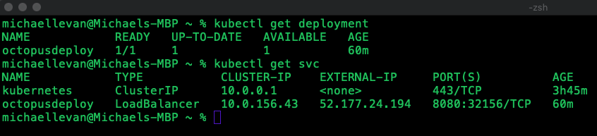

In the first blog post for the Multi-Cloud Kubernetes Deployments blog post series. This series is about how to use Octopus Deploy Linux containers in many different Kubernetes deployment scenarios.

You're going to learn how to not only deploy the needed cloud infrastructure and services for deploying Octopus Deploy as a container, but you'll also learn how to do it in a cloud development and automated fashion.

TIP If you don't want to copy/paste all of the code from this blog post, you can find the repository [here](https://github.com/OctopusSamples/Azure-AKS-OctopusDeploy)

## Prerequisites

To follow along in this blog post, you'll need the following:

- An Azure account. If you don't have one, you can sign up for a 30-day free trial [here](https://azure.microsoft.com/en-us/free/)
- Visual Studio Code (VS Code) installed. If you don't have it, you can install VS Code from [here](https://code.visualstudio.com/download).
- Beginner to intermediate level knowledge of Terraform and Kubernetes.
- Terraform installed. If you don't have Terraform installed, you can find instructions [here](https://www.terraform.io/downloads.html).

## What AKS can do for you

It's important to understand what AKS can do for an organization to simplify orchestrating deployments. In a raw Kubernetes cluster, there are several components, including but not limited to:

- Managing and deploying the API server(s)
- Managing and deploying the worker node(s)
- Monitoring the cluster
- Upkeep of the cluster

With AKS, you don't have to worry about any of that. The master node/API server is managed by Azure and the worker nodes are virtual machines that get created automatically. The monitoring is built-in using Azure Monitor.

Working in a Kubernetes-as-a-Service like AKS allows you to not have to worry about the cloud infrastructure, and instead just worry about the application deployments.

## Authenticate with an Azure service principal

To properly authenticate when creating AKS using Terraform, a service principal client ID and client secret are needed in the Terraform configuration. This section will give you code to use to create an Azure service principal.

The PowerShell script below is a 10-liner that you can use to create an Azure service principal that can be used for Terraform.

```powershell
function newAppRegistration {
    
    param(
        [string]$name = "od-aks"
    )
    
    # Create App Registration
    $appCreation = az ad sp create-for-rbac --skip-assignment --name $name --sdk-auth | ConvertFrom-Json
    $appCreation
}
```

Once the code is run, you'll see an output with several values, including the client ID and secret.

## Using key vault to store service principal secrets

Once the service principal is created, you need a place to store it. After all, you don't want to have to worry about passing in the plain-text values at runtime.

You can use Terraform to create a key vault solution in an automated fashion. The code below in the `[main.tf](http://main.tf)` shows what is needed to deploy key vault.

Let's go over the key components of the code:

- The first resource is to create the key vault itself, using an access policy with the tenant ID and object ID of the service principal you created in the previous section. The service principal is given permissions on both keys and secrets.
- The next two resources are to create the secret in key vault. The secret that gets passed in is the client ID and client secret of the service principal.
- Following the three resources, you have an output of the key vault ID. The ID is used in the AKS configuration coming up later.

```bash
provider "azurerm" {
  version = "<=2.36.0"

  features {}
}

resource "azurerm_key_vault" "od-keyvault" {
  name                = "od-keyvault-aks"
  resource_group_name = var.resourceGroupName
  location            = var.location
  sku_name            = "standard"
  tenant_id           = var.tenantID

  access_policy {
    tenant_id = var.tenantID
    object_id = var.objectID

    key_permissions = [
      "get",
      "list",
      "create",
    ]

    secret_permissions = [
      "get",
      "list",
      "set",
    ]
  }

  access_policy {
    tenant_id = var.tenantID
    object_id = var.localObjectID

    key_permissions = [
      "get",
      "list",
      "create",
    ]

    secret_permissions = [
      "get",
      "list",
      "set",
    ]
  }
}

resource "azurerm_key_vault_secret" "od-clientid" {
  name         = "ODClientID"
  value        = var.clientID
  key_vault_id = azurerm_key_vault.od-keyvault.id
}

resource "azurerm_key_vault_secret" "od-client-password" {
  name         = "ODClientSecret"
  value        = var.clientSecret
  key_vault_id = azurerm_key_vault.od-keyvault.id
}

output "key_vault_id" {
  value = azurerm_key_vault.od-keyvault.id
}
```

To ensure you have the proper variables set up and configuration for the resource creation, the `[variables.tf](http://variables.tf)` Terraform configuration is below.

```bash
variable "resourceGroupName" {
  type = string
}

variable "location" {
  type = string
}

variable "tenantID" {
  type = string
}

variable "clientID" {
  type = string
}

variable "clientSecret" {
  type = string
}

variable "objectID" {
  type = string
}

variable "localObjectID" {
  type = string
}
```

Create the key vault resource with variables based on your environment (resource group name, location, etc.). Once complete, you can run `terraform plan` and `terraform apply` to create the resources.

## Creating a storage account for the Terraform state

The storage account stores the Terraform State (TFSTATE) in the cloud so you don't have to worry about storing it locally. That way, if anyone else wants to update/replace/delete the AKS configuration, they can.

Below is the code for the storage account configuration. It creates a few resources:

- The first resource is for creating the storage account.
- The second resource is for creating the container inside of the storage account where the TFSTATE lives.

```bash
provider "azurerm" {
  version = "<=2.36.0"

  features {}
}

resource "azurerm_storage_account" "od-tfstate-storage" {
  name = "odtfstatestorage"
  resource_group_name = var.resourceGroupName

  location                 = var.location
  account_tier             = "Standard"
  account_replication_type = "GRS"
}

resource "azurerm_storage_container" "od-tfstate-container" {
  name = "tfstate"
  storage_account_name = azurerm_storage_account.od-tfstate-storage.name
  container_access_type = "blob"
}
```

To ensure you have the proper variables set up and configuration for the resource creation, the `[variables.tf](http://variables.tf)` Terraform configuration for the storage account is below.

```bash
variable "resourceGroupName" {
  type = string
}

variable "location" {
  type = string
}
```

## Deploying an AKS cluster

It's time to deploy the AKS cluster, which is where the Octopus Deploy container will live. The infrastructure for the AKS cluster is completely automated, like the rest of the blog post, using Terraform.

The AKS Terraform configuration is larger than the others, so let's break it down resource by resource, and at the end the entire configuration will be shown.

First, you have the Terraform backend. The backend allows you to store the TFSTATE inside of an Azure storage account.

```bash
terraform {
  backend "azurerm" {
    resource_group_name  = "your_resource_group_name"
    storage_account_name = "your_storage_account_name"
    container_name       = "tfstate"
    key                  = "terraform.state"
  }
}
```

Next, you specify the provider itself, like you've done for the other Terraform modules.

```bash
provider "azurerm" {
  version = "<=2.36.0"

  features {}
}
```

After the provider is specified, you'll create two data resources. The data resources retrieve the client ID and client secret from key vault.

```bash
data "azurerm_key_vault_secret" "keyVaultClientID" {
  name         = "ODClientID"
  key_vault_id = var.keyvaultID
}

data "azurerm_key_vault_secret" "keyVaultClientSecret" {
  name         = "ODClientSecret"
  key_vault_id = var.keyvaultID
}
```

The last configuration for the AKS module is the AKS resource itself. The resource creates 3 nodes and uses a `Standard_D2_v2` VM size.

```bash
resource "azurerm_kubernetes_cluster" "OD-AKS" {
  name                = var.name
  location            = var.location
  resource_group_name = var.resourceGroup
  dns_prefix          = "octopusdeployprefix"

  default_node_pool {
    name       = "default"
    node_count = 3
    vm_size    = "Standard_D2_v2"
  }
  service_principal {
    client_id     = data.azurerm_key_vault_secret.keyVaultClientID.value
    client_secret = data.azurerm_key_vault_secret.keyVaultClientSecret.value
  }
}
```

Below are the variables that you can use for the AKS module.

```bash
variable "name" {
    type = string
    description = "Name of AKS cluster"
}

variable "resourceGroup" {
    type = string
    description = "Resource Group name"
}

variable "keyvaultID" {
    type = string
    description = "KeyVault ID"
}

variable "location" {
    type = string
    description = "Region"
}
```

All said and done, the entire `[main.tf](http://main.tf)` should look like the code below:

```bash
terraform {
  backend "azurerm" {
    resource_group_name  = "MichaelLevanResources"
    storage_account_name = "odstorage92"
    container_name       = "tfstate"
    key                  = "terraform.state"
  }
}

provider "azurerm" {
  version = "<=2.36.0"

  features {}
}

data "azurerm_key_vault_secret" "keyVaultClientID" {
  name         = "ODClientID"
  key_vault_id = var.keyvaultID
}

data "azurerm_key_vault_secret" "keyVaultClientSecret" {
  name         = "ODClientSecret"
  key_vault_id = var.keyvaultID
}

resource "azurerm_kubernetes_cluster" "OD-AKS" {
  name                = var.name
  location            = var.location
  resource_group_name = var.resourceGroup
  dns_prefix          = "octopusdeployprefix"

  default_node_pool {
    name       = "default"
    node_count = 3
    vm_size    = "Standard_D2_v2"
  }
  service_principal {
    client_id     = data.azurerm_key_vault_secret.keyVaultClientID.value
    client_secret = data.azurerm_key_vault_secret.keyVaultClientSecret.value
  }
}
```

## Creating an Azure SQL server and database

Octopus Deploy uses Microsoft SQL for persistent and backend data that needs to be stored. Because Octopus Deploy is running in a container and containers are ephemeral, you want a location that you can store data persistently.

The SQL Server Terraform configuration has three parts:

- Creating the Azure SQL Server
- Creating a firewall rule to allow Azure services to connect to the SQL server
- Creating the Microsoft SQL database

The first is the Azure SQL server. It's being created with version 12.0 and a minimum TLS version of 1.2.

```bash
resource "azurerm_mssql_server" "octopussqlserver" {
  name                         = "octopussqlprod"
  resource_group_name          = var.resourceGroupName
  location                     = var.location
  version                      = "12.0"
  administrator_login          = var.sqlLogin
  administrator_login_password = var.dbpassword
  minimum_tls_version          = "1.2"
}
```

The second part is for the firewall rule. You may be wondering why the IP address is `0.0.0.0`. That's what Microsoft recommends when connecting to other Azure services as Microsoft handles the networking on the backend. You'll also see that there's a `depends_on` flag to ensure that the SQL server is created first.

```bash
resource "azurerm_sql_firewall_rule" "acifirewallrule" {
  name                = "azurecontainerinstanceconnection"
  resource_group_name = var.resourceGroupName
  server_name         = azurerm_mssql_server.octopussqlserver.name
  start_ip_address    = "0.0.0.0"
  end_ip_address      = "0.0.0.0"

  depends_on = [azurerm_mssql_server.octopussqlserver]
}
```

The third part is for the Microsoft SQL database, which is running SQL Server Express.

```bash
resource "azurerm_mssql_database" "octopussqldb" {
  name           = "octopusdb"
  server_id      = azurerm_mssql_server.octopussqlserver.id
  license_type   = "LicenseIncluded"
  max_size_gb    = 4
  read_scale     = true
  sku_name       = "BC_Gen5_2"
  zone_redundant = true
}
```

All together, the `[main.tf](http://main.tf)` looks like the below:

```bash
provider "azurerm" {
  version = "<=2.36.0"

  features {}
}

resource "azurerm_mssql_server" "octopussqlserver" {
  name                         = "octopussqlprod"
  resource_group_name          = var.resourceGroupName
  location                     = var.location
  version                      = "12.0"
  administrator_login          = var.sqlLogin
  administrator_login_password = var.dbpassword
  minimum_tls_version          = "1.2"
}

resource "azurerm_sql_firewall_rule" "acifirewallrule" {
  name                = "azurecontainerinstanceconnection"
  resource_group_name = var.resourceGroupName
  server_name         = azurerm_mssql_server.octopussqlserver.name
  start_ip_address    = "0.0.0.0"
  end_ip_address      = "0.0.0.0"

  depends_on = [azurerm_mssql_server.octopussqlserver]
}

resource "azurerm_mssql_database" "octopussqldb" {
  name           = "octopusdb"
  server_id      = azurerm_mssql_server.octopussqlserver.id
  license_type   = "LicenseIncluded"
  max_size_gb    = 4
  read_scale     = true
  sku_name       = "BC_Gen5_2"
  zone_redundant = true
}
```

## Creating persistent data that isn't in the database

With Octopus Deploy, there's data that isn't stored in the database, but instead, intended on being stored on the local Octopus Deploy server. Because containers are ephemeral, you never want to store data locally on a container. In this section, you'll learn what needs to be created with Azure File Shares to store the data.

The code below will create three file shares:

- tasklogs
- artifacts
- repository

Once PowerShell creates the three file shares for you in Azure File Share, the storage account name and storage key will be echo'd out. That way, you can use those in the next section to create a Kubernetes secret.

```bash
# The configuration below creates a storage account for Kubernetes persistent storage.
# The perisistent storage is used for data in Octopus Deploy that isn't stored in a DB

$AKS_PERS_STORAGE_ACCOUNT_NAME = ""
$AKS_PERS_RESOURCE_GROUP = ""
$AKS_PERS_SHARE_NAME = @(
    "tasklogs",
    "artifacts",
    "repository"
)

$connectionString = $(az storage account show-connection-string -n $AKS_PERS_STORAGE_ACCOUNT_NAME -g $AKS_PERS_RESOURCE_GROUP -o tsv)

foreach ($share in $AKS_PERS_SHARE_NAME) {
    az storage share create --name $share --connection-string $connectionString
}

# Get storage account key
$STORAGE_KEY = $(az storage account keys list --resource-group $AKS_PERS_RESOURCE_GROUP --account-name $AKS_PERS_STORAGE_ACCOUNT_NAME --query "[0].value" -o tsv)

# Echo storage account name and key
echo $AKS_PERS_STORAGE_ACCOUNT_NAME
echo $STORAGE_KEY
```

## Creating an Azure file share Kubernetes secret

Kubernetes secrets are like any other secret - whether it be a password, API key, SSH key, etc. Kubernetes secrets allow you to store a secret in a Kubernetes cluster to use in, for example, a Kubernetes manifest.

The `kubectl` command below is for creating a Kubernetes secret so the Kubernetes manifest (coming up in the next section) can authenticate to Azure File Share so you can store the data for:

- tasklogs
- artifacts
- repository

`kubectl create secret generic azure-secret --from literal=azurestorageaccountname=storage_account_name --from-literal=azurestorageaccountkey=storage_account_key`

## Logging into AKS and deploying the Octopus Deploy kubernetes manifest

### Logging into AKS

To log into AKS, you need to run an Azure CLI command. The command takes the Kubernetes configuration (kubeconfig) and puts in in your local `.kube` directory.

`az aks get-credentials -n aks_cluster_name -g resource_group_name`

### Creating a database master key

A database master key can either:

- Get created automatically
- Get created by the user

The problem is that if it gets created automatically, you can't have more than one Kubernetes pod/replica. The reason why is because one pod acts as one Octopus Deploy "server". Because of that, when connecting another pod, it doesn't have the same DB master key that was generated.

To generate a database master key to use in the Kubernetes manifest, run the following command:

`openssl rand 16 | base64`

### Deploying the Kubernetes manifest

The last and final step is to deploy the Kubernetes manifest. The Kubernetes manifest is comprosed of the following:

- One Kubernetes deployment
- One pod
- One service that creates an Azure load balancer with a public IP
- Ports for 8080 (the web UI) and 10943 (the tentacle)
- Environment variables for:
    - Accepting the eula
    - Octopus admin username
    - Octopus password
    - Database connection string
    - Database master key
- Volume mounts

This manifest is designed to work with Azure files, so if you want to use it in say, AWS or GKE, you'll need to change around the volume mounts.

With the Kubernetes manifest below, run the following command:

`kubectl create -f name_of_kubernetes_yaml_file.yml`

```bash
apiVersion: apps/v1
kind: Deployment
metadata:
  name: octopusdeploy
spec:
  selector:
    matchLabels:
      app: octopusdeploy
  replicas: 1
  template:
    metadata:
      labels:
        app: octopusdeploy
    spec:
      containers:
      - name: octopusdeploy
        image: octopusdeploy/octopusdeploy:latest
        env:
        - name: ACCEPT_EULA
          value: "Y"
        - name: ADMIN_USERNAME
          value: "admin"
        - name: ADMIN_PASSWORD
          value: "SecreTP@assw0rd"
        - name: DB_CONNECTION_STRING
          value: "Server=tcp:octopussqlprod.database.windows.net,1433;Initial Catalog=octopusdb;Persist Security Info=False;User ID=mike;Password=SecreTP@assw0rd;MultipleActiveResultSets=False;Encrypt=True;TrustServerCertificate=False;Connection Timeout=30;"
        - name: MASTER_KEY
          value: "HWlMQXp3A2guZLdZP1QyQA=="
        ports:
        - containerPort: 8080
        - containerPort: 10943
        volumeMounts:
          - name: tasklogs
            mountPath: /taskLogs
          - name: artifacts
            mountPath: /artifacts
          - name: repository
            mountPath: /repository

      volumes:
        - name: tasklogs
          azureFile:
            secretName: azure-secret
            shareName: tasklogs
            readOnly: false

        - name: artifacts
          azureFile:
            secretName: azure-secret
            shareName: artifacts
            readOnly: false

        - name: repository
          azureFile:
            secretName: azure-secret
            shareName: repository
            readOnly: false

---
apiVersion: v1
kind: Service
metadata:
  name: octopusdeploy
spec:
  selector:
    app: octopusdeploy
  ports:
    - port: 8080
  type: LoadBalancer
```

Once complete, you should see the deployment running.

