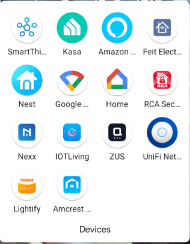

At Octopus Deploy, we are obsessed with automation.  As you might expect, this obsession goes beyond deployments, with many of us dabbling in the world of Home Automation, including myself.  In this post, I'll go over some lessons I learned while implenting Smart products around my houshold.

## Lesson 1: Z-Wave, and Zigbee, and WiFi, Oh My!
Perhaps one of the most important lessons I learned was that not all "Smart" devices communicate the same way and may require special equipment to operate.  A smart device will fall into three distinct communication categories:
- Z-Wave
- Zigbee
- WiFi

Both Z-Wave and Zigbee do not directly connect to your home network and need something in the middle to receive and transmit instructions.  These devices often come in the form of a `Hub` which is a piece of hardware that connects to your network either wired or wireless.  Some hubs are brand specific, such as Phillips Hue, and do not communicate with anything but their brand.  Other hubs are more generic and are compatible with most things and may include both Z-Wave and Zigbee functionality.  Samsung SmartThings is a good example of this.

While hubs are the most common device, it is possible to communicate with Z-Wave and or Zigbee devices with USB adapters, I'll go into that later in this post.

### Z-Wave
Z-Wave is a mesh network technology that uses low-energy radio waves, usually the 900Mhz band, for communcation.  Being a mesh network technology, Z-Wave devices that are connected to constant power, such as a smart plug or a smart bulb, have the capability of acting like a repeater, allowing you to place devices further away from the hub.

### Zigbee
Zigbee is similar to Z-Wave in that it is also a low-energy radio wave mesh network technology. Zigbee, however, uses the 2.4Ghz band for communication, similar to the B/G/N bands of WiFi.  As previously stated, Zigbee devices also require the use of a Hub in order to communicate.  Just like Z-Wave, devices attached to constant power act as repeaters to extend the range of Zigbee network.

### WiFi
WiFi devices are the only one of the three that do not require a hub to communicate.  These devices are directly attached to your WiFi network making them easier to communicate with with things like Google Home Assistant or Amazon Alexa.  Most WiFi enabled smart devices operate on the 2.4 GHz band which makes sense as their data needs are often small and 2.4 has a much farther range.  Unlike Z-Wave and Zigbee, WiFi devices are dependent on access point location and do not offer range extending capabilities.

## Lesson 2: Mesh network parent devices
Both Zigee and Z-Wave devices attach themselves to a Parent device on the mesh network.  Once connected, they do not actively seek a "better" parent until communication with the first one has been broken.  To update Z-Wave to use a new parent will sometimes necessitate removing the device from your network and re-adding it (some apps have 'repair network' functionality that will force it to seek a new parent).  Zigbee, on the other had, can find a new parent by powering off the old one forcing it to find something else.  The lesson I learned with this is that if the child can still communicate with the parent, it "thinks" it's still online, even if the parent no longer communicates to its parent, or hub.

## Lesson 3: There's an app for that!
One of the issues that I ran into early in my home automation journey was that each brand of device required its own app to control them, or at the very least, perform inital setup.  This quickly became quite annoying having to set up accounts for each branch in order to configure the device.

Coming from experience, my recommendation would be determine what it is you would like to do with your home automation and research the available brands to minimize the amount apps you will need.  Most of the WiFi devices available are compatible with Google Home or Amazon Alexa which means that once configured, you won't necessarily need their app to control the device.

## Lesson 4: Beware of app requirements
I once came across a smart plug that was being advertised for a steal of a price.  Before committing to purchase, I read the reviews and found that the its app *required* access to your contacts.  Umm, no, hard pass.

## Lesson 5: Google Home or Amazon Alexa compatibility
The two most popular voice-control devices are Google Home and Amazon Alexa.  For the most part, the vast majority of WiFi enabled smart devices will with both technolgoies, however, there are some that do not, so make sure to double-check before purchasing.

In terms of Zigbee or Z-Wave, just because your hub is compatible, doesn't mean that Google or Amazon work with the devices attached to them.  For example, I have a Samsung SmartThings hub to control my Z-Wave and Zigbee devices.  Connected to my hub are some door sensors for simple open/close detection.  While my SmartThings hub is connected to both Google Home and Amazon Alexa, only Alexa is able to use the open/close functionality.  Google shows the door sensors as devices, but doesn't know what to do with them.

## Lesson 6: Basic Routine/automation
There are multiple ways to perform basic automation (often referred to as `routines`) with smart devices

- Device's app
- Amazon/Google

### Device's app
As referred to in Lesson 3, each brand of device comes with its own app.  These apps allow you to set up different types of automations, however, they'll only work with their brand.  For example, I can set up a routine that turns on my TP-Link smart bulbs at dusk using the Kasa app.  However, if I wanted my Feit Electric lights to also turn on, I'd need to set up the same automation in the Feit Electric app.

### Amazon/Google
Amazon Alexa and Google Home allow you to link the individual brand accounts to their platforms and authorize them to control your devices.  This gives you much better more flexibility in that you can create a single automation to control multiple devices that span brands.

:::warning
Routines running in Google or Amazon have increased latency between action and trigger due to all the communication that has to take place.  For example, I have a routine that turns on a smart bulb in a closet when the door sensor is in an open state, both devices are Zigbee attached to a SmartThings hub.  If the routine is defined in the SmartThings app, the light turns on nearly instantly.  If the routine is set up in Alexa, it takes a full second before the light turns on.  
:::

## Lesson 7: Advanced automation
Device apps, Google, and Amazon give you the ability to do common, albeit basic automation, like the routine I defined above with the door sensor and the smart bulb.  However, none of them allow you to do advanced or complex automations such as leave the bathroom light on if the door is closed and motion is detected.  If the door is closed and no motion is detected but humidity is above a certain threshold, don't turn off the light (it is likely someone is taking a shower).  For this level of automation, you'd need to implement something like [IFTTT](https://ifttt.com/) or [Home Assistant](https://www.home-assistant.io/).

### IFTTT
IFTTT stands for `If This Then That` and is one of the more well known advanced home automation platforms.  IFTTT is an app for Apple or Google products that you can use to define advanced routines for your smart devices and comes in both paid and free (with limitations) variants.

### Home Assisant
Home Assistant is an application that runs in a Docker container with configurable storage options such as SQLLite, MySQL, or PostgreSQL (I've mine running in a Docker Swarm on a Raspberry Pi with a MySQL backend since SQLLite and CIFS don't get along.)  Considered among many as the holy grail of home automation, Home Assistant has a large following and adds more integrations with each iteration.  (As a side note, the bathroom scenario presented above is something a buddy of mine has working in his home.).  Home Assistant can control Z-Wave or Zigbee devices with the use of USB adapters instead of needing a hub.

## Lesson 8: Co$t!
As with most hobbies, home automation can get quite expensive.  Even the most basic smart device such as plug or bulb can range from $15 to $40 (prices often depend on communication type) a piece and hubs can be upwards of $100.

## Lesson 9: Be cognizant of others
While home automation and advanced routines are fun to configure, they can be equally frustrating when they don't work.  Nothing brings on the wrath of your significant other faster than the bathroom light turning off mid-shower (or so my buddy tells me) :)

## Conclusion
Home automation is a fun hobby and like many hobbies a tremendous time sink if you delve into the advanced automation realm.  I hope the lessons I've had to endure help you with your home automation journey.