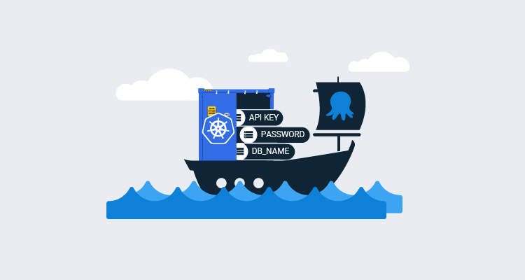
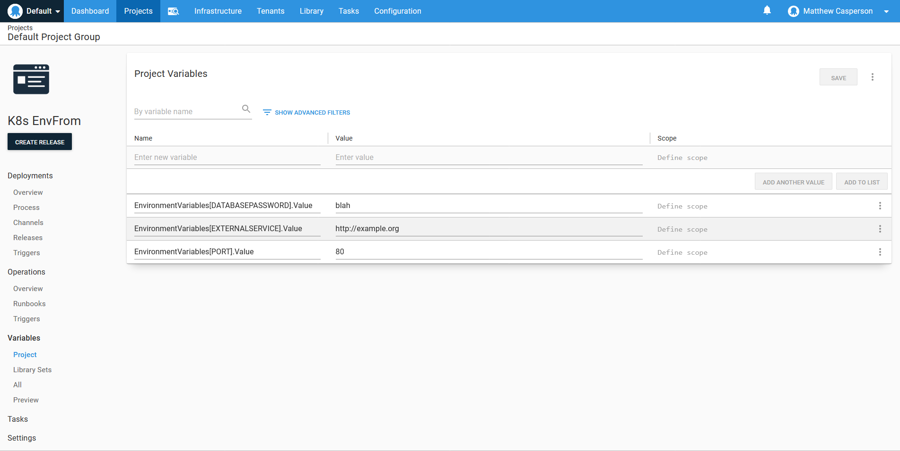
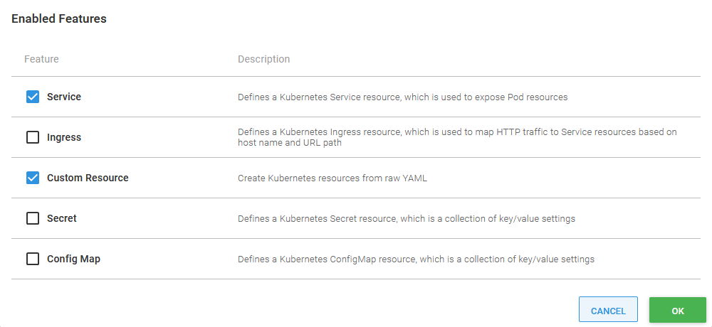
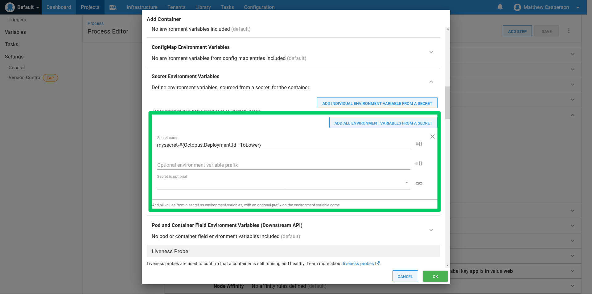
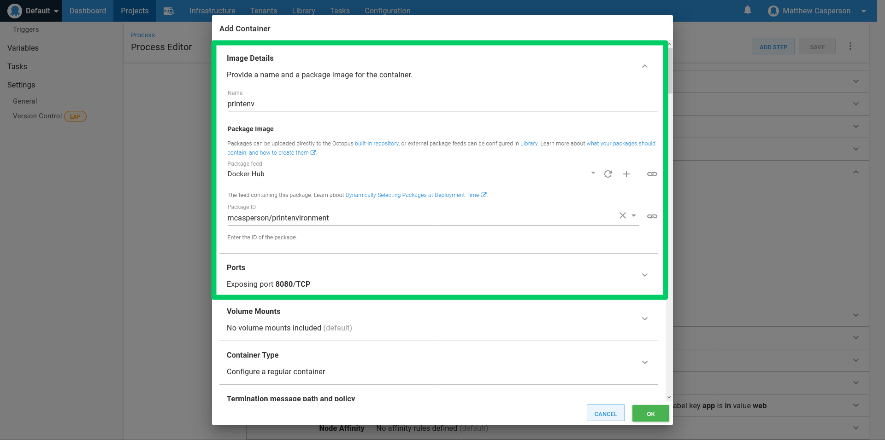
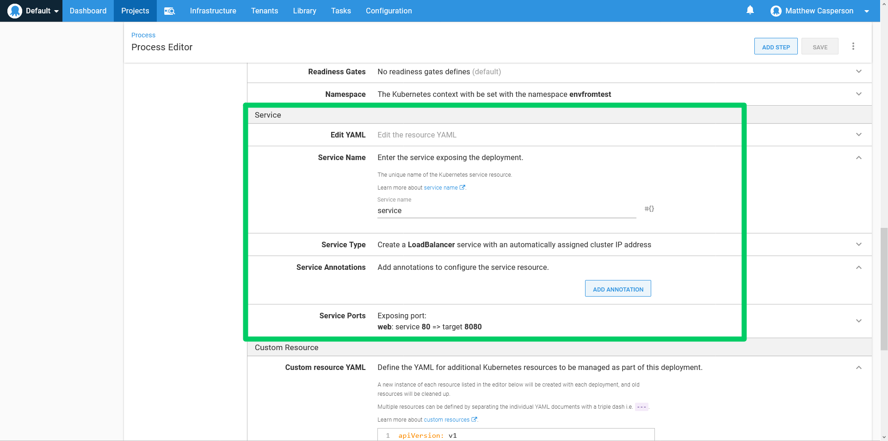
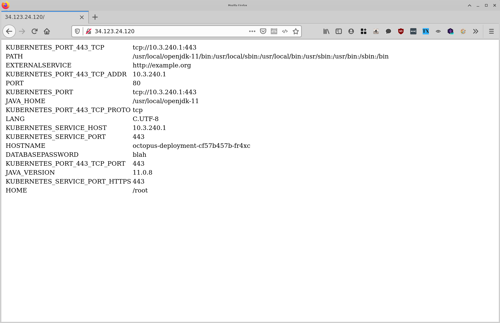

If you follow best practice guides like [The Twelve-Factor App](https://12factor.net/), your Kubernetes applications will likely externalize configuration values with environment variables. There are many ways to define these environment variables in pods, but until recently, they all involved explicitly defining each environment variable one by one.

New with Kubernetes 1.16 is the [ability to have all the values of a config map or secret exposed as environment variables in a pod](https://kubernetes.io/docs/tasks/configure-pod-container/configure-pod-configmap/#configure-all-key-value-pairs-in-a-configmap-as-container-environment-variables). With Octopus 2020.5, these new `envFrom` fields have been exposed via the **Deploy Kubernetes containers** step. When combined with the ability to deploy resources from raw YAML, we can create a workflow where groups of Octopus variables are exposed to a container without tediously mapping them one-to-one.

In this blog post, we’ll look at how to pass groups of Octopus variables directly to containers in a streamlined fashion.

## Defining the environment variables

For this example, we’ll define three environment variables: `DATABASEPASSWORD`, `EXTERNALSERVICE`, and `PORT`.

In Octopus we capture these variables in a format that will later allow us to loop over them with a template, which looks like `GroupName[VariableName].Property`. This means we end up with three Octopus variables called:

* `EnvironmentVariables[DATABASEPASSWORD].Value`
* `EnvironmentVariables[EXTERNALSERVICE].Value`
* `EnvironmentVariables[PORT].Value`:



## Enabling custom resources

One of the features in the **Deploy Kubernetes containers** step is called **Custom Resource**. We’ll use this feature to create the secret that holds our environment variables.

The **Custom Resource** feature is not enabled by default, so we must first enable it by clicking the **CONFIGURE FEATURES** button:



## Making resources immutable

The **Deploy Kubernetes containers** step is an opinionated way to deploy Kubernetes resources, and one of those opinions is that resources that support the main deployment, like secrets and config maps, are treated as immutable.

You can imagine a situation where a new deployment changed the data it expected in a config map or secret, and if the new deployment overwrote the existing supporting resources, then any old deployments are left in an undefined state. This is usually not a problem when using the recreate strategy, as all old pods are deleted before the new ones are created. But for rolling or blue/green deployments, both the old and new deployments must run side by side for a period, and so their supporting resources should run side by side as well.

In practice, this opinion that supporting resources be treated as immutable means that config maps, secrets, or custom resources created by the **Deploy Kubernetes containers** step are given a unique name with each Octopus deployment. This is done automatically by Octopus, but it’s important to understand that the name assigned to the custom resource is not the final name of the resource when it’s deployed.

## Creating the secret

Custom resources are created with raw YAML. We also have access to the Octopus template features, which we’ll use to loop over each of the variables we defined earlier. The resulting custom resource looks like this:

```YAML
apiVersion: v1
data:
#{each var in EnvironmentVariables}
  #{var}: "#{var.Value | ToBase64}"
#{/each}
kind: Secret
metadata:  
  name: mysecret
type: Opaque
```

## Defining the container

To expose the secret as environment variables, we expand the **Secret Environment Variables** section of the container definition and click the **ADD ALL ENVIRONMENT VARIABLES FROM A SECRET** button.

To reference the secret created as a custom resource, we take the resource name defined in YAML and append `-#{Octopus.Deployment.Id | ToLower}` to it. In our case, the final secret name is `mysecret-#{Octopus.Deployment.Id | ToLower}`:



To prove that the environment variables have been configured correctly, we’ll deploy the Docker image [mcasperson/printenvironment](https://hub.docker.com/r/mcasperson/printenvironment) (source code is on [GitHub](https://github.com/mcasperson/PrintEnvironment)), which is a simple web app that prints the environment variables to a web page. This image exposes port 8080:



## Exposing the container

For convenience, we’ll create a load balancer service to expose our container. This will give us a public IP to point our browser at to test the sample web application:



## Verifying the results

Opening up the load balancer IP address in a web browser shows the three environment variables exposed via the secret:



## Conclusion

By crafting our Octopus variables in a way that allows us to loop over them when creating a custom resource, and by taking advantage of the new `envFrom` fields exposed by the **Deploy Kubernetes containers** step in 2020.5, we have a workflow that allows us to directly map an arbitrary number of Octopus variables as environment variables in a Kubernetes container.

Thanks to the fact that the **Deploy Kubernetes containers** step ensures each custom resource has a unique name, and is therefore essentially immutable (at least as far as the deployment process is concerned), we can also be assured that more advanced strategies like rolling or blue/green deployments won’t leave old Kubernetes deployments in an undefined state.

This combination is a powerful and convenient solution to the common issue of externalizing many variables, and we hope it will empower teams while deploying Kubernetes applications.

Happy deployments!