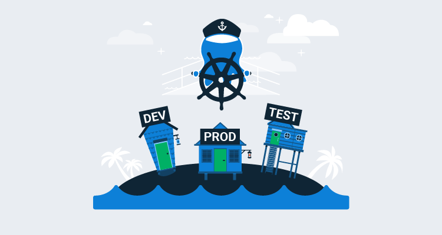

The declarative nature of Kubernetes resources provides a convenient way to describe the desired state of your cluster. However, Kubernetes has no native concept of environments. While namespaces provide a natural mechanism for partitioning your cluster, it is difficult to get a sense of what has been deployed where just by running `kubectl` or looking at traditional Kubernetes dashboards.

By [managing Kubernetes deployments](https://octopus.com/use-case/kubernetes) through Octopus, applications can be progressed through distinct environments (represented by namespaces and namespace restricted service accounts), and the current environment state is summarized by the Octopus dashboard.

In this blog post and screencast, we look at how Kubernetes deployments can be progressed through multiple environments. We'll also create a number of runbooks to manage and inspect the cluster, providing a base set of automated tools for anyone tasked with supporting the deployments and cluster in the future.

## Screencast

The video below demonstrates the process of deploying a web application to multiple environments within a Kubernetes cluster. The remainder of the blog post provides links to additional resources and copies of the scripts used in this demo:

<iframe width="900" height="506" src="https://www.youtube.com/embed/WexwK4ro9Bs" frameborder="0" allow="accelerometer; autoplay; encrypted-media; gyroscope; picture-in-picture" allowfullscreen></iframe>

## The feeds

A Docker feed pointing to Docker Hub and a Helm feed are required for our deployments:

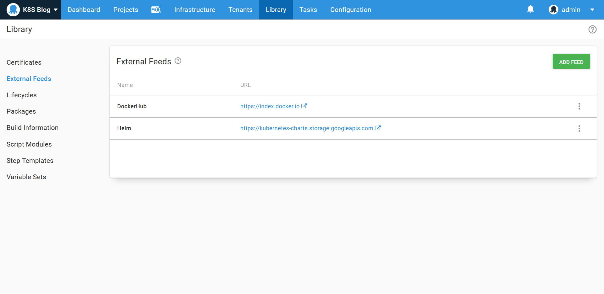

## The environments

We have three environments to represent the progression of our deployed application: **Development**, **Test**, and **Production**. We then have an environment called **Admin** that is used when managing cluster wide resources:

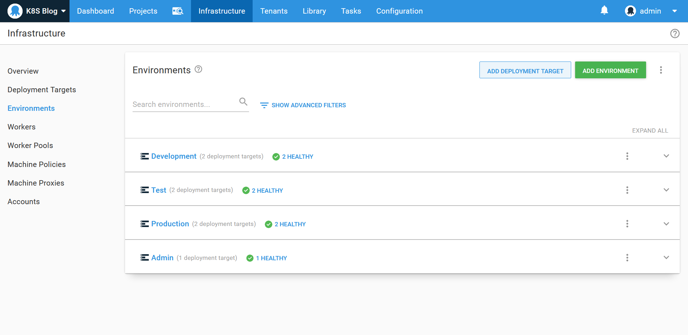

The **Development**, **Test**, and **Production** environments all have the **Dynamic Infrastructure** option enabled:

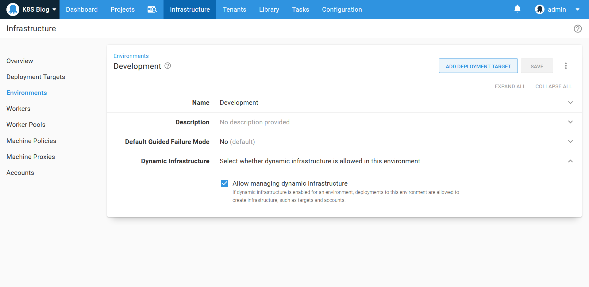

## The certificates

A wildcard certificate generated by Let's Encrypt has been uploaded to the certificate library. This will be used by the ingress resource later on:

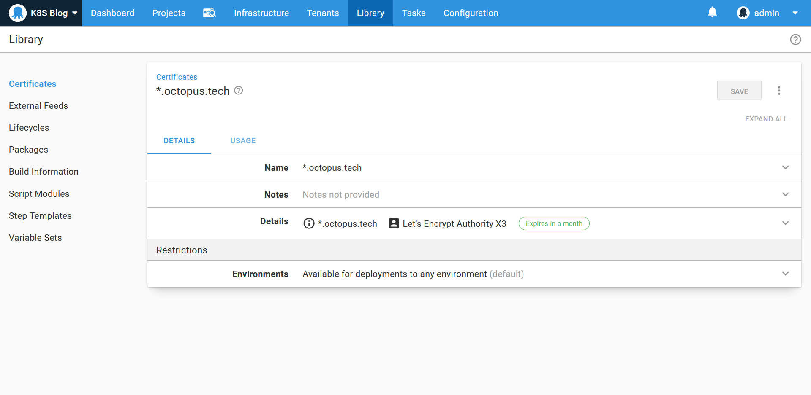

## The admin target

We need a Kubernetes target with administrative privileges as the starting point. This target will be used to install and inspect cluster wide tools, like ingress controllers, as well as creating the environment specific targets. This target has a role of **admink8s**:

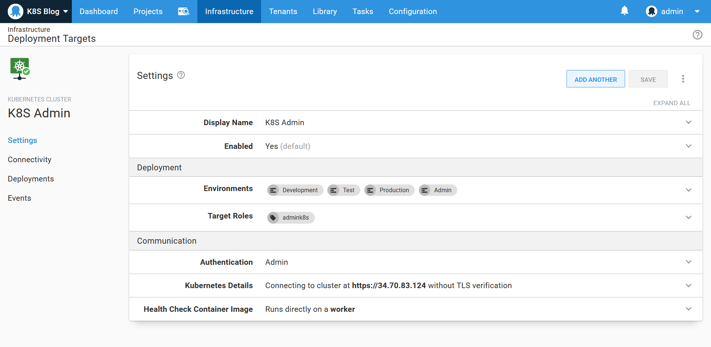

## The deployment targets

Conceptually a Kubernetes target in Octopus is a security boundary limiting deployments to a specific environment. For this example, where we are creating multiple environments in a single cluster, the security boundary is defined by a namespace and a service account that has access to only that namespace. The namespace then represents the environment, and the limited scope of the service account prevents deployments to that namespace/environment from modifying any other namespace/environment.

To create a service account limited to a specific namespace, three Kubernetes resources must be created: 

- A service account
- A role
- A role binding

The service account then creates a secret containing a generated token that is used for authentication.

Fortunately, a community step template called **Kubernetes - Create Service Account and Target** does the hard work of creating these Kubernetes resources for you, as well as creating the Octopus token account and the Kubernetes target itself. Here we configure this step as part of a runbook to create targets with the role **k8s** linked to the lowercase name of the environment:

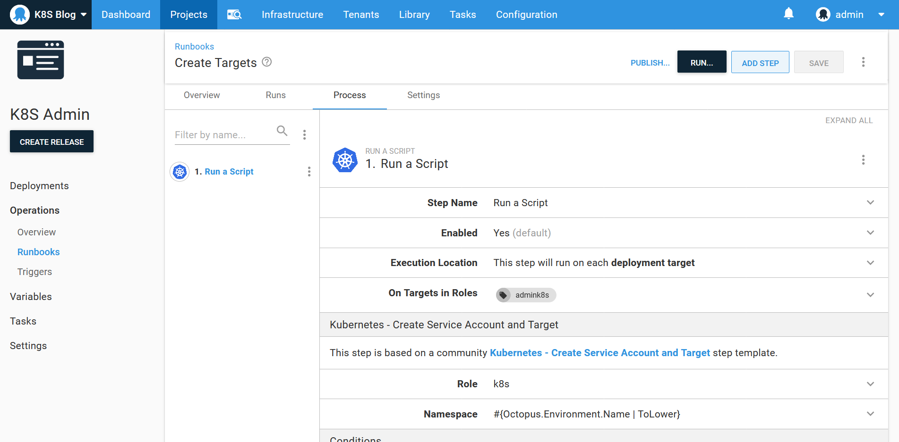

Running the runbook in the **Development**, **Test**, and **Production** environments result in three new Kubernetes targets being created. Here is the production deployment target:

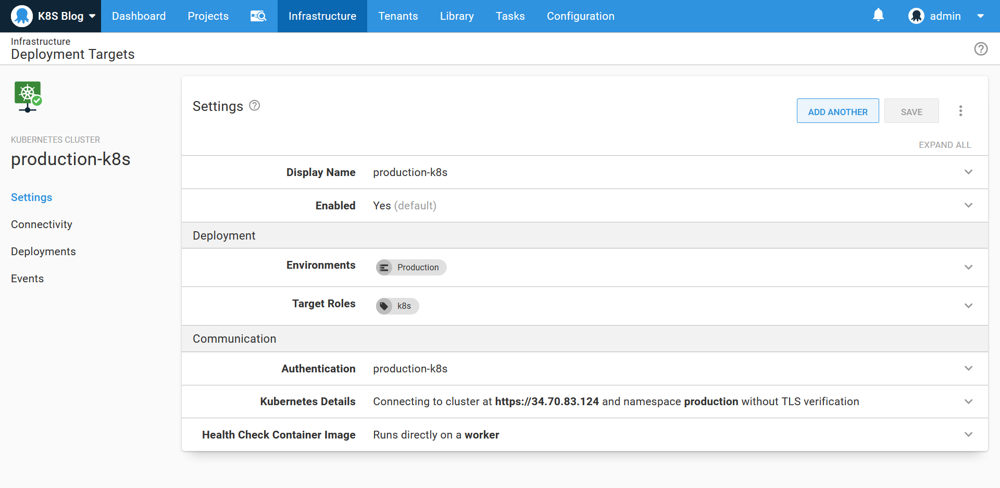

## The deployment process

We will deploy the random quotes sample application to the cluster. The source code for this Spring Boot application can be found on [GitHub](https://github.com/OctopusSamples/RandomQuotes-Java), and the Docker image is available on [DockerHub](https://hub.docker.com/r/octopusdeploy/randomquotesjava).

To demonstrate environment specific variables being passed down to each deployment, we'll create a variable called **Environment** with three values scoped to the **Development**, **Test**, and **Production** environments:

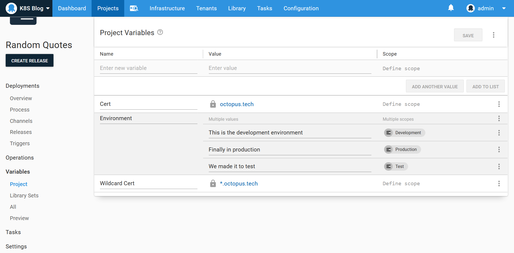

We then deploy this image using the **Deploy Kubernetes containers** step. This step provides an opinionated and UI driven interface for creating Kubernetes resources, and in this example, we will create a deployment, service, and ingress resource.

The deployment resource creates a pod with a container exposing port 80 and mapping the **Environment** variable to an environment variable called **SPRING_PROFILES_ACTIVE**. This sets the Spring active profile name, which will be displayed on the screen, allowing us to verify that the correct Octopus variable was applied for each environment:

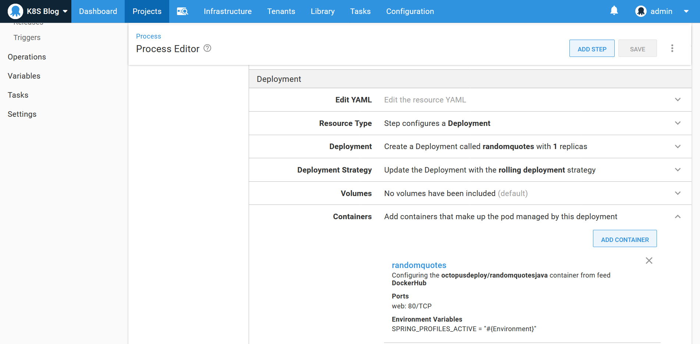

The cluster IP service then exposes port 80 internally in the cluster:

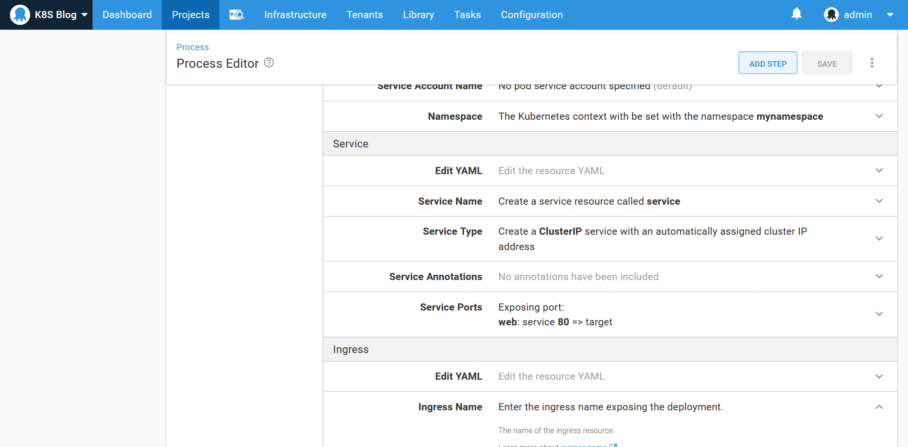

The ingress exposes the service to any request on the host **#{Octopus.Environment.Name | ToLower}.octopus.tech**. It also assigns a HTTPS certificate to that same hostname:

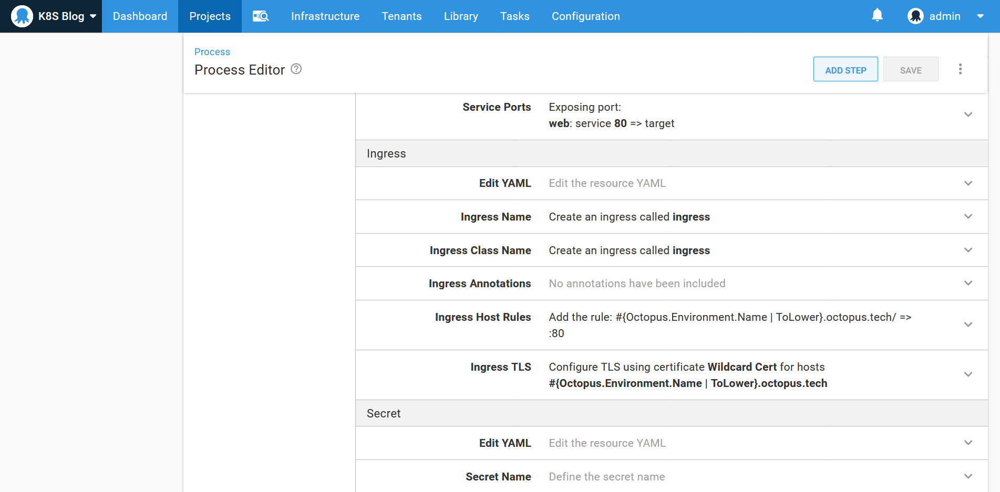

## The ingress controllers

Our Kubernetes cluster requires an ingress controller to inspect the ingress resources and create the appropriate networking rules to expose our web application. There are many [third party ingress controllers available](https://kubernetes.io/docs/concepts/services-networking/ingress-controllers/), and for this example, we will install the NGINX ingress controller. 

The easiest way to install the NGINX ingress controller is with the `nginx-ingress` helm chart. We'll install this helm chart with a **Upgrade a Helm Chart** step as part of a runbook. The step will run on the **admink8s** target, as the ingress controller is a cluster wide service:

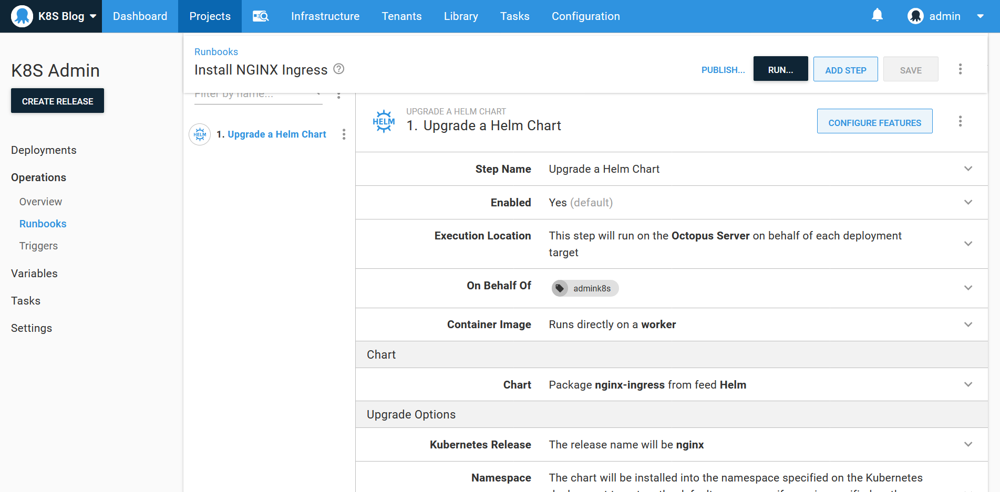

To ensure that the worker running the helm deployment has access to the helm v3 executable, the archive from the [helm releases page](https://github.com/helm/helm/releases) was uploaded to the built-in feed and referenced in the **Connection** section of the step. For Windows workers, the path to the `helm.exe` file is `windows-amd64\helm.exe`:

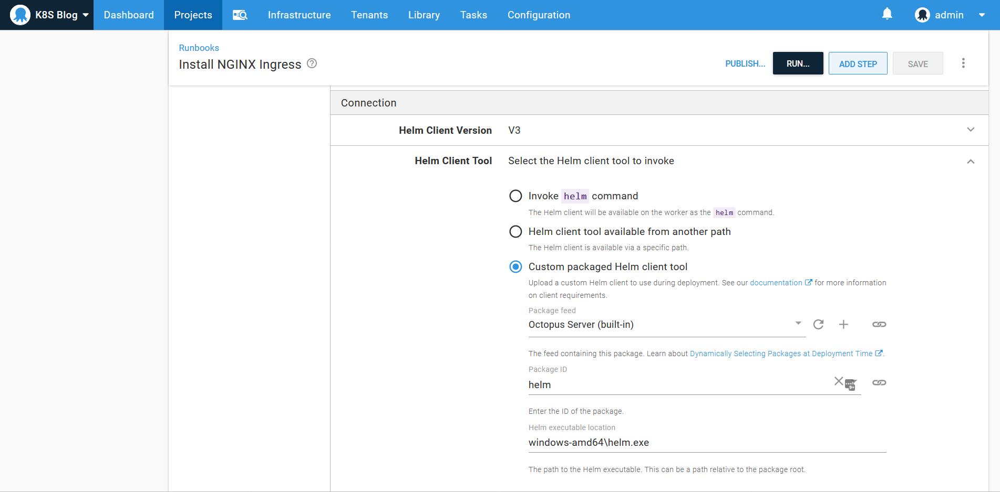

For Linux workers, the path is `linux-amd64/helm`:

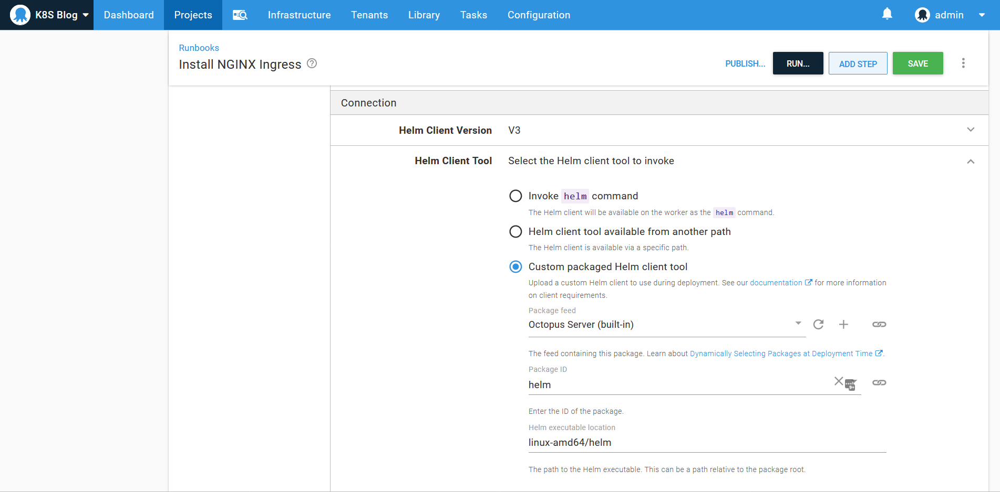

## Inspecting the ingress controller load balancer public IP

The installation of the NGINX ingress controller created a load balancer with a public IP. We need to know this public IP in order to map it to a DNS hostname.

To inspect Kubernetes resources, we use a community step template called **Kubernetes - Inspect Resources**. This step is a convenient wrapper around `kubectl`, and we'll use it to inspect the details of the services created by NGINX:

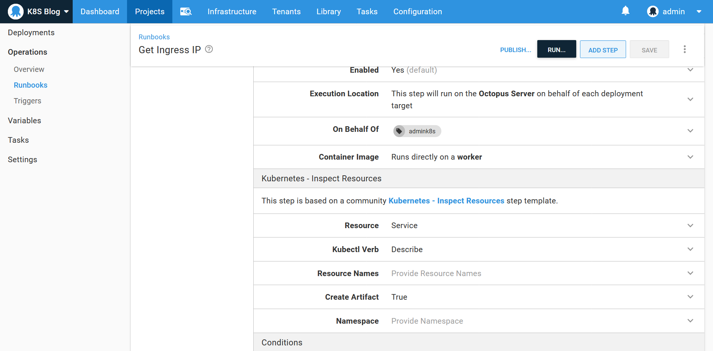

## Update the DNS records

The **octopus.tech** domain is hosted by SimpleDNS, which offers an API to update DNS records. Updating an existing DNS record is performed with an HTTP PATCH operation, and we have performed this using `curl`. The value of the **IP Address** variable is supplied via a prompt before the runbook is run, and the **SimpleDNS Token** variable is a secret:

:::hint
The `curl` executable is provided by an [additional package reference](https://octopus.com/blog/script-step-packages) to the Windows build of curl [found here](https://curl.haxx.se/windows/).
:::

```powershell
Set-Content -Path data.json -Value '{"content":"#{IP Address}"}'

.\curl\curl-7.72.0-win64-mingw\bin\curl.exe  `
  --silent `
  -H "Authorization: Bearer #{SimpleDNS Token}" `
  -H "Accept: application/json" `
  -H "Content-Type: application/json" `
  -X "PATCH" `
  --data-binary '@data.json' `
  "https://api.dnsimple.com/v2/36730/zones/octopus.tech/records/20067854"
```

Most Linux distributions will come will curl installed or available through the included package manager, so this script in bash is:

```bash
echo "#{IP Address}" > data.json

curl \
  --silent \
  -H "Authorization: Bearer #{SimpleDNS Token}" \
  -H "Accept: application/json" \
  -H "Content-Type: application/json" \
  -X "PATCH" \
  --data-binary '@data.json' \
  "https://api.dnsimple.com/v2/36730/zones/octopus.tech/records/20067854"
```

## Conclusion

Multiple environments are a common deployment pattern, and Octopus provides first-class support for progressing Kubernetes deployments through multiple environments. By creating Kubernetes targets for each environment and authenticating those targets with service accounts that only have permission to access a single namespace, Octopus ensures that deployments are created in the correct namespace and can not affect resources they should not have access to.

In this blog post and screencast, we looked at how a multi-environment Kubernetes deployment process can be created, using community step templates to create environment specific targets, and creating a number of runbooks to configure and manage the Kubernetes cluster and associated infrastructure like DNS providers. The end result was a web application deployed to the **Development**, ***Test***, and ***Production*** environments, securely exposed with HTTPS and a suite of runbooks to help anyone tasked with supporting the cluster in the future.

Happy deployments!
