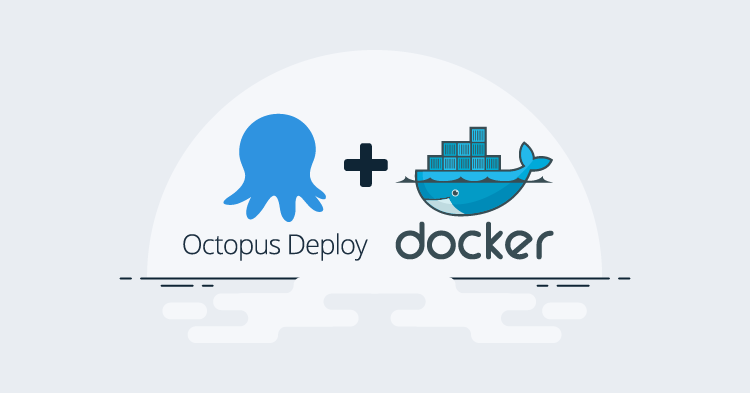
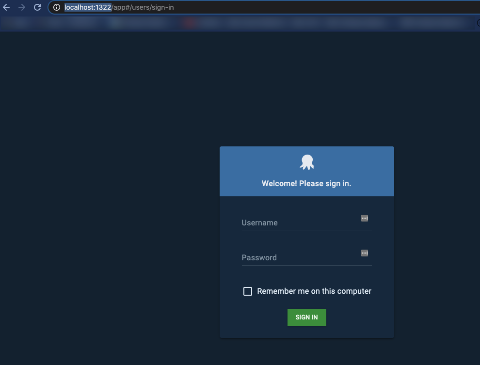

You can run Octopus on-premises, with an Octopus Cloud instance, or even in Docker. You can run Octopus Deploy in a Docker container for both testing and production environments.

In this blog post, you'll learn how to get a Docker container up and running in five minutes on your local machine.

## Prerequisites

To follow along with this blog post, you need the following:

- Knowledge of Octopus Deploy
- A computer running Windows or MacOS
- Docker [desktop](https://www.docker.com/products/docker-desktop).
- A code editor like VS Code

## Configure your Environment

The first step in creating a local containerized Octopus Deploy environment is to set up a `.env` configuration file. The `.env` allows you to save environment variables for certain values of the Docker Compose configuration. That way, you can set variables instead of hardcoding values.

1. Open a text editor and create a new file called `.env`
2. Add the following code to the `.env` file.

This containerized environment is supposed to be for testing/development purposes only, which is why you will see the passwords in the `.env` configuration file. This is not recommended for production-based deployments.

```bash
SA_PASSWORD=P@ssw0rd!
OCTOPUS_ADMIN_USERNAME=admin
OCTOPUS_ADMIN_PASSWORD=SecreTP@assw0rd
```

After the values are added to the `.env` file, you can create the Docker Compose file.

## Configure Docker Compose to run Octopus Containers

The next step is to create a Docker Compose file, which stores the configuration for two containers. The Docker Compose file creates a running container for the Octopus Deploy environment to run on your local machine. The Compose file consists of two configurations:

- The SQL Docker image used for the Octopus Deploy backend
- The Octopus Deploy Docker image

1. Create a new file called `docker-compose.yml`. Ensure that it's saved in the same directory as the `.env` configuration file. This tells Docker you're using a Compose file to create an environment.
2. The first section of the Docker Compose file sets up the configuration for the database. The database configuration uses the Linux SQL image, accepts the EULA and provides the SA password. After that, you specify the port that you want to use and the health check to confirm that the database comes up successfully:

```yaml
version: '3'
services:
   db:
    image: mcr.microsoft.com/mssql/server
    environment:
      SA_PASSWORD: ${SA_PASSWORD}
      ACCEPT_EULA: 'Y'
    ports:
      - 1401:1433
    healthcheck:
      test: [ "CMD", "/opt/mssql-tools/bin/sqlcmd", "-U", "sa", "-P", "${SA_PASSWORD}", "-Q", "select 1"]
      interval: 10s
      retries: 10
```

3. The second part of the Docker Compose file configures Octopus Deploy. It uses the official Octopus Deploy image, the environment is set up to accept the EULA, configure the Octopus Deploy username, password, and the database connection string to the SQL DB container that was configured earlier. The ports are then specified for Octopus Deploy, and there is a `depends_on` switch to ensure that the database is configured prior to the Octopus Deploy container running. The condition is to ensure that the database service is healthy:

```yaml
octopus:
    image: octopusdeploy/octopusdeploy:latest
    environment:
       ACCEPT_EULA: "Y"
       OctopusAdminUsername: "${OCTOPUS_ADMIN_USERNAME}"
       OctopusAdminPassword: "${OCTOPUS_ADMIN_PASSWORD}"
       DB_CONNECTION_STRING: "Server=db,1433;Initial Catalog=Octopus;Persist Security Info=False;User=sa;Password=${SA_PASSWORD};MultipleActiveResultSets=False;Connection Timeout=30;"
    ports:
    - 1322:8080
    - 10943:10943
    depends_on:
      db:
        condition: service_healthy
    stdin_open: true
```

The entire `docker-compose.yml` file should look like this:

```yaml
version: '3'
services:
   db:
    image: mcr.microsoft.com/mssql/server
    environment:
      SA_PASSWORD: ${SA_PASSWORD}
      ACCEPT_EULA: 'Y'
    ports:
      - 1401:1433
    healthcheck:
      test: [ "CMD", "/opt/mssql-tools/bin/sqlcmd", "-U", "sa", "-P", "${SA_PASSWORD}", "-Q", "select 1"]
      interval: 10s
      retries: 10

   octopus:
    image: octopusdeploy/octopusdeploy:latest
    environment:
       ACCEPT_EULA: "Y"
       ADMIN_USERNAME: "${OCTOPUS_ADMIN_USERNAME"
       ADMIN_PASSWORD: "${OCTOPUS_ADMIN_PASSWORD}"
       DB_CONNECTION_STRING: "Server=db,1433;Initial Catalog=Octopus;Persist Security Info=False;User=sa;Password=${SA_PASSWORD};MultipleActiveResultSets=False;Connection Timeout=30;"
    ports:
    - 1322:8080
    - 10943:10943
    depends_on:
      db:
        condition: service_healthy
    stdin_open: true
```

## Run the Docker Compose file

Now that the Docker Compose and the environment configurations are set, it's time to run the Docker Compose file.

From the directory where both the `.env` and `docker-compose.yml` files are, run the following command to create the Octopus Deploy and SQL containers:

```bash
docker-compose up
```

You will see the Docker Compose file running.

Now, open a web browser and go to the following URL to access the local Octopus Deploy instance.

```bash
http://localhost:1322/
```

You will see the Octopus Deploy login page:



Log in using the Octopus deploy username and password specified in the `.env` configuration file.

You are now successfully logged into Octopus Deploy and can start using it.

If you'd like to take this journey even further, you can learn how to run an Octopus Deploy Linux container on Kubernetes using a [blog post by Matthew Casperson](https://octopus.com/blog/introducing-linux-docker-image).

The code in this post is available in [GitHub](https://github.com/OctopusSamples/OctopusDeploy-Local-Docker-Env)
