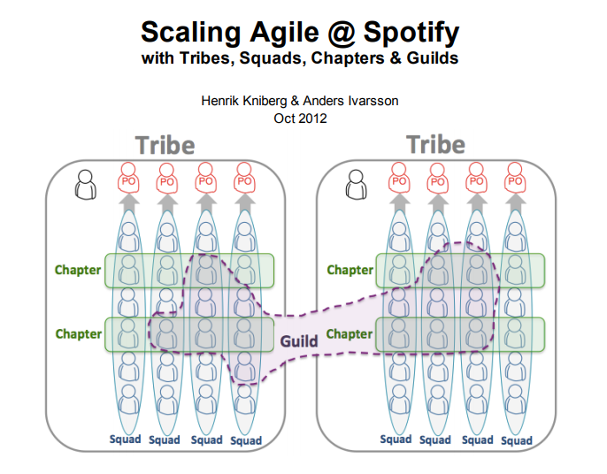

Last month [I shared my DevOps Reading List](https://octopus.com/blog/devops-reading-list). The post went a little wild on social media and for a few days I got lost in the discussions on [Twitter](https://twitter.com/_AlexYates_/status/1330763347281780736) and [LinkedIn](https://www.linkedin.com/feed/update/urn:li:activity:6736600404013985792/). One person shared the link with a comment that my blog post was a “must read” for anyone who wanted to build a career as a “DevOps Engineer”.

While I was grateful for the endorsement, I felt uncomfortable about my words being used in that context. You see, I don’t like the title “DevOps Engineer”.

In this post I’m going to start by attempting to articulate why many folks in the DevOps community wince when they hear the words “DevOps Engineer” or “DevOps Team”. I’m then going to suggest a few other job titles that might be more appropriate, and which might avoid raising eyebrows within the community.

And by the way, I know this is a pretty hot topic. It’s not my intention to start a [flame war](https://www.urbandictionary.com/define.php?term=flame%20war). I do not mean to undermine the valuable and important work that is done every day by excellent “DevOps Engineers” around the world. In fact, while I dislike the naming convention, I actually hold the view that the people who find themselves with the “DevOps Engineer” job title are typically undervalued and underappreciated.

If you are a “DevOps Engineer”, I salute you. And I would love you to have a job title that is a better representation of the genuine contributions that you deliver through your work.

## A different way of thinking

A job title normally defines the task(s) a person is required to perform. A “Software Developer” develops software, a “Systems Administrator” administrates systems, and a “Team Lead” leads teams. The quality with which they perform that task can be used to assess their performance.

DevOps is different. DevOps is the way a group of people, who typically hold different roles, skills, and responsibilities, work together to achieve some goal. It’s a collaboration protocol, and asking one person or one team to “do all the collaborating” makes no sense. Put another way, if you adopted DevOps because you had a silo problem, creating a new “DevOps” silo is unlikely to be an effective solution.

**What does a “DevOps Engineer” actually do?**

Unlike “Software Developer”, “Systems Administrator”, or “Team Lead”, the title “DevOps Engineer” does not clearly define the task a person is expected to perform. “DevOps” simply does not make sense as a task to be completed by a specific person. No-one person can engineer a DevOps.

I will concede that in recent years the title has often been used as a shorthand either for the person who looks after the build/release system and/or a person who manages a bunch of cloud infrastructure. However, this over-simplification is harmful.

Boiling DevOps down to simply automated deployments and/or infrastructure as code only gets an organisation so far. Organizations that focus on deployment automation and neglect the rest of the DevOps package often initially see an illusion of significantly improved productivity, but later get bogged down when they realise they’ve been shipping bugs and racking up [technical debt](https://martinfowler.com/bliki/TechnicalDebt.html) more quickly than before.

Picking the automated deployment cherry, without putting up the appropriate testing, security, architectural and wider cultural guard rails, rarely delivers the sort of return that DevOps enthusiasts promise.

**DevOps is an interface, not a class**

Instead of imagining DevOps as a task for a specific class of engineer, imagine DevOps as an interface to be implemented by many different classes of engineers, as well as folks in many other departments throughout an organisation (senior leadership, marketing, infosec etc).

I tried to codify it as follows:

<blockquote class="twitter-tweet">
/* DevOps != Job DevOps == Interface */  class DevOpsEngineer extends Job {  // protocol + !directive } class Developer extends Job {  // directive + !protocol }  interface DevOps {  // protocol } class Developer extends Job implements DevOps {  // directive + protocol }
&mdash; Alex Yates (@_AlexYates_) <a href="https://twitter.com/_AlexYates_/status/1334812186905092097?ref_src=twsrc%5Etfw">December 4, 2020</a></blockquote> 

That was quite a technical way of putting it, so for the folks who aren’t software developers, let me put it another way, using a more accessible example.

**Would you hire a “Spotify Model” Engineer?**

The “Spotify Model” is a form of matrix-management structure that’s popular within the DevOps community for large IT departments. You can read more about the “Spotify Model” in [this whitepaper by Henrik Kniberg and Anders Ivarsson](https://blog.crisp.se/wp-content/uploads/2012/11/SpotifyScaling.pdf).

Under this model, the primary software team structure is a “squad”, and multiple squads are grouped into “tribes”, which contain no more than 150 people. A squad has a specific business objective and is made up of everyone that’s required to design, develop, test and release whatever software is required to meet that objective. To use [Team Topologies](https://octopus.com/blog/devops-reading-list#tt) vocabulary, a “squad” would probably be a “[stream-aligned](https://www.atlassian.com/devops/frameworks/team-topologies#:~:text=the%20best%20approach.-,Stream%2Daligned%20team,or%20a%20single%20user%20persona.)” team.

There are various other communication, collaboration, and management structures that connect the squads and tribes, but I’m not going to get distracted by those here. If you are interested, read the whitepaper. (It’s very good.)

The important point is that, like DevOps, if an organization uses the “Spotify Model” it implies that everyone in IT will need to embrace it. Regardless of their role, everyone in a tribe is going to be affected by the specific team and communication structures.

Here’s an example of one of the engineering implications, copied verbatim from the whitepaper:

> “Technically, anyone is allowed to edit any system. Since the squads are effectively feature teams, they normally need to update multiple systems to get a new feature into production.”

Since squads are aligned to business objectives, rather than specific services or codebases, some form of standardised build and release process is likely to be a necessity. In fact, this is implied pretty heavily here:

> “At Spotify there is a separate operations team, but their job is not to make releases for the squads – their job is to give the squads the support they need to release code themselves.”

So, would you call that operations team a “Spotify Model Team”? Is it made up of “Spotify Model Engineers”? Hmmm, that doesn’t sound right, does it?

It doesn’t sound right because the Spotify Model is primarily a management/collaboration structure that effects everyone, and the work that is required to maintain the deployment platform is only one capability that is required to make it work.

The same is true of DevOps. Build and release pipelines are the tip of the iceberg… And it’s a big iceberg.

**So, what is “DevOps” anyway?**

Let’s look at a few of the most widely accepted definitions of DevOps:

-	[Calms](https://www.atlassian.com/devops/frameworks/calms-framework) (Culture, automation, lean, measurements, sharing)
-	[The Three Ways](https://itrevolution.com/the-three-ways-principles-underpinning-devops/) (Flow, Feedback, Continual Experimentation and Learning)
-	[Accelerate metrics](https://octopus.com/blog/devops-reading-list#accelerate) (Lead time, deployment frequency, MTTR, change failure %)

In all cases, the scope of DevOps is clearly much broader than a deployment pipeline or a single person/team. It’s about the practice and performance of the whole IT organisation.

Accelerate goes on to define [24 capabilities](https://itrevolution.com/24-key-capabilities-to-drive-improvement-in-software-delivery/) that contribute to high IT performance. Of these 24 capabilities only two, (“use version control for all production artifacts” and “automate your deployment process”), neatly match the infrastructure as code/deployment pipeline DevOps job description. There are probably other capabilities that correlate, but these capabilities don’t map neatly to a single person. These are organisational capabilities, rather than individual capabilities. Most of them simply do not make sense if they are tasked to a single person. For example:

-	Use trunk-based development methods
-	Use a loosely coupled architecture
-	Shift-left on security
-	Support a generative culture

While deployment pipelines are certainly important, even critical, they are just one detail. It’s important not to get lost in that specific detail at the expense of the big picture.

**Signalling the wrong ideas**

The assignment “DevOps Engineer” or “DevOps Team” is harmful because it promotes two problematic ideas to most of the people in the organisation:

1.	DevOps is someone else’s job, and not their primary concern
2.	DevOps is just deployment pipelines and/or infrastructure as code

Based on the lessons that DevOps has taught us, this is counterproductive. DevOps works when everyone signs up to it, and when it’s recognised in the broader sense that I described above. DevOps fails when it’s interpreted as just a deployment pipeline that can be outsourced to some third party.

In fact, among the DevOps community, seeing a job advert for a “DevOps Engineer” is a bit like a [code smell](https://martinfowler.com/bliki/CodeSmell.html). It hints that the organisation is likely to interpret DevOps in this counter-productive narrow sense. A lot of the best people may consider this a red flag and be actively put off working for a company that employs “DevOps Engineers” for this very reason.

**The impossible remit of the poor “DevOps Engineer”**

DevOps makes big promises about improvements in IT performance, but these improvements are the result of many factors and many people. Those factors certainly include effective build and deployment pipelines, but they also include many other technical, procedural, and cultural factors that are well beyond the scope of a single “DevOps Engineer” or “DevOps Team”.

Let’s not burden one person/team with the implied responsibility of the whole organisation’s IT performance (unless they are the CTO). It would set the poor “DevOps Engineer” up for failure since the promises DevOps makes are unattainable based on their actions alone.

You can measure the performance of a “Software Developer”, “Systems Administrator” or “Team Lead” based on how well they do the tasks described by the job description, but you cannot measure the success of any single engineer/team, based on the success of an organization’s DevOps initiative, unless that single engineer/team is ultimately responsible for the performance of the entire IT organisation.

## Suggested alternative job titles

For the record, I’m not saying I fundamentally disagree with asking one person or a team to develop shared tools for the benefit of the wider organisation. Those shared tools may well include deployment and self-service environment-provisioning platforms.

Team Topologies refers to these teams as “[Platform Teams](https://www.atlassian.com/devops/frameworks/team-topologies#:~:text=products%20and%20services.-,Platform%20team,stream%2Daligned%20team%20can%20use.)”. [Site Reliability Engineering](https://octopus.com/blog/devops-reading-list#sre) also advocates for this, talking at length about the role and scope of the “Site Reliability Engineering” role/team. However, in both cases, DevOps is recognised as a broader topic than simply the job description of the individuals in these teams/with these roles. In fact, upon reflection, [it appears that I subconsciously and accidentally plagiarised them with my interface metaphor above](https://cloud.google.com/blog/products/gcp/sre-vs-devops-competing-standards-or-close-friends).

More simply, for an engineer who specialises in looking after a build/release pipelines, why not “Build/Release Engineer”. For someone who looks after some cloud infrastructure, how about “Infrastructure Engineer”, or plain old “Systems Administrator”?

If a person is expected to build multiple internal tools for other software teams, why not plain old “Software Developer”? Before you raise any eyebrows, consider the titles given to the folks who build, maintain, or administrate your CRM, HR, and accounting systems? You might have a “CRM Developer”, but I’m guessing these folks aren’t called “Sales Engineers”, “HR Administrators” or “Accountants”. Those job titles all mean something else entirely.

After all, while most software developers are learning to work in new ways, not many people are seriously suggesting that they need a new job title just because we are moving away from waterfall project management styles towards DevOps.

The one place where I support using "DevOps" in a job title is for a "DevOps Coach" or "DevOps Mentor" etc. If your job is to help others to understand and practice DevOps, great. I have no issue with you. Carry on.

Fundamentally, it makes a lot more sense if job titles reflect what a person is required to do, rather than the development philosophy of the wider organisation. 

(Even if what they are required to do is solely to manage an Octopus Deploy server.)

That’s it from me for 2020.

For many of us it’s been a rough year. Happy holidays to all my readers. Enjoy a well-deserved rest - and raise a glass for me to the health workers, key workers and scientists who’ll be busy keeping us safe and rolling out the vaccines.

Most of all, stay safe folks - the end is in sight.

See you in 2021. 😊
