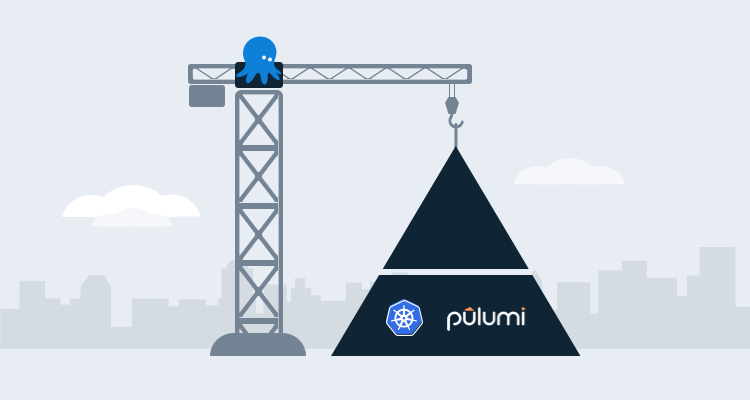

Creating software-defined infrastructure comes in many different shapes and sizes, including popular IaC tools like Terraform and configuration management tools like Ansible. One thing holds true with any tool, you want the ability to write the code in a language that you prefer.

[Pulumi](https://www.pulumi.com/) combines the power of infrastructure as code and general purpose programming to make infrastructure as software, and it lets you write the code as you normally would in Go, Python, JavaScript, etc.

In this blog post, I explain how to create an Azure Kubernetes Cluster (AKS) using Pulumi, Python, and Octopus Deploy.

## Prerequisites

When you create infrastructure as software with Pulumi, there are a few hard prerequisites you need to consider. As soon as you create a new project, you're asked which cloud and programming language you're using, because of this, it's best to pick specific technologies.

To follow along with this blog post, you need the following:

- A Pulumi project already defined to use Azure and Python.
- An Azure account. If you don't already have one, you sign can up for a [30-day free trial](https://azure.microsoft.com/en-us/free/).
- An Azure app registration. If you don't know how to create one, you can follow these [instructions](https://docs.microsoft.com/en-us/azure/active-directory/develop/howto-create-service-principal-portal).
- Intermediate level knowledge of Python.
- A GitHub account where you can start the Python code.
- An external [GitHub feed](https://octopus.com/docs/packaging-applications/package-repositories/github-feeds).

## Creating the Python code

The following sections show you how to write the code in Python.

### Writing Python constants

When you're using Pulumi, you have a few options to pass in arguments at runtime:

- A config file
- From the command-line
- Hard-coded in the code

I prefer to create a constants file because it lets me avoid hard-coding the values and gives me one location where I can change the values.

If you decide to take this approach, in your Pulumi project, create a new file called `aksParamConstants.py`.

Add the following constants to the your file. Keep the `keys` the same, but the `values` should change based on the environment you're working in:

```python
name = ('octoaks92')
location = ('eastus')
resource_group_name = ('resource_group')
dns_prefix = ("dns_prefix")
min_count = (1)
max_count = (1)
vm_size = ('Standard_D12_v2')
auto_scaling = (True)
clientID = ("azure_app_registration_client_id")
```

### Writing Python functions

The Python code will use the Pulumi Azure Python SDK.

First, you need to import the packages that you'll use to create an AKS cluster.

The first library is for logging and will be used to output any errors that occur. The second import is the Pulumi SDK itself. The third is the `[aksParamConstants.py](http://aksparamconstants.py)` file you created in the previous section, Finally, you're importing the core components from the `pulumi_azure` library to manage containers in Azure:

```python
import logging
import pulumi
import aksParamConstants as constants
from pulumi_azure import containerservice, core
```

The next piece of code is the Python function itself.

The function calls the `KubernetesCluster` class that exists in the SDK and uses a few of the properties that you can initiate and assign values to:

```python
def createAKSCluster():
    config = pulumi.Config()

    if containerservice == None:
        logging.warning("Check to ensure the containerservice import is accurate")
    
    else:
        try:
            containerservice.KubernetesCluster(
                resource_name = constants.name,
                default_node_pool={
                    'min_count': constants.min_count,
                    'max_count': constants.max_count,
                    'name': constants.name,
                    'vm_size': constants.vm_size,
                    'enable_auto_scaling': constants.auto_scaling
                },
                dns_prefix=constants.dns_prefix,    
                resource_group_name=constants.resource_group_name,
                service_principal={
                    'client_id': constants.clientID,
                    'client_secret': config.require_secret('clientSecret')
                    }
                )

        except Exception as e:
            logging.error(e)
```

For a pull list of the properties that you can use, take a look at the SDK itself under the `KubernetesCluster` [class](https://github.com/pulumi/pulumi-azure/blob/master/sdk/python/pulumi_azure/containerservice/kubernetes_cluster.py).

The `__main__.py` file in the Pulumi project should look like this:

```python
import logging
import pulumi
import aksParamConstants as constants
from pulumi_azure import containerservice, core
    

def createAKSCluster():
    config = pulumi.Config()

    if containerservice == None:
        logging.warning("Check to ensure the containerservice import is accurate")
    
    else:
        try:
            containerservice.KubernetesCluster(
                resource_name = constants.name,
                default_node_pool={
                    'min_count': constants.min_count,
                    'max_count': constants.max_count,
                    'name': constants.name,
                    'vm_size': constants.vm_size,
                    'enable_auto_scaling': constants.auto_scaling
                },
                dns_prefix=constants.dns_prefix,    
                resource_group_name=constants.resource_group_name,
                service_principal={
                    'client_id': config.require('clientID'),
                    'client_secret': config.require_secret('clientSecret')
                    }
                )

        except Exception as e:
            logging.error(e)

createAKSCluster()
```

### Storing the code in GitHub

Because Octopus Deploy needs to retrieve and pull the Pulumi project from a feed and eventually push that code to a deployment target, you can push the Pulumi project to a GitHub repo.

Next, you can create a new release of the code in GitHub. Octopus Deploy looks for specific release versions when using external feeds to pull in code.

## Configure the deployment in Octopus Deploy

Now that the code is written and stored in GitHub, it's time to deploy the package with Octopus Deploy.

### Authentication in Octopus Deploy

For the Pulumi step you need an Azure account configured as a variable in the project variables for authentication.

1. In the Octopus Web Portal navigate to the project.
1. Select project variables.
1. Create a new variable called Azure.
1. Under value, go to **{{ CHANGE TYPE, Azure Account}}**.
1. Choose the Azure account that you want to use for authentication.

## Pulumi password and secret variable

When you authenticate to Azure from the Pulumi code, you need to provide an Azure app registration and client secret. The client secret is sensitive, so you should store it somewhere safe:

1. Go to **{{Project,Variables}}**.
2. Create a new variable called `clientSecret`.
3. Ensure  the type is Sensitive.
4. Add the value of the Azure app registration client secret. 

### The Code package step

1. In the Octopus Deploy portal, create a new project to use to deploy the Pulumi package.
2. Go to **{{Deployments,Process}}**.
3. Click the **ADD STEP** button.

The first step you need to add is the **DEPLOY A PACKAGE** step. This lets you specify the external GitHub feed, point to the GitHub repo that the Pulumi package exists in, and push it to the deployment target.

4. Under `.NET Configuration Transforms`, click the **CONFIGURE FEATURES** button.
5. Uncheck all of the .NET options and check/select **Custom Installation Directory.** The custom installation directory is where the Pulumi package will be pushed to and stored so the next step in the process can use it.
6. Save the step.

### Installing the Pulumi SDK

Before running any Pulumi package, you need to ensure that the Pulumi SDK exists. The Pulumi SDK also contains the Azure for Pulumi SDK.

1. Add a **Run a Script** step.
2. Under the **Inline Source Code** section, add the following code under Bash: `pip install pulumi`

### The Pulumi Step

Next, it's time to add in the first Pulumi step. The Pulumi step will create a secret and the AKS cluster. Instead of using a third-party step template, you're going to use the **RUN A SCRIPT** template to use the Pulumi commands in Bash.

For the **RUN A SCRIPT** step, add the following code to the **Inline Source Code** section under **Script**:

```bash
cd /home/mike/pulumiaks/AKS-Create
secret=$(get_octopusvariable "clientSecret")
sudo /root/.pulumi/bin/pulumi config set --secret clientSecret $secret
sudo /root/.pulumi/bin/pulumi up --yes
```

### Running the Pulumi deployment

It's now time to run the deployment:

1. Click **SAVE**.
2. Create a new release.
3. Save the release.
4. Choose a lifecycle and deployment where you would like to deploy the Pulumi package to.
5. Click **DEPLOY TO some_environment**.
6. Click **DEPLOY**.

Congrats! You have successfully created an AKS cluster using infrastructure as software.

## Conclusion

With the power of Pulumi allowing you to not only define infrastructure and services with general purpose programming language, but also giving you the ability to store state and the power of deployments with Octopus Deploy, we're slowly moving into a new age of infrastructure development.
