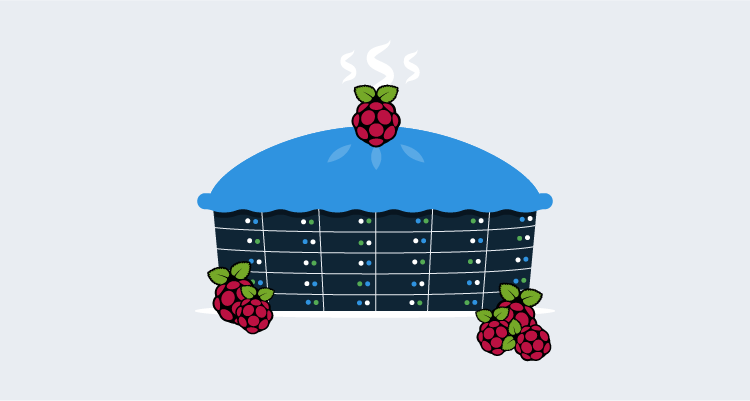
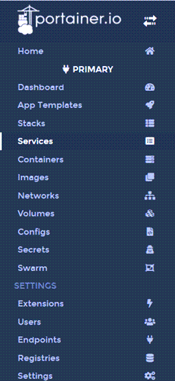
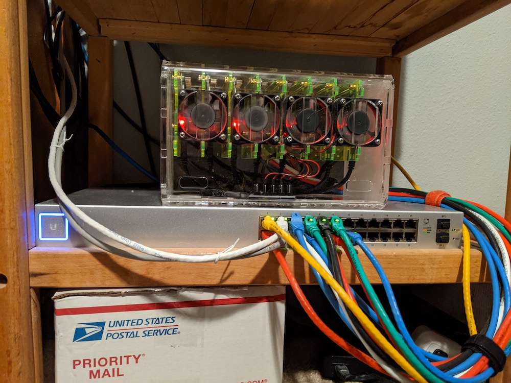

In a previous post, [lessons learned building a Raspberry Pi cluster](https://octopus.com/blog/raspberry-pi-cluster-lessons-learned), I shared some of the things I learned using Raspberry Pi machines in a Docker Swarm. Here are some more lessons I've since learned (if you want to see the first four lessons, take a look at that [previous post](https://octopus.com/blog/raspberry-pi-cluster-lessons-learned)).

## Configuration and networking update

In the last post, the cluster consisted of five Raspberry Pi machines, which was due to the 8-port switch I had available.  I have since upgraded to a 24-port switch which allowed me to fill the case completely with an additional three Pi machines.  With a total of eight machines, I could evenly split them between Docker Swarm and Kubernetes (K8s).

If you're interested, I switched my entire network gear to [Unifi](https://www.ui.com).  This post isn't about networking equipment, but if you've ever considered Unifi, I highly recommend it.  It gives you the control of enterprise equipment at a more affordable price.  A word of caution, they give you just enough freedom with the configuration to get yourself in trouble, making it possible to spiral out of control:

> If I added just one more access point between the kids room and the dining room, I could maintain full 5Ghz signal strength all the way down the hall

You've been warned :)

## Lesson 5: Raspberry Pi 4 has a 64-bit processor, but Raspberry Pi OS is still 32-bit

As I stated in the last post, not all containers will run on the ARM architecture.  However, I did find that there are a number of containers that will run on ARM64.  With my original project, I had attempted to run these ARM64 compatible containers, but they all failed claiming incompatible architecture.  That confused me as I read the processor in the Raspberry Pi 4 is 64-bit chip.  What I didn't realize was that the Raspberry Pi OS is still only 32-bit, which makes sense because it wasn't until recently they offered a model with greater than 4GB of RAM.  With 8GB models now available, Raspberry Pi OS does have a 64-bit version, but it's still in beta.

I did some more research and found [Ubuntu has a 64-bit, ARM compatible version](https://ubuntu.com/download/raspberry-pi) available.  Being somewhat familiar with Ubuntu, I loaded this OS on to 4 of my Raspberry Pi machines.

## Lesson 6: ARM64 compatible containers

Other than learning about cluster computing, the other goal of my Raspberry Pi project was to reduce the load on my Hypervisor by using containers instead of VMs. One of the VMs I wanted to replace was running MySQL.  The only containers I could find on [Docker Hub](https://hub.docker.com) than ran on ARM were unofficial, old, and sparsely updated ports of MySQL for Raspberry Pi.  Unfortunately, the database deployment technologies I used would complain they were too old and required me to purchase new licenses ... boo!  As luck would have it, the [MySQL-Server](https://hub.docker.com/r/mysql/mysql-server) container happened to be ARM64 compatible!  With a couple of YAML files, I quickly spun up MySQL containers running in my K8s cluster:

```yaml mysql-deployment.yaml
apiVersion: apps/v1
kind: Deployment
metadata:
  name: mysql-dev-deployment
spec:
  replicas: 1
  selector:
    matchLabels:
      component: mysqlserver-dev
  template:
    metadata:
      labels:
        component: mysqlserver-dev
    spec:
      containers:
        - name: mysqlserver-dev
          image: mysql/mysql-server
          ports:
            - containerPort: 3306
          env:
            - name: MYSQL_ROOT_PASSWORD
              value: "A_Password_I_will_not_share"
            - name: MYSQL_ROOT_HOST
              value: "%"
```
```yaml mysql-loadbalancer.yaml
apiVersion: v1
kind: Service
metadata:
  name: loadbalancer-dev-mysql
spec:
  selector:
    component: mysqlserver-dev
  ports:
    - port: 3306
      targetPort: 3306
      name: mysqldevport
  externalIPs:
    - 192.168.1.64
  type: LoadBalancer
```

With this container running, I could now run a modern version of MySQL and test the various deployment methods (Dbup, Flyway, Liquibase, and RoundhousE)!

## Lesson 7: Better Swarm monitoring

For my original Swarm project, I had followed a [guide](https://howchoo.com/g/njy4zdm3mwy/how-to-run-a-raspberry-pi-cluster-with-docker-swarm) that had you run a container called Visualizer.  This container displayed which containers were running on which node within your cluster, but little else.  My colleague, Adam Close, told me about [Portainer](https://www.portainer.io/), a tool for container management.

Portainer gives you the ability to not only see what containers are running in your Swarm, it also lets you manage the swarm itself.  The left-hand navigation gives you an indication as to its capabilities



Needless to say, Portainer was a much nicer tool to use for container management.

## Conclusion

This project continues to be quite fun as I learn more and more about Linux, Docker, and Kubernetes.  It also gives me something to do while the COVID-19 issue drags on.



P.S. I'm aware that my cable management skill leave a bit to be desired ;)
