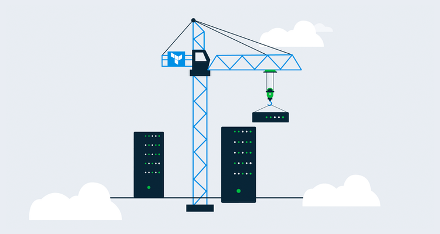

Infrastructure developers write code to automate the process of configuring cloud and on-premises infrastructure, in this post, I show you how to use Terraform and Octopus Deploy to deploy services to Azure.

## Prerequisites

To follow along with this blog post, you need the following:

- An Octopus Deploy server, either [on-premises](https://octopus.com/start/server) or a [cloud instance](https://octopus.com/start/cloud)
- An Azure subscription. If you don't already have one, you can sign up for a [30-day free trial](https://azure.microsoft.com/en-us/free/).
- An Azure Service Principal (app registration) that has access to create resources in your Azure subscription.
- Knowledge of [Terraform](https://www.terraform.io/intro/index.html) at a beginner-to-intermediate level.

## Using Octopus and Terraform together

Terraform is an open-source [Infrastructure as code](https://docs.microsoft.com/en-us/azure/devops/learn/what-is-infrastructure-as-code) platform created by [Hashicorp](https://www.hashicorp.com/) that is supported by default in Octopus Deploy. 

You can deploy Terraform resources to:

- Azure
- AWS
- On-premises (hardware and virtualized environments)

One of the major benefits of using Terraform in a continuous delivery and deployment tool is that you can focus on writing the code, not manually deploying it. Combining Octopus and Terraform allows you to automate the entire lifecycle.

## The Terraform code

To create a resource or service in Azure, you need to write the HCL code. In this section, I show you the HCL code to create a Resource Group in Azure using Terraform.

### The Azure Terraform provider

Whenever you interact with a Terraform provider, you need to specify some inputs and authentication in a code block. The provider that is used to interact with Azure is the [`azurerm` provider](https://www.terraform.io/docs/providers/azurerm/index.html).

There are four ways to authenticate to the `azurerm` Terraform provider:

- [Authenticating to Azure using the Azure CLI](https://www.terraform.io/docs/providers/azurerm/guides/azure_cli.html)
- [Authenticating to Azure using Managed Service Identity](https://www.terraform.io/docs/providers/azurerm/guides/managed_service_identity.html)
- [Authenticating to Azure using a Service Principal and a Client Certificate](https://www.terraform.io/docs/providers/azurerm/guides/service_principal_client_certificate.html)
- [Authenticating to Azure using a Service Principal and a Client Secret](https://www.terraform.io/docs/providers/azurerm/guides/service_principal_client_secret.html)

For the purposes of this blog post, we're using an Azure Service Principal.

The provider needs the following information:

- Azure Subscription ID
- Client ID
- Client Secret
- Tenant ID

There is also a `features` parameter, but it can be left blank.

The provider config block looks like the following code:

```
provider "azurerm" {
  subscription_id = "#{subscriptionID}"
  client_id       = "#{clientID}"
  client_secret   = "#{clientSecret}"
  tenant_id       = "#{tenantID}"
  
  features		  = {}
}
```

Notice, the subscription ID, client ID, client secret, and tenant ID have variables for their values. I'll go over configuring these variables in a later section. 

## Creating the Azure resource

The resource create operation will call upon the `azurerm_resource_group` resource type. The resource type contains two parameters in the config block:

- **name**: The name of the resource group you're creating.
- **location**: The location where the resource group will reside, for example, `eastus`.

```
resource "azurerm_resource_group" "resourceGroup" {
  name     = "#{resourceGroupName}"
  location = "#{location}"
}
```

After you have the provider and resource code, it should look like the following code snippet:

```
provider "azurerm" {
  subscription_id = "#{subscriptionID}"
  client_id       = "#{clientID}"
  client_secret   = "#{clientSecret}"
  tenant_id       = "#{tenantID}"
  
  features		  = {}
}

resource "azurerm_resource_group" "myterraformgroup" {
  name     = "#{resourceGroupName}"
  location = "#{location}"
}
```

## Authentication from Octopus Deploy to Azure

Next, you need a way to authenticate from Octopus Deploy to Azure. Octopus Deploy has a way to create accounts for authentication to cloud and on-premises environments.

### Create an Azure account

1. Log into the Octopus Deploy web portal and go to **{{Infrastructure, Accounts}}**
2. Click **ADD ACCOUNT** and choose the **Azure Subscription** option.
3. Add the associated information for the Azure Service Principal you are using to create resources in the Azure Portal. 
4. To confirm that the Azure Service Principal works, click **SAVE AND TEST**.

## Creating a new project in Octopus Deploy

After the authentication is complete from Octopus Deploy to Azure, you can start thinking about how and where you want the Terraform runbook to exist. To ensure that the runbook is in its own project, you can create the project in the Octopus Web Portal.

### Create a project in Octopus Deploy

1. Log into the Azure portal and go to **Projects**.
2. Choose which project group you'd like to store the project in and click **ADD PROJECT**.
3. Create a new project and name it **TerraformAzure**.

When the project is created, it's time to create the runbook.

### Creating the Octopus variables

Navigate to the variables section of the project to add your project variables:

```
AzureAuth         = AzureAuth Account
clientID          = guid_client_id
clientSecret      = client_secret
location          = eastus
resourceGroupName = your_resource_group_name
subscriptionID    = your_subscription_id
tenantID          = guid_tenant_id
```

These values will differ based on the environment you're using. The `Name` of the variables should match the example below, but the values will be different for your environment.


## Configure the runbook

Because you're deploying a service in Azure and not code for an application, using a runbook is the most efficient method. The runbook will give you the ability to use the Terraform step template and create the Resource Group.

## Create a runbook

1. Navigate to **Project** and select **{{Operations, Runbooks}}**.
2. Click **ADD RUNBOOK**.
3. Create a runbook and name it **ResourceGroup**.

## Add steps to the runbook

1. Navigate to the runbook, select **Process**, and click **ADD STEP.**
2. Click on the Terraform category.
3. Choose the **Apply a Terraform template** step.


### Configuring the Terraform step

Depending on the environment you're running in, these steps could be different. For example, you could use a different Worker Pool than the default. These are the key steps to include for Terraform:

1. Under **Managed Accounts**, choose **Azure Account** and add the Azure account you created in the **Authentication to Octopus Deploy from Azure** section.
2. Under **Template**, choose **Template Source** and use the **Source code** option. Then paste in the following code:

```
provider "azurerm" {
  subscription_id = "#{subscriptionID}"
  client_id       = "#{clientID}"
  client_secret   = "#{clientSecret}"
  tenant_id       = "#{tenantID}"
  
  features		  = {}
}

resource "azurerm_resource_group" "myterraformgroup" {
  name     = "#{resourceGroupName}"
  location = "#{location}"
}
```

As you can see, this uses the variables you created in the **Creating the Octopus variables** section.

## Executing the runbook

The configuration of the project, authentication, steps, and code is all complete. Now, it's time to see the code in action.

1. Under **Runbooks**, you'll see the **ResourceGroup** runbook. Click **RUN**.
2. Select the environment that you'd like to run the runbook under and click **RUN**.

After the runbook has executed, the task summary will show you have successfully created a Resource Group in Azure using Octopus Deploy and Terraform.

## Conclusion

Combining the power of continuous deployment and infrastructure as code is key to any automated environment. Not only does it give you automation, but a place for fellow team members to collaborate, see what's happening, and understand the process instead of manually doing it yourself.
