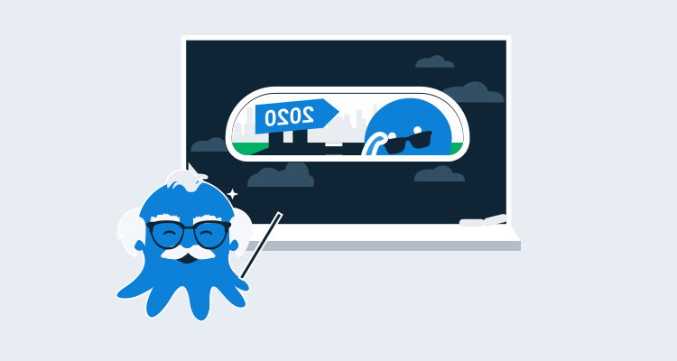

Webinars are a way for us to share and deep dive into a specific topic for our customers and the broader DevOps community. In this post, I'll be looking at how we run our webinars, how we improved them in 2020, and our top recommendations if you're working through the holiday period and looking for some company.

You can find all 29 of our webinars on the YouTube [Webinar playlist](https://www.youtube.com/watch?v=AjQhW5lC4Qs&list=PLAGskdGvlaw2ph_YPvMquJlzgYd7bEDba).

## Top webinars of 2020

In this section, I'll list some of my personal favorites and others that Octopods have voted on as their favorites of 2020.

### Deploying Microservice containers to Kubernetes

Kubernetes is a hot topic in DevOps. In this webinar, Shawn Sesna gives you a 101 of Kubernetes and what's involved, and how you can use Octopus Deploy to manage your containers, pods, deployments & variable management. We cover the following topics:

- The basic concepts of [Kubernetes](https://octopus.com/docs/deployment-examples/kubernetes-deployments/deploy-container).
- Take an existing application and deploy it as a container using Octopus Deploy.
- See how Octopus can automatically update your web application configuration as you deploy from dev to test to production environments.

<iframe width="560" height="315" src="https://www.youtube.com/embed/mj2oNBIYetc" frameborder="0" allowfullscreen></iframe>

### Server provisioning with AWS and runbooks

When starting with [Cloudformation](https://aws.amazon.com/cloudformation/) and [Octopus Runbooks](https://octopus.com/docs/runbooks) on [AWS](https://aws.amazon.com), there is a lot to get your head around. CloudFormation is a powerful technology that makes it easy to provision and destroy infrastructure on-demand in AWS. We cover the following topics:

- How to provision and tear down Linux servers with Runbook Automation
- How to save cloud computing costs with runbook scheduling
- How to deploy CloudFormation templates to AWS
- How to deploy a Java web application to Tomcat on your new Infrastructure

<iframe width="560" height="315" src="https://www.youtube.com/embed/6cKhypLE11I" frameborder="0" allowfullscreen></iframe>

### Practical self-service DevOps with runbook automation

DevOps is about bringing teams together to collaborate. This is easier said in real life than done as development and operations teams often have different priorities.

Development teams want to ship code fast and fix problems quickly, whereas operations teams want to provide stable and reliable IT services. There's no single source of truth, and the tooling often gets in the way and reinforces the silos.

Runbook Automation in Octopus allows development and operations teams to work together to automate routine maintenance and self-service without sacrificing production control. We covered the following topics:

- How DevOps automation can break down the silos between Dev and Ops
- Introduction to runbook automation and self-service operations
- How to provision cloud infrastructure with Azure Resource Manager templates
- How to manage your database maintenance with Octopus Runbooks

<iframe width="560" height="315" src="https://www.youtube.com/embed/HjXl_Vz6uu0" frameborder="0" allowfullscreen></iframe>

### 2020: A year of Octopus

2020 has been a year with unique challenges globally. While the world has been turned upside down, we've been working hard to improve Octopus with some great new features as well as smaller improvements based on customer feedback. In this webinar, we covered the following topics:

- Unique technical challenges of 2020
- Key features released in 2020
- Runbooks
- Simpler Java support
- Increased integration and cross-platform support
- Better dependency management

<iframe width="560" height="315" src="https://www.youtube.com/embed/apxzK-rDHIc" frameborder="0" allowfullscreen></iframe>

### Shaping up Octopus engineering

Octopus has grown considerably over the last few years. We've grow from 10 Australians in 2015 to almost 100 people in 2020, with team members in the UK and the US. This growth was not without its challenges.

As our engineering team grew, we expected our output and new features would increase along with the team. The reality is that as we added engineers and released more complex features, the opposite happened.

In the middle of 2019, not long after we released Spaces, we started looking at and adopting the [Basecamp Shape-Up](https://basecamp.com/shapeup) model, and this helped give us more focussed development time, removing interruptions, giving us more time to scope features upfront. In this webinar, we covered the following topics:

- The problems our engineering team faced as we grew
- How we adopted Basecamp's Shape-up development methodology to improve how development and releases are managed at Octopus
- Lessons learned as we tried to improve how we shipped software

<iframe width="560" height="315" src="https://www.youtube.com/embed/AjQhW5lC4Qs" frameborder="0" allowfullscreen></iframe>

## Summary

We've run some world-class webinars in 2020, and I'm excited about what we're going to do in 2021 with some great new features landing. 

Our pipeline for the first quarter of 2020 is already looking full, and if you have an idea for a webinar that you'd like to see or even an improvement we can make on webinars, please email us at <Advice@Octopus.com>.
