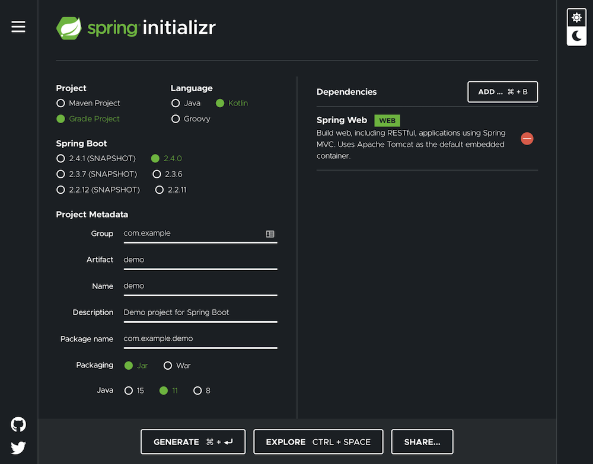

For package uploads to Octopus, if you’re running a build server that isn't supported natively you can use the Octopus Command Line (CLI) or the Octopus REST API instead. For Gradle projects, we ([Liftric](https://www.liftric.com)) have created a small Gradle plugin to help us get a similar, hassle-free experience as the officially supported CI-Servers: octopus-deploy-plugin.

Currently, it supports the following use-cases:

- Create and upload package build-information 
- Upload packages
- Generate build-information commits from git history
- Progress Octopus Deploy releases

## Setup example project

Let’s generate a Spring Boot starter project to get a quick example project going: 

start.spring.io

The example project must be a Gradle project and the language must use Kotlin to generate the Gradle build files in Kotlin (instead of Groovy). The octopus- deploy-plugin can be used with Groovy build files as well, but all examples are using the Gradle Kotlin DSL.

The Spring Web and Spring Boot Actuator dependency must be added as well. This adds a minimal web service and a health endpoint which we can open to verify the project runs successful:



After unzipping the demo project, we can build and run it to verify it works as expected:

```
./gradlew build
java -jar build/libs/demo-0.0.1-SNAPSHOT.jar
```

Now we can verify this by calling the health endpoint at `http://localhost:8080/actuator/health`.

## Configure the Octopus Deploy plugin

Next, we’ll add the Gradle plugin and add basic configuration. The complete configuration uses the Gradle Lazy Configuration approach (Provider API) which lets us to depend on other providers/tasks for configuration without hardcoding the values at Gradle configuration time. Checkout the Build Lifecycle docs for details why the Lazy Configuration approach is the preferable one.

`com.liftric.octopus-deploy-plugin` is the plugin ID, the current version is `1.6.0`:

```
plugins {
        id("org.springframework.boot") version "2.4.0"
        id("io.spring.dependency-management") version "1.0.10.RELEASE"
        kotlin("jvm") version "1.4.10"
        kotlin("plugin.spring") version "1.4.10"
        id("com.liftric.octopus-deploy-plugin") version "1.6.0"
}
```

If we call `./gradlew` tasks, we’ll see the tasks added by the plugin:

```
Octopus tasks
-------------
commitsSinceLastTag - Calls git log to receive all commits since the
previous tag or the first commit of the current history.
createBuildInformation - Creates the octopus build-information file.
firstCommitHash - Calls git log to get the first commit hash of the
current history tree
previousTag - Calls git describe to receive the previous tag name. Will
fail if no tag is found.
uploadBuildInformation - Uploads the created octopus build-information
file.
uploadPackage - Uploads the package to octopus.
```

Now we have to configure the plugin (top-level extension):

```
octopus {
    packageName.set(project.name)
    version.set(project.version.toString())
    serverUrl.set("https://<cloud-instance-name>.octopus.app/")
    apiKey.set("API-XXXXYYYYZZZZZXXXXYYYYYZZZZZ")
    val bootJar by tasks.existing(Jar::class)
    pushPackage.set(bootJar.get().archiveFile)
}
```

For the name ( `packageName`) and `version`, we’re reusing the project values set by the `start.spring.io` generator (version under the plugins block, the name is in `settings.gradle.kts` configured). For automatic versioning, something like the `researchgate/gradle-release` plugin might be used, the static values are fine for our example though.

`serverUrl` needs the base URL of your Octopus Deploy instance, the example uses the cloud instance naming pattern. Learn how to [create an API key](https://octopus.com/docs/octopus-rest-api/how-to-create-an-api-key).

In a non-prototype project, it’s recommend for security reasons not to store secrets inside the build-script/repository itself. At Liftric, we use Hashicorp Vault as our secrets management tool of choice and even provide a small Gradle Plugin for accessing it: https://github.com/Liftric/vault-client-plugin. Reading a secured/secret environment variable (like Gitlab’s masked variables), or from a repo-external file (e.g. \~/.octopus) might be an alternative to a fully-fledged secrets management solution.

Finally, we’re importing the `bootJar` task provider and binding the `archiveFile` file property to the `pushPackage` property so that the plugin knowns which file to upload.

## Push build information

The `uploadBuildInformation` task builds and uploads the `build-information` for the `package` `version` combination:

```
./gradlew uploadBuildInformation
```

If you want to debug the generated build-information, calling `./gradlew createBuildInformation` only builds it without uploading. The content will be printed but can also be viewed at `build/octopus/build-information.json`.

## Push packages

The `uploadPackage` task uploads the target `pushPackage` file:

```
./gradlew uploadPackage
```

Octopus Deploy has one quirk during the package upload: it expects the file in the format <name>.<version>.<extension>. In the Maven and Gradle world, the default naming is <name>-<version>.extension. If we leave the default naming of our boot jar, the default name is `demo-0.0.1-SNAPSHOT.jar` which will upload the package `demo-0` with the version `0.1-SNAPSHOT`, meaning we have to adapt the naming of our boot jar artifact:

```
tasks.withType<Jar> {
    archiveFileName.set("${archiveBaseName.get().removeSuffix("-
")}.${archiveVersion.get()}.${archiveExtension.get()}")
}
```

Now the correct jar filename is created: `demo.0.0.1-SNAPSHOT.jar` which matches our generated build information.

## Learn more

The complete feature set of the octopus-deploy-plugin is documented in the project’s [repo](https://github.com/Liftric/octopus-deploy-plugin).
