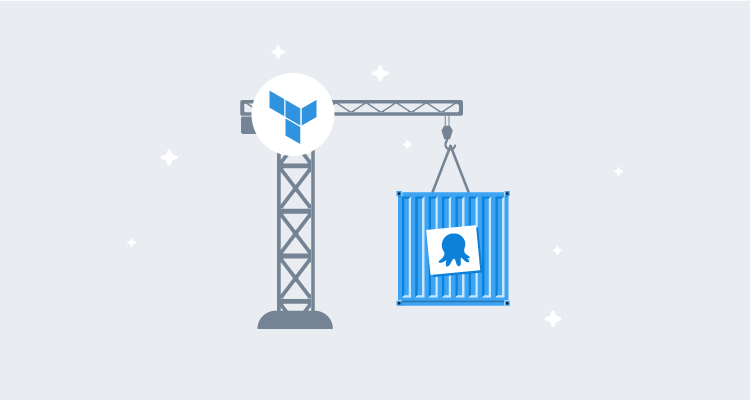
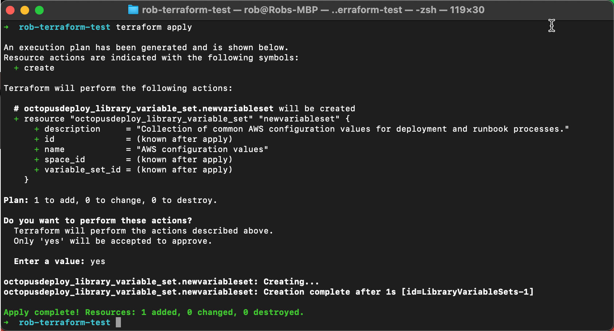
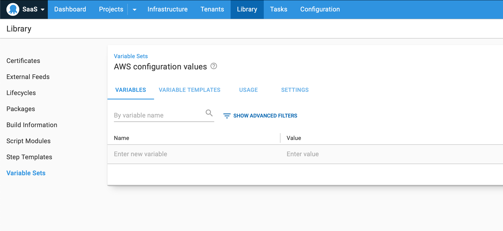

Infrastructure as Code (IaC) allows teams to create infrastructure resources (i.e., virtual machines, storage, network resources, etc.) without walking through wizards or numerous mouse clicks. [Hashicorp’s](https://www.hashicorp.com) [Terraform](https://www.terraform.io) is one of the most popular infrastructure as code solutions. Terraform is an open-source IaC solution that lets you to define your infrastructure using a functional-based programming language called [Hashicorp Configuration Language (HCL)](https://github.com/hashicorp/hcl). 

Octopus is proud to introduce our official [Terraform provider](https://github.com/OctopusDeployLabs/terraform-provider-octopusdeploy). This project started as a [community initiative](https://github.com/MattHodge/terraform-provider-octopusdeploy) by [Matthew Hodgkins](https://github.com/MattHodge/), who built it to suit his needs. Down the track, [Mark Henderson](https://github.com/mhenderson-so) contributed to the project for the needs of StackExchange. We’re indebted to Matt and Mark for their efforts since the project started in 2018. Making this an official, supported provider brings significant advantages, as we can keep the plugin up-to-date, improve its testing, and add new features.

In this blog post, I introduce the Terraform provider for Octopus Deploy, and share practical examples of how to get started with it. 

## Why Infrastructure as Code?

Automation and DevOps are the future. Creating infrastructure manually is slow and error prone, and it’s far too easy to break systems with something as small as a silly typo.

Infrastructure as Code lets you declaratively describe your infrastructure, and the associated tooling lets you test it before applying it to production systems. Storing your configuration in source control allows you to improve quality further with collaboration, code reviews, and it gives you a full history of changes. 

## What is a Terraform Provider? 

Terraform is an open-source tool you can use to provision and update infrastructure using declarative configuration files following an infrastructure as code approach. You describe the state of the resources in configuration files and Terraform applies this to your infrastructure. It can create, destroy, and detect drift between the desired state and the actual infrastructure.

Terraform providers are plugins that allow Terraform to interact with a wide variety of technologies. The Octopus Deploy Terraform provider will enable you to interact with an Octopus instance and manage its configuration.

## Getting started with the Terraform provider for Octopus Deploy

Our Terraform provider allows teams to provision and configure Octopus Deploy instances. This applies to both on-premises Octopus servers and [Octopus Cloud](https://octopus.com/pricing/cloud) instances. 

:::hint
We use this Terraform provider internally to provision and configure Octopus instances, including Octopus Cloud. It’s a fantastic tool and we’re excited to see it used in teams in the community.
:::

This provider is powered by a new cross-platform [Octopus client](https://github.com/OctopusDeploy/go-octopusdeploy) written in [Go](https://golang.org). This client is useful as it lets you interact with Octopus without direct calls to the Octopus REST API. It complements the [Octopus CLI](https://octopus.com/docs/octopus-rest-api/octopus-cli) and other Octopus [API clients](https://octopus.com/docs/octopus-rest-api).

### Prerequisites

The following tooling is required to use the Octopus Terraform provider:

* Go 1.12 or newer
* Terraform 0.12 or newer
* Octopus Deploy 2019.1 or newer

### Installing the Octopus Terraform Provider

We are publishing the Octopus provider to the official [Terraform Registry](https://registry.terraform.io), and Terraform automatically detects which providers you need and installs them.

### Creating your first Terraform script

To get started, here’s a simple example that shows you how to add a new variable set to an existing Octopus instance and space:

1. **Create Terraform configuration files**

* `main.tf`: This is the main configuration file that configures the provider and specifies resources to create or update. 
* `variables.tf`: This file defines the variables used in the `main.tf` configuration file.
* `terraform.tfvars`: This file contains the values for the variables defined in `variables.tf`.

2. **Configure the main Terraform configuration file.** Open the `main.tf` file and copy and paste the following. The first two blocks configures the Octopus Deploy provider and the last one defines a new variable set resource:

``` json
terraform {
  required_providers {
    octopusdeploy = {
      source  = "OctopusDeployLabs/octopusdeploy"
    }
  }
}

provider "octopusdeploy" {
  address  = var.serverURL
  api_key   = var.apiKey
  space_id = var.space
}

resource "octopusdeploy_library_variable_set" "newvariableset" {
  description = var.description
  name        = var.variableSetName
}
```

3. **Add variable definitions.** Open the `variables.tf` file and copy and paste the following variable definitions. The contents of this file are straightforward. We are defining variable names and the type of data they will store. In this case, everything is a simple string:

```json
variable "apiKey" {
    type = string
}

variable "space" {
    type = string
}

variable "serverURL" {
    type = string
}

variable "variableSetName" {
    type = string
}

variable "description" {
    type = string
}
```

4. **Set your variable values**. Terraform will pass these values to your configuration file at runtime. Open the `terraform.tfvars` file and copy and paste the following text. You will need to update the values with your Octopus Server details and a variable set name and description:

```json
serverURL       = "https://mytestoctopusname.octopus.app"
apiKey          = "API-XXXXXXXXXXXXX"
space           = "Spaces-1"
variableSetName = "AWS configuration values"
description     = "Collection of common AWS config values for automated deployment and runbook processes."
```

5. **Apply the changes in your configuration file.** Create your new Octopus variable set resource by applying the Terraform configuration file to your Octopus instance. Run the following commands at a terminal or command prompt to initialize, verify and apply your changes:

* `terraform init`
* `terraform plan`
* `terraform apply`

**NOTE**: This is not a complete Terraform tutorial. I highly recommend you read the excellent [Terraform documentation](https://www.terraform.io/docs/) to learn more about Terraform itself.



Congratulations! You have used Terraform and the Octopus Deploy provider to configure your Octopus instance. Navigate to your Octopus instance, and you will see the newly created variable set in the selected Space!



### Next steps

Read the [Terraform provider docs](https://registry.terraform.io/providers/OctopusDeployLabs/octopusdeploy/latest/docs) and review the [`examples` folder](https://github.com/OctopusDeployLabs/terraform-provider-octopusdeploy/tree/master/examples) in the GitHub repository for more examples. 

Watch our Managing Octopus with Go and Terraform webinar to get an indepth overview and see numerous real-world examples live. 

<iframe width="560" height="315" src="https://www.youtube.com/embed/lN78iPeqwsE" frameborder="0" allowfullscreen></iframe>

## Open source and contributing

The [project repository](https://github.com/OctopusDeployLabs/terraform-provider-octopusdeploy) is available on GitHub with the Mozilla Public License Version 2.0 license. We accept pull requests, and we’d love to see community contributions.

## Infrastructure as Code with the Terraform provider vs Config as Code

We’re currently building support for [Config as Code](https://octopus.com/blog/shaping-config-as-code) to give teams a version-controlled text representation of Octopus projects. This brings numerous benefits but it also raises several questions. 

*What is the difference between Config as Code and Infrastructure as Code with our Terraform Provider? When should I use Config as Code? When should I use the Terraform provider?*

Both features are valuable, and they complement each other. You can choose to use them independently or together if it suits your needs. The most significant difference between the two technologies is scope. Infrastructure as code focuses on provisioning and configuring a whole Octopus instance, whereas Config as Code focuses on automated processes in a project.

With **Config as Code**, you get a human-readable version of an automated process (deployment and runbook) in Git source control. This brings numerous benefits including capturing history, enabling changes with branches, having a single source of truth, and improving the ability to create template configurations than can be cloned. Config as Code focuses on automated processes within a project. It does not allow you to configure other areas of Octopus.

With **Infrastructure as Code**, you can provision new Octopus instances and configure existing ones. This covers most of the Octopus surface area from infrastructure, to projects, to the library, to system configuration. You also gain numerous benefits from the Terraform ecosystem, including a consistent approach for configuring infrastructure, managing changes, and detecting drift.

## Conclusion

We’re thrilled to share our Terraform provider, and we hope it helps teams manage their Octopus instances with a declarative "Infrastructure as Code" approach. 
