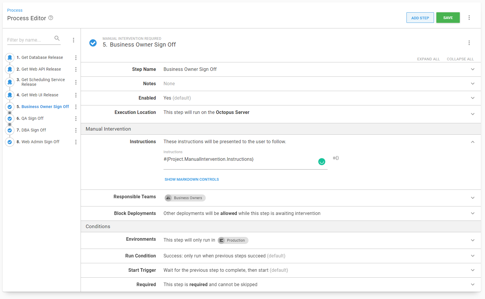

It is common to ask, should we have one Octopus Deploy project per application, or an Octopus Deploy project per component (WebUI, API, Database, etc)?  I've seen and been a part of projects where it was far more common to deploy one or two components, perhaps to fix a small bug than it was to deploy all the components.  Having an Octopus Deploy project per component solves a lot of problems; the trade-off is it makes it more complex to deploy the entire application stack.  In this post I am going to walk through how to use a new step template [Deploy Child Octopus Deploy Project](https://library.octopus.com/step-templates/0dac2fe6-91d5-4c05-bdfb-1b97adf1e12e/actiontemplate-deploy-child-octopus-deploy-project) to make release management in Octopus Deploy much easier.

## The Sample Application

For this article I will be using a sample application with four components, a database, a scheduling service, a web api, and a web ui.  You can be find it on our [samples instance](https://samples.octopus.app/app#/Spaces-603) (log in as guest).


Each project is designed to be deployed independently of one another; so much so each project has its own manual interventions.


This example will use a modified version of [SemVer](https://semver.org/) for the components, `Year.Minor.Patch.Build`, or `2021.1.0.1`.  The orchestration project will use standard [SemVer](https://semver.org), `Year.Minor.Patch` or `2021.1.0`.  

I'm not going to spend to much time discussing how the code is stored in source control nor the build server configuration.  It is possible to have a single GIT repo for the entire application, with the build server configured to trigger component builds based on a watch folder.  It is also possible to have a GIT repo per component.  This example should be flexible enough to account for both configurations.  Assume the build server will build each component, create a release for that component's project, and automatically deploy the code to the **Development** environment.  When that deployment is complete, it will run a batch of integration tests, and if those passed, promote the release to **Test**.  

The first batch of work for 2021 will look like this.


## The roadblocks

Typically a change will sit in the **Test** environment for 1 to N days while it goes through the QA process.  Bugs are found and squashed, and chances are each component will have a different build number.


It is now time to deploy to promote the `2021.1.0` release to **Staging**, which means promoting each release for each project one by one.  A person will have to click on the project to get to the dashboard, click the deploy button next for the correct `2021.1.0.x` release, and click the deploy button again.  Repeat that four times.  It's not great, but it is tolerable.  Promoting all the components to **Production** is when this pattern starts to run into issues.  

- If a components has multiple fixes pushed to **Test** chances are it will need at least one more fix pushed to **Staging**.
- All the projects require approval from QA.
- Multiple projects require approval from the web admins and business owners.
- All the projects will send out an email notification.
- Typically applications need to be deployed in a specific order.  Deploy the database first, then the API, then scheduling service, then the UI.  Any issues should stop everything.

## Deploy Child Octopus Deploy Project
What is needed is a release orchestration project to coordinate the components.  That project has a unique lifecycle, only **Staging** and **Production**.  The release for this project won't be created until all the testing is complete in **Test**.


That release orchestration project will leverage the new [Deploy Child Octopus Deploy Project](https://library.octopus.com/step-templates/0dac2fe6-91d5-4c05-bdfb-1b97adf1e12e/actiontemplate-deploy-child-octopus-deploy-project) step template.  This new step template was written for a number of common use cases found in release orchestration projects.  It's features include:

### Intelligent Release Picking

One of the more common roadblocks users run into with pre-existing steps is how difficult it is to get them to pick the correct release.  The new step template aims to solve that by a new approach in picking releases to promote.

To start with, you supply a pattern, for example `2021.1.0.*` and a destination environment, for example **Staging**, and optionally a channel.  If the channel is not provided it will use the component project's default channel.  The step template will then:

- Calculate the previous environment(s) based the channel and destination environment.  For example, if you entered **Staging** it would pick **Test** because that is the prior to **Staging** in the channel's lifecycle.
- Look for all the releases matching the supplied pattern for that channel.  
- Find the release that was last successfully deployed to the previous environments.  Not the most recently created release deployed to the previous environment.  The last successfully deployed release.  For example, you deploy `2021.1.0.15` to **Test**, realize that shouldn't have been pushed, and redeploy `2021.1.0.14` to **Test**.  The step template will pick `2021.1.0.14` when it promotes to **Staging** because that was the last release deployed to **Test**.

If no release is found it will exit out of the step.  For example, shortly after promoting `2021.1.0` to **Production** a bug is found requiring a fix to the Web API and Web UI projects.  You'd create the `2021.1.1` and supply the `2021.1.1.*` pattern.  The Database and Scheduling service projects don't have a matching release, because they weren't touched, so they are skipped.  You can configure the step to throw an error if no release is found.

The step template will also check to see if the selected release has been deployed to the destination environment.  If the release has been deployed to the destination environment it will skip it.  You can configure it to always redeploy.


### Easier Approvals

Approvals seems to be a major tripping point when it comes to release orchestration.  It is common to want to approve a deployment prior to actually deploying it.  But only approve that release once, not have to reapprove each child component's deployment.  When approving a release, it'd be nice to pull in all the pertinant release informaton into one place to approve.

The step template makes approvals much easier by providing a what-if flag, which will exit the step right before doing the deployment.  In addition, when that flag is set, the step template will populate the output variable `ReleaseToPromote`, which can be used in manual interventions steps.

The step template will always gather the release notes for each child component and populates the output variable `ReleaseNotes`.  If you are using the build information and issue tracker feature in Octopus, the step template will also gather the commit and issue information calculated for the release.  You can save release notes as an artifact making it easier for approvers and later auditors to review the deployment in one place.


If you recall, each component project has its own approval step.  This is to handle the use case when a single component needs to be promoted to **Production** to fix a bug.


The QA team has to approve each component prior to deploying to **Production**.  When deploying a single component, it is not a big deal.  When deploying 2 to N components, that gets real tedious real fast.  The good news is step template will use the approvals from the release orchestration project.  You can even have the step template look in an different environment for approvals.  

How it works:

- The step template finds the deployment you want to pull the approvers from.  By default it will use the current deployment, but you can supply a different environment, for example **Staging** or **Prod Approval** to get the approvers from.
- It stores the approver, along with what teams they are members of.
- When the step template is waiting for a deployment to finish it will look for manual interventions.
- When a manual intervention is found it will look at which team the approval has to come from.  
- It will compare that component project's team with the list it created earlier, if a match is found, the step template will submit the approval.

**Important** this step template uses the Octopus Deploy API and requires an API key.  It is submitting the approval based on the user attached to the API key.  What it will do is populate all the necessary information to track the approval back to who actually approved it.


### Controlled Scaling Out


## Using the Deploy Child Octopus Deploy Project Step Template

This section will walk through adding the new step template to the release orchestration project.

Before we do that, we have to create a [service account](https://octopus.com/docs/security/users-and-teams/service-accounts) and assign that account to a team.  That is because the step template uses the Octopus Deploy API.

I recommend naming the service account "Release Conductor."  Create an API key for the user and save it in a safe location.


Create a new team called "Release Management" and assign that user to it.


Assign the roles "Deployment Creator", "Project Viewer", and "Environment Viewer" to the team.  This will allow the service account to create a deployment and see the projects and environments, but not edit them.


Finally, for each manual intervention in the component projects add the release management team. 


Now go into set up the release orchestration project.  First, we will want to add all the manual interventions.  

 

Next, we need to add the API key as a sensitive variable and the release pattern.


Now, add the Deploy Child Octopus Deploy Project step template.  First give it a name and tell it to either run on the Octopus Deploy server (self-hosted), or on a worker (Octopus Cloud).  I named this step "Get database release" because I am going to configure the "what if" option to be true.  Trust me this will make sense in a minute.


Now it is time to populate the parameters.  There are a lot of parameters, I'll go through what to set it to one by one.

- **Octopus API Key** - the API Key from the variables screen.
- **Octopus Child Space** - The space on the instance where the child project is located.  Leave it as is.  You'd change it if you were creating the release orchestration project in a different space.
- **Child Project Name** - Enter in the name of the child project.  
- **Child Project Channel** - Enter in the name of a specific channel.  If you leave it blank it will pick the default channel on the child project.  You'd change this if you want to use something else other than the default channel.
- **Child Project Release Number** - Supply the variable from the variables screen.  It supports a specific version, a pattern, or can be empty.  Recommend using a pattern.


- **Child Project Release Not Found Error Handle** - What the step should do if the component doesn't have a matching release number.  By default it will skip the step and log a warning.  You can change that to stop a deployment with an error or not log a warning.  Recommend leaving it as a warning.
- **Destination Environment Name** - The name you want to deploy to.  The default is the name of the environment being deployed to.  Recommend leaving as-is unless you are implementing an "Approval Only" environment between **Staging** and **Production** (more on that later).
- **Source Environment Name** - The name of the of the source environment.  Octopus Deploy [lifecycles](https://octopus.com/docs/releases/lifecycles) can have 1 to N environments in a phase.  Enter a specific environment if the release has to come from a specific source environment.  When left blank it will look at the destination's lifecycle phase and calculate the previous phase.  If you didn't understand that, no worries, most people don't just know it calculates the source environment.  Recommend you leave blank.
- **Child Project Prompted Variables** - You can supply prompted variables values for the child project.  


- **Force Redeployment** - Tells the step template to either redeploy a release or skip it if it has already been deployed.  In the event you have a deployment target trigger configured for the release orchestration project, you'd want to change the value to `When deploying to specific machines`.  Otherwise leave it as is.
- **Ignore Specific Machine Mismatch** - This only comes into account if you are deploying to specific machine(s).  This step will determine if the child project is associated with any of those machines.  If it cannot find any then it will skip the child project's deployment.  Recommend leaving as is unless there is a very specific reason.
- **Save Release Notes as Artifacts** - The step template will pull all the release notes and build information from the child project and save it in an output variable `ReleaseNotes`.  Output variables are not persisted.  If you want to persist those release notes in the orchestration project then set this to `Yes`.
- **What If** - The step template will do everything except do the deployment.  Set to `Yes` if you'd like to approve a release prior to actually deploying.  


- **Wait for finish** - Wait for the deployment to finish before moving on.  Is ignored if what if is set to yes.
- **Wait for Deployment** - How long it will wait for a deployment to finish.  This is the MAX time it will wait.  If a deployment finishes before the limit is finished it will stop waiting.  Leave at 1800 seconds (30 minutes) unless there is a compelling reason.
- **Scheduling** - Allows you to schedule a deployment in the future.  Uses [DateTime.TryParse](https://docs.microsoft.com/en-us/dotnet/api/system.datetime.tryparse) to parse the date.  Recommend using this with a prompted variable.
- **Use Manual Intervention Approvals in child project** - Will use the approvals from the parent project in the child project.  


Add a step for each of the components.  Remember to set the what if parameter to `Yes`.  We are doing this because these steps are going to get the specific release to deploy along with the release notes for the manual intervention steps.  Next, reorder the steps so they come before the manual interventions steps.


These steps are going to populate output parameters, perfect for manual intervention instructions.  I'm not a fan of duplicating effort.  Create a new variable `Project.ManualIntervention.Instructions`, open up the editor and create a multi-line instruction.


This is the text of that screenshot:

```
Please approve releases for:

**Database: #{Octopus.Action[Get Database Release].Output.ReleaseToPromote}**
#{Octopus.Action[Get Database Release].Output.ReleaseNotes}

**Web API: #{Octopus.Action[Get Web API Release].Output.ReleaseToPromote}**
#{Octopus.Action[Get Web API Release].Output.ReleaseNotes}

**Scheduling Service: #{Octopus.Action[Get Scheduling Service Release].Output.ReleaseToPromote}**
#{Octopus.Action[Get Scheduling Service Release].Output.ReleaseNotes}

**Web UI: #{Octopus.Action[Get Web UI Release].Output.ReleaseToPromote}**
#{Octopus.Action[Get Web UI Release].Output.ReleaseNotes}
```

Now add those manual intervention instructions variable to each manual intervention.



Okay, now it is time for a test release.  Because everything is set to what if, nothing should be deployed.

## Alternative configuration
Before going further, I want to take a step back and explain the goals for this setup.  They are:
- Minimize downtime by only deploying what has changed.
- Minimize build time by only building what has changed.
- Minimize the number of decisions a person has to make.
- Consistency across all applications.

Seperate projects per component is the only one that meets all of those goals.  

That isn't to say we didn't look at alternatives.  First we looked at putting everything into a single project and use [Octopus Deploy channels](https://octopus.com/docs/releases/channels) feature.  Steps can be scoped to run on specific channels.  When a release is created something (most likely the build server) would determine which channel to select.  The problem was all the possible combinations.  Imagine adding a fifth component!

- WebUI
- WebAPI
- Database
- Service
- WebUI WebAPI
- WebUI Database
- WebUI Service
- WebAPI Database
- WebAPI Service
- Service Database
- WebUI WebAPI Database
- WebUI WebAPI Service
- WebAPI Service Database
- WebUI WebAPI Database Service

Another alternative was a single process, but enabling and disable steps on the deployment screen.  That was shot down right away by the web admins.  Manually disabling steps has way too much room for human error.  

We looked at the [package redeployment option](https://octopus.com/docs/projects#deployment-settings) in the project settings.  We could set it to `Skip any package that is already installed`.  However, we had use cases when we wanted to redeploy, for example, if we wanted to rollback a UI change.  And that setting is for _all_ packages in the project.  We can't pick and choose.

And we had to ask ourselves, are we making this more complex than it needs to be?  How much time are we really talking about?  Some applications had a dozen or so components.  Deployments don't occur in a vacuum.  In a few applications, if a specific service component and database were updated, it would require lengthly data validation and processing.  In that application's case, a full deployment of all the components lasted over eight hours!  Those two components were deployed together once a quarter.  Thinking about this in the big picture, one of the reasons we adopted a tool like Octopus Deploy was to have consistency.  Some applications could have all the components deployed in under 20 minutes, while others took hours.  A consistent build and deployment process across the teams is key.