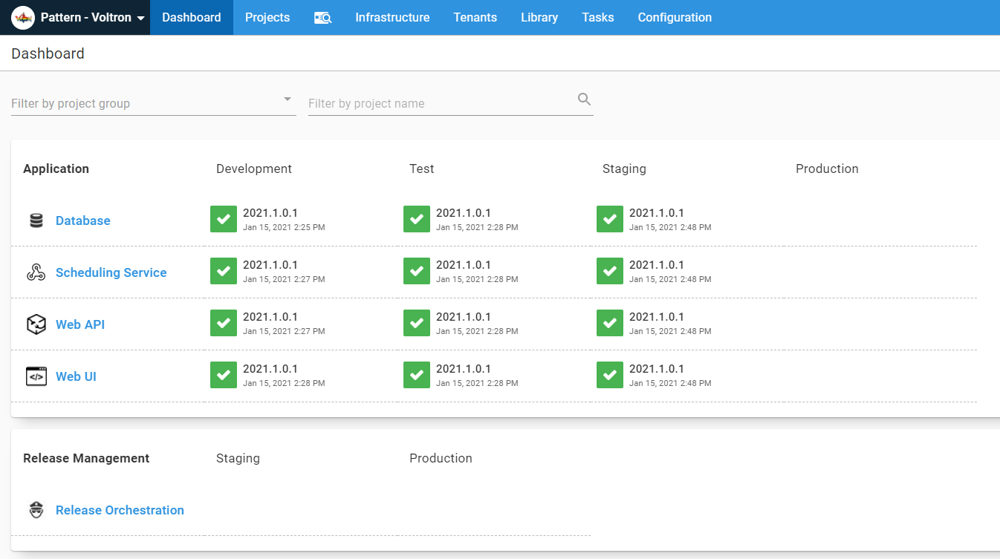
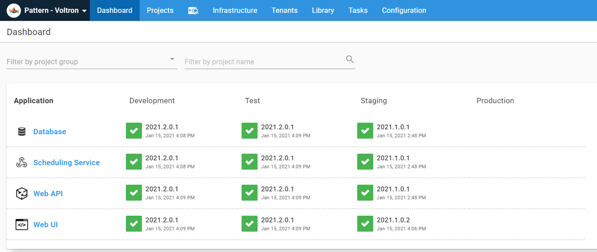
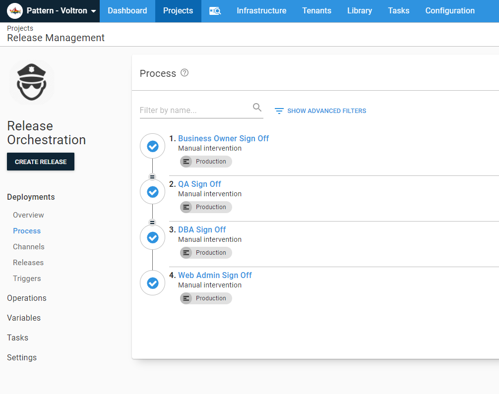
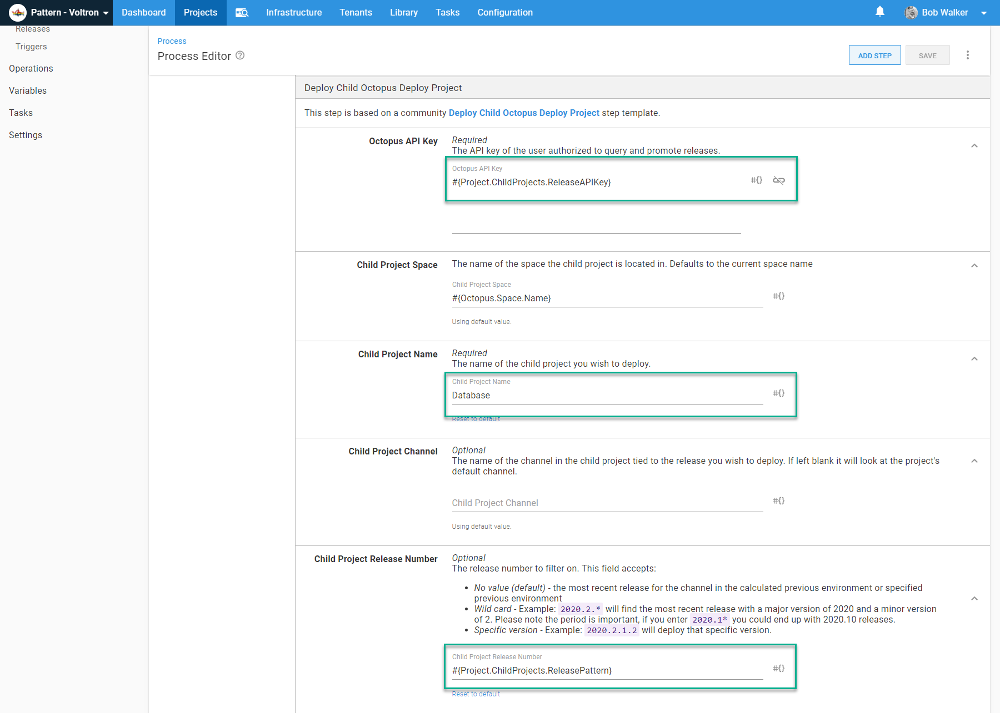
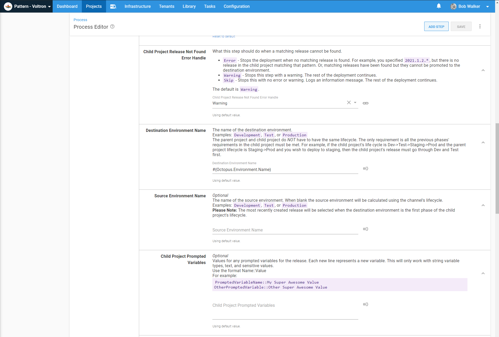
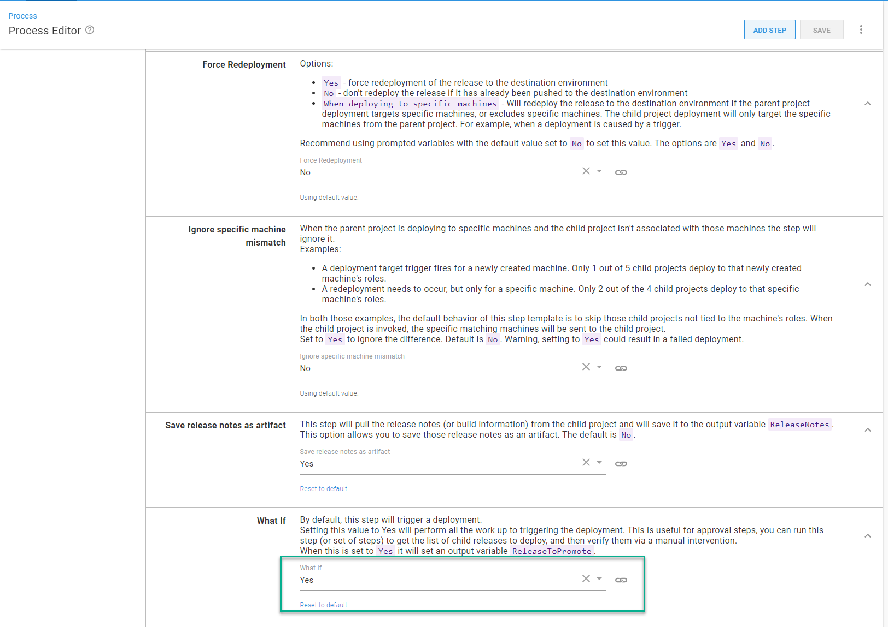
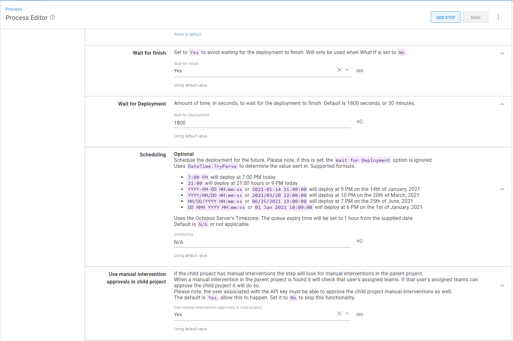
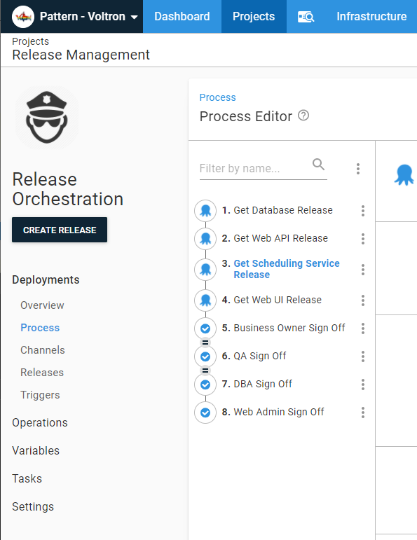

Before I worked at Octopus Deploy I was an Octopus Deploy user.  When I started using Octopus Deploy my team had a decision to make, should we have one Octopus Deploy project per application, or an Octopus Deploy project per component (WebUI, API, Database, etc)?  Someone in that discussion pointed out it is common to deploy a single component; typically it was to fix a small bug.  The majority of the time, it was smooth sailing.  That is until we had a major release requiring all the components to be deployed.  It worked, but it was tedious and time consuming.  In this post I am going to walk through how to use a new step template [Deploy Child Octopus Deploy Project](https://library.octopus.com/step-templates/0dac2fe6-91d5-4c05-bdfb-1b97adf1e12e/actiontemplate-deploy-child-octopus-deploy-project) to make release management in Octopus Deploy much easier.

## The Sample Application

The sample application for this article has four components, a database, a scheduling service, a web api, and a web ui.  You can be find it on our [samples instance](https://samples.octopus.app/app#/Spaces-603) (log in as guest).

Each project is designed to be deployed independently of one another. This meant each project has the required manual interventions.

In general this setup is very similar to the application I worked on when I first started using Octopus Deploy. In my application's case all the code was in a single GIT repository.  This way a new developer only had to pull down one repo, go through the read me file, and they'd be up and running.  For the build server, each component had a dedicated build, with each build configured to monitor specific folders.  

For this exmaple, we will use a modified form of [SemVer](https://semver.org/) for the components `Year.Minor.Patch.Build`, or `2021.1.0.1`.  The build server will create the release with the version number, and automatically deploy the code to the **Development** environment.  When that deployment is complete, it will run a batch of integration tests, and if those passed, promote the release to **Test**.  The first batch of work for 2021, would look like this.

## The roadblocks

The `2021.1.0.x` release has been tested by QA and is ready to be promoted to **Staging**.  Which means going into each project and clicking the deploy button.  With four components that is tolerable if it doesn't happen every day.  

Promoting all the components to **Production** is when this pattern starts to run into issues.  

- All the projects require approval from QA.
- Multiple projects require approval from the web admins and business owners.
- All the projects will send out an email notification.
- Typically applications need to be deployed in a specific order.  Deploy the database first, then the API, then scheduling service, then the UI.  Any issues should stop everything.

What is needed is a release orchestration project to coordinate the components.  That project has a unique lifecycle, only **Staging** and **Production**.  The release wouldn't be created until all the testing is complete in **Test**.

Prior to the new [Deploy Child Octopus Deploy Project](https://library.octopus.com/step-templates/0dac2fe6-91d5-4c05-bdfb-1b97adf1e12e/actiontemplate-deploy-child-octopus-deploy-project) step template, the options were:

- [Deploy a release step](https://octopus.com/docs/projects/coordinating-multiple-projects/deploy-release-step)
- [Chain Deploy step template](https://library.octopus.com/step-templates/18392835-d50e-4ce9-9065-8e15a3c30954/actiontemplate-chain-deployment)

The chain deployment step template was created before the deploy a release step.  Functionally, there are a lot of overlap between the two steps.  When used for their designed use cases, both steps work great.  But they didn't support the following use cases:

- Provide a release number pattern, for example `2021.1.0.*`, and deploy the latest release in the source environment.  This enables a user to create a single release and deploy the latest `2021.1.0.x` release to **Staging** or **Production**.
- Deploy the last successful release matching a pattern.  Not the most recently created release, the last successful release.
- If there is no release matching `2021.1.0.x` for a component then skip that component.
- Have the approvals from the release orchestration project flow into the component projects.
- Be able to review all the release notes from all the components in a single place.

The first two use cases are related to the same issue.  With the Deploy a Release step and Chain Deployment step, you had to specify a specific release number and/or use the latest release created.  Working under the assumption no bugs are found in **Staging**, that works fine.  But imagine this scenario:

- The `2021.1.0` release is promoted to **Staging**
- The business owner realizes the verbiage is incorrect on one of the new pages created in the `2021.1.0.1` build.  
- A developer makes the fix in `2021.1.0.2`.  It gets automatically promoted to **Dev** and **Test**.  The business owner approves the change and it is pushed up to **Staging**.
- If we were using the Deploy A Release Step a new release for the Orchestration project would need to get created.
- Everything checks out on **Staging** and it is time to deploy to **Production**.  However, an external service isn't ready for **Production** yet.  The deployment to **Production** is delayed a week.
- In the meantime, work on `2021.2.0` has started.  
- Right before it is time to deploy to **Production** the business owner comes back and says the verbiage in the `2021.1.0.1` is fine.  Go back to that.

The developer looks at the Octopus Dashboard.

They think, "you know I don't want to mess anything up in Dev and Test, and it is such a small change, I'll make it in the 2021.2.0 branch and redeploy 2021.1.0.1."

Some permentation of that example happens all the time.  If we were using the deploy a release step, we'd have to tell the admins to delete the new release.  If we were using the chain deployment step, we'd have to hardcode in 2021.1.0.1 into that step, create the release, then remove that hardcoded value.  

The manual intervention flowing to the child projects and release notes use cases are interesting.  Essentially, it is a chicken / egg scenario.  We want to approve a release, but in order to approve the release we need to be able to see all the release notes.

In addition to those common use cases, I've also heard from our customers, or ran into other less common use cases myself.

- Don't deploy a release if it has already deployed to an environment.
- However, when a new machine is added, have a trigger for fire in the orchestration project.  That release will run for that single machine and if the component project is tied to that machine, then redeploy the release but only for that machine.
- I want to have a single release orchestration deployment process for my tenanted application.  If the component is tied to a specific tenant, then skip that tenant.
- The build server only deploys to the **Dev** environment.  Every day at noon and 7 pm a scheduled trigger should promote latest release from **Dev** to **Test** for all the components.  Setting up a scheduled trigger for each component is tedious at best.
- When picking a release to promote to **Staging** it should use a specific channel.  No hotfix or branch channels should be considered.  Setting up channel version rules is tedious.
- Each development team has their own space.  But there is only one web admin team, one DBA team, and one QA team.  Having to go across multiple spaces is tedious.
- Deployments can get stuck, it'd be nice to be able to cancel anything long running.

## Deploy Child Octopus Deploy Project Step Template

The new step template is designed to address all of those use cases.  It uses the [Octopus Deploy REST API](https://octopus.com/docs/octopus-rest-api) and a ton of PowerShell.

Because it is using the Octopus Deploy API, we will need to create a [service account](https://octopus.com/docs/security/users-and-teams/service-accounts) and assign them to a team.  I recommend naming the service account "Release Conductor."  Create an API key for the user and save it in a safe location.

Create a new team called "Release Management" and assign that user to it.

Assign the roles "Deployment Creator", "Project Viewer", and "Environment Viewer" to the team.  This will allow the service account to create a deployment and see the projects and environments, but not edit them.

Finally, for each manual intervention in the component projects add the release management team. 

Now go into set up the release orchestration project.  First, we will want to add all the manual interventions.  

 

You'll notice the first three are run in parallel.  That is to gather all the approvals required.  Once the web admin approves it, it will kick off the deployments.

Next, we need to add the API key as a sensitive variable and the release pattern.

Now, add the Deploy Child Octopus Deploy Project step template.  First give it a name and tell it to either run on the Octopus Deploy server (self-hosted), or on a worker (Octopus Cloud).  I named this step "Get database release" because I am going to configure the "what if" option to be true.  Trust me this will make sense in a minute.

Now it is time to populate the parameters.  There are a lot of parameters, I'll go through what to set it to one by one.

- **Octopus API Key** - the API Key from the variables screen.
- **Octopus Child Space** - The space on the instance where the child project is located.  Leave it as is.  You'd change it if you were creating the release orchestration project in a different space.
- **Child Project Name** - Enter in the name of the child project.  
- **Child Project Channel** - Enter in the name of a specific channel.  If you leave it blank it will pick the default channel on the child project.  You'd change this if you want to use something else other than the default channel.
- **Child Project Release Number** - Supply the variable from the variables screen.  It supports a specific version, a pattern, or can be empty.  Recommend using a pattern.

- **Child Project Release Not Found Error Handle** - What the step should do if the component doesn't have a matching release number.  By default it will skip the step and log a warning.  You can change that to stop a deployment with an error or not log a warning.  Recommend leaving it as a warning.
- **Destination Environment Name** - The name you want to deploy to.  The default is the name of the environment being deployed to.  Recommend leaving as-is unless you are implementing an "Approval Only" environment between **Staging** and **Production** (more on that later).
- **Source Environment Name** - The name of the of the source environment.  Octopus Deploy [lifecycles](https://octopus.com/docs/releases/lifecycles) can have 1 to N environments in a phase.  Enter a specific environment if the release has to come from a specific source environment.  When left blank it will look at the destination's lifecycle phase and calculate the previous phase.  If you didn't understand that, no worries, most people don't just know it calculates the source environment.  Recommend you leave blank.
- **Child Project Prompted Variables** - You can supply prompted variables values for the child project.  

- **Force Redeployment** - Tells the step template to either redeploy a release or skip it if it has already been deployed.  In the event you have a deployment target trigger configured for the release orchestration project, you'd want to change the value to `When deploying to specific machines`.  Otherwise leave it as is.
- **Ignore Specific Machine Mismatch** - This only comes into account if you are deploying to specific machine(s).  This step will determine if the child project is associated with any of those machines.  If it cannot find any then it will skip the child project's deployment.  Recommend leaving as is unless there is a very specific reason.
- **Save Release Notes as Artifacts** - The step template will pull all the release notes and build information from the child project and save it in an output variable `ReleaseNotes`.  Output variables are not persisted.  If you want to persist those release notes in the orchestration project then set this to `Yes`.
- **What If** - The step template will do everything except do the deployment.  Set to `Yes` if you'd like to approve a release prior to actually deploying.  

- **Wait for finish** - Wait for the deployment to finish before moving on.  Is ignored if what if is set to yes.
- **Wait for Deployment** - How long it will wait for a deployment to finish.  This is the MAX time it will wait.  If a deployment finishes before the limit is finished it will stop waiting.  Leave at 1800 seconds (30 minutes) unless there is a compelling reason.
- **Scheduling** - Allows you to schedule a deployment in the future.  Uses [DateTime.TryParse](https://docs.microsoft.com/en-us/dotnet/api/system.datetime.tryparse) to parse the date.  Recommend using this with a prompted variable.
- **Use Manual Intervention Approvals in child project** - Will use the approvals from the parent project in the child project.  

The manual intervention in the child projects is a bit tricky.  This step is going to use the user attached to the API key to do the actual approvals.  What it will do is populate the approval message with all the details of who did the approval in the release orchestration project.

Add a step for each of the components.  Remember to set the what if parameter to `Yes`.  We are doing this because these steps are going to get the specific release to deploy along with the release notes for the manual intervention steps.  Next, reorder the steps so they come before the manual interventions steps.

## Alternative configuration
Before going further, I want to take a step back and explain the goals for this setup.  They are:
- Minimize downtime by only deploying what has changed.
- Minimize build time by only building what has changed.
- Minimize the number of decisions a person has to make.
- Consistency across all applications.

Seperate projects per component is the only one that meets all of those goals.  

That isn't to say we didn't look at alternatives.  First we looked at putting everything into a single project and use [Octopus Deploy channels](https://octopus.com/docs/releases/channels) feature.  Steps can be scoped to run on specific channels.  When a release is created something (most likely the build server) would determine which channel to select.  The problem was all the possible combinations.  Imagine adding a fifth component!

- WebUI
- WebAPI
- Database
- Service
- WebUI WebAPI
- WebUI Database
- WebUI Service
- WebAPI Database
- WebAPI Service
- Service Database
- WebUI WebAPI Database
- WebUI WebAPI Service
- WebAPI Service Database
- WebUI WebAPI Database Service

Another alternative was a single process, but enabling and disable steps on the deployment screen.  That was shot down right away by the web admins.  Manually disabling steps has way too much room for human error.  

We looked at the [package redeployment option](https://octopus.com/docs/projects#deployment-settings) in the project settings.  We could set it to `Skip any package that is already installed`.  However, we had use cases when we wanted to redeploy, for example, if we wanted to rollback a UI change.  And that setting is for _all_ packages in the project.  We can't pick and choose.

And we had to ask ourselves, are we making this more complex than it needs to be?  How much time are we really talking about?  Some applications had a dozen or so components.  Deployments don't occur in a vacuum.  In a few applications, if a specific service component and database were updated, it would require lengthly data validation and processing.  In that application's case, a full deployment of all the components lasted over eight hours!  Those two components were deployed together once a quarter.  Thinking about this in the big picture, one of the reasons we adopted a tool like Octopus Deploy was to have consistency.  Some applications could have all the components deployed in under 20 minutes, while others took hours.  A consistent build and deployment process across the teams is key.