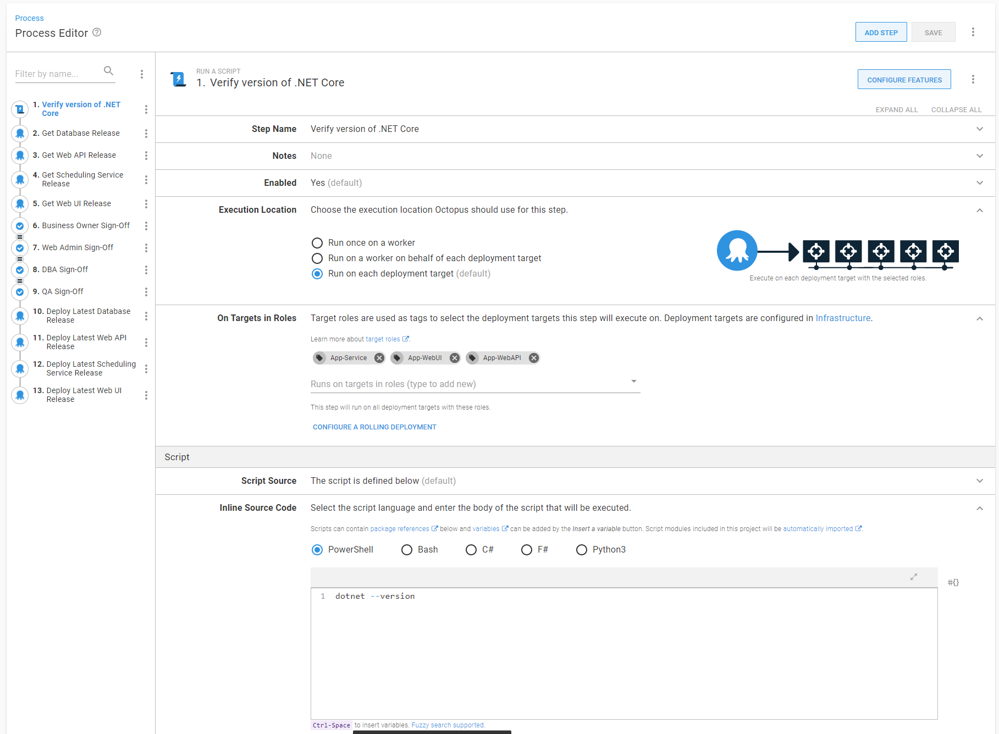
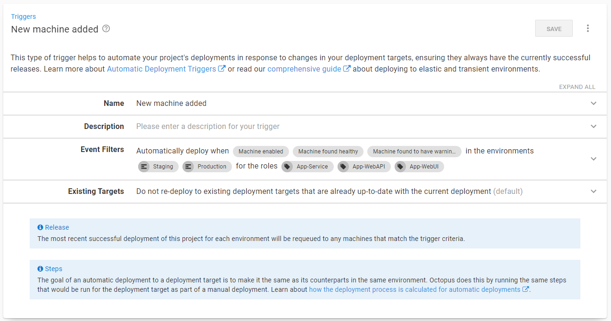
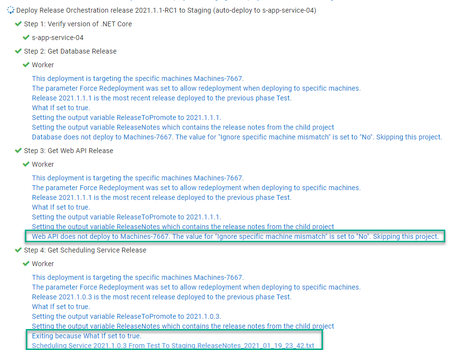

It is common to ask, should we have one Octopus Deploy project per application, or an Octopus Deploy project per component (WebUI, API, Database, etc)?  I've seen and been a part of projects where it was far more common to deploy one or two components, perhaps to fix a small bug than it was to deploy all the components.  Having an Octopus Deploy project per component solves a lot of problems; the trade-off is it makes it more complex to deploy the entire application stack.  In this post I am going to walk through how to use a new step template [Deploy Child Octopus Deploy Project](https://library.octopus.com/step-templates/0dac2fe6-91d5-4c05-bdfb-1b97adf1e12e/actiontemplate-deploy-child-octopus-deploy-project) to make release management in Octopus Deploy much easier.

## The Sample Application

For this article I will be using a sample application with four components, a database, a scheduling service, a web api, and a web ui.  You can be find it on our [samples instance](https://samples.octopus.app/app#/Spaces-603) (log in as guest).


Each project is designed to be deployed independently of one another; so much so each project has its own manual interventions.


This example will use a modified version of [SemVer](https://semver.org/) for the components, `Year.Minor.Patch.Build`, or `2021.1.0.1`.  The orchestration project will use standard [SemVer](https://semver.org), `Year.Minor.Patch` or `2021.1.0`.  

I'm not going to spend to much time discussing how the code is stored in source control nor the build server configuration.  It is possible to have a single GIT repo for the entire application, with the build server configured to trigger component builds based on a watch folder.  It is also possible to have a GIT repo per component.  This example should be flexible enough to account for both configurations.  Assume the build server will build each component, create a release for that component's project, and automatically deploy the code to the **Development** environment.  When that deployment is complete, it will run a batch of integration tests, and if those passed, promote the release to **Test**.  

The first batch of work for 2021 will look like this.


## The roadblocks

Typically a change will sit in the **Test** environment for 1 to N days while it goes through the QA process.  Bugs are found and squashed, and chances are each component will have a different build number.


It is now time to deploy to promote the `2021.1.0` release to **Staging**, which means promoting each release for each project one by one.  A person will have to click on the project to get to the dashboard, click the deploy button next for the correct `2021.1.0.x` release, and click the deploy button again.  Repeat that four times.  It's not great, but it is tolerable.  Promoting all the components to **Production** is when this pattern starts to run into issues.  

- If a components has multiple fixes pushed to **Test** chances are it will need at least one more fix pushed to **Staging**.
- All the projects require approval from QA.
- Multiple projects require approval from the web admins and business owners.
- All the projects will send out an email notification.
- Typically applications need to be deployed in a specific order.  Deploy the database first, then the API, then scheduling service, then the UI.  Any issues should stop everything.

## Introducing the Deploy Child Octopus Deploy Project
What is needed is a release orchestration project to coordinate the components.  That project has a unique lifecycle, only **Staging** and **Production**.  The release for this project won't be created until all the testing is complete in **Test**.


That release orchestration project will leverage the new [Deploy Child Octopus Deploy Project](https://library.octopus.com/step-templates/0dac2fe6-91d5-4c05-bdfb-1b97adf1e12e/actiontemplate-deploy-child-octopus-deploy-project) step template.  This new step template was written for a number of common use cases found in release orchestration projects.  It's features include:

### Intelligent Release Picking

One of the more common roadblocks users run into with pre-existing steps is how difficult it is to get them to pick the correct release.  The new step template aims to solve that by a new approach in picking releases to promote.

To start with, you supply a pattern, for example `2021.1.0.*` and a destination environment, for example **Staging**, and optionally a channel.  If the channel is not provided it will use the component project's default channel.  The step template will then:

- Calculate the previous environment(s) based the channel and destination environment.  For example, if you entered **Staging** it would pick **Test** because that is the prior to **Staging** in the channel's lifecycle.
- Look for all the releases matching the supplied pattern for that channel.  
- Find the release that was last successfully deployed to the previous environments.  Not the most recently created release deployed to the previous environment.  The last successfully deployed release.  For example, you deploy `2021.1.0.15` to **Test**, realize that shouldn't have been pushed, and redeploy `2021.1.0.14` to **Test**.  The step template will pick `2021.1.0.14` when it promotes to **Staging** because that was the last release deployed to **Test**.

If no release is found it will exit out of the step.  For example, shortly after promoting `2021.1.0` to **Production** a bug is found requiring a fix to the Web API and Web UI projects.  You'd create the `2021.1.1` and supply the `2021.1.1.*` pattern.  The Database and Scheduling service projects don't have a matching release, because they weren't touched, so they are skipped.  You can configure the step to throw an error if no release is found.

The step template will also check to see if the selected release has been deployed to the destination environment.  If the release has been deployed to the destination environment it will skip it.  You can configure it to always redeploy.


### Easier Approvals

Approvals seems to be a major tripping point when it comes to release orchestration.  It is common to want to approve a deployment prior to actually deploying it.  But only approve that release once, not have to reapprove each child component's deployment.  When approving a release, it'd be nice to pull in all the pertinant release informaton into one place to approve.

The step template makes approvals much easier by providing a what-if flag, which will exit the step right before doing the deployment.  In addition, when that flag is set, the step template will populate the output variable `ReleaseToPromote`, which can be used in manual interventions steps.

The step template will always gather the release notes for each child component and populates the output variable `ReleaseNotes`.  If you are using the build information and issue tracker feature in Octopus, the step template will also gather the commit and issue information calculated for the release.  You can save release notes as an artifact making it easier for approvers and later auditors to review the deployment in one place.


If you recall, each component project has its own approval step.  This is to handle the use case when a single component needs to be promoted to **Production** to fix a bug.


The QA team has to approve each component prior to deploying to **Production**.  When deploying a single component, it is not a big deal.  When deploying 2 to N components, that gets real tedious real fast.  The good news is step template will use the approvals from the release orchestration project.  You can even have the step template look in an different environment for approvals.  

How it works:

- The step template finds the deployment you want to pull the approvers from.  By default it will use the current deployment, but you can supply a different environment, for example **Staging** or **Prod Approval** to get the approvers from.
- It stores the approver, along with what teams they are members of.
- When the step template is waiting for a deployment to finish it will look for manual interventions.
- When a manual intervention is found it will look at which team the approval has to come from.  
- It will compare that component project's team with the list it created earlier, if a match is found, the step template will submit the approval.

**Important** this step template uses the Octopus Deploy API and requires an API key.  It is submitting the approval based on the user attached to the API key.  What it will do is populate all the necessary information to track the approval back to who actually approved it.


### Release Scheduling

It is common to get approval for a deployment to **Production** hours or days prior to the actual deployment.  Part of the approval process is scheduling an outage window.  The order in which the child components are deployed aren't important, as long as they are deployed within a few minutes of one another.  

The step template allows you to send in a future date and/or date as a parameter.  It uses .NET's [DateTime.TryParse](https://docs.microsoft.com/en-us/dotnet/api/system.datetime.tryparse) to parse the date.  Formats supported include:

- `7:00 PM` will deploy at 7:00 PM today
- `21:00` will deploy at 21:00 hours or 9 PM today
- `YYYY-MM-DD HH:mm:ss` or `2021-01-14 21:00:00` will deploy at 9 PM on the 14th of January, 2021
- `YYYY/MM/DD HH:mm:ss` or `2021/03/20 22:00:00` will deploy at 10 PM on the 20th of March, 2021
- `MM/DD/YYYY HH:mm:ss` or `06/25/2021 19:00:00` will deploy at 7 PM on the 25th of June, 2021
- `DD MMM YYYY HH:mm:ss` or `01 Jan 2021 18:00:00` will deploy at 6 PM on the 1st of January, 2021

You can leverage [prompted variables](https://octopus.com/docs/projects/variables/prompted-variables) to let a user send in a date/time when deploying to **Production**.


### Scaling out with deployment target triggers

Adding a new VM to your infrastructure is rarely a matter of spinning up a VM and installing the Octopus Deploy tentacle.  Often you need to install tooling and frameworks (node.js, .NET Core, Java, etc), and once that is finished, then you can install your software.  Octopus Deploy can automatically kick off deployments when new VMs are added using [deployment target triggers](https://octopus.com/docs/projects/project-triggers/deployment-target-triggers).  

Having a deployment target trigger per component project is far from ideal.  The projects can run in any order, tooling and framework might be installed _after_ your software.  In addition there are multiple triggers to manage and add.  

The step template is built to work with deployment target triggers.  

How it works:

- You add a step to the release orchestration project to run a script on all the servers across all the component projects.
- You add a deployment target trigger to monitor all the roles associated with your project.
- You add a new server with targeting 1 to N roles in your application.
- When a new target is detected a deployment will be triggered, but only targeting the new machine.
- The step template will look at each component project's target list.  If the new machine appears in the list it will trigger a deployment.  If it does not, then it will skip that project.

[INSERT IMAGE HERE]

### Parameters

When designing this step template, I ran various use cases by my teammates.  A parameter was added anytime we came across a use case where a decision wasn't unanimous.  As you can imagine, there are a lot of parameters in this step template.

- **Octopus API Key**: the API Key of a user with permissions to deploy and when using the automated approval functionality, approve manual interventions.
- **Octopus Child Space**: the name of the space where the component project is located.  The default is the current space.  Unless there is a compelling reason, leave this as is.
- **Child Project Name**: The name of the component project.
- **Child Project Channel**: The name of a specific channel.  If you leave it blank it will pick the default channel on the component project.  
- **Child Project Release Number**: the release number to deploy.  The default is empty, it will pull the latest release in the source environment.  Can supply a specific number, `2021.1.0.14`, or a pattern, `2021.1.1.*`.  The `.*` is important.  If the period `.` isn't supplied you could end up with releases from `2021.1.10.x` or `2021.1.15.x`.  
- **Child Project Release Not Found Error Handle**: what the step should do if the component project doesn't have a matching release number.  By default it will skip the step and log a warning.  You can change that to stop a deployment with an error or not log a warning.  Recommend leaving it as a warning.
- **Destination Environment Name**: the name you of the environment want to deploy to.  The default is the name of the environment being deployed to.  Recommend leaving as-is unless you are implementing an "Approval Only" environment between **Staging** and **Production** (more on that later).
- **Source Environment Name**: the name of the of the source environment.  When left blank the step template will look at the channel's lifecycle, determine what phase the destination environment is in, then look for the environment(s) before that.  The kicker is Octopus Deploy [lifecycles](https://octopus.com/docs/releases/lifecycles) can have 1 to N environments in a phase.  Enter a specific environment if the release has to come from a specific source environment.  Recommend you leave blank.
- **Child Project Prompted Variables**:  where you supply prompted variables values for the component project.  
- **Force Redeployment**: tells the step template to either redeploy a release or skip it if it has already been deployed.  In the event you have a deployment target trigger configured for the release orchestration project, you'd want to change the value to `When deploying to specific machines`.  Otherwise leave it as is.
- **Ignore Specific Machine Mismatch**: this only comes into account if you are deploying to specific machine(s).  This step will determine if the component project is associated with any of those machines.  If it cannot find any then it will skip the component project's deployment.  Recommend leaving as is unless there is a very specific reason.
- **Save Release Notes as Artifacts**: the step template will pull all the release notes and build information from the component project and save it in an output variable `ReleaseNotes`.  Output variables are not persisted.  If you want to persist those release notes in the orchestration project then set this to `Yes`.
- **What If**: tells the step template to do everything except do the deployment.  Set to `Yes` if you'd like to approve a release prior to actually deploying.
- **Wait for finish**: wait for the deployment to finish before moving on.  This parameter is ignored if whatif parameter is set to `Yes`.
- **Wait for Deployment**: how long the step template wait for a deployment to finish.  It will cancel the child component's deployment if the timeout is exceeded.  This is the MAX time it will wait.  If a deployment finishes before the limit is finished it will stop waiting.  Leave at 1800 seconds (30 minutes) unless there is a compelling reason.
- **Scheduling**: Allows you to schedule a deployment in the future.  Uses [DateTime.TryParse](https://docs.microsoft.com/en-us/dotnet/api/system.datetime.tryparse) to parse the date.  Recommend using this with a prompted variable.
- **Use Manual Intervention Approvals in Child Project**: will use the approvals from the parent project in the component project. 
- **Environment name to pull approvals from**: the name of the environment to pull the parent project's approvals from.  The default is the current environment.  Useful if you are implementing an "Prod Approval" environment.

## Using the Deploy Child Octopus Deploy Project Step Template

This section will walk through how to configure this step template to use in various scenarios.  These scenarios are going to start simple and slowly add more and more functionality. 

### Scaffolding

Before jumping into the scenarios there is a small amount of scaffolding to configure.  

#### Create a service account

First, we have to create a [service account](https://octopus.com/docs/security/users-and-teams/service-accounts) and assign that account to a team.  That is because the step template uses the Octopus Deploy API.

I recommend naming the service account "Release Conductor."  Create an API key for the user and save it in a safe location.


Create a new team called "Release Management" and assign that user to it.


Assign the roles "Deployment Creator", "Project Viewer", and "Environment Viewer" to the team.  This will allow the service account to create a deployment and see the projects and environments, but not edit them.


If you want to leverage the auto-approval functionality, go to each manual intervention in the component projects add the release management team.


#### Create a unique lifecycle

The release orchestration project only needs to deploy to **Staging** and **Production**.  We don't want to use the default lifecycle, that has all four environments in it.  Create a new lifecycle that only has **Staging** and **Production** in it.

:::success
The parent project and child / component project's lifecycles and channels _do not_ have to match.  If you recall, you can supply a source and destination channel as parameters in the step template.  The step template uses the child / component project's channel.
:::


#### Create the project

Next up is to create the project.  When you are creating the project, remember to select the new lifecycle created above.


Once the project is created, head over to the variables screen and add in the API key and the release pattern.


### Scenario: Deploying the latest release from Test to Staging

In this scenario we are going back to the sample application.  If you recall release `2021.1.0` is ready to be deployed to from **Test** to **Staging**.


Go to the deployment process in the newly created **Release Orchestration** project and add a `Deploy Child Octopus Deploy Project` step for each component project.


Here are the values for each parameter.

- **Octopus API Key**: the API key variable, `#{Project.ChildProjects.ReleaseAPIKey}`.
- **Octopus Child Space**: leave the default value as-is, we aren't creating a release orchestration project in another space.
- **Child Project Name**: the name of the component project.
- **Child Project Channel**: leave the default (empty) value as-is, the child project only has one channel.
- **Child Project Release Number**: The release pattern variable, `#{Project.ChildProjects.ReleasePattern}`
- **Child Project Release Not Found Error Handle**: leave the default value as-is, if the release doesn't exist, skip it.
- **Destination Environment Name**: leave the default value as-is, use the same environment as the parent project. 
- **Source Environment Name**: leave the default (empty) value as-is, we will let the step template decide the source environment.
- **Child Project Prompted Variables**: leave the default (empty) value as-is, there are no prompted variables. 
- **Force Redeployment**: leave the default value as-is, we don't want to redeploy an existing release.
- **Ignore Specific Machine Mismatch**: leave the default value as-is, not adding deployment target triggers yet.
- **Save Release Notes as Artifacts**: leave the default value as-is.
- **What If**: leave the default value as-is, we aren't adding approvals yet.
- **Wait for finish**: leave the default value as-is, we want to wait for the deployment.
- **Wait for Deployment**: leave the default value as-is, 30 minutes should be more than enough.
- **Scheduling**: leave the default value as-is, we want to deploy right away.
- **Use Manual Intervention Approvals in Child Project**: leave the default value as-is, we haven't added approvals in so this is moot.
- **Environment name to pull approvals from**: leave the default value as-is, we haven't added approvals in so this is moot.

After the steps have been configured it is time to create a release.  As I will be making many changes to this project in this article I am going to be using `2021.1.0-RCx` for my release numbers.  


Wait for the deployment to finish deploying all the component projects.


### Scenario: Approvals in parent project only

Deploying to **Staging** is straight forward as there are no approvals to contend.  Deploying to **Production** is a different story.  One of the key features of this new step template is the ability to use approvals from the parent project to auto approve component projects.

To configure that you will want to clone the four steps.  This can be done by clicking the `...` next to each step and clicking the **Clone** button.


Rename each of the cloned steps.  The parameters in the cloned steps will be:

- **Save Release Notes as Artifacts**: Set to `Yes`.
- **What If**: Set to `Yes`.  

Finally, reorder the steps by clicking the `...` next to the **Filter by name** text box and click the **Reorder** button.  


Move all the steps you set to do a "whatif" to be above the "non-whatif" steps.


Next, we will want to add the manual intervention steps.  One of the features of the manual intervention step is the instructions.  The new step template will set output variables we can access.  For example:

```
Please approve releases for:

**Database: #{Octopus.Action[Get Database Release].Output.ReleaseToPromote}**
#{Octopus.Action[Get Database Release].Output.ReleaseNotes}

**Web API: #{Octopus.Action[Get Web API Release].Output.ReleaseToPromote}**
#{Octopus.Action[Get Web API Release].Output.ReleaseNotes}

**Scheduling Service: #{Octopus.Action[Get Scheduling Service Release].Output.ReleaseToPromote}**
#{Octopus.Action[Get Scheduling Service Release].Output.ReleaseNotes}

**Web UI: #{Octopus.Action[Get Web UI Release].Output.ReleaseToPromote}**
#{Octopus.Action[Get Web UI Release].Output.ReleaseNotes}
```

I like to avoid duplicating effort.  Let's add that as a variable.


Now add a manual intervention for each approver group.


Reorder the deployment process once again so the new steps are between the "whatif" steps and the "non-whatif" steps.


Create a new release and deploy it to **Staging**.


When you deploy to **Staging** you will see this message a lot.  That is expected, especially for this sample project.  The redeployment parameter is set to `No` and we haven't created any new releases.


Promote that release to **Production**.  During this deployment you'll see the manual interventions and auto-approvals in action.  First up, the manual intervention should have the version being deployed along with the release notes.


Once every group has approved the release, the deployments will kick off.  If the user associated with the API doesn't have permissions to take ownership of the manual intervention you will see a warning like this.  You will have 30 minutes to fix this problem or the deployment will be cancelled.


But once that is fixed, you should see a message similar to this in the child projects.


And with that, the release to **Production** is complete!


### Scenario: Approve now, deploy later

For a large chunk of our users, deployments are done off-hours.  It seems odd to require approvers to be online during a deployment if they have nothing to do.  In a perfect world the deployment should run and page the appropriate people if something goes wrong.  We can accomplish that functionality by adding in a **Prod Approval** environment to sit between **Staging** and **Production**.  This environment will _only_ be used for release orchestration projects.

Add the **Prod Approval** environment.  You will notice this environment sits between **Staging** and **Production** on this page.  I clicked the `...` to reorder the environments on this page.


Now that the new environment has been added, update the lifecycle used by this release orchestration project.


:::success
Keep an eye on the **Default Lifecycle.**  By default, that lifecycle doesn't have explict phases defined.  Instead it uses the order of the environments.  To remove **Prod Approval** from the **Default Lifecycle** you will need to add explict phases.
:::

Next, update the approval steps to only run in the **Prod Approval** environment.  At the same time, configure the non-whatif steps to skip the **Prod Approval** environment.


Next, head over to the variables screen and add in two new variables:

- **Project.ChildProject.Approval.Environment.Name**: stores the **Prod Approval** environment name.
- **Project.ChildProject.Deployment.Environment.Name**: stores the name of the environment the child project should be deployed to.  For all environments except **Prod Approval** the name will match the current environment.  When running this on the **Prod Approval** environment, the deployment environment name is **Production**.


Go into each step implementing the `Deploy Child Octopus Deploy Project` and update the following parameters:

- **Destination Environment Name**: update to `#{Project.ChildProject.Deployment.Environment.Name}`
- **Environment name to pull approvals from**: update to `#{Project.ChildProject.Approval.Environment.Name}`.


:::success
By doing this we are telling the step template to pull approvals from the **Prod Approval** environment rather than the **Production** environment during a **Production** deployment.  This means we can approve at 11 AM and schedule it to deploy at 7 PM.
:::

Now, let's see this in action.  For the sample application, let's pretend a bug was found in the API and Database.  A patch `2021.1.1.1` is created to fix that bug and deployed to **Development** and **Test**.


The appropriate testing is done and it is time to promote those two components to **Staging**.  First we want to update the release pattern to be `2021.1.*`.  You'll notice that isn't `2021.1.1.*`.  To be honest, in thinking about this more, it makes sense to only update that when a new minor release is created, not for every patch release.  And don't worry about it trying to redeploy existing code, remember, the step template will skip already deployed releases.


Create an new release for the release orchestration project and deploy it to **Staging**.  


Promote that release to **Prod Approval** and go through each of the approval steps.  You'll notice the approval message is slightly different for releases already deployed.


Now it is time to schedule the release to deploy to **Production**.  Using the built-in tool we can schedule it to run at 7 PM tonight.


When the release is deployed it will pull the approvals from the **Prod Approval** environment.


### Scenario: Scaling out infrastructure

I'll admit this is one scenario I didn't think of until a user asked.  In a nutshell, the user has a deployment target trigger on the parent project.  When a new deployment is added they want to redeploy all the current releases, but only for that specific machine.

With the new step template, that can be accomplished.  The first step is to update all the steps **Force Redeployment** parameter to be `When deploying to specific machines`.


After that, add a step to the top of the deployment process to run a simple script across all the deployment targets the child projects deploy to.  Don't forget to tell it to skip the **Prod Approval** environment!



:::success
For the trigger to work on this project the run a script step is needed.  It uses the machines in that step to know when a new machine is added.
:::

Finally, add a deployment target trigger for **Staging** and **Production** and have it monitor the roles for that script step.



For this to work, you'll need to create a release and deploy it through the environments.  Otherwise the trigger won't pick up anything.

Now add a new deployment target.  When the trigger fires you should see the deployment kick off, and logs such as these.



When you go into the deployment of the child project you should see the deployment targeting a single machine.


## Alternative configuration
Before going further, I want to take a step back and explain the goals for this setup.  They are:
- Minimize downtime by only deploying what has changed.
- Minimize build time by only building what has changed.
- Minimize the number of decisions a person has to make.
- Consistency across all applications.

Seperate projects per component is the only one that meets all of those goals.  

That isn't to say we didn't look at alternatives.  First we looked at putting everything into a single project and use [Octopus Deploy channels](https://octopus.com/docs/releases/channels) feature.  Steps can be scoped to run on specific channels.  When a release is created something (most likely the build server) would determine which channel to select.  The problem was all the possible combinations.  Imagine adding a fifth component!

- WebUI
- WebAPI
- Database
- Service
- WebUI WebAPI
- WebUI Database
- WebUI Service
- WebAPI Database
- WebAPI Service
- Service Database
- WebUI WebAPI Database
- WebUI WebAPI Service
- WebAPI Service Database
- WebUI WebAPI Database Service

Another alternative was a single process, but enabling and disable steps on the deployment screen.  That was shot down right away by the web admins.  Manually disabling steps has way too much room for human error.  

We looked at the [package redeployment option](https://octopus.com/docs/projects#deployment-settings) in the project settings.  We could set it to `Skip any package that is already installed`.  However, we had use cases when we wanted to redeploy, for example, if we wanted to rollback a UI change.  And that setting is for _all_ packages in the project.  We can't pick and choose.

And we had to ask ourselves, are we making this more complex than it needs to be?  How much time are we really talking about?  Some applications had a dozen or so components.  Deployments don't occur in a vacuum.  In a few applications, if a specific service component and database were updated, it would require lengthly data validation and processing.  In that application's case, a full deployment of all the components lasted over eight hours!  Those two components were deployed together once a quarter.  Thinking about this in the big picture, one of the reasons we adopted a tool like Octopus Deploy was to have consistency.  Some applications could have all the components deployed in under 20 minutes, while others took hours.  A consistent build and deployment process across the teams is key.