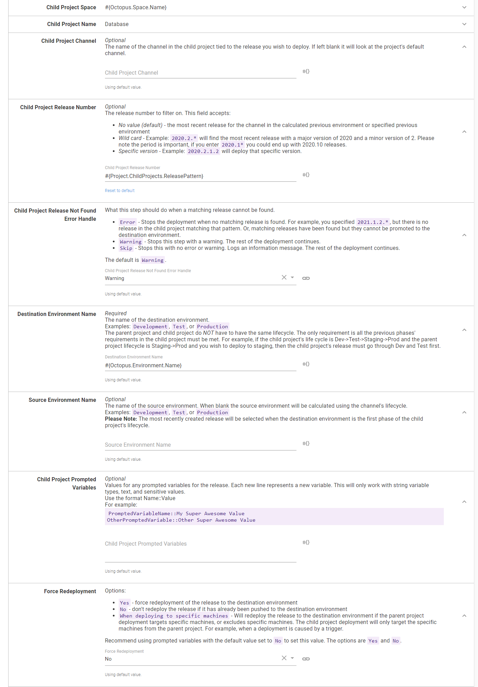
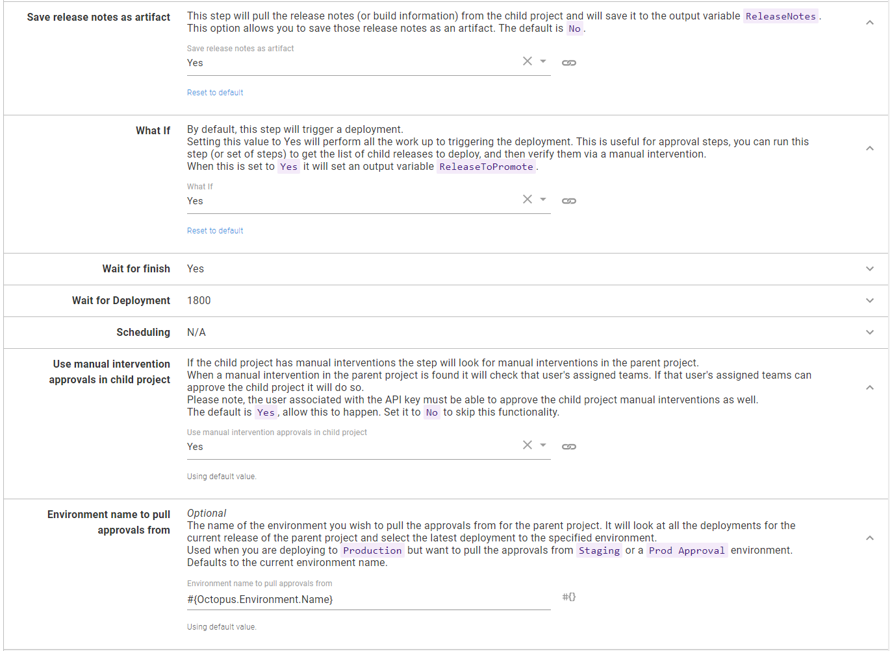
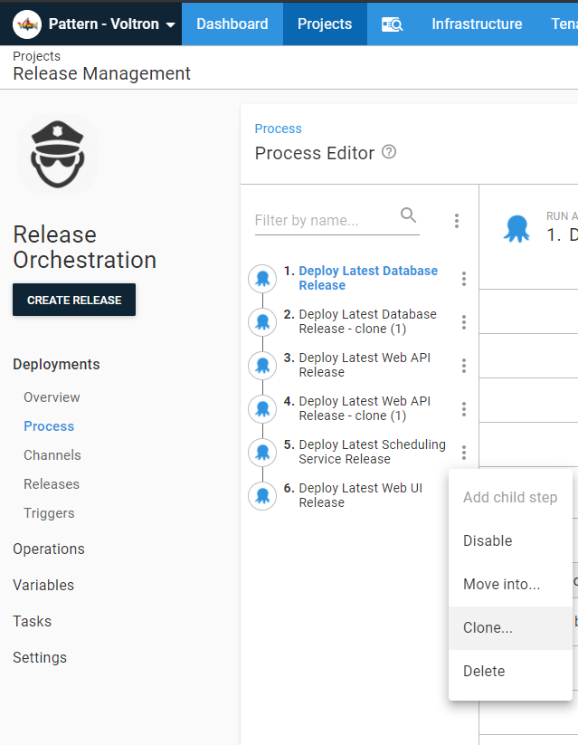
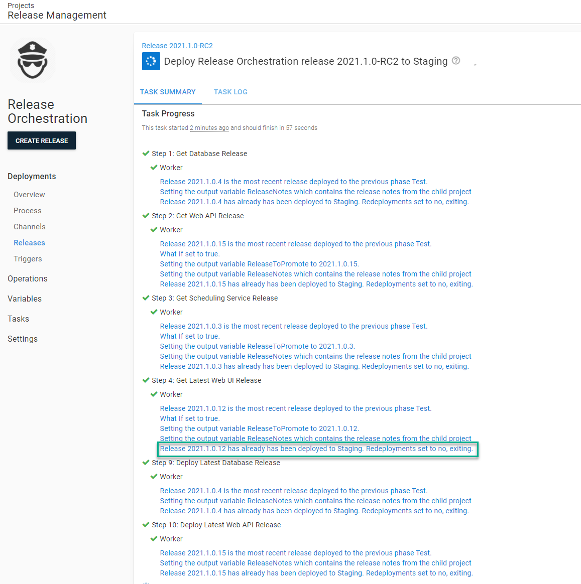
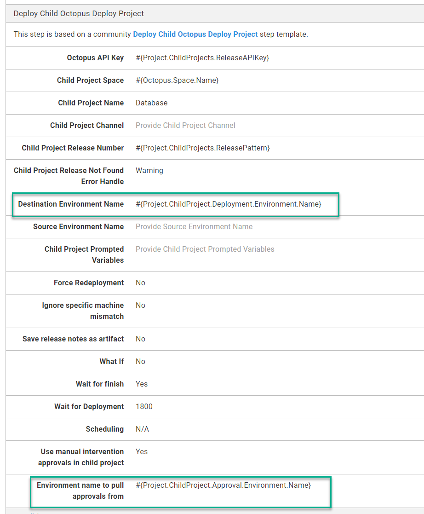

It is common to ask, should we have one Octopus Deploy project per application or an Octopus Deploy project per component (WebUI, API, Database, etc.)? I've seen and been a part of projects where it was far more common to deploy one or two pieces, perhaps to fix a small bug, than it was to deploy everything.  Having an Octopus Deploy project per component solves many problems; the trade-off makes it more complex to deploy the entire application stack.  In this post, I will walk through how to use a new step template [Deploy Child Octopus Deploy Project](https://library.octopus.com/step-templates/0dac2fe6-91d5-4c05-bdfb-1b97adf1e12e/actiontemplate-deploy-child-octopus-deploy-project) to make release management in Octopus Deploy much easier.

## Why a project per component

The driving forces behind a project per component commonly are:

- Minimize downtime by only deploying what has changed.
- Minimize build time by only building what has changed.
- Minimize the number of decisions a person has to make.
- Single responsibility principle, each project deploys one thing to the best of its ability.

In other words, a project per component helps reduce the amount of time it takes to deploy the software.  But nothing in life is free; the cost of saving time makes it harder to coordinate releases.

## The Sample Application

For this article, I will be using a sample application with four components, a Database, a Scheduling Service, a Web API, and a Web UI.  You can find it on our [samples instance](https://samples.octopus.app/app#/Spaces-603) (login as a guest).


Each project's design allows it to be deployed independently of one another; so much so each project has its manual interventions.


This example will use a modified version of [SemVer](https://semver.org/) for the components, `Year.Minor.Patch.Build`, or `2021.1.0.1`.  The orchestration project will be closer to standard [SemVer](https://semver.org), `Year.Minor.Patch` or `2021.1.0`.  

I'm not going to spend too much time discussing source control repository and build configuration.  This example should be flexible enough to account for various configurations, be it a single git repo/single build, single git repo/build per component, or a git repo/build per component.  There are pros and cons to each approach, but discussing that is very much out of this article's scope.

For this example, we will assume a build server will build each component, create a release for that component's project, and automatically deploy it to the **Development** environment.  When that deployment is complete, it will run a batch of integration tests, and if those passed, promote the release to **Test**.  

The first batch of work for 2021 will look like this.


## The roadblocks

Typically a change will sit in the **Test** environment for 1 to N days while it goes through the QA process.  Bugs are found and squashed, and chances are each component will have a different build number.


After QA completes its testing of all the component projects for the `2021.1.0.x` release, the promotion to  **Staging** can start.  With the current configuration, that means promoting each release for each project one by one.  I've done this promotion hundreds of times, and while doing it, my mood fluctuates between this isn't great, but it is tolerable and ugh this again.  

Promoting all the component projects to **Production** is when this pattern starts to run into issues.  

- If a component has multiple fixes pushed to **Test**, chances are it will need at least one more fix pushed to **Staging**.  Often the release number of the component project to approve isn't known until the day of approval.
- All the projects require approval from QA.
- Multiple projects require approval from the web admins and business owners.
- Typically, applications need to be deployed in a specific order.  Deploy the database first, followed by the API, then the scheduling service, and finally the UI.  Any issues during the deployment should stop everything.
- How and when changes are approved vary from company to company.  It is not uncommon for a release's approval to occur on Tuesday for a Thursday night deployment.

To solve these issues, we need a "parent project" to coordinate all these "child projects." Unlike the child projects, the parent project only needs to deploy to **Staging** and **Production**.

## Introducing the Deploy Child Octopus Deploy Project Step Template

The parent project will need a way to invoke the child project's deployments.  That will be handled by the new [Deploy Child Octopus Deploy Project](https://library.octopus.com/step-templates/0dac2fe6-91d5-4c05-bdfb-1b97adf1e12e/actiontemplate-deploy-child-octopus-deploy-project) step template.  In this example, the parent project will be called "Release Orchestration" and will use that step template multiple times.  You don't have to call your project that, other names for the parent project could be "Traffic Cop," the name of the application, or if you want to be cheeky, Voltron.


Before providing examples on how to use the step template, I want to take a minute to walk through how the step template works.

### How Releases Are Chosen

I'd be remiss in forgetting to mention there are two other options for a parent project to deploy a child project.

- [Deploy a release step](https://octopus.com/docs/projects/coordinating-multiple-projects/deploy-release-step): a step built into Octopus Deploy designed to solve particular use cases.
- [Chain Deployment step template](https://library.octopus.com/step-templates/18392835-d50e-4ce9-9065-8e15a3c30954/actiontemplate-chain-deployment): a community step template that was a pre-cursor to the deploy a release step.

Those two steps choose the release to deploy the same way; use the most recently created release for a channel.  The Deploy Child Octopus Deploy Project step template chooses releases a different way.

You supply:
- A channel name.  When no channel is provided, the default channel is chosen.
- A release number pattern (`2021.1.0.*`) or a specific release number (`2021.1.0.15`).  If no release number is provided, it will use the latest release it can find for the channel.
- And a destination environment.

With those three points of data, the step template will:

- Calculate the previous environment(s) based on the channel and destination environment.  For example, if you entered **Staging** as the destination environment, it would pick **Test** because that is the prior environment to **Staging** in the channel's lifecycle.
- Look for all the releases matching the supplied pattern for that channel.  
- Find the release that was last successfully deployed to the previous environments.  Not the most recently created release deployed to the previous environment.  The last successfully deployed release.  For example, you deploy `2021.1.0.15` to **Test**, then realize that release shouldn't have been pushed, and redeploy `2021.1.0.14` to **Test**.  The step template will pick `2021.1.0.14` when it promotes to **Staging** because that was the last release deployed to **Test**.

If no release is found, it will exit the step and move onto the next step in the deployment process.  For example, shortly after promoting `2021.1.0` to **Production**, a bug is reported requiring a fix to the Web API and Web UI projects. You'd create the `2021.1.1` release with the `2021.1.1.*` pattern for the child projects.  The Database and Scheduling service projects don't have a matching release because they weren't updated, so they are skipped.  



:::success
One of the basic design rules of this step template is customization.  For example, you can configure the step to throw an error if no release is found rather than exiting out of the step and proceeding.
:::

The step template will also check to see if the selected release has been deployed to the destination environment and skip it if it already has.  You can configure it always to redeploy.

### Easier Approvals

Approvals seem to cause the most headaches when it comes to parent/child project relationships.  In Octopus Deploy, the [manual intervention step](https://octopus.com/docs/deployment-process/steps/manual-intervention-and-approvals) is responsible for approvals.  The kicker with that step is the deployment has to start for the approval to happen.  But often, the approval process occurs hours or days before the release.  

Also, child projects have their own approvals to handle a use case when only one child project is being deployed.  In general, approvers like to approve a release once, not for each child project.  And when they are approving a release, it'd be nice to pull in all the pertinent release information into one place to approve.

The step template helps the approval process by providing a what-if flag, which will exit the step right before it kicks off the deployment.  When that flag is used, the step template will populate the output variable `ReleaseToPromote` for manual intervention steps instructions.

The step template will also gather the release notes for each child project and populate the output variable `ReleaseNotes`.  If you are using the build information and issue tracker feature in Octopus, the step template will gather the commit and issue information for the release.  That includes the rolled up release notes.  You can save release notes as an artifact making it easier for approvers and later auditors to review the deployment in one place.



How it works:

- The step template will grab all the deployments for the parent project release.  It will then filter that list by the desired environment.  By default, it will use the current deployment's environment, but you can supply a different environment, for example, **Staging** or **Prod Approval** to pull the approval information.
- It pulls all the approvers from the selected deployment.
- It stores the approver(s), along with what teams their team membership.
- When the step template is waiting for a deployment to finish, it will look for manual interventions.
- When a manual intervention occurs during the child project's deployment, it will look at which team(s) has the permission to approve it.  
- It will compare the manual intervention team list with the list it created for the user earlier.  If a match is found, the step template will submit the approval.

:::success
This step template uses the Octopus Deploy API and requires an API key.  This particular functionality is submitting the approval based on the user attached to the API key.  
:::

When this step template approves a child project's manual intervention, you will see a similar message.


### Release Scheduling

It is common to get approval for a **Production** deployment hours or days before the actual deployment.  Part of the approval process is scheduling an outage window.  Depending on your application, the order the child projects are deployed might not be necessary, as long as they are deployed within a few minutes of one another.  

The step template supports that use case by allowing you to send in a future time and/or date as a parameter. It uses .NET’s [DateTime. TryParse](https://docs.microsoft.com/en-us/dotnet/api/system.datetime.tryparse) to parse the date.  Formats supported include:

- `7:00 PM` will deploy at 7:00 PM today
- `21:00` will deploy at 21:00 hours or 9 PM today
- `YYYY-MM-DD HH:mm:ss` or `2021-01-14 21:00:00` will deploy at 9 PM on the 14th of January, 2021
- `YYYY/MM/DD HH:mm:ss` or `2021/03/20 22:00:00` will deploy at 10 PM on the 20th of March, 2021
- `MM/DD/YYYY HH:mm:ss` or `06/25/2021 19:00:00` will deploy at 7 PM on the 25th of June, 2021
- `DD MMM YYYY HH:mm:ss` or '01 Jan 2021 18:00:00` will deploy at 6 PM on the 1st of January, 2021

You can leverage [prompted variables](https://octopus.com/docs/projects/variables/prompted-variables) to let a user send in a date/time when deploying to **Production**.


This example is not the only scenario in which you can approve a release and then schedule it to deploy later.  Please see the section "Scenario: Approve Today Deploy Tomorrow" later in this article on how to leverage a "Prod Approval" environment.  

### Parameters

When designing this step template, one of the design decisions was to make it easy for users to tweak to match their use cases.  Some users will find the auto-approval feature useful and implement it right away, while other users have business rules disallowing that functionality.  All of that is entirely understandable.  I have tried to add as many parameters as possible to tweak the step template to make your use case(s).  As you can imagine, there are a lot of parameters in this step template.

- **Octopus API Key**: the API Key of a user with permissions to deploy and approve manual interventions when using the automated approval functionality.
- **Octopus Child Space**: the name of the space where the child project is located.  The default is the current space.  Unless there is a compelling reason, leave this as is.
- **Child Project Name**: The name of the child project.
- **Child Project Channel**: The name of a specific channel.  If you leave it blank, it will pick the default channel on the child project.  
- **Child Project Release Number**: the release number to deploy.  The default is empty; it will pull the latest release in the source environment.  Can supply a specific number, `2021.1.0.14`, or a pattern, `2021.1.1.*`.  The `.*` is important.  If the period `.` isn't supplied, you could end up with releases from `2021.1.10.x` or `2021.1.15.x`.  
- **Child Project Release Not Found Error Handle**: what the step should do if the child project doesn't have a matching release number.  By default, it will skip the step and log a warning.  You can change that to stop a deployment with an error or not log a warning.  Recommend leaving it as a warning.
- **Destination Environment Name**: the name of the environment being deployed to, with the default set to the current environment name.  Recommend leaving as-is unless you are implementing an "Approval Only" environment between **Staging** and **Production** (more on that later).
- **Source Environment Name**: the name of the source environment.  When left blank, the step template will look at the channel's lifecycle, determine what phase the destination environment is in, then look for the environment(s) before that.  The kicker is Octopus Deploy [lifecycles](https://octopus.com/docs/releases/lifecycles) can have 1 to N environments in a phase.  Enter a specific environment if the release has to come from a specific source environment.  Recommend you leave blank.
- **Child Project Prompted Variables**:  where you supply prompted variables values for the child project.  
- **Force Redeployment**: tells the step template to either redeploy a release or skip it if it has already been deployed.  In the event you have a deployment target trigger configured for the parent project, you'd want to change the value to `When deploying to specific machines`.  Otherwise leave it as is.
- **Ignore Specific Machine Mismatch**: this only comes into account if you deploy to specific machine(s), which happens with a deployment target trigger.  This step will determine if the child project is associated with any of those machines and exit when it cannot find a match.  Recommend leaving as-is unless there is a particular reason.
- **Save Release Notes as Artifacts**: the step template will pull all the release notes and build information from the child project and save it in an output variable `ReleaseNotes`.  Output variables are not easily accessible after a deployment.  If you want to persist the gathered release notes in the parent project, then set this to `Yes`.
- **What If**: tells the step template to do everything except the deployment.  Set to `Yes` if you'd like to approve a release before actually deploying.
- **Wait for finish**: wait for the deployment to finish before moving on.  Setting the what if parameter set to `Yes` will cause this parameter to be ignored.
- **Wait for Deployment**: how long the step template waits for the deployment to finish.  Once the timeout is exceeded, the child project's deployment is canceled.  This parameter is the MAX time it will wait.  If a deployment finishes before the limit, it will stop waiting.  Leave at 1800 seconds (30 minutes) unless there is a compelling reason.
- **Scheduling**: Allows you to schedule a deployment in the future.  Uses [DateTime.TryParse](https://docs.microsoft.com/en-us/dotnet/api/system.datetime.tryparse) to parse the date.  Recommend using this with a prompted variable.
- **Auto-Approve Child Project Manual Interventions**: will use the parent project's manual intervention approvals for the child project's manual intervention. 
- **Approval Environment**: the environment's name where the parent project's manual interventions are located.  The default is the current environment.  Change if you are implementing a "Prod Approval" environment.
- **Approval Tenant**: the name of the tenant where the parent project's manual interventions are located.  The default is the current tenant.  Change if you are implementing a "Prod Approval" environment for a single tenant.

## Using the Deploy Child Octopus Deploy Project Step Template

This section will walk through how to configure this step template for various scenarios.  These scenarios are going to start simple and slowly add more and more functionality. 

### Scaffolding

Before jumping into the scenarios, there is some scaffolding to configure.  

#### Create a service account

First, we have to create a [service account](https://octopus.com/docs/security/users-and-teams/service-accounts) and assign that account to a team.  That is because the step template uses the Octopus Deploy API.

I recommend naming the service account "Release Conductor." Create an API key for the user and save it in a safe location.


Create a new team called "Release Management" and assign that user to it.


Assign the roles "Deployment Creator", "Project Viewer", and "Environment Viewer" to the team.  Assigning those roles will allow the service account to create a deployment and see the projects and environments, but not edit them.


If you want to leverage the auto-approval functionality, go to each manual intervention in the child projects add the release management team.


#### Create a unique lifecycle

The parent project only needs to deploy to **Staging** and **Production**.  We don't want to use the default lifecycle that has all four environments in it.  Create a new lifecycle that only has **Staging** and **Production** in it.

:::success
The parent project and child project's lifecycles and channels _do not_ have to match.  The step template will determine if the selected release from the child project can be promoted to the destination environment
:::


#### Create the project

Next up is to create the project.  When you are creating the project, remember to select the new lifecycle created above.


Once the project is created, head over to the variables screen and add in the API key and the release pattern.


### Scenario: Deploying the latest release from Test to Staging

In this scenario, we are going back to the sample application.  If you recall, release `2021.1.0` is ready to be deployed from **Test** to **Staging**.


Go to the deployment process in the newly created **Release Orchestration** project and add a `Deploy Child Octopus Deploy Project` step for each child project.


Here are the values for each parameter.

- **Octopus API Key**: the API key variable, `#{Project.ChildProjects.ReleaseAPIKey}`.
- **Octopus Child Space**: leave the default value as-is; this example isn't creating a parent project in another space from the child projects.
- **Child Project Name**: the name of the child project.
- **Child Project Channel**: leave the default (empty) value as-is; the child project only has one channel.
- **Child Project Release Number**: The release pattern variable, `#{Project.ChildProjects.ReleasePattern}`
- **Child Project Release Not Found Error Handle**: leave the default value as-is, which says if the release doesn't exist, skip it.
- **Destination Environment Name**: leave the default value as-is, use the same environment as the parent project. 
- **Source Environment Name**: leave the default (empty) value as-is; this example will let the step template decide the source environment.
- **Child Project Prompted Variables**: leave the default (empty) value as-is; there are no prompted variables. 
- **Force Redeployment**: leave the default value as-is; the example won't be redeploying an existing release.
- **Ignore Specific Machine Mismatch**: leave the default value as-is, not adding deployment target triggers yet.
- **Save Release Notes as Artifacts**: leave the default value as-is.
- **What If**: leave the default value as-is; the approvals aren't getting added yet.
- **Wait for finish**: leave the default value as-is; this example will wait for the deployment to finish.
- **Wait for Deployment**: leave the default value as-is; 30 minutes should be more than enough.
- **Scheduling**: leave the default value as-is, this example requires a specific order for child projects.
- **Auto-Approve Child Project Manual Interventions**: leave the default value as-is; this setting is moot right now as we aren't concerned with approvals at the moment.
- **Approval Environment**: leave the default value as-is; this setting is moot right now as we aren't concerned with approvals at the moment.
- **Approval Tenant**: leave the default value as-is; this setting is moot right now as we aren't concerned with multi-tenant deployments for this article.

After adding and configuring the steps, it is time to create a release.  I will be making many changes to the parent project in this article; you might see `2021.1.0-RCx` for the release numbers.  


Wait for the deployment to finish deploying all the child projects.


### Scenario: Approvals in parent project only

Deploying to **Staging** is straight forward as there are no approvals to contend.  Deploying to **Production** is a different story.  One of the key features of this new step template is using approvals from the parent project to auto-approve child projects.

To configure that, you will want to clone the four steps.  Cloning is accomplished by clicking the `...` next to each step and clicking the **Clone** button.



Rename each of the cloned steps.  The parameters in the cloned steps will be:

- **Save Release Notes as Artifacts**: Set to `Yes`.
- **What If**: Set to `Yes`.  

Finally, reorder the steps by clicking the `...` next to the **Filter by name** text box and click the **Reorder** button.  


Move all the steps you set to do a "whatif" to be above the "non-whatif" steps.


Next, we will want to add the manual intervention steps.  One of the features of the manual intervention step is the instructions.  The new step template will set output variables we can access.  For example:

```
Please approve releases for:

**Database: #{Octopus.Action[Get Database Release].Output.ReleaseToPromote}**
#{Octopus.Action[Get Database Release].Output.ReleaseNotes}

**Web API: #{Octopus.Action[Get Web API Release].Output.ReleaseToPromote}**
#{Octopus.Action[Get Web API Release].Output.ReleaseNotes}

**Scheduling Service: #{Octopus.Action[Get Scheduling Service Release].Output.ReleaseToPromote}**
#{Octopus.Action[Get Scheduling Service Release].Output.ReleaseNotes}

**Web UI: #{Octopus.Action[Get Web UI Release].Output.ReleaseToPromote}**
#{Octopus.Action[Get Web UI Release].Output.ReleaseNotes}
```

I like to avoid duplicating effort. Let's add that as a variable.


Now add a manual intervention for each approver group.


Reorder the deployment process once again; the new steps are between the "what-if" steps and the "non-what-if" steps.


Please create a new release and deploy it to **Staging**.


When you deploy to **Staging** you will see this message.  That is expected, especially for this sample project.  The redeployment parameter is set to `No`, and we haven't created any new releases.



Promote that release to **Production**.  During this deployment, you'll see the manual interventions and auto-approvals in action.  First up, the manual intervention should have the version being deployed along with the release notes.


Once every group has approved the release, the deployments will kick-off.  If the user associated with the API doesn't have permission to take ownership of the manual intervention, you will see a warning like this.  You will have 30 minutes to fix this problem, or the deployment will be canceled.


But once that is fixed, you should see a message similar to this in the child projects.


And with that, the release to **Production** is complete!


### Scenario: Approve today deploy tomorrow

For a large chunk of our users, deployments are done off-hours.  It seems odd to require approvers to be online during deployment if their only task is to approve a deploy.  In a perfect world, the deployment should run automatically off-hours without user intervention and page the appropriate people if something goes wrong.  We can accomplish that functionality by adding in a **Prod Approval** environment to sit between **Staging** and **Production**.  This environment will _only_ be used for parent projects.

First, add the **Prod Approval** environment.  You will notice this environment sits between **Staging** and **Production** on this page.  I clicked the `...` to reorder the environments on this page.


Now that the new environment has been added, update the lifecycle used by this parent project.


:::success
Keep an eye on the **Default Lifecycle.**  By default, that lifecycle doesn't have explicit phases defined.  Instead, it auto-generates the phases using the entire environment list.  To remove **Prod Approval** from the **Default Lifecycle**, you will need to add explicit phases.
:::

Next, update the approval steps to only run in the **Prod Approval** environment.  At the same time, configure the non-what-if steps to skip the **Prod Approval** environment.


Next, head over to the variables screen and add in two new variables:

- **Project.ChildProject.Approval.Environment.Name**: stores the **Prod Approval** environment name.
- **Project.ChildProject.Deployment.Environment.Name**: stores the name of the environment the child project should be deployed to.  For all environments except **Prod Approval**, the name will match the current environment.  When running this on the **Prod Approval** environment, the deployment environment name is **Production**.


Go into each step implementing the `Deploy Child Octopus Deploy Project` and update the following parameters:

- **Destination Environment Name**: update to `#{Project.ChildProject.Deployment.Environment.Name}`
- **Approval Environment**: update to `#{Project.ChildProject.Approval.Environment.Name}`.



:::success
By doing this, we are telling the step template to pull approvals from the **Prod Approval** environment rather than the **Production** environment during a **Production** deployment.  This means we can approve at 11 AM and schedule it to deploy at 7 PM.
:::

Now, let's see this in action.  For the sample application, let's pretend a bug was found in the API and Database.  A patch `2021.1.1.1` is created to fix that bug and deployed to **Development** and **Test**.


Let's assume everything successfully passes QA, and it is time to promote those two components to **Staging**.  First, we want to update the release pattern to be `2021.1.*`. You'll notice that it isn't `2021.1.1.*`.  To be honest, in thinking about this more, it makes sense only to update that when a new minor release is created, not for every patch release.  And don't worry about it trying to redeploy existing code; remember, the step template will skip already deployed releases.


Please create a new release for the **Release Orchestration** project and deploy it to **Staging**.  


Promote that release to **Prod Approval** and go through each of the approval steps. You'll notice the approval message is slightly different for releases already deployed.


Now it is time to schedule the release to deploy to **Production**.  Using the built-in tool, we can schedule it to run at 7 PM tonight.


When the release is deployed, it will pull the approvals from the **Prod Approval** environment.


### Scenario: Redeploy on demand

By default, the step template will skip any release already deployed to the target environment.  For a significant number of use cases that is the preferred behavior.  However, there are several use cases where a redeployment is desired.

- Environment refresh: the **Staging** environment is refreshed from **Production**.  It makes sense to redeploy the latest code to **Staging** to get the latest bits out there for testing.
- Server reset: one of the servers is acting funny, perhaps the easiest solution is to redeploy to make sure all the code and configuration values are up to date.
- New server: a new server is added to the web farm, redeploy everything to make sure the web farm has the same code and configuration across all nodes.

To accomplish this we will use [Octopus Deploy's prompted variable functionality](https://octopus.com/docs/projects/variables/prompted-variables).  First, we will add a new variable to the project.

- Name: **Project.ChildProject.ForceRedeployment**
- Default Value: No
- Label: Force Redeployment
- Control Type: Drop Down List
- Options: Yes and No


Next, update the **Force Redeployment** parameter to use this new variable.  


Now when you do a deployment you will be prompted to force a redeployment.  The default is `No`, if a user leaves everything as is the default functionality will be used.


And when it is set to `Yes` you will see all the child projects redeploy.


At the moment the prompted variable makes redeployment an all or nothing.  It might make sense to have a unique variable per component project, or group them together in a logical fashion.  

## Alternatives
If you made it this far, you might be thinking, wow, this is all very complex.  Is this needed?  I think it is. Let's reexamine why a person wants to have a project per component.

- Minimize downtime by only deploying what has changed.
- Minimize build time by only building what has changed.
- Minimize the number of decisions a person has to make.
- Single responsibility principle, each project deploys one thing to the best of its ability.

At this time, an Octopus Project per component is the best solution to meet these requirements.

There are alternatives to a project per component.  This section will walk through those alternatives to better understand why an Octopus Project per component solves the problem in the most efficient manner.

### Single Project with multiple channels

It is possible to have a single project and use [Octopus Deploy channels](https://octopus.com/docs/releases/channels) feature.  Steps can be scoped to run on specific channels.  The channel is selected when creating a release.  Typically releases are created by a build server and automatically deploy to a **Development** environment.

The first problem is all the possible component combinations.  For four components, there would be 15 channels.

- WebUI
- WebAPI
- Database
- Service
- WebUI WebAPI
- WebUI Database
- WebUI Service
- WebAPI Database
- WebAPI Service
- Service Database
- WebUI WebAPI Database
- WebUI WebAPI Service
- WebAPI Service Database
- WebUI Service Database
- WebUI WebAPI Database Service

Adding a fifth component would mean 36 channels.  A sixth component would mean 63 channels!  As you can see, channels per component combination doesn't scale.

The second problem is when a release is created, something or someone has to decide which channel to use—making the wrong decision could result in the wrong component being deployed.  That opens the door to human error.

### Single project with disabling steps at deployment time

Another alternative is to have a single project, but instead of using channels, disable steps on the deployment screen.  


The main problem with this option is the manual process this involves.  A person has to pick which steps to disable.  The more steps, the greater chance of error.  And the steps have to be disabled during each deployment, which further increases the chance of error.

### Leverage the project package redeployment setting

There is a [package redeployment option](https://octopus.com/docs/projects#deployment-settings) in the project settings pages.  You could set that to `Skip any package that is already installed`.

There are several roadblocks with this setting:

- Quite often, deployments are more involved than just pushing out a package.  There are other steps to configure the database or the webserver.  Maybe there are steps to run sanity checks tests after the deployment.  That setting only applied to the deployment package steps, not to any script steps.
- That setting applied to _all_ the packages in the deployment process.  You can't pick and choose the packages the setting applies to.  
- That setting didn't work very well with rollbacks or redeployments.  It would cause a package to get skipped at the wrong time.

## Conclusion

As I wrote this article, I couldn't help ask myself, am I making this too complex?  Is it worth it? I've come to a conclusion that, yes, this effort is worth it.

No matter what, a deployment will take time.  Even if Octopus Deploy and the target VMs are running on servers with dual 64-core/128-thread AMD Epyc CPUs and 1 TB of RAM and a 100-gigabit connection between them.  The amount of time a deployment takes varies from application to application. I've seen applications where a deployment of all components can take over 12 hours, with one or two components taking the vast majority of the time. I've been part of deployments that had to occur at 2 AM Saturday because they took at least one hour to complete, and that was the only time a downtime of that length was permitted.  Unless we can find ways to minimize that downtime by skipping components that have not changed, then the chance of doing more frequent deployments diminishes.

With this new step template, my hope is it solves some of those release management issues you have run into in the past.  

Until next time, Happy Deployments!