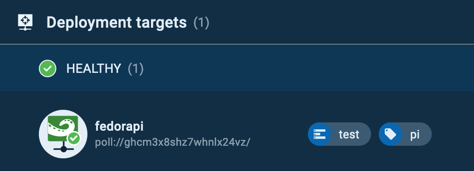
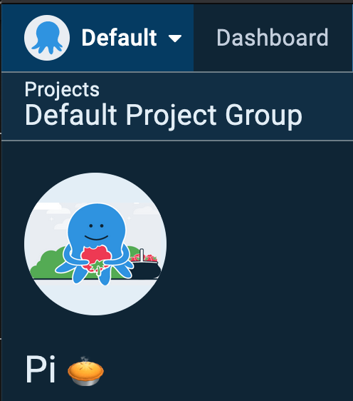
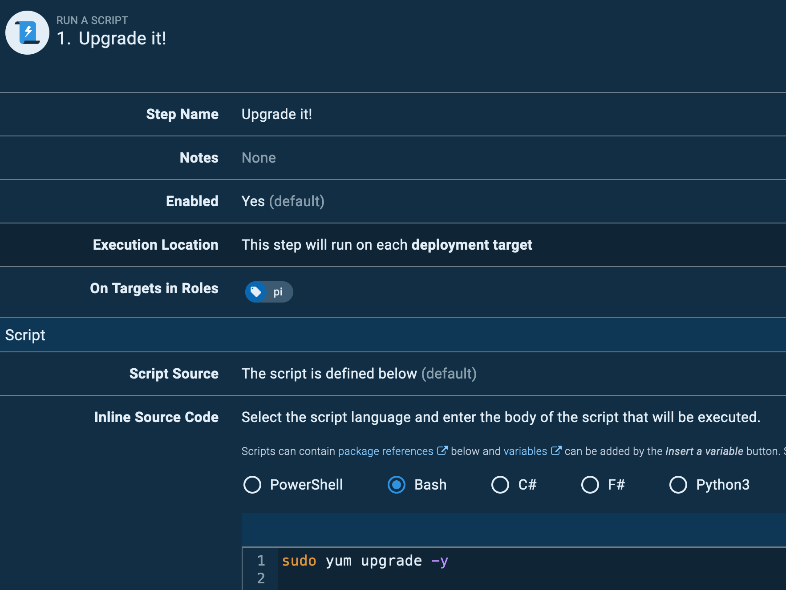

We're pleased to share that our Tentacle agent now supports ARM and ARM64 hardware. This update makes it possible to deploy your apps and services to Raspberry Pi 3 & 4, AWS A1 EC2 instances, or any ARM hardware that can run [.NET Core 3.0 or later](https://devblogs.microsoft.com/dotnet/announcing-net-core-3-0/#platform-support). 

In this post, I'll explain why it's valuable to run Tentacle on ARM servers and how to get started.

## Why Tentacle on ARM/ARM64? 

Back in late 2019, we introduced support for ARM-based deployment targets and workers as an SSH connection option\*. The [Linux Tentacle](https://octopus.com/downloads/tentacle#linux) has been around for a while now, but it only supported `x86_64/amd64` based machines, leaving ARM adopters stuck with SSH.

Connecting over SSH is fine, but it doesn't work for everyone, such as highly secure environments where port 22 is not allowed. It also requires a direct connection, possibly through a firewall, between the Octopus Server and the SSH server. 

By installing a Polling Tentacle on your ARM device, you can avoid having to open a firewall port for an SSH connection, which is especially important if you are using the Octopus Cloud service. 

Feel free to check out our [previous blog post](https://octopus.com/blog/tentacle-on-linux), which goes into further detail about the benefits of using a Linux Tentacle for deployments rather than SSH.

Running your workloads on ARM hardware has some benefits:
- Lower running cost
- Low-cost replaceable units in the case of the small form-factor manufacturers such as Raspberry Pi.
- Faster compute compared to x86 servers.

[Comparison between ARM and x86](https://www.section.io/engineering-education/arm-x86/)

\* _Technically, it was available earlier than this but there were some awkward hoops you had to jump through._

## Getting started

All the instructions for configuring Tentacle on Linux are available in our [docs](https://octopus.com/docs/infrastructure/deployment-targets/linux/tentacle), but I'll provide a walk-through of the steps. At the end of the walk-through, we'll have a Raspberry Pi inside a private network, connected to an Octopus Cloud instance.

For this example, I'm running [Fedora 33 Server](https://getfedora.org/en/server/download/) on a [Raspberry Pi 3B+](https://www.raspberrypi.org/products/) and have signed up for an [Octopus Cloud instance](https://octopus.com/start/cloud).

:::info
You can also run the Linux Tentacle agent on a Raspberry Pi with Ubuntu 18.04 or later, or Raspbian Buster.
:::

Before we install the Tentacle application, you need the **Octopus Server URL** and an **API Key** for authentication. If you are using an on-premises Octopus Server instance, you can use **Username / Password** for authentication.

### Installation

Installing the Tentacle package is straightforward:

```bash
sudo wget https://rpm.octopus.com/tentacle.repo -O /etc/yum.repos.d/tentacle.repo
sudo yum install tentacle
```

At the end of the installation, you will see the following message:
```
To set up a Tentacle instance, run the following script:
    /opt/octopus/tentacle/configure-tentacle.sh
```

There are sample scripts available in the [Linux Tentacle documentation](https://octopus.com/docs/infrastructure/deployment-targets/linux/tentacle) if you need to make an automated, repeatable install, but for now, we will run the configuration script and mostly just accept the defaults.

For this example, it is important to select **Polling** (2) for the kind of Tentacle. The [Polling Tentacle](https://octopus.com/docs/infrastructure/deployment-targets/windows-targets/tentacle-communication#polling-tentacles) will make a connection out to the Octopus Server so we don't need to open up any additional ports in the firewall:

```bash
[user@fedora ~]# sudo /opt/octopus/tentacle/configure-tentacle.sh

Name of Tentacle instance (default Tentacle):
Invalid characters will be ignored, the instance name will be: 'Tentacle'

What kind of Tentacle would you like to configure: 1) Listening or 2) Polling (default 1): 2
Where would you like Tentacle to store log files? (/etc/octopus):
Where would you like Tentacle to install applications to? (/home/Octopus/Applications):
Octopus Server URL (eg. https://octopus-server): https://***.octopus.app
Select auth method: 1) API-Key or 2) Username and Password (default 1): 1
API-Key: ...
Select type of Tentacle do you want to setup: 1) Deployment Target or 2) Worker (default 1): 1
What Space would you like to register this Tentacle in? (Default):
What name would you like to register this Tentacle with? (fedora): fedorapi
Enter the environments for this Tentacle (comma seperated): test
Enter the roles for this Tentacle (comma seperated): pi

The following configuration commands will be run to configure Tentacle:
sudo /opt/octopus/tentacle/Tentacle create-instance --instance "Tentacle" --config "/etc/octopus/Tentacle/tentacle-Tentacle.config"
sudo /opt/octopus/tentacle/Tentacle new-certificate --instance "Tentacle" --if-blank
sudo /opt/octopus/tentacle/Tentacle configure --instance "Tentacle" --app "/home/Octopus/Applications" --noListen "True" --reset-trust
sudo /opt/octopus/tentacle/Tentacle register-with --instance "Tentacle" --server "https://***.octopus.app" --name "fedorapi" --comms-style "TentacleActive" --server-comms-port "10943" --apiKey "API-XXXXXXXXXXXXXXXXXXXXXXXXXX" --space "Default" --environment "test"  --role "pi"
sudo /opt/octopus/tentacle/Tentacle service --install --start --instance "Tentacle"
Press enter to continue...

Creating empty configuration file: /etc/octopus/Tentacle/tentacle-Tentacle.config
Saving instance: Tentacle
Setting home directory to: /etc/octopus/Tentacle
A new certificate has been generated and installed. Thumbprint:
9B691824225B6A77AB68...
These changes require a restart of the Tentacle.
Removing all trusted Octopus Servers...
Application directory set to: /home/Octopus/Applications
Tentacle will not listen on a port
These changes require a restart of the Tentacle.
Checking connectivity on the server communications port 10943...
Connected successfully
Registering the tentacle with the server at https://***.octopus.app/
Detected automation environment: NoneOrUnknown
Machine registered successfully
These changes require a restart of the Tentacle.
Service installed: Tentacle
Service started: Tentacle

Tentacle instance 'Tentacle' is now installed
```

After the script has finished configuring the Tentacle, you will be able to see the Linux Tentacle in the Deployment Targets page on your instance.



### The Tentacle in action

Next, we'll run something against our new Tentacle.

For this step, I am going to set up a new project and configure a runbook to install the latest package updates.

In your instance, create a new project, I called mine **Pi 🥧**



I then created a new runbook called **Upgrade it!** and added a single script step containing:

```bash
sudo yum upgrade -y
```

The step is configured to run a bash script against the role **pi**, which is the role I specified in the configuration script earlier.



Running against a role, means you could have many targets with the same role and the execution will run against each of them. Add a schedule trigger and you have yourself a real DevOps process.

This is a simple example, this could also be a runbook that updates PiHole (`pi-hole -up`) on a Raspberry Pi, or cleans up Docker images (`docker images prune --force`), or a deployment project that deploys the latest version of an in-house Python application to remotely located IoT monitoring devices.

## Conclusion

There are many reasons you might use ARM hardware from cost savings to performance or remote IoT devices. Being able to connect them to an Octopus instance via Tentacle allows you to deploy application updates to them or manage them using our [Runbooks](https://octopus.com/docs/runbooks) feature to centralize management of the operating system and applications. The Polling Tentacle has the added benefit of avoiding complex firewall configurations and exposing SSH ports across the public Internet.
