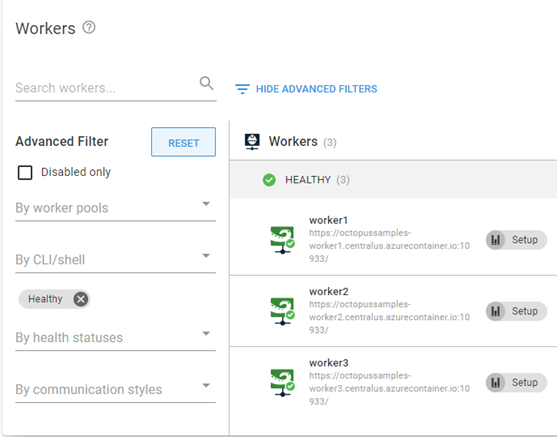

I recently had the need to create some additional, temporary workers on our [Samples](https://samples.octopus.app) cloud instance of Octopus Deploy.  As these workers were to be short lived, containers seemed like the perfect solution!  Spin up, do some work, tear them down.  Beautiful!  In this post, I'll demonstrate how to create workers in a container hosted in Azure, perform a health check, and install some additional software components.  

## Spin up the workers
The first step we'll need to do is to create a Runbook.  This post assumes that you have some familiarity with the [Runbook](https://octopus.com/docs/runbooks) feature, so I'll not be going into great detail in creating one.  My Runbook consists of the following steps:
- Create a Azure Resource Group
- Run an ARM template to create the Octopus Deploy Tentacle container
- Run a health check
- Install additional software

### Create Azure Resource Group
For ease of removal and overall tidyness, the first step creates an Azure Resource Group using the Run an Azure Script step:

```PowerShell
$resourceGroupName = $OctopusParameters["Azure.Network.ResourceGroup.Name"]
$resourceGroupLocation = $OctopusParameters["Azure.Location.Abbr"]

if ((az group exists --name $resourceGroupName) -eq $false)
{
	Write-Output "Creating resource group $resourceGroupName in $resourceGroupLocation"
    az group create --location $resourceGroupLocation --name $resourceGroupName
}
```

### Run an ARM template 
Azure Container instances are a quick and easy way to spin up a worker container.  Using a small Azure Resource Managemer (ARM) template, we can automate the creation of the [Octopus Tentacle](https://hub.docker.com/r/octopusdeploy/tentacle) container.

<details>
	<summary>Template code</summary>

```json
{
    "$schema": "https://schema.management.azure.com/schemas/2015-01-01/deploymentTemplate.json#",
    "contentVersion": "1.0.0.0",
    "parameters": {
        "location": {
            "type": "string"
        },
        "containerName": {
            "type": "string"
        },
        "imageType": {
            "type": "string",
            "allowedValues": [
                "Public",
                "Private"
            ]
        },
        "imageName": {
            "type": "string"
        },
        "osType": {
            "type": "string",
            "allowedValues": [
                "Linux",
                "Windows"
            ]
        },
        "numberCpuCores": {
            "type": "string"
        },
        "memory": {
            "type": "string"
        },
        "restartPolicy": {
            "type": "string",
            "allowedValues": [
                "OnFailure",
                "Always",
                "Never"
            ]
        },
        "ipAddressType": {
            "type": "string"
        },
        "ports": {
            "type": "array"
        },
        "dnsNameLabel": {
            "type": "string"
        },
        "environmentVariables": {
            "type": "array"
        }
    },
    "resources": [
        {
            "location": "[parameters('location')]",
            "name": "[parameters('containerName')]",
            "type": "Microsoft.ContainerInstance/containerGroups",
            "apiVersion": "2018-10-01",
            "properties": {
                "containers": [
                    {
                        "name": "[parameters('containerName')]",
                        "properties": {
                            "image": "[parameters('imageName')]",
                            "resources": {
                                "requests": {
                                    "cpu": "[int(parameters('numberCpuCores'))]",
                                    "memoryInGB": "[float(parameters('memory'))]"
                                }
                            },
                            "ports": "[parameters('ports')]",
                            "environmentVariables": "[parameters('environmentVariables')]"
                        }
                    }
                ],
                "restartPolicy": "[parameters('restartPolicy')]",
                "osType": "[parameters('osType')]",
                "ipAddress": {
                    "type": "[parameters('ipAddressType')]",
                    "ports": "[parameters('ports')]",
                    "dnsNameLabel": "[parameters('dnsNameLabel')]"
                }
            },
            "tags": {}
        }
    ]
}
```
</details>

The template requires some parameters to be entered:
- location: Location code in Azure, i.e. centralus
- containerName: The name of the container
- imageType: Public|Private
- imageName: octopusdeploy/tentacle
- osType: Linux|Windows
- numberCpuCores: Number of cores to use
- memory: Number (in GB) to use for the container
- restartPolicy: [See docker documentation for options](https://docs.docker.com/config/containers/start-containers-automatically/)
- ipAddressType: Public|Private
- ports: Array of ports to expose
- dnsNameLabel: DNS prefix for DNS entry - i.e. [dnsNameLabel].[AzureRegion].azurecontainer.io
- environmentVariables: Array of environment variables to pass to container

This template will spin up an Azure Container Instance of the Octopus Deploy Tentacle.  

I chose the Linux variant as it is much smaller than the Windows container (254.39 MB versus 2.27 GB).

### Run a health check
The built-in health check template only works for deployment targets, however, there is a Community step that was developed specifically for workers; [Worker - Health Check](https://library.octopus.com/step-templates/c6c23c7b-876d-4758-a908-511f066156d7/actiontemplate-worker-health-check).  Running this step ensures that our worker is healthy and ready for the next step.

### Install addtional software
The workers were going to need to interact with both Azure and AWS.  The Tentacle image has the bare minimum software required to run, so I needed to install the following:
- PowerShell Core
- Azure CLI
- AWS CLI

With Deployment Targets, you can execute steps against all targets with the same role.  Since workers don't have roles, I needed to find an alternative.  I found the Script Console had the ability to execute the same code against all workers within a pool.  With Octopus written API-first, I was able to duplicate the functionality of the Script Console to run the code to install the additional software against the whole pool via the API!

```PowerShell
# Define parameters
$baseUrl = $OctopusParameters['Global.Base.Url'] 
$apiKey = $OctopusParameters['Global.Api.Key'] 
$spaceId = $OctopusParameters['Octopus.Space.Id']
$spaceName = $OctopusParameters['Octopus.Space.Name']
$workerPoolName = $OctopusParameters['Project.WorkerPool.Name']

if ($baseUrl.EndsWith("/"))
{
	$baseUrl = $baseUrl.SubString(0, $baseUrl.LastIndexOf("/"))
}

# Get worker pool
$workerPool = ((Invoke-RestMethod -Method Get -Uri "$baseUrl/api/$spaceId/workerpools/all" -Headers @{"X-Octopus-ApiKey"="$apiKey"}) | Where-Object {$_.Name -eq $workerPoolName})

# Build payload
$jsonPayload = @{
    Name = "AdHocScript"
    Description = "Script run from management console"
    Arguments = @{
        MachineIds = @()
        TenantIds = @()
        TargetRoles = @()
        EnvironmentIds = @()
        WorkerIds = @()
        WorkerPoolIds = @($workerPool.Id)
        TargetType = "WorkerPools"
        Syntax = "Bash"
        ScriptBody = @"
# Update the list of products
sudo apt-get update

# Install wget
sudo apt-get install wget -y

# Download the Microsoft repository GPG keys
wget https://packages.microsoft.com/config/debian/10/packages-microsoft-prod.deb

# Register the Microsoft repository GPG keys
sudo dpkg -i packages-microsoft-prod.deb

# Update the list of products
sudo apt-get update

# Install PowerShell
sudo apt-get install -y powershell

# Install az module
echo "Installing az module ..."
pwsh -Command "& {Install-Module az -Scope AllUsers -Force}" > /tmp/azModuleInstall.log

# Install Az cli
curl -sL https://aka.ms/InstallAzureCLIDeb | sudo bash

# Install aws cli
sudo apt-get install awscli -y
"@
    }
    SpaceId = "$spaceId"
}


$scriptTask = (Invoke-RestMethod -Method Post -Uri "$baseUrl/api/tasks" -Body ($jsonPayload | ConvertTo-Json -Depth 10) -Headers @{"X-Octopus-ApiKey"="$apiKey"})

# Check to see if the health check is queued
while ($scriptTask.IsCompleted -eq $false)
{
	Write-Output "Waiting 5 seconds ..."
    Start-Sleep -Seconds 5
    $scriptTask = (Invoke-RestMethod -Method Get -Uri "$baseUrl/api/tasks/$($scriptTask.Id)" -Headers @{"X-Octopus-ApiKey"="$apiKey"})
}

Write-Output "Installation complete!"
```
I needed to create more than just one worker, so steps 2 and 3 from above were created multiple times in my process


## Containerized workers
When configured in Listening mode, the Tentacle container is coded to automatically connect to your Octopus Server and register itself to the specified worker pool.  Once the runbook completed, I had three, healthy workers.



## Conclusion
In this post I demonstrated how to create workers running as containers.  This gives you the flexibility of creating workers without having to manage a VM!