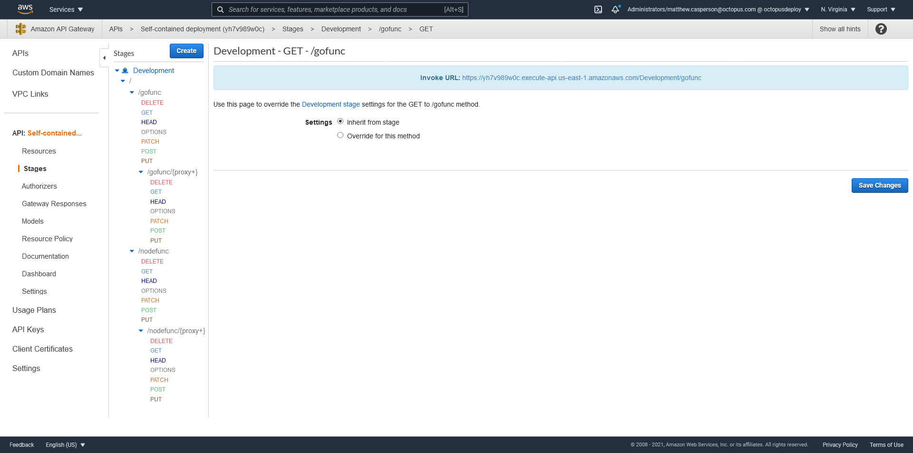
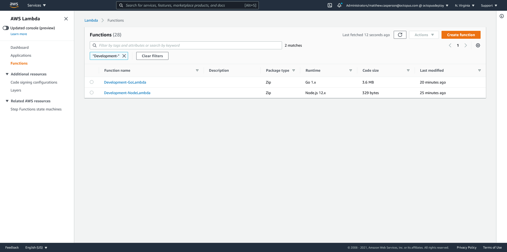
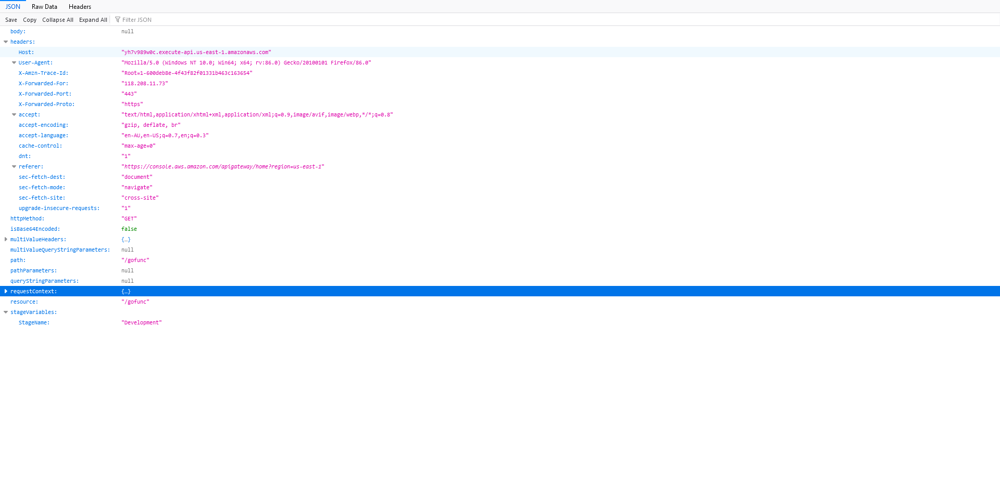
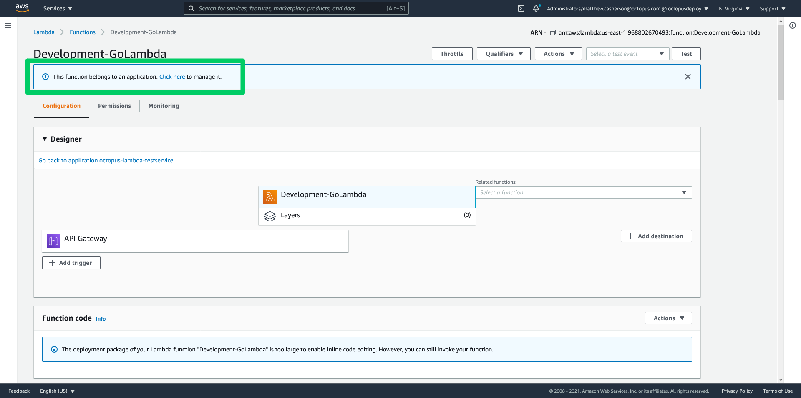
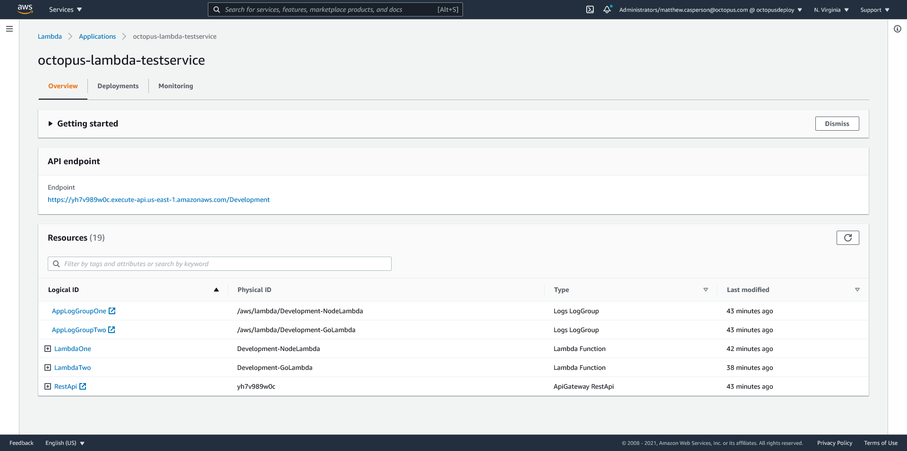
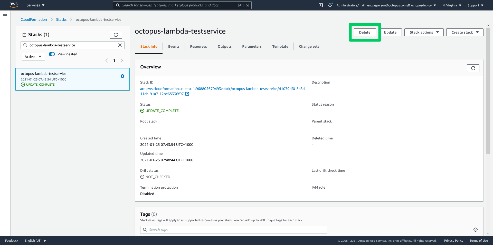
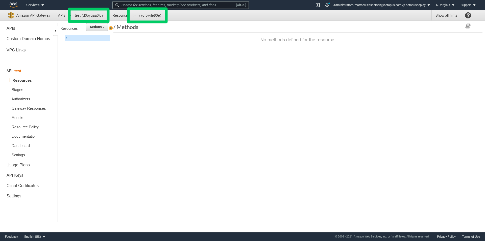

Serverless is the latest iteration in a steady shift away from managing physical or virtual machines. The term "serverless" is a little misleading, because there are still servers running code. But the promise of serverless is that you don't have to think about servers any more. Serverless platforms like AWS Lambda handle creating, destroying, updating and exposing these servers for you, allowing you to focus on running your code.

The serverless model is very compelling for certain types of workloads. Infrequently run code, like a function triggered by a file upload or the addition of a database row, is very convenient to host as a Lambda. You may even find more traditional workloads like website hosting can be accommodated by Lambdas in a cost effective and scalable manner.

Deploying serverless application is trivial these days. CLI tools and IDE plugins allow you to go from code to production with just a single command or click. Eventually though such deployments will need a more robust process to allow changes to be batched together and verified by teams who don't write the code. The traditional solution to these requirements is to have multiple environments, and progress deployments through internal testing environment before they reach production.

In this blog post we'll dive into how multi-environment serverless deployments can be expressed in CloudFormation and progressed in a reliable manner.

## The sample applications

We'll deploy two very simple Lambda applications in this example.

The first is written in Go and can be found at https://github.com/OctopusSamples/GoLambdaExample. 

The second is written in Node.js and can be found at https://github.com/OctopusSamples/NodeLambdaExample.

## Self-contained and decoupled deployments

For this post we'll consider two styles of serverless deployments.

The self-contained style wraps up all the Lambda functions and the services that trigger them (API Gateway in our case) as a single CloudFormation template creating independent and isolated infrastructure stacks for each environment. 

Self-contained deployments have the following benefits:

* Everything is created, and destroyed, as a group.
* A deployment is progressed to the next environment as a group.
* It is easy to reason about the state of a deployed application, even when the application has multiple Lambdas.

While a self-contained deployment is easy to create, it does have the downside that you can not deploy separate Lambdas independently. Serverless platforms are a natural fit for microservices, and to get the most from microservices you must be able to develop and deploy each microservice independently.

The decoupled style accommodates the flexibility required by microservice deployments. In a decoupled deployment, each Lambda is deployed independently, while still being exposed by a single shared API Gateway.

Decoupled deployments have the following benefits:

* Each Lambda manages its own deployment lifecycle.
* A single, shared API gateway allows Lambdas to interact via relative URLs.
* A shared hostname makes it easier to manage HTTPS certificates.

## Creating a self-contained deployment

A self-contained deployments involves creating a single CloudFormation template with the following resources:

* [AWS::ApiGateway::RestApi](https://docs.aws.amazon.com/AWSCloudFormation/latest/UserGuide/aws-resource-apigateway-restapi.html) - The API Gateway REST API
* [AWS::Logs::LogGroup](https://docs.aws.amazon.com/AWSCloudFormation/latest/UserGuide/aws-resource-logs-loggroup.html) - The CloudWatch log group for the Lambda logs
* [AWS::IAM::Role](https://docs.aws.amazon.com/AWSCloudFormation/latest/UserGuide/aws-resource-iam-role.html) - The permissions for the Lambda to access the log group
* [AWS::Lambda::Function](https://docs.aws.amazon.com/AWSCloudFormation/latest/UserGuide/aws-resource-lambda-function.html) - The Lambda function
* [AWS::Lambda::Permission](https://docs.aws.amazon.com/AWSCloudFormation/latest/UserGuide/aws-resource-lambda-permission.html) - A permission that grants API Gateway the ability to execute a Lambda
* [AWS::ApiGateway::Resource](https://docs.aws.amazon.com/AWSCloudFormation/latest/UserGuide/aws-resource-apigateway-resource.html) - A resource is a component of the URL path that exposed the Lambda
* [AWS::ApiGateway::Method](https://docs.aws.amazon.com/AWSCloudFormation/latest/UserGuide/aws-resource-apigateway-method.html) - Methods expose HTTP methods on resources
* [AWS::ApiGateway::Stage](https://docs.aws.amazon.com/AWSCloudFormation/latest/UserGuide/aws-resource-apigateway-stage.html) - A stage exposes the URLs defined in the REST API
* [AWS::ApiGateway::Deployment](https://docs.aws.amazon.com/AWSCloudFormation/latest/UserGuide/aws-resource-apigateway-deployment.html) - A deployment captures the state of the REST API configuration as an immutable resource. A deployment is deployed to a stage to expose the API.

### The AWS::ApiGateway::RestApi resource

The `AWS::ApiGateway::RestApi` resource creates a REST API. API Gateway offers multiple kinds of APIs. [REST APIs](https://docs.aws.amazon.com/apigateway/latest/developerguide/apigateway-rest-api.html) were the first, and are the most configurable. [HTTP APIs](https://docs.aws.amazon.com/apigateway/latest/developerguide/http-api.html) are another option, but we won't use HTTP APIs here.

The snippet below creates the REST API resource:

```json
    "RestApi": {
      "Type": "AWS::ApiGateway::RestApi",
      "Properties": {
        "Description": "My API Gateway",
        "Name": "Self-contained deployment",
        "EndpointConfiguration": {
          "Types": [
            "REGIONAL"
          ]
        }
      }
    }
```

## The AWS::Logs::LogGroup resource

To help debug and monitor or Lambda function, we create a CloudWatch log group.

The name of the log group is based on the name of the Lambda. [This name is not configurable](https://stackoverflow.com/a/39233203/157605), and so we build the log group name from the name of the environment and the name of the service, which combine to create the name of the Lambda:

```JSON
    "AppLogGroupOne": {
      "Type": "AWS::Logs::LogGroup",
      "Properties": {
        "LogGroupName": { "Fn::Sub": "/aws/lambda/${EnvironmentName}-NodeLambda" }
      }
    }
```

## The AWS::IAM::Role resource

In order for our Lambda to have permission to interact with the log group, we need an IAM role to grant access:

```JSON
    "IamRoleLambdaOneExecution": {
      "Type": "AWS::IAM::Role",
      "Properties": {
        "AssumeRolePolicyDocument": {
          "Version": "2012-10-17",
          "Statement": [
            {
              "Effect": "Allow",
              "Principal": {
                "Service": [
                  "lambda.amazonaws.com"
                ]
              },
              "Action": [
                "sts:AssumeRole"
              ]
            }
          ]
        },
        "Policies": [
          {
            "PolicyName": { "Fn::Sub": "${EnvironmentName}-NodeLambda-policy" },
            "PolicyDocument": {
              "Version": "2012-10-17",
              "Statement": [
                {
                  "Effect": "Allow",
                  "Action": [
                    "logs:CreateLogStream",
                    "logs:CreateLogGroup",
                    "logs:PutLogEvents"
                  ],
                  "Resource": [
                    {
                      "Fn::Sub": "arn:${AWS::Partition}:logs:${AWS::Region}:${AWS::AccountId}:log-group:/aws/lambda/${EnvironmentName}-NodeLambda*:*"
                    }
                  ]
                }
              ]
            }
          }
        ],
        "Path": "/",
        "RoleName": { "Fn::Sub": "${EnvironmentName}-NodeLambda-role" },
      }
    }
```

## The AWS::Lambda::Function resource

This is where we create the Lambda itself. It will execute using the IAM role created above:

```JSON
    "LambdaOne": {
      "Type": "AWS::Lambda::Function",
      "Properties": {
        "Code": {
          "S3Bucket": "deploy-lambda-blog",
          "S3Key": "nodelambdaexample.zip"
        },
        "Environment": {
          "Variables": {}
        },
        "FunctionName": { "Fn::Sub": "${EnvironmentName}-NodeLambda" },
        "Handler": "index.handler",
        "MemorySize": 128,
        "PackageType": "Zip",
        "Role": {
          "Fn::GetAtt": [
            "IamRoleLambdaOneExecution",
            "Arn"
          ]
        },
        "Runtime": "nodejs12.x",
        "Timeout": 20
      }
    }
```

## The AWS::Lambda::Permission resource

In order for the REST API to be able to execute the Lambda, it needs to be granted access.

There are two ways to grant API Gateway access to a Lambda: [IAM roles or resource-based policies](https://docs.aws.amazon.com/IAM/latest/UserGuide/id_roles_compare-resource-policies.html). We have chosen to use resource-based policies here, as this is how the API Gateway console grants itself access to a Lambda if you integrate the two systems manually:

```JSON
    "LambdaOnePermissions": {
      "Type": "AWS::Lambda::Permission",
      "Properties": {
        "FunctionName": {
          "Fn::GetAtt": [
            "LambdaOne",
            "Arn"
          ]
        },
        "Action": "lambda:InvokeFunction",
        "Principal": "apigateway.amazonaws.com",
        "SourceArn": {
          "Fn::Join": [
            "",
            [
              "arn:",
              {
                "Ref": "AWS::Partition"
              },
              ":execute-api:",
              {
                "Ref": "AWS::Region"
              },
              ":",
              {
                "Ref": "AWS::AccountId"
              },
              ":",
              {"Ref": "RestApi"},
              "/*/*"
            ]
          ]
        }
      }
    }
```

# The AWS::ApiGateway::Resource resources

The elements in a path exposed by an API gateway are called resources. For example, the URL path of `/vehicles/cars/car1` is made up of three resources: `vehicles`, `cars`, and `car1`.

Resources can match the entire remaining path with the `{proxy+}` syntax.

The template below creates two resources that combine to match the path `/nodefunc/{proxy+}`:

```JSON
    "ResourceOne": {
      "Type": "AWS::ApiGateway::Resource",
      "Properties": {
        "RestApiId": {"Ref": "RestApi"},
        "ParentId": { "Fn::GetAtt": ["RestApi", "RootResourceId"] },
        "PathPart": "nodefunc"
      }
    },
    "ResourceTwo": {
      "Type": "AWS::ApiGateway::Resource",
      "Properties": {
        "RestApiId": {"Ref": "RestApi"},
        "ParentId": {
          "Ref": "ResourceOne"
        },
        "PathPart": "{proxy+}"
      }
    }
```

# The AWS::ApiGateway::Method resources

We need to expose a method in order to respond to a HTTP request on a resource.

When calling a Lambda, API gateway has the option of using [proxy integration](https://docs.aws.amazon.com/apigateway/latest/developerguide/api-gateway-set-up-simple-proxy.html).

Prior to the proxy integration option, calling a Lambda from API Gateway involved a significant amount of boilerplate configuration to bridge the world of HTTP requests and Lambda executions. HTTP requests expose a range of information in the requested URL, query strings, headers, and HTTP body. A HTTP response can then include a status code, headers, and a body. On the other side we have a Lambda, which accepts a single object as input and returns a single object as output. This means that API Gateway had to be configured to marshall the various inputs in a HTTP call into a single object when calling a Lambda, and unmarshall the Lambda's response into the HTTP response. In practice, this same configuration was done for every method, resulting in a lot of duplicated effort.

Proxy integrations were created to provide a tick-box solution for this common problem. With proxy integration enabled, API Gateway marshalls the incoming HTTP request into a [standard object to be consumed by the Lambda](https://docs.amazonaws.cn/en_us/apigateway/latest/developerguide/set-up-lambda-proxy-integrations.html#api-gateway-simple-proxy-for-lambda-input-format), and expects an [object of a certain shape to be returned](https://docs.amazonaws.cn/en_us/apigateway/latest/developerguide/set-up-lambda-proxy-integrations.html#api-gateway-simple-proxy-for-lambda-output-format), from which the HTTP response is generated.

Finally note that we reference the build the Lambda URL from a stage variable. This allows us to call a distinct Lambda from each API Gateway stage.

The more "traditional" approach is to match an API Gateway stage to a Lambda alias, with both stages and aliases representing a progression through environments. However, Lambda aliases have significant limitation which I believe make them fundamentally unsuitable to solve the common use cases for environmental progression. You can read more about this in the blog post [Why you should not use Lambda aliases to define environments](https://octopus.com/blog/multi-environment-lambda-deployments).

So this methods here are configured to allow different Lambdas per environment. This will set us up later as we split this self-contained deployment into a decoupled deployment.

Below are the two methods, with proxy integration, referencing Lambdas via the stage variable `StageName`:

```JSON
    "LambdaOneMethodOne": {
      "Type": "AWS::ApiGateway::Method",
      "Properties": {       
        "AuthorizationType": "NONE", 
        "HttpMethod": "ANY",
        "Integration": {          
          "IntegrationHttpMethod": "POST",          
          "TimeoutInMillis": 20000,
          "Type": "AWS_PROXY",
          "Uri": {
            "Fn::Join": [
              "",
              [
                "arn:",
                {
                  "Ref": "AWS::Partition"
                },
                ":apigateway:",
                {
                  "Ref": "AWS::Region"
                },
                ":lambda:path/2015-03-31/functions/",
                "arn:aws:lambda:",
                {
                  "Ref": "AWS::Region"
                },
                ":",
                {
                  "Ref": "AWS::AccountId"
                },
                ":function:${stageVariables.StageName}-NodeLambda",
                "/invocations"
              ]
            ]
          }
        },        
        "ResourceId": {
          "Ref": "ResourceOne"
        },
        "RestApiId": {"Ref": "RestApi"}
      }
    },
    "LambdaOneMethodTwo": {
      "Type": "AWS::ApiGateway::Method",
      "Properties": {        
        "AuthorizationType": "NONE",
        "HttpMethod": "ANY",
        "Integration": {          
          "IntegrationHttpMethod": "POST",          
          "TimeoutInMillis": 20000,
          "Type": "AWS_PROXY",
          "Uri": {
            "Fn::Join": [
              "",
              [
                "arn:",
                {
                  "Ref": "AWS::Partition"
                },
                ":apigateway:",
                {
                  "Ref": "AWS::Region"
                },
                ":lambda:path/2015-03-31/functions/",
                "arn:aws:lambda:",
                {
                  "Ref": "AWS::Region"
                },
                ":",
                {
                  "Ref": "AWS::AccountId"
                },
                ":function:${stageVariables.StageName}-NodeLambda",
                "/invocations"
              ]
            ]
          }
        },        
        "ResourceId": {
          "Ref": "ResourceTwo"
        },
        "RestApiId": {"Ref": "RestApi"}
      }
    }
```

## The AWS::ApiGateway::Deployment resource

The resources and methods created above have been created in a kind of working stage. This configuration is not exposed to traffic until it is captured in a deployment, and promoted to a stage.

The deployment is created below. The description of the deployment matches the Octopus release version number. We'll take advantage of this once we move to a decoupled deployment model.

Note that we attach a random string to the resource name. Deployments are immutable, and so each time this CloudFormation template is published to a stack, we create a new deployment resource:

```JSON
    "Deployment93b7b8be299846a5b609121f6fca4952": {
      "Type": "AWS::ApiGateway::Deployment",
      "Properties": {
        "RestApiId": {"Ref": "RestApi"},
        "Description": "Octopus Release #{Octopus.Release.Number}"
      },
      "DependsOn": [
        "LambdaOneMethodOne",
        "LambdaOneMethodTwo"
      ]
    }
```

## The AWS::ApiGateway::Stage resource

The final step in this journey is to create a stage. It is here that we create the stage variable `StageName` that the methods referenced, and "promote" the working stage by referencing the deployment resource:


```json
    "Stage": {
      "Type": "AWS::ApiGateway::Stage",
      "Properties": {
        "CanarySetting": {
          "DeploymentId": {"Ref": "Deployment93b7b8be299846a5b609121f6fca4952"},
          "PercentTraffic": 0
        },
        "DeploymentId": {"Ref": "Deployment93b7b8be299846a5b609121f6fca4952"},
        "RestApiId": {"Ref": "RestApi"},
        "StageName": {"Fn::Sub": "${EnvironmentName}"},
        "Variables": {
          "StageName": {"Fn::Sub": "${EnvironmentName}"}
        }
      }
    }
```

## The complete template

Deploying the second Go Lambda is very similar to the Node Lambda we deployed above, and so we won't cover all the resources again. So the template below is the complete copy of the self-contained CloudFormation template, with a parameter defining the environment name, and output variables building up the stage URL:

```JSON
{
  "Parameters" : {
    "EnvironmentName" : {
      "Type" : "String",
      "Default" : "#{Octopus.Environment.Name}"
    }
  },
  "Resources": {
    "RestApi": {
      "Type": "AWS::ApiGateway::RestApi",
      "Properties": {
        "Description": "My API Gateway",
        "Name": "Self-contained deployment",
        "EndpointConfiguration": {
          "Types": [
            "REGIONAL"
          ]
        }
      }
    },
    "AppLogGroupOne": {
      "Type": "AWS::Logs::LogGroup",
      "Properties": {
        "LogGroupName": { "Fn::Sub": "/aws/lambda/${EnvironmentName}-NodeLambda" }
      }
    },
    "IamRoleLambdaOneExecution": {
      "Type": "AWS::IAM::Role",
      "Properties": {
        "AssumeRolePolicyDocument": {
          "Version": "2012-10-17",
          "Statement": [
            {
              "Effect": "Allow",
              "Principal": {
                "Service": [
                  "lambda.amazonaws.com"
                ]
              },
              "Action": [
                "sts:AssumeRole"
              ]
            }
          ]
        },
        "Policies": [
          {
            "PolicyName": { "Fn::Sub": "${EnvironmentName}-NodeLambda-policy" },
            "PolicyDocument": {
              "Version": "2012-10-17",
              "Statement": [
                {
                  "Effect": "Allow",
                  "Action": [
                    "logs:CreateLogStream",
                    "logs:CreateLogGroup",
                    "logs:PutLogEvents"
                  ],
                  "Resource": [
                    {
                      "Fn::Sub": "arn:${AWS::Partition}:logs:${AWS::Region}:${AWS::AccountId}:log-group:/aws/lambda/${EnvironmentName}-NodeLambda*:*"
                    }
                  ]
                }
              ]
            }
          }
        ],
        "Path": "/",
        "RoleName": { "Fn::Sub": "${EnvironmentName}-NodeLambda-role" },
      }
    },
    "LambdaOne": {
      "Type": "AWS::Lambda::Function",
      "Properties": {
        "Code": {
          "S3Bucket": "deploy-lambda-blog",
          "S3Key": "nodelambdaexample.zip"
        },
        "Environment": {
          "Variables": {}
        },
        "FunctionName": { "Fn::Sub": "${EnvironmentName}-NodeLambda" },
        "Handler": "index.handler",
        "MemorySize": 128,
        "PackageType": "Zip",
        "Role": {
          "Fn::GetAtt": [
            "IamRoleLambdaOneExecution",
            "Arn"
          ]
        },
        "Runtime": "nodejs12.x",
        "Timeout": 20
      }
    },
    "LambdaOnePermissions": {
      "Type": "AWS::Lambda::Permission",
      "Properties": {
        "FunctionName": {
          "Fn::GetAtt": [
            "LambdaOne",
            "Arn"
          ]
        },
        "Action": "lambda:InvokeFunction",
        "Principal": "apigateway.amazonaws.com",
        "SourceArn": {
          "Fn::Join": [
            "",
            [
              "arn:",
              {
                "Ref": "AWS::Partition"
              },
              ":execute-api:",
              {
                "Ref": "AWS::Region"
              },
              ":",
              {
                "Ref": "AWS::AccountId"
              },
              ":",
              {"Ref": "RestApi"},
              "/*/*"
            ]
          ]
        }
      }
    },
    "ResourceOne": {
      "Type": "AWS::ApiGateway::Resource",
      "Properties": {
        "RestApiId": {"Ref": "RestApi"},
        "ParentId": { "Fn::GetAtt": ["RestApi", "RootResourceId"] },
        "PathPart": "nodefunc"
      }
    },
    "ResourceTwo": {
      "Type": "AWS::ApiGateway::Resource",
      "Properties": {
        "RestApiId": {"Ref": "RestApi"},
        "ParentId": {
          "Ref": "ResourceOne"
        },
        "PathPart": "{proxy+}"
      }
    },
    "LambdaOneMethodOne": {
      "Type": "AWS::ApiGateway::Method",
      "Properties": {      
        "AuthorizationType": "NONE",  
        "HttpMethod": "ANY",
        "Integration": {          
          "IntegrationHttpMethod": "POST",          
          "TimeoutInMillis": 20000,
          "Type": "AWS_PROXY",
          "Uri": {
            "Fn::Join": [
              "",
              [
                "arn:",
                {
                  "Ref": "AWS::Partition"
                },
                ":apigateway:",
                {
                  "Ref": "AWS::Region"
                },
                ":lambda:path/2015-03-31/functions/",
                "arn:aws:lambda:",
                {
                  "Ref": "AWS::Region"
                },
                ":",
                {
                  "Ref": "AWS::AccountId"
                },
                ":function:${stageVariables.StageName}-NodeLambda",
                "/invocations"
              ]
            ]
          }
        },        
        "ResourceId": {
          "Ref": "ResourceOne"
        },
        "RestApiId": {"Ref": "RestApi"}
      }
    },
    "LambdaOneMethodTwo": {
      "Type": "AWS::ApiGateway::Method",
      "Properties": {      
        "AuthorizationType": "NONE",  
        "HttpMethod": "ANY",
        "Integration": {          
          "IntegrationHttpMethod": "POST",          
          "TimeoutInMillis": 20000,
          "Type": "AWS_PROXY",
          "Uri": {
            "Fn::Join": [
              "",
              [
                "arn:",
                {
                  "Ref": "AWS::Partition"
                },
                ":apigateway:",
                {
                  "Ref": "AWS::Region"
                },
                ":lambda:path/2015-03-31/functions/",
                "arn:aws:lambda:",
                {
                  "Ref": "AWS::Region"
                },
                ":",
                {
                  "Ref": "AWS::AccountId"
                },
                ":function:${stageVariables.StageName}-NodeLambda",
                "/invocations"
              ]
            ]
          }
        },        
        "ResourceId": {
          "Ref": "ResourceTwo"
        },
        "RestApiId": {"Ref": "RestApi"}
      }
    },
    "AppLogGroupTwo": {
      "Type": "AWS::Logs::LogGroup",
      "Properties": {
        "LogGroupName": { "Fn::Sub": "/aws/lambda/${EnvironmentName}-GoLambda" }
      }
    },
    "IamRoleLambdaTwoExecution": {
      "Type": "AWS::IAM::Role",
      "Properties": {
        "AssumeRolePolicyDocument": {
          "Version": "2012-10-17",
          "Statement": [
            {
              "Effect": "Allow",
              "Principal": {
                "Service": [
                  "lambda.amazonaws.com"
                ]
              },
              "Action": [
                "sts:AssumeRole"
              ]
            }
          ]
        },
        "Policies": [
          {
            "PolicyName": { "Fn::Sub": "${EnvironmentName}-GoLambda-policy" },
            "PolicyDocument": {
              "Version": "2012-10-17",
              "Statement": [
                {
                  "Effect": "Allow",
                  "Action": [
                    "logs:CreateLogStream",
                    "logs:CreateLogGroup",
                    "logs:PutLogEvents"
                  ],
                  "Resource": [
                    {
                      "Fn::Sub": "arn:${AWS::Partition}:logs:${AWS::Region}:${AWS::AccountId}:log-group:/aws/lambda/${EnvironmentName}-GoLambda*:*"
                    }
                  ]
                }
              ]
            }
          }
        ],
        "Path": "/",
        "RoleName": { "Fn::Sub": "${EnvironmentName}-GoLambda-role" },
      }
    },
    "LambdaTwo": {
      "Type": "AWS::Lambda::Function",
      "Properties": {
        "Code": {
          "S3Bucket": "deploy-lambda-blog",
          "S3Key": "golambdaexample.zip"
        },
        "Environment": {
          "Variables": {}
        },
        "FunctionName": { "Fn::Sub": "${EnvironmentName}-GoLambda" },
        "Handler": "GoLambdaExample",
        "MemorySize": 128,
        "PackageType": "Zip",
        "Role": {
          "Fn::GetAtt": [
            "IamRoleLambdaTwoExecution",
            "Arn"
          ]
        },
        "Runtime": "go1.x",
        "Timeout": 20
      }
    },
    "LambdaTwoPermissions": {
      "Type": "AWS::Lambda::Permission",
      "Properties": {
        "FunctionName": {
          "Fn::GetAtt": [
            "LambdaTwo",
            "Arn"
          ]
        },
        "Action": "lambda:InvokeFunction",
        "Principal": "apigateway.amazonaws.com",
        "SourceArn": {
          "Fn::Join": [
            "",
            [
              "arn:",
              {
                "Ref": "AWS::Partition"
              },
              ":execute-api:",
              {
                "Ref": "AWS::Region"
              },
              ":",
              {
                "Ref": "AWS::AccountId"
              },
              ":",
              {"Ref": "RestApi"},
              "/*/*"
            ]
          ]
        }
      }
    },
    "ResourceThree": {
      "Type": "AWS::ApiGateway::Resource",
      "Properties": {
        "RestApiId": {"Ref": "RestApi"},
        "ParentId": { "Fn::GetAtt": ["RestApi", "RootResourceId"] },
        "PathPart": "gofunc"
      }
    },
    "ResourceFour": {
      "Type": "AWS::ApiGateway::Resource",
      "Properties": {
        "RestApiId": {"Ref": "RestApi"},
        "ParentId": {
          "Ref": "ResourceThree"
        },
        "PathPart": "{proxy+}"
      }
    },
    "LambdaTwoMethodOne": {
      "Type": "AWS::ApiGateway::Method",
      "Properties": {     
        "AuthorizationType": "NONE",   
        "HttpMethod": "ANY",
        "Integration": {          
          "IntegrationHttpMethod": "POST",          
          "TimeoutInMillis": 20000,
          "Type": "AWS_PROXY",
          "Uri": {
            "Fn::Join": [
              "",
              [
                "arn:",
                {
                  "Ref": "AWS::Partition"
                },
                ":apigateway:",
                {
                  "Ref": "AWS::Region"
                },
                ":lambda:path/2015-03-31/functions/",
                "arn:aws:lambda:",
                {
                  "Ref": "AWS::Region"
                },
                ":",
                {
                  "Ref": "AWS::AccountId"
                },
                ":function:${stageVariables.StageName}-GoLambda",
                "/invocations"
              ]
            ]
          }
        },        
        "ResourceId": {
          "Ref": "ResourceThree"
        },
        "RestApiId": {"Ref": "RestApi"}
      }
    },
    "LambdaTwoMethodTwo": {
      "Type": "AWS::ApiGateway::Method",
      "Properties": {      
        "AuthorizationType": "NONE",  
        "HttpMethod": "ANY",
        "Integration": {          
          "IntegrationHttpMethod": "POST",          
          "TimeoutInMillis": 20000,
          "Type": "AWS_PROXY",
          "Uri": {
            "Fn::Join": [
              "",
              [
                "arn:",
                {
                  "Ref": "AWS::Partition"
                },
                ":apigateway:",
                {
                  "Ref": "AWS::Region"
                },
                ":lambda:path/2015-03-31/functions/",
                "arn:aws:lambda:",
                {
                  "Ref": "AWS::Region"
                },
                ":",
                {
                  "Ref": "AWS::AccountId"
                },
                ":function:${stageVariables.StageName}-GoLambda",
                "/invocations"
              ]
            ]
          }
        },        
        "ResourceId": {
          "Ref": "ResourceFour"
        },
        "RestApiId": {"Ref": "RestApi"}
      }
    },
    "Deployment93b7b8be299846a5b609121f6fca4952": {
      "Type": "AWS::ApiGateway::Deployment",
      "Properties": {
        "RestApiId": {"Ref": "RestApi"},
        "Description": "Octopus Release #{Octopus.Release.Number}"
      },
      "DependsOn": [
        "LambdaOneMethodOne",
        "LambdaOneMethodTwo"
      ]
    },
    "Stage": {
      "Type": "AWS::ApiGateway::Stage",
      "Properties": {
        "CanarySetting": {
          "DeploymentId": {"Ref": "Deployment93b7b8be299846a5b609121f6fca4952"},
          "PercentTraffic": 0
        },
        "DeploymentId": {"Ref": "Deployment93b7b8be299846a5b609121f6fca4952"},
        "RestApiId": {"Ref": "RestApi"},
        "StageName": {"Fn::Sub": "${EnvironmentName}"},
        "Variables": {
          "StageName": {"Fn::Sub": "${EnvironmentName}"}
        }
      }
    }
  },
  "Outputs": {
    "StageURL": {
      "Description": "The url of the stage",
      "Value": {
        "Fn::Join": [
          "",
          [
            "https://",
            {"Ref": "RestApi"},
            ".execute-api.",
            {
              "Ref": "AWS::Region"
            },
            ".amazonaws.com/",
            {
              "Ref": "Stage"
            },
            "/"
          ]
        ]
      }
    }
  }
}
```

## Deploying self-contained Lambdas

Deploying the template above through Octopus to an environment called **Development** creates an API Gateway with a stage called **Development** with a resource hierarchy creating the paths `/gofunc/*` and `nodefunc/*`:



We also have the two Lambdas called **Development-GoLambda** and **Development-NodeLambda**:



The Lambdas have been written to return the object that API gateway passed as input in the response body. This allows us to inspect the details of the object that API Gateway built with its proxy integration:



If we promote this self-contained Lambda deployment to a new environment, we will get a second API Gateway with its own stage, and two more Lambdas. Each environment is defined by its own Cloudformation stack, and none of the resources we create are shared between environments. 

One nice feature we get as a result of deploying our Lambda stack via a CloudFormation template is that it is considered to be an [application](https://docs.aws.amazon.com/lambda/latest/dg/deploying-lambda-apps.html):



The application dashboard provides a centralized view of the individual resources that make up the stack:



To clean up an environment, we simply delete the cloudformation stack:



At the begining of this post we noted the following benefits of self-contained deployments:

* Everything is created, and destroyed, as a group.
* A deployment is progressed to the next environment as a group.
* It is easy to reason about the state of a deployed application, even when the application has multiple Lambdas.

We can now see how defining a deployment stack as a single, self-contained CloudFormation template provides those benefits.

However, one significant downside to self contained deployments is that the lifecycle of all the Lambdas are tightky coupled to one another. In our example, you cannot deploy the Node Lmabda independantly of the Go Lambda. This becomes a problem once your stack grows in complexity, and individual teams begin taking responsibility for each Lambda.

As you stack evolves into a true microservice architecture, you need to decouple the deployment of each Lambda. One approach would be to split each Lambda into its own self-contained deployment. Scaling multiple self-contained deployments would almost certainly require a service discovery layer to cope with the explosion of unique URLs exposed by each API Gateway instance though.

Another approach is to have each Lambda deploy into a shared API Gateway instance. That way each Lambda can use relative URLs to access sibling Lambdas. This is what we will call a decoupled deployment.

## Creating a decoupled deployment

A decoupled deployment differs from a self-contained deployment in the following ways:

* The API Gateway is considered a shared resource, and created outside of the deployment of the Lambdas.
* API Gateway resources (i.e. the path elements in the URLs) are also considered to be shared resources. For example, you may have a two Lambdas responding to the path **/cars**. One Lambda will respond to a HTTP POST method, and the second responds to a HTTP DELETE method. Neither Lambda can claim exclusive ownership of the resources in this case.
* The API Gateway will host multiple stages, each representing a new environment.
* The stages are considered shared reosurces.

Let's see how this works in practice. We start with an existing API Gateway REST API. We need the API ID and the ID of the root resource:



We need to build up the resources that make up our URL paths. Because there is no longer a central owner of these resources, we don't need to represent them in a CloudFormation template. Below I have create the resources exposing the Node Lambda via the CLI:

```
RESULT=`aws apigateway create-resource --rest-api-id d0oyqaa3l6 --parent-id 6fpwrle83e --path-part nodefunc`
ID=`jq -r  '.id' <<< "${RESULT}"`
aws apigateway create-resource --rest-api-id d0oyqaa3l6 --parent-id $ID --path-part {proxy+}
```

We can then deploy the Lambda and create the methods attached to the resources created above. The code here is similar to the self-contained deployment, but does have some notable changes:

* We create an `AWS::Lambda::Version` resource to snapshot the current Lambda deployment version.
* The `AWS::ApiGateway::Method` resources point to the version of the Lambda that was just deployed. 
* We have two `AWS::Lambda::Permission` resources. The first allows access to the `$LATEST` version, and the second allows access to the newly deployed Lambda.
* The API Gateway and resource IDs are supplied via parameters now, as these resources were created outside of the CloudFormation template.

```JSON
{
  "Parameters" : {
    "EnvironmentName" : {
      "Type" : "String",
      "Default" : "#{Octopus.Environment.Name}"
    },
    "ResourceOne" : {
      "Type" : "String"
    },
    "ResourceTwo" : {
      "Type" : "String"
    },
    "ApiGatewayId" : {
      "Type" : "String"
    }
  },  
  "Resources": {
    "AppLogGroupOne": {
      "Type": "AWS::Logs::LogGroup",
      "Properties": {
        "LogGroupName": { "Fn::Sub": "/aws/lambda/${EnvironmentName}-NodeLambdaDecoupled" }
      }
    },
    "IamRoleLambdaOneExecution": {
      "Type": "AWS::IAM::Role",
      "Properties": {
        "AssumeRolePolicyDocument": {
          "Version": "2012-10-17",
          "Statement": [
            {
              "Effect": "Allow",
              "Principal": {
                "Service": [
                  "lambda.amazonaws.com"
                ]
              },
              "Action": [
                "sts:AssumeRole"
              ]
            }
          ]
        },
        "Policies": [
          {
            "PolicyName": { "Fn::Sub": "${EnvironmentName}-NodeLambdaDecoupled-policy" },
            "PolicyDocument": {
              "Version": "2012-10-17",
              "Statement": [
                {
                  "Effect": "Allow",
                  "Action": [
                    "logs:CreateLogStream",
                    "logs:CreateLogGroup",
                    "logs:PutLogEvents"
                  ],
                  "Resource": [
                    {
                      "Fn::Sub": "arn:${AWS::Partition}:logs:${AWS::Region}:${AWS::AccountId}:log-group:/aws/lambda/${EnvironmentName}-NodeLambdaDecoupled*:*"
                    }
                  ]
                }
              ]
            }
          }
        ],
        "Path": "/",
        "RoleName": { "Fn::Sub": "${EnvironmentName}-NodeLambdaDecoupled-role" }
      }
    },
    "Lambda": {
      "Type": "AWS::Lambda::Function",
      "Properties": {
        "Description": "Octopus Release #{Octopus.Release.Number}",
        "Code": {
          "S3Bucket": "deploy-lambda-blog",
          "S3Key": "nodelambdaexample.zip"          
        },
        "Environment": {
          "Variables": {}
        },
        "FunctionName": { "Fn::Sub": "${EnvironmentName}-NodeLambdaDecoupled" },
        "Handler": "index.handler",
        "MemorySize": 128,
        "PackageType": "Zip",
        "Role": {
          "Fn::GetAtt": [
            "IamRoleLambdaOneExecution",
            "Arn"
          ]
        },
        "Runtime": "nodejs12.x",
        "Timeout": 20
      }
    },
    "LambdaPermissions": {
      "Type": "AWS::Lambda::Permission",
      "Properties": {
        "FunctionName": {
          "Fn::GetAtt": [
            "Lambda",
            "Arn"
          ]
        },
        "Action": "lambda:InvokeFunction",
        "Principal": "apigateway.amazonaws.com",
        "SourceArn": {
          "Fn::Join": [
            "",
            [
              "arn:",
              {
                "Ref": "AWS::Partition"
              },
              ":execute-api:",
              {
                "Ref": "AWS::Region"
              },
              ":",
              {
                "Ref": "AWS::AccountId"
              },
              ":",
              {
                "Fn::Sub": "${ApiGatewayId}"
              },
              "/*/*"
            ]
          ]
        }
      }
    },
    "LambdaVersionPermissions479fe95fb94b6c89fb86f412be60d7": {
      "Type": "AWS::Lambda::Permission",
      "Properties": {
        "FunctionName": {
          "Fn::Join": [
            "",
            [
              {
                "Fn::GetAtt": [
                  "Lambda",
                  "Arn"
                ]
              },
              ":",
              { "Fn::GetAtt" : [ "LambdaVersion479fe95fb94b6c89fb86f412be60d7", "Version" ] },
            ]
          ]
        },
        "Action": "lambda:InvokeFunction",
        "Principal": "apigateway.amazonaws.com",
        "SourceArn": {
          "Fn::Join": [
            "",
            [
              "arn:",
              {
                "Ref": "AWS::Partition"
              },
              ":execute-api:",
              {
                "Ref": "AWS::Region"
              },
              ":",
              {
                "Ref": "AWS::AccountId"
              },
              ":",
              {
                "Fn::Sub": "${ApiGatewayId}"
              },
              "/*/*"
            ]
          ]
        }
      },
      "DependsOn": [
        "LambdaVersion479fe95fb94b6c89fb86f412be60d7",
      ]
    },
    "LambdaMethodOne": {
      "Type": "AWS::ApiGateway::Method",
      "Properties": {      
        "AuthorizationType": "NONE",  
        "HttpMethod": "ANY",
        "Integration": {          
          "IntegrationHttpMethod": "POST",          
          "TimeoutInMillis": 20000,
          "Type": "AWS_PROXY",
          "Uri": {
            "Fn::Join": [
              "",
              [
                "arn:",
                {
                  "Ref": "AWS::Partition"
                },
                ":apigateway:",
                {
                  "Ref": "AWS::Region"
                },
                ":lambda:path/2015-03-31/functions/",
                "arn:aws:lambda:",
                {
                  "Ref": "AWS::Region"
                },
                ":",
                {
                  "Ref": "AWS::AccountId"
                },
                ":function:${stageVariables.StageName}-NodeLambdaDecoupled:",
                { "Fn::GetAtt" : [ "LambdaVersion479fe95fb94b6c89fb86f412be60d7", "Version" ] },
                "/invocations"
              ]
            ]
          }
        },        
        "ResourceId": {
          "Fn::Sub": "${ResourceOne}"
        },
        "RestApiId": {
          "Fn::Sub": "${ApiGatewayId}"
        }
      },
      "DependsOn": [
        "LambdaVersion479fe95fb94b6c89fb86f412be60d7"
      ]
    },
    "LambdaMethodTwo": {
      "Type": "AWS::ApiGateway::Method",
      "Properties": {      
        "AuthorizationType": "NONE",  
        "HttpMethod": "ANY",
        "Integration": {          
          "IntegrationHttpMethod": "POST",          
          "TimeoutInMillis": 20000,
          "Type": "AWS_PROXY",
          "Uri": {
            "Fn::Join": [
              "",
              [
                "arn:",
                {
                  "Ref": "AWS::Partition"
                },
                ":apigateway:",
                {
                  "Ref": "AWS::Region"
                },
                ":lambda:path/2015-03-31/functions/",
                "arn:aws:lambda:",
                {
                  "Ref": "AWS::Region"
                },
                ":",
                {
                  "Ref": "AWS::AccountId"
                },
                ":function:${stageVariables.StageName}-NodeLambdaDecoupled:",
                { "Fn::GetAtt" : [ "LambdaVersion479fe95fb94b6c89fb86f412be60d7", "Version" ] },
                "/invocations"
              ]
            ]
          }
        },        
        "ResourceId": {
          "Fn::Sub": "${ResourceTwo}"
        },
        "RestApiId": {
          "Fn::Sub": "${ApiGatewayId}"
        }
      },
      "DependsOn": [
        "LambdaVersion479fe95fb94b6c89fb86f412be60d7"
      ]
    },
    "LambdaVersion479fe95fb94b6c89fb86f412be60d7" : {
      "Type" : "AWS::Lambda::Version",
      "Properties" : {
          "FunctionName" : {
            "Ref": "Lambda"
          }
        }
    },
    "Deploymented479fe95fb94b6c89fb86f412be60d7": {
      "Type": "AWS::ApiGateway::Deployment",
      "Properties": {
        "RestApiId": {
          "Fn::Sub": "${ApiGatewayId}"
        },
        "Description": "Octopus Release #{Octopus.Release.Number}"
      },
      "DependsOn": [
        "LambdaMethodOne",
        "LambdaMethodTwo"
      ]
    },
  },
  "Outputs": {
    "LambdaVersion": {
      "Description": "The Lambda Version",
      "Value": {
        "Fn::GetAtt": [
          "LambdaVersion479fe95fb94b6c89fb86f412be60d7",
          "Version"
        ]
      }
    },
    "DeploymentId": {
      "Description": "The Deployment ID",
      "Value": {
        "Ref": "Deploymented479fe95fb94b6c89fb86f412be60d7"
      }
    }
  }
}
```

As before, we need to create a stage to expose the API Gateway configuration. But instead of always creating a new deployment and passing that to the stage `DeploymentId` field, we will instead check to see if a deployment has already been created for the current Octopus release. For example, we can query existing deployments based on their description like so:

```bash
aws apigateway get-deployments  --rest-api-id d0oyqaa3l6 | jq -r -c '.items[] | select(.description=="Octopus Release 0.0.21") | .id'
```

Or, more generally in an Octopus AWS Script step, we could run something like this:

```bash
DEPLOYMENTID=aws apigateway get-deployments --rest-api-id d0oyqaa3l6 | jq -r -c '.items[] | select(.description=="Octopus Release #{Octopus.Release.Number}") | .id'
set_octopusvariable "DeploymentId" "${DEPLOYMENTID}"
```

Each Lambda deployment that contributes to a shared API Gateway will deploy an updated template defining the stage with a new `DeploymentId` property. This means that the CloudFormation stack name must be able to be recreated from the API Gateway ID and the stage name. For example, you may create a stack with the name `APIG-d0oyqaa3l6-Development` to define the stage called **Development** for the API Gateway with the ID of **d0oyqaa3l6**.

```JSON
{
  "Parameters" : {
    "EnvironmentName" : {
      "Type" : "String",
      "Default" : "#{Octopus.Environment.Name}"
    },
    "DeploymentId" : {
      "Type" : "String",
      "Default" : "#{Octopus.Action[Deploy Lambda].Output.AwsOutputs[DeploymentId]}"
    },
    "ApiGatewayId" : {
      "Type" : "String"
    }
  },
  "Resources": {
    "Stage": {
      "Type": "AWS::ApiGateway::Stage",
      "Properties": {
        "DeploymentId": {"Fn::Sub": "${DeploymentId}"},
        "RestApiId": {"Fn::Sub": "${ApiGatewayId}"},
        "StageName": {"Fn::Sub": "${EnvironmentName}"},
        "Variables": {
          "StageName": {"Fn::Sub": "${EnvironmentName}"}
        }
      }
    }
  }
}
```