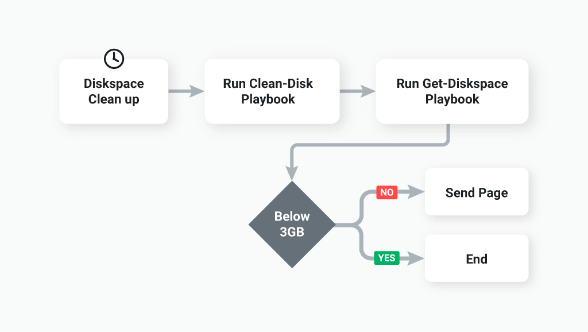

As an ops person, when you first start out with automation, you might find you have Git repositories scattered everywhere. Some of them might be extremely bloated, containing one-liners, scripts, functions, modules, and configuration files. And other repos might be stale with broken CI/CD pipelines that haven't been touched for months or years.

Repository design is often an afterthought, and for good reason. It can be hard to know how to structure something when you don't know exactly what you're building. It doesn't have to stay a mess, nor do you have to front-load years' worth of future work into a decision that can't be made today.

As a contributing member of many "hot mess" codebases, I'll share with you what's worked best for the teams I've been a member of when starting down the automation road and how to refactor a centralized repository. 

## Start simple and centralize your automation

```
|-- docs/
|   |-- failover-database.md
|   |-- sre-local-setup.md
|-- scripts/
|   |-- windows/
|   |-- linux/
|   |-- load-balancer/
|   |-- networking/
|-- ansible/
|   |-- group_vars/
|   |-- roles/
|   |-- site.yml
|   |-- windows-patching.yml
|   |-- inventory.yml
|-- terraform/
|   |-- main.tf
|   |-- provider.tf
|   |-- variables.tf
|   |-- outputs.tf
```

Initially, creating a single central repository can be the best way to start. This is roughly the equivalent to a monolithic application, where everything is tightly coupled. Ad-hoc scripts, orchestrated automation, and infrastructure as code documents all live in the same repository. Name the repository after your team and let it become the source of truth for all the code developed by your team.

Keep the repository layout simple. Create general purpose directories to separate the different types of automation within the repository. For example, create a scripts directory for ad-hoc scripts, another for Terraform configuration files, and so on. Add additional directories for automation that defines a process like patching. At this stage, don't put too much thought into the structure and naming of directories. Your primary goal right now is to make it as simple and easy to use as possible.

A centralized design works best when the execution of the code is still manual, for instance, Infrastructure as Code configurations, scripts, and orchestrated automation are all pulled down and run from the command line.

Comparing a centralized repository design to a monolithic app might make you think you shouldn't use it. But it's an excellent place to start if your team or organization is new to automation or infrastructure as code in general. It's something you'll grow out of eventually, but I've found it's far better than jumping ahead to a more mature design which will add complexity, confusion, and reduce your rate of adoption.

Having everything in one place keeps things simple. It's clear how to organize files and where you should commit your code. It's easy to track changes, and there is a single CI/CD pipeline to troubleshoot.

## When is it time to refactor a repository?

Friction is the best way to identify constraints, and over time your centralized repository’s codebase will start to get burdensome. This happens as you shift to automating the execution of tasks and stop running everything by hand. That’s when a centralized repository starts to make things complicated.

The most significant disadvantage of a centralized repository is the number of workflows it contains. There is a lot of [toil](https://cloud.google.com/blog/products/management-tools/identifying-and-tracking-toil-using-sre-principles) to automate, and not all of them run at the same time.

For example, say you have a script used to generate an audit report, a PowerShell module that is used to complete a failover, and Terraform code to build the infrastructure all in a single repo. It’s not the single repo that’s the bottleneck, but the workflows. Each of these three different code bases will change and evolve at different times.

It’s at that point, that the latest version of the entire codebase becomes problematic. If a change to the audit script snuck in some Terraform changes, bad things could happen. As a result, development slows, and that is exactly when you need to reevaluate your repository design.

In short, there are two indicators that it’s time to redesign: 
* Development has slowed.
* Risk increases by removing the manual execution of the code. 

One solution is to create a repository for every individual workflow, and while that’s an easy solution, it’s not the best one.

## How to split up a repository?

Everything and everyone gets a repository! Is normally the first instinct when a centralized repository becomes problematic. However, that comes with its own set of challenges. Instead, I recommend you follow the _change_.

Automation is written to make a change, report a change, or to test a change. When it comes time to refactor your repository start by mapping those changes through the system. Using that data will inform your decision.

[Value stream mapping](https://www.atlassian.com/continuous-delivery/principles/value-stream-mapping) is a technique used to analyze the flow of information, people, and materials required to bring a result to a customer. Normally in the form of a product or service. It's a concept that originated in Lean manufacturing methodologies but is also prevalent in DevOps literature.

This analysis can be as complicated as you make it, but keep it simple and stick to identifying the steps in the process rather than the waste and efficiencies. Your goal is to visualize the current process instead of optimizing it.



For each different process in your central repository, go through this workflow exercise. For example, say there is an operating system patching process you’ve automated. The code lives within the central repository and runs every month. You also have your infrastructure as code configuration within the same repository, but that is run on-demand without a schedule. Each of those processes has a different workflow and are good candidates to be separated out into their own repositories.

Creating more repositories is helpful, but it also creates more complexity. There are tradeoffs, and you need to strike the right balance. Moving code to another repository for the sake of organizing it isn’t going to motivate anyone. However, if moving code means a task can be fully automated and someone doesn’t have to wake up at 3:00 am to patch servers. Then it’s overwhelmingly worth it.

Use a simple workflow tool such as [draw.io](https://draw.io) to draft the workflows. Share the workflows with your team to get feedback. After you’ve mapped the process, start to move all the code required for that process to a different repository. Again, only decouple the code if it adds value.

## Conclusion

Starting simple is the best way to begin your automation journey. Avoid over-engineering by using a centralized repository that holds all your automation processes. Refactor as soon as development slows down and friction increases. Use value stream mapping to identify the workflows that exist within your central repository. Decouple the code with the highest return on investment (ROI) to your team and add the most value.
