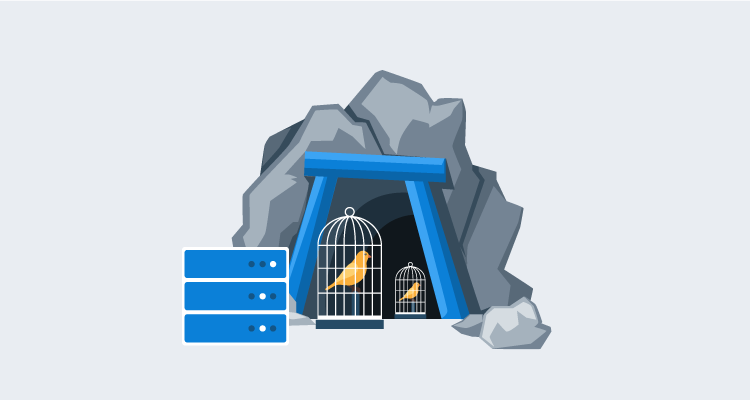
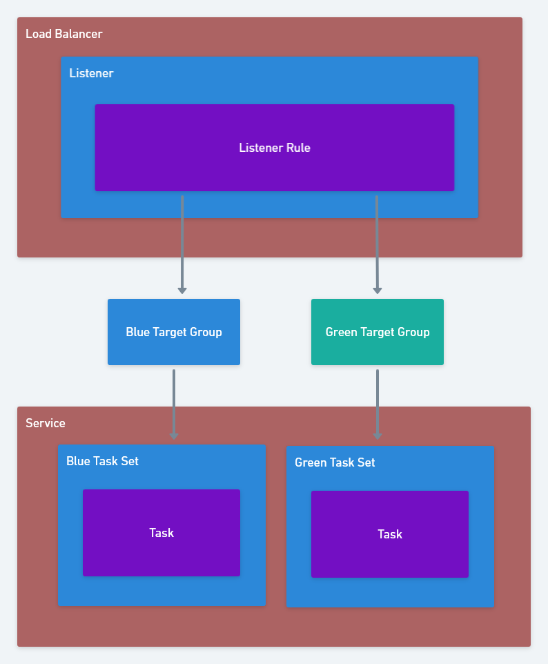
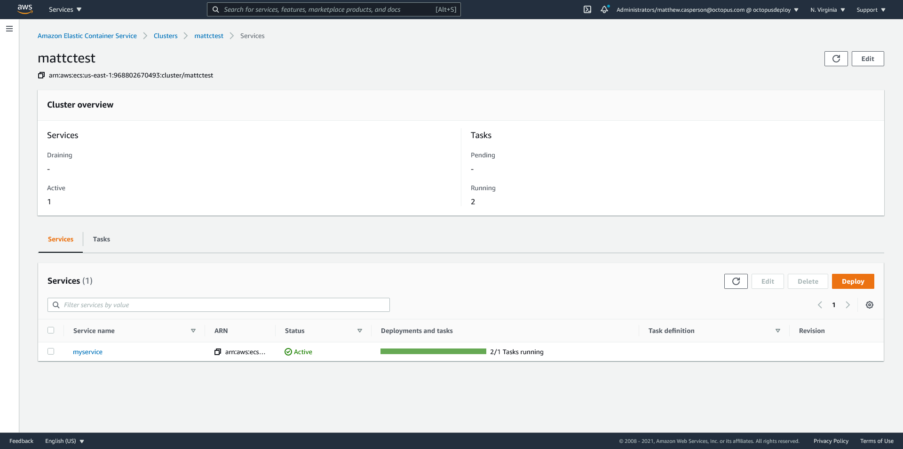
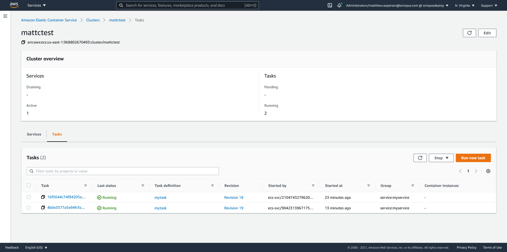
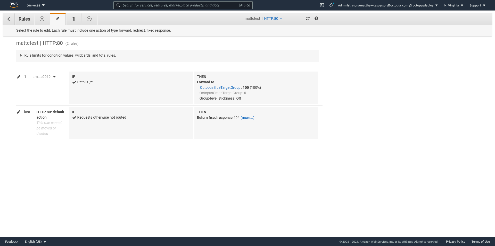
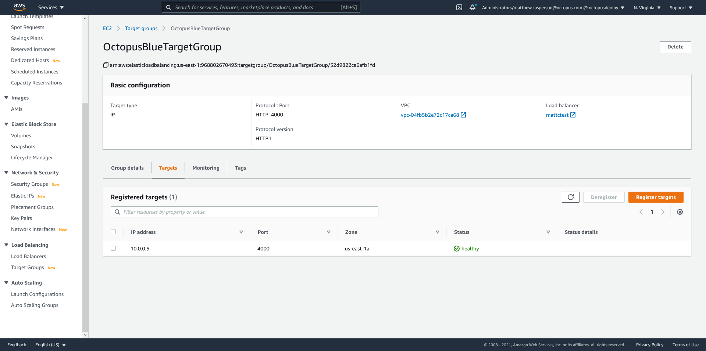
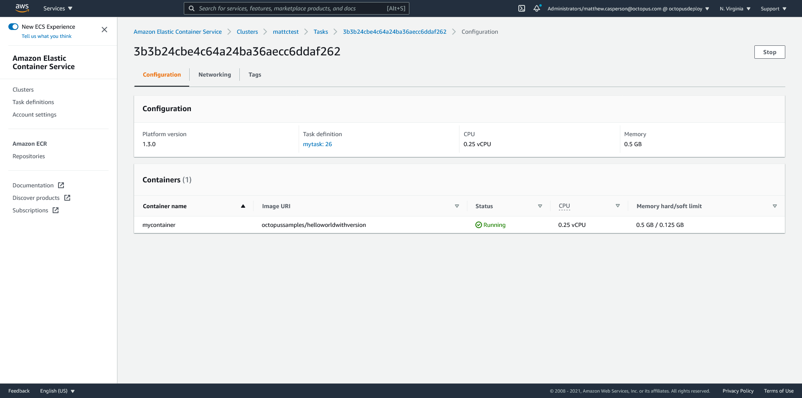
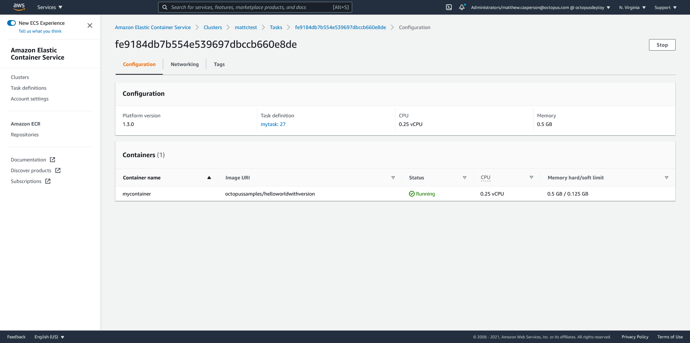
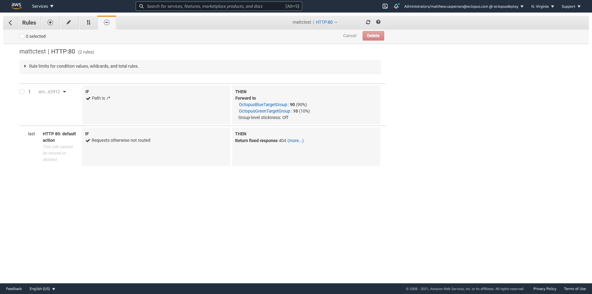
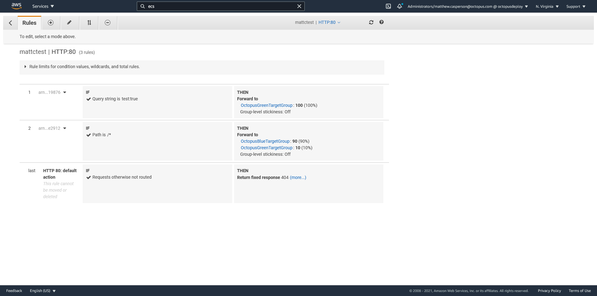

Canary deployments are a popular pattern that allows you to progressively roll out a new version of your application to an increasing number of end users. By watching for errors or undesirable effects from the new version during the rollout, it is possible to catch and revert production errors before they impact the majority of your users.

ECS has native support for [rolling updates](https://docs.aws.amazon.com/AmazonECS/latest/developerguide/deployment-type-ecs.html), where tasks in a service are progressively, but automatically, updated with a new version of the application. By integrating with CodeDeploy, it is possible to perform what ECS refers to as a [Blue/Green deployment](https://docs.aws.amazon.com/AmazonECS/latest/developerguide/deployment-type-bluegreen.html), although this deployment option can be configured to perform Canary deployments that shifts the traffic to the new version. You can even [create your own deployment strategy](https://docs.aws.amazon.com/cli/latest/reference/deploy/create-deployment-config.html), but you are limited to a time based canary rule, which is:

> A configuration that shifts traffic from one version of a Lambda function or ECS task set to another in two increments.

Or a time based linear rule, which is:

> A configuration that shifts traffic from one version of a Lambda function or ECS task set to another in equal increments, with an equal number of minutes between each increment.

There are times though, when the decision to shift more traffic to the canary deployment is not something you can easily determine over a fixed period of time. For example, you may need a person to make the decision to move forward with a canary deployment based on a range of inputs like support requests, errors in logs, or resource usage. This kind of manual intervention in the deployment requires more flexibility than the Blue/Green strategy exposed by ECS.

Fortunately, [ECS can defer the decision to progress a deployment to an external system](https://docs.aws.amazon.com/AmazonECS/latest/developerguide/deployment-type-external.html). It requires some work to set up, but is incredibly flexible.

In this blog post, we'll look at how to manage an ECS canary deployment with CloudFormation.

## ECS CloudFormation resources

Our ECS deployment will be created and managed via CloudFormation, and will make use of the following resources:

* [`AWS::ECS::TaskDefinition`](https://docs.aws.amazon.com/AWSCloudFormation/latest/UserGuide/aws-resource-ecs-taskdefinition.html): Task definitions configure the containers to be executed by ECS.
* [`AWS::ECS::Service`](https://docs.aws.amazon.com/AWSCloudFormation/latest/UserGuide/aws-resource-ecs-service.html): A service keeps one or more instances of a task definition (or many task definitions, when using task sets) running in the ECS cluster.
* [`AWS::ECS::TaskSet`](https://docs.aws.amazon.com/AWSCloudFormation/latest/UserGuide/aws-resource-ecs-taskset.html): A service can contain many task sets, with each task set configured with its own task definition. Multiple task sets allow a single service to manage tasks created from multiple task definitions.
* [`AWS::ElasticLoadBalancingV2::Listener`](https://docs.aws.amazon.com/AWSCloudFormation/latest/UserGuide/aws-resource-elasticloadbalancingv2-listener.html): A listener defines the port and protocol that it will receive load balancer traffic on.
* [`AWS::ElasticLoadBalancingV2::ListenerRule`](https://docs.aws.amazon.com/AWSCloudFormation/latest/UserGuide/aws-resource-elasticloadbalancingv2-listenerrule.html): A listener rule defines the high level rules, such as path, query string, header matching etc, that must be satisfied to deliver traffic to a target group.
* [`AWS::ElasticLoadBalancingV2::TargetGroup`](https://docs.aws.amazon.com/AWSCloudFormation/latest/UserGuide/aws-resource-elasticloadbalancingv2-targetgroup.html): A target group binds downstream services, like ECS tasks, to a load balancer listener rule.

The resulting architecture looks like this:



## The sample application

To demonstrate a canary deployment, we'll use the Docker image created from the code at https://github.com/OctopusSamples/DockerHelloWorldWithVersion. This is a simple "hello world" Node.js application that also prints the value of the `APPVERSION` environment variable in response to an HTTP request.

## The `AWS::ECS::TaskDefinition` resource

The task definition configures the sample application to listen to traffic on port 4000. It also defines an environment variable called `APPVERSION`, which will be displayed in the response.

We'll update the `APPVERSION` environment variable as a way of simulating new application versions deployments later in the post.

Here is the first task definition. Note the `UpdateReplacePolicy` property is set to `Retain`. This means CloudFormation will create a new task definition, but not delete (or, more technically, mark as inactive) any previously deployed task definition:

```json
    "MyTask": {
      "Type": "AWS::ECS::TaskDefinition",
      "UpdateReplacePolicy": "Retain",
      "Properties": {
        "ContainerDefinitions": [
          {
            "Cpu": 256,
            "Image": "octopussamples/helloworldwithversion",
            "Memory": 512,
            "MemoryReservation": 128,
            "Name": "mycontainer",
            "Environment": [
              {
                "Name": "APPVERSION",
                "Value": "1.0.0"
              }
            ],
            "PortMappings": [
              {
                "ContainerPort": 4000,
                "HostPort": 4000,
                "Protocol": "tcp"
              }
            ]
          }
        ],
        "Cpu": "256",
        "Family": "mytask",
        "Memory": "512",
        "RequiresCompatibilities": [
          "FARGATE"
        ],
        "NetworkMode": "awsvpc"
      }
    }
```

## The `AWS::ElasticLoadBalancingV2::TargetGroup` resources

Target groups define the downstream services that respond to a network request. We don't define any services here as ECS itself will place tasks into target groups as they are created and remove tasks as they are destroyed.

The two target groups below will hold the blue (or existing deployment) tasks, and the green (or new deployment) tasks:

```json
    "GreenTargetGroup": {
      "Type": "AWS::ElasticLoadBalancingV2::TargetGroup",
      "Properties": {
        "HealthCheckEnabled": true,
        "HealthCheckIntervalSeconds": 5,
        "HealthCheckPath": "/",
        "HealthCheckPort": "4000",
        "HealthCheckProtocol": "HTTP",
        "HealthCheckTimeoutSeconds": 2,
        "HealthyThresholdCount": 2,
        "Matcher": {
          "HttpCode": "200"
        },
        "Name": "OctopusGreenTargetGroup",
        "Port": 4000,
        "Protocol": "HTTP",
        "TargetType": "ip",
        "UnhealthyThresholdCount": 5,
        "VpcId": "vpc-04fb5b2e72c17ca68"
      }
    }
```

```json
    "BlueTargetGroup": {
      "Type": "AWS::ElasticLoadBalancingV2::TargetGroup",
      "Properties": {
        "HealthCheckEnabled": true,
        "HealthCheckIntervalSeconds": 5,
        "HealthCheckPath": "/",
        "HealthCheckPort": "4000",
        "HealthCheckProtocol": "HTTP",
        "HealthCheckTimeoutSeconds": 2,
        "HealthyThresholdCount": 2,
        "Matcher": {
          "HttpCode": "200"
        },
        "Name": "OctopusBlueTargetGroup",
        "Port": 4000,
        "Protocol": "HTTP",
        "TargetType": "ip",
        "UnhealthyThresholdCount": 5,
        "VpcId": "vpc-04fb5b2e72c17ca68"
      }
    }
```

## The `AWS::ECS::TaskSet` resources

With a standard rolling deployment, an ECS service would reference only one task definition, and the service resource would define all the associated settings like networking and task counts. 

Task sets provide a more flexible method of defining task definitions in a service. When task sets are used, [the service resource defines very few settings](https://docs.aws.amazon.com/AmazonECS/latest/developerguide/deployment-type-external.html#deployment-type-external-workflow) and exists mostly as a parent resource for its child task sets.

In this example, each task set points to the same task definition. This means for the initial deployment, the blue and green half of the stacks will be the same. Later in the post, we'll look at how this template is updated with a new task definition for the green stack to perform a canary or blue/green deployment:

```json
    "GreenTaskSet": {
      "Type": "AWS::ECS::TaskSet",
      "Properties": {
        "Cluster": "arn:aws:ecs:us-east-1:968802670493:cluster/mattctest",
        "ExternalId": "OctopusGreenStack",
        "LaunchType": "FARGATE",
        "NetworkConfiguration": {
          "AwsvpcConfiguration": {
            "AssignPublicIp": "ENABLED",
            "SecurityGroups": [
              "sg-043789abf52c12d9a"
            ],
            "Subnets": [
              "subnet-0af41f8e0404d7b23",
              "subnet-0c2515119bdf77d4c",
              "subnet-09d1a3362fac596a9"
            ]
          }
        },
        "LoadBalancers": [
          {
            "ContainerName": "mycontainer",
            "ContainerPort": 4000,
            "TargetGroupArn": {
              "Ref": "GreenTargetGroup"
            }
          }
        ],
        "Scale": {
          "Unit": "PERCENT",
          "Value": 100
        },
        "Service": "myservice",
        "TaskDefinition": {"Ref": "MyTask10d4f29d4aa0474dbd4b0435922cd032"}
      },
      "DependsOn": [
        "MyService",
        "GreenTargetGroup"
      ]
    }
```

```json
    "BlueTaskSet": {
      "Type": "AWS::ECS::TaskSet",
      "Properties": {
        "Cluster": "arn:aws:ecs:us-east-1:968802670493:cluster/mattctest",
        "ExternalId": "OctopusBlueStack",
        "LaunchType": "FARGATE",
        "NetworkConfiguration": {
          "AwsvpcConfiguration": {
            "AssignPublicIp": "ENABLED",
            "SecurityGroups": [
              "sg-043789abf52c12d9a"
            ],
            "Subnets": [
              "subnet-0af41f8e0404d7b23",
              "subnet-0c2515119bdf77d4c",
              "subnet-09d1a3362fac596a9"
            ]
          }
        },
        "LoadBalancers": [
          {
            "ContainerName": "mycontainer",
            "ContainerPort": 4000,
            "TargetGroupArn": {
              "Ref": "BlueTargetGroup"
            }
          }
        ],
        "Scale": {
          "Unit": "PERCENT",
          "Value": 100
        },
        "Service": "myservice",
        "TaskDefinition": {"Ref": "MyTask10d4f29d4aa0474dbd4b0435922cd032"}
      },
      "DependsOn": [
        "MyService",
        "BlueTargetGroup"
      ]
    }
```

## The `AWS::ECS::Service` resource

The service will ensure the desired number of tasks are run, and that they continue to run. Typically, we would configure the service to reference a task definition directly, but in our case we will use the task sets above to link a service to a task definition. This means our service is quite sparse.

We do add a tag to the service to indicate the stack that holds the previous stable deployment. When deploying this template, we always consider the blue stack to be previous stable deployment, and the green stack to be the new deployment. However, the cut over from blue to green will involve updating this tag to indicate that the green stack passed testing and is the new stable stack:

```json
    "MyService": {
      "Type": "AWS::ECS::Service",
      "Properties": {
        "Cluster": "arn:aws:ecs:us-east-1:968802670493:cluster/mattctest",
        "ServiceName": "myservice",
        "DeploymentController": {
          "Type": "EXTERNAL"
        },
        "Tags": [
          {
            "Key": "StableStack",
            "Value": "Blue"
          }
        ]
      }
    }
```

## The `AWS::ElasticLoadBalancingV2::Listener` resource

Listeners are attached to load balancers, and define the protocol and port rules used to direct traffic to a target group. The listener below is configured to receive HTTP traffic on port 80, and has a default rule to respond with an HTTP 404 status code if no other custom rule matches the incoming request.

Note here that we have hard coded the ARN of an existing [ALB](https://docs.aws.amazon.com/elasticloadbalancing/latest/application/introduction.html) or [NLB](https://docs.aws.amazon.com/elasticloadbalancing/latest/network/introduction.html). The requirement here is that the existing load balancer does not already have a listener configured to use port 80:

```json
    "MyListener": {
      "Type": "AWS::ElasticLoadBalancingV2::Listener",
      "Properties": {
        "DefaultActions": [
          {
            "FixedResponseConfig": {
              "StatusCode": "404"
            },
            "Order": 1,
            "Type": "fixed-response"
          }
        ],
        "LoadBalancerArn": "arn:aws:elasticloadbalancing:us-east-1:968802670493:loadbalancer/app/mattctest/3a1496378bd20439",
        "Port": 80,
        "Protocol": "HTTP"
      }
    }
```

## The `AWS::ElasticLoadBalancingV2::ListenerRule` resource

A listener rule is attached to a listener and provides fine grained-control over how an incoming request is matched, and how the request is forwarded to a target group. The listener rule below matches all request paths (essentially matching all requests) and splits traffic between the blue and green target groups.

Modifying the weights assigned to the blue and green target groups is how we achieve a blue/green or canary deployment. A hard cut over from the blue to the green stack achieves a traditional blue/green deployment, while gradually increasing the traffic to the green stack achieves a canary deployment:

```json
    "MyListenerRule": {
      "Type": "AWS::ElasticLoadBalancingV2::ListenerRule",
      "Properties": {
        "Actions": [
          {
            "ForwardConfig": {
              "TargetGroups": [
                {
                  "TargetGroupArn": {
                    "Ref": "GreenTargetGroup"
                  },
                  "Weight": 0
                },
                {
                  "TargetGroupArn": {
                    "Ref": "BlueTargetGroup"
                  },
                  "Weight": 100
                }
              ]
            },
            "Order": 1,
            "Type": "forward"
          }
        ],
        "Conditions": [
          {
            "Field": "path-pattern",
            "PathPatternConfig": {
              "Values": [
                "/*"
              ]
            }
          }
        ],
        "ListenerArn": {
          "Ref": "MyListener"
        },
        "Priority": 10
      },
      "DependsOn": [
        "MyListener",
        "GreenTargetGroup",
        "BlueTargetGroup"
      ]
    }
```

## The complete template

Here is the complete CloudFormation template:

```json
{
  "Resources": {
    "MyTask": {
      "Type": "AWS::ECS::TaskDefinition",
      "UpdateReplacePolicy": "Retain",
      "Properties": {
        "ContainerDefinitions": [
          {
            "Cpu": 256,
            "Image": "octopussamples/helloworldwithversion",
            "Memory": 512,
            "MemoryReservation": 128,
            "Name": "mycontainer",
            "Environment": [
              {
                "Name": "APPVERSION",
                "Value": "1.0.0"
              }
            ],
            "PortMappings": [
              {
                "ContainerPort": 4000,
                "HostPort": 4000,
                "Protocol": "tcp"
              }
            ]
          }
        ],
        "Cpu": "256",
        "Family": "mytask",
        "Memory": "512",
        "RequiresCompatibilities": [
          "FARGATE"
        ],
        "NetworkMode": "awsvpc"
      }
    },   
    "GreenTargetGroup": {
      "Type": "AWS::ElasticLoadBalancingV2::TargetGroup",
      "Properties": {
        "HealthCheckEnabled": true,
        "HealthCheckIntervalSeconds": 5,
        "HealthCheckPath": "/",
        "HealthCheckPort": "4000",
        "HealthCheckProtocol": "HTTP",
        "HealthCheckTimeoutSeconds": 2,
        "HealthyThresholdCount": 2,
        "Matcher": {
          "HttpCode": "200"
        },
        "Name": "OctopusGreenTargetGroup",
        "Port": 4000,
        "Protocol": "HTTP",
        "TargetType": "ip",
        "UnhealthyThresholdCount": 5,
        "VpcId": "vpc-04fb5b2e72c17ca68"
      }
    },
    "BlueTargetGroup": {
      "Type": "AWS::ElasticLoadBalancingV2::TargetGroup",
      "Properties": {
        "HealthCheckEnabled": true,
        "HealthCheckIntervalSeconds": 5,
        "HealthCheckPath": "/",
        "HealthCheckPort": "4000",
        "HealthCheckProtocol": "HTTP",
        "HealthCheckTimeoutSeconds": 2,
        "HealthyThresholdCount": 2,
        "Matcher": {
          "HttpCode": "200"
        },
        "Name": "OctopusBlueTargetGroup",
        "Port": 4000,
        "Protocol": "HTTP",
        "TargetType": "ip",
        "UnhealthyThresholdCount": 5,
        "VpcId": "vpc-04fb5b2e72c17ca68"
      }
    },
    "GreenTaskSet": {
      "Type": "AWS::ECS::TaskSet",
      "Properties": {
        "Cluster": "arn:aws:ecs:us-east-1:968802670493:cluster/mattctest",
        "ExternalId": "OctopusGreenStack",
        "LaunchType": "FARGATE",
        "NetworkConfiguration": {
          "AwsvpcConfiguration": {
            "AssignPublicIp": "ENABLED",
            "SecurityGroups": [
              "sg-043789abf52c12d9a"
            ],
            "Subnets": [
              "subnet-0af41f8e0404d7b23",
              "subnet-0c2515119bdf77d4c",
              "subnet-09d1a3362fac596a9"
            ]
          }
        },
        "LoadBalancers": [
          {
            "ContainerName": "mycontainer",
            "ContainerPort": 4000,
            "TargetGroupArn": {
              "Ref": "GreenTargetGroup"
            }
          }
        ],
        "Scale": {
          "Unit": "PERCENT",
          "Value": 100
        },
        "Service": "myservice",
        "TaskDefinition": {"Ref": "MyTask"}
      },
      "DependsOn": [
        "MyService",
        "GreenTargetGroup"
      ]
    },
    "BlueTaskSet": {
      "Type": "AWS::ECS::TaskSet",
      "Properties": {
        "Cluster": "arn:aws:ecs:us-east-1:968802670493:cluster/mattctest",
        "ExternalId": "OctopusBlueStack",
        "LaunchType": "FARGATE",
        "NetworkConfiguration": {
          "AwsvpcConfiguration": {
            "AssignPublicIp": "ENABLED",
            "SecurityGroups": [
              "sg-043789abf52c12d9a"
            ],
            "Subnets": [
              "subnet-0af41f8e0404d7b23",
              "subnet-0c2515119bdf77d4c",
              "subnet-09d1a3362fac596a9"
            ]
          }
        },
        "LoadBalancers": [
          {
            "ContainerName": "mycontainer",
            "ContainerPort": 4000,
            "TargetGroupArn": {
              "Ref": "BlueTargetGroup"
            }
          }
        ],
        "Scale": {
          "Unit": "PERCENT",
          "Value": 100
        },
        "Service": "myservice",
        "TaskDefinition": {"Ref": "MyTask"}
      },
      "DependsOn": [
        "MyService",
        "BlueTargetGroup"
      ]
    },
    "MyService": {
      "Type": "AWS::ECS::Service",
      "Properties": {
        "Cluster": "arn:aws:ecs:us-east-1:968802670493:cluster/mattctest",
        "ServiceName": "myservice",
        "DeploymentController": {
          "Type": "EXTERNAL"
        },
        "Tags": [
          {
            "Key": "StableStack",
            "Value": "Blue"
          }
        ]
      }
    },
    "MyListener": {
      "Type": "AWS::ElasticLoadBalancingV2::Listener",
      "Properties": {
        "DefaultActions": [
          {
            "FixedResponseConfig": {
              "StatusCode": "404"
            },
            "Order": 1,
            "Type": "fixed-response"
          }
        ],
        "LoadBalancerArn": "arn:aws:elasticloadbalancing:us-east-1:968802670493:loadbalancer/app/mattctest/3a1496378bd20439",
        "Port": 80,
        "Protocol": "HTTP"
      }
    },
    "MyListenerRule": {
      "Type": "AWS::ElasticLoadBalancingV2::ListenerRule",
      "Properties": {
        "Actions": [
          {
            "ForwardConfig": {
              "TargetGroups": [
                {
                  "TargetGroupArn": {
                    "Ref": "GreenTargetGroup"
                  },
                  "Weight": 0
                },
                {
                  "TargetGroupArn": {
                    "Ref": "BlueTargetGroup"
                  },
                  "Weight": 100
                }
              ]
            },
            "Order": 1,
            "Type": "forward"
          }
        ],
        "Conditions": [
          {
            "Field": "path-pattern",
            "PathPatternConfig": {
              "Values": [
                "/*"
              ]
            }
          }
        ],
        "ListenerArn": {
          "Ref": "MyListener"
        },
        "Priority": 10
      },
      "DependsOn": [
        "MyListener",
        "GreenTargetGroup",
        "BlueTargetGroup"
      ]
    }
  },
  "Outputs": {
    "BlueTaskSet": {
      "Description": "The blue service task set",
      "Value": {"Fn::GetAtt": ["BlueTaskSet", "Id"]}
    },
    "GreenTaskSet": {
      "Description": "The green service task set",
      "Value": {"Fn::GetAtt": ["GreenTaskSet", "Id"]}
    },
    "BlueTargetGroup": {
      "Description": "The blue target group",
      "Value": {"Ref": "BlueTargetGroup"}
    },
    "GreenTargetGroup": {
      "Description": "The green target group",
      "Value": {"Ref": "GreenTargetGroup"}
    }
  }
}
```

Deploying this stack results in a new service in ECS. 

The report of **2/1 Tasks running** might seem a little odd, but this value is the result of having two task sets each configured to run 100% of their parent service's desired task count, which is 1. This means we have two task sets, each running one task, resulting in two tasks running for the one desired task defined in the service:



The two tasks are those configured in the blue and green task sets. Note that task sets are not displayed in the console, and we have to infer the task set a task belongs to:



Our load balancer listener has been configured to direct traffic to the two target groups:



The target groups have had the tasks added to them by ECS:



As this was our first deployment, the task sets both point to the same task definition, and there is nothing to switch between as part of a blue/green or canary deployment.

We will assume at this point that this initial deployment is complete. This means that the blue stack represents the currently deployed and publicly available version of the application receiving 100% of the traffic, and that the green stack is unused.

## Deploying a new version to the green task set

If you recall from earlier, we added a tag to the service to indicate which stack, blue or green, was the stable stack. We now want to find the details of the stable stack and copy them back into the blue stack as we start a new deployment.

We know this tag is currently set to **Blue** because that's what we set it to, and nothing has changed it. However, we still want to run through the process of extracting the tag value in a repeatable way because the next deployment can't assume the tag has a known value.

The command below will extract the value of the tag:

```bash
STACK=`aws ecs list-tags-for-resource --resource-arn arn:aws:ecs:us-east-1:968802670493:service/mattctest/myservice | jq -r '.tags[] | select(.key == "StableStack") | .value'`
```

We can then get the task set ID of the active stack from the CloudFormation template output with the command:

```bash
TASKSET=`aws cloudformation describe-stacks --stack-name ecs-task-test-2 --query "Stacks[0].Outputs[?OutputKey=='${STACK}TaskSet'].OutputValue" --output text`
```

Finally, we can inspect the state of the stable task set with the command:

```bash
aws ecs describe-task-sets --cluster "arn:aws:ecs:us-east-1:968802670493:cluster/mattctest" --service myservice --task-sets "${TASKSET}"
```

This will return the configuration of the blue task set. This task set defines the state of the stable task set:

```json
{
    "taskSets": [
        {
            "id": "ecs-svc/8260773081660460393",
            "taskSetArn": "arn:aws:ecs:us-east-1:968802670493:task-set/mattctest/myservice/ecs-svc/8260773081660460393",
            "serviceArn": "arn:aws:ecs:us-east-1:968802670493:service/myservice",
            "clusterArn": "arn:aws:ecs:us-east-1:968802670493:cluster/mattctest",
            "externalId": "OctopusBlueStack",
            "status": "ACTIVE",
            "taskDefinition": "arn:aws:ecs:us-east-1:968802670493:task-definition/mytask:26",
            "computedDesiredCount": 1,
            "pendingCount": 0,
            "runningCount": 1,
            "createdAt": 1611869109.157,
            "updatedAt": 1611869219.178,
            "launchType": "FARGATE",
            "platformVersion": "1.3.0",
            "networkConfiguration": {
                "awsvpcConfiguration": {
                    "subnets": [
                        "subnet-0af41f8e0404d7b23",
                        "subnet-0c2515119bdf77d4c",
                        "subnet-09d1a3362fac596a9"
                    ],
                    "securityGroups": [
                        "sg-043789abf52c12d9a"
                    ],
                    "assignPublicIp": "ENABLED"
                }
            },
            "loadBalancers": [
                {
                    "targetGroupArn": "arn:aws:elasticloadbalancing:us-east-1:968802670493:targetgroup/OctopusBlueTargetGroup/52d9822ce6afb1fd",
                    "containerName": "mycontainer",
                    "containerPort": 4000
                }
            ],
            "serviceRegistries": [],
            "scale": {
                "value": 100.0,
                "unit": "PERCENT"
            },
            "stabilityStatus": "STEADY_STATE",
            "stabilityStatusAt": 1611869219.178,
            "tags": []
        }
    ],
    "failures": []
}
```

To perform the second deployment, we need to copy out any relevant values from the state of the stable task set into the blue task set resource defined in our own CloudFormation template. In particular, we want to retain the task definition that the task set is currently configured with.

It would also be worth considering if other details, like the container name or port, need to be updated. However, in our case we know the only property we need to copy is the `TaskDefinition`.

Copying the state of the stable task set into our new blue task set resets our deployment to the canonical blue/green state, where blue is the stable deployment, and green is the new deployment.

Below we update the `TaskDefinition` property to reference the fixed task definition version:

```json
    "BlueTaskSet": {
      "Type": "AWS::ECS::TaskSet",
      "Properties": {
        "Cluster": "arn:aws:ecs:us-east-1:968802670493:cluster/mattctest",
        "ExternalId": "OctopusBlueStack",
        "LaunchType": "FARGATE",
        "NetworkConfiguration": {
          "AwsvpcConfiguration": {
            "AssignPublicIp": "ENABLED",
            "SecurityGroups": [
              "sg-043789abf52c12d9a"
            ],
            "Subnets": [
              "subnet-0af41f8e0404d7b23",
              "subnet-0c2515119bdf77d4c",
              "subnet-09d1a3362fac596a9"
            ]
          }
        },
        "LoadBalancers": [
          {
            "ContainerName": "mycontainer",
            "ContainerPort": 4000,
            "TargetGroupArn": {
              "Ref": "BlueTargetGroup"
            }
          }
        ],
        "Scale": {
          "Unit": "PERCENT",
          "Value": 100
        },
        "Service": "myservice",
        "TaskDefinition": "arn:aws:ecs:us-east-1:968802670493:task-definition/mytask:26"
      },
      "DependsOn": [
        "MyService",
        "BlueTargetGroup"
      ]
    }
```

So far all we have done is recreated the blue task set with a fixed `TaskDefinition`. This may seem redundant, but the process of finding the stable task set and configuring the new blue stack based on its values will allow us to cycle back and forth between the blue and green stacks as we perform (and possibly fail) blue/green or canary deployments.

Let's now configure a new version of our task definition. We'll demonstrate this new version by updating the `APPVERSION` environment variable:

```json
  "MyTask": {
      "Type": "AWS::ECS::TaskDefinition",
      "UpdateReplacePolicy": "Retain",
      "Properties": {
        "ContainerDefinitions": [
          {
            "Cpu": 256,
            "Image": "octopussamples/helloworldwithversion",
            "Memory": 512,
            "MemoryReservation": 128,
            "Name": "mycontainer",
            "Environment": [
              {
                "Name": "APPVERSION",
                "Value": "1.0.1"
              }
            ],
            "PortMappings": [
              {
                "ContainerPort": 4000,
                "HostPort": 4000,
                "Protocol": "tcp"
              }
            ]
          }
        ],
        "Cpu": "256",
        "Family": "mytask",
        "Memory": "512",
        "RequiresCompatibilities": [
          "FARGATE"
        ],
        "NetworkMode": "awsvpc"
      }
    }
```

This new task definition is configured in the green task set. Here is the complete template for the new deployment:

```json
{
  "Resources": {
    "MyTask": {
      "Type": "AWS::ECS::TaskDefinition",
      "UpdateReplacePolicy": "Retain",
      "Properties": {
        "ContainerDefinitions": [
          {
            "Cpu": 256,
            "Image": "octopussamples/helloworldwithversion",
            "Memory": 512,
            "MemoryReservation": 128,
            "Name": "mycontainer",
            "Environment": [
              {
                "Name": "APPVERSION",
                "Value": "1.0.1"
              }
            ],
            "PortMappings": [
              {
                "ContainerPort": 4000,
                "HostPort": 4000,
                "Protocol": "tcp"
              }
            ]
          }
        ],
        "Cpu": "256",
        "Family": "mytask",
        "Memory": "512",
        "RequiresCompatibilities": [
          "FARGATE"
        ],
        "NetworkMode": "awsvpc"
      }
    },   
    "GreenTargetGroup": {
      "Type": "AWS::ElasticLoadBalancingV2::TargetGroup",
      "Properties": {
        "HealthCheckEnabled": true,
        "HealthCheckIntervalSeconds": 5,
        "HealthCheckPath": "/",
        "HealthCheckPort": "4000",
        "HealthCheckProtocol": "HTTP",
        "HealthCheckTimeoutSeconds": 2,
        "HealthyThresholdCount": 2,
        "Matcher": {
          "HttpCode": "200"
        },
        "Name": "OctopusGreenTargetGroup",
        "Port": 4000,
        "Protocol": "HTTP",
        "TargetType": "ip",
        "UnhealthyThresholdCount": 5,
        "VpcId": "vpc-04fb5b2e72c17ca68"
      }
    },
    "BlueTargetGroup": {
      "Type": "AWS::ElasticLoadBalancingV2::TargetGroup",
      "Properties": {
        "HealthCheckEnabled": true,
        "HealthCheckIntervalSeconds": 5,
        "HealthCheckPath": "/",
        "HealthCheckPort": "4000",
        "HealthCheckProtocol": "HTTP",
        "HealthCheckTimeoutSeconds": 2,
        "HealthyThresholdCount": 2,
        "Matcher": {
          "HttpCode": "200"
        },
        "Name": "OctopusBlueTargetGroup",
        "Port": 4000,
        "Protocol": "HTTP",
        "TargetType": "ip",
        "UnhealthyThresholdCount": 5,
        "VpcId": "vpc-04fb5b2e72c17ca68"
      }
    },
    "GreenTaskSet": {
      "Type": "AWS::ECS::TaskSet",
      "Properties": {
        "Cluster": "arn:aws:ecs:us-east-1:968802670493:cluster/mattctest",
        "ExternalId": "OctopusGreenStack",
        "LaunchType": "FARGATE",
        "NetworkConfiguration": {
          "AwsvpcConfiguration": {
            "AssignPublicIp": "ENABLED",
            "SecurityGroups": [
              "sg-043789abf52c12d9a"
            ],
            "Subnets": [
              "subnet-0af41f8e0404d7b23",
              "subnet-0c2515119bdf77d4c",
              "subnet-09d1a3362fac596a9"
            ]
          }
        },
        "LoadBalancers": [
          {
            "ContainerName": "mycontainer",
            "ContainerPort": 4000,
            "TargetGroupArn": {
              "Ref": "GreenTargetGroup"
            }
          }
        ],
        "Scale": {
          "Unit": "PERCENT",
          "Value": 100
        },
        "Service": "myservice",
        "TaskDefinition": {"Ref": "MyTask"}
      },
      "DependsOn": [
        "MyService",
        "GreenTargetGroup"
      ]
    },
    "BlueTaskSet": {
      "Type": "AWS::ECS::TaskSet",
      "Properties": {
        "Cluster": "arn:aws:ecs:us-east-1:968802670493:cluster/mattctest",
        "ExternalId": "OctopusBlueStack",
        "LaunchType": "FARGATE",
        "NetworkConfiguration": {
          "AwsvpcConfiguration": {
            "AssignPublicIp": "ENABLED",
            "SecurityGroups": [
              "sg-043789abf52c12d9a"
            ],
            "Subnets": [
              "subnet-0af41f8e0404d7b23",
              "subnet-0c2515119bdf77d4c",
              "subnet-09d1a3362fac596a9"
            ]
          }
        },
        "LoadBalancers": [
          {
            "ContainerName": "mycontainer",
            "ContainerPort": 4000,
            "TargetGroupArn": {
              "Ref": "BlueTargetGroup"
            }
          }
        ],
        "Scale": {
          "Unit": "PERCENT",
          "Value": 100
        },
        "Service": "myservice",
        "TaskDefinition": "arn:aws:ecs:us-east-1:968802670493:task-definition/mytask:26"
      },
      "DependsOn": [
        "MyService",
        "BlueTargetGroup"
      ]
    },
    "MyService": {
      "Type": "AWS::ECS::Service",
      "Properties": {
        "Cluster": "arn:aws:ecs:us-east-1:968802670493:cluster/mattctest",
        "ServiceName": "myservice",
        "DeploymentController": {
          "Type": "EXTERNAL"
        },
        "Tags": [
          {
            "Key": "StableStack",
            "Value": "Blue"
          }
        ]
      }
    },
    "MyListener": {
      "Type": "AWS::ElasticLoadBalancingV2::Listener",
      "Properties": {
        "DefaultActions": [
          {
            "FixedResponseConfig": {
              "StatusCode": "404"
            },
            "Order": 1,
            "Type": "fixed-response"
          }
        ],
        "LoadBalancerArn": "arn:aws:elasticloadbalancing:us-east-1:968802670493:loadbalancer/app/mattctest/3a1496378bd20439",
        "Port": 80,
        "Protocol": "HTTP"
      }
    },
    "MyListenerRule": {
      "Type": "AWS::ElasticLoadBalancingV2::ListenerRule",
      "Properties": {
        "Actions": [
          {
            "ForwardConfig": {
              "TargetGroups": [
                {
                  "TargetGroupArn": {
                    "Ref": "GreenTargetGroup"
                  },
                  "Weight": 0
                },
                {
                  "TargetGroupArn": {
                    "Ref": "BlueTargetGroup"
                  },
                  "Weight": 100
                }
              ]
            },
            "Order": 1,
            "Type": "forward"
          }
        ],
        "Conditions": [
          {
            "Field": "path-pattern",
            "PathPatternConfig": {
              "Values": [
                "/*"
              ]
            }
          }
        ],
        "ListenerArn": {
          "Ref": "MyListener"
        },
        "Priority": 10
      },
      "DependsOn": [
        "MyListener",
        "GreenTargetGroup",
        "BlueTargetGroup"
      ]
    }
  },
  "Outputs": {
    "BlueTaskSet": {
      "Description": "The blue service task set",
      "Value": {"Fn::GetAtt": ["BlueTaskSet", "Id"]}
    },
    "GreenTaskSet": {
      "Description": "The green service task set",
      "Value": {"Fn::GetAtt": ["GreenTaskSet", "Id"]}
    },
    "BlueTargetGroup": {
      "Description": "The blue target group",
      "Value": {"Ref": "BlueTargetGroup"}
    },
    "GreenTargetGroup": {
      "Description": "The green target group",
      "Value": {"Ref": "GreenTargetGroup"}
    }
  }
}
```

After deploying this second template, we now have a service with tasks referencing two task definitions. The blue task set is pointing to the previous stable deployment, while the green task set is pointing to the new deployment:





End users still don't have access to the new deployment though, as the listener rule is directing 100% of traffic to the blue stable stack.

To progress our canary deployment towards the green stack we can run the following AWS CLI command, which will update the weights to direct 10% of traffic to the new deployment in the green stack:

```bash
aws elbv2 modify-rule \
  --rule-arn "arn:aws:elasticloadbalancing:us-east-1:968802670493:listener-rule/app/mattctest/3a1496378bd20439/b934cb81e0365dab/945df85599ee2912" \
  --actions '[{
    "Type": "forward",
    "Order": 10, 
    "ForwardConfig": {
      "TargetGroups": [
        { 
          "Weight": 90, 
          "TargetGroupArn": "arn:aws:elasticloadbalancing:us-east-1:968802670493:targetgroup/OctopusBlueTargetGroup/52d9822ce6afb1fd" 
        },
        { 
          "Weight": 10, 
          "TargetGroupArn": "arn:aws:elasticloadbalancing:us-east-1:968802670493:targetgroup/OctopusGreenTargetGroup/f52cb2839cc063d9" 
        }
      ]
    }
  }]'
```



With traffic split between the stable blue task set and the new green task set, we can now run whatever tests we need to validate the new deployment is working as expected. Unlike the blue/green deployment driven by CodeDeploy, there is no automatic progression from blue to green, and we are in complete control as to how much traffic is split between the stacks and when.

The weights can be incrementally updated to drive more traffic to the green stack, eventually reaching a point where the green stack is receiving 100% of the traffic. At this point the green stack represents the stable stack. We reflect this change in the tag assigned to the service with the command:

```bash
aws ecs tag-resource --resource-arn arn:aws:ecs:us-east-1:968802670493:service/mattctest/myservice --tags key=StableStack,value=Green
```

Had we found an error with the new green stack, we would simply return all traffic to the blue stack. The **StableStack** tag remains set to **Blue**, and we can run through the process again. As long as each time we create the CloudFormation template we recreate the new blue stack with the details of the old stable stack identified by the **StableStack** tag, it doesn't matter if the last deployment successfully transitioned all the way to the green stack, because the **StableStack** tag will point us to what is considered the last stable stack color.

At this point we can go back and run through the process again:

1. Find the value assigned to the **StableStack** tag.
2. Get the ID of the stable task set from the CloudFormation outputs.
3. Query the current state of the stable task set.
4. Update the CloudFormation template with a new task definition, and the blue task set configured to match the current stable task set.
5. Direct traffic from the blue target group to the green target group.
6. If all goes well, direct 100% of traffic to the green stack and set the **StableStack** tag to **Green**.
7. If problems were found, direct 100% of traffic to the blue stack, and leave the **StableStack** tag as **Blue**.
8. Go to step 1.

## Advanced testing of the green stack

If you look closely at the listener rule created to split traffic between the blue and green stacks, you will see that we have defined its priority at `10`. These priority numbers are somewhat like the command numbers in an old BASIC application where you always incremented in steps of 10 to give yourself room to add steps in-between at a later time.

In our example, it may be useful to direct a small amount of the main traffic to the green stack, but also allow the green stack to be accessed with a URL that only testers are aware of. For example, you might add a rule that directed traffic to the green stack only when a special query string is supplied.

The command below creates a new rule to direct traffic to the green stack if the query string **test** is supplied with the value of **true**:

```bash
aws elbv2 create-rule \
  --listener-arn "arn:aws:elasticloadbalancing:us-east-1:968802670493:listener/app/mattctest/3a1496378bd20439/b934cb81e0365dab" \
  --priority 5 \
  --conditions '[{
    "Field": "query-string",
    "QueryStringConfig": {
      "Values": [
        {
          "Key": "test",
          "Value": "true"
        }
      ]
    }
  }]' \
  --actions '[{
    "Type": "forward",
    "Order": 10, 
    "ForwardConfig": {
      "TargetGroups": [
        { 
          "Weight": 100, 
          "TargetGroupArn": "arn:aws:elasticloadbalancing:us-east-1:968802670493:targetgroup/OctopusGreenTargetGroup/f52cb2839cc063d9" 
        }
      ]
    }
  }]'
```

Note that in the UI rules are shown with concurrent priorities, so even though we created rules with priorities of 5 and 10, they are shown in the UI as rules 1 and 2:



We can now test the green stack with a URL like http://mattctest-314950320.us-east-1.elb.amazonaws.com/?test=true. Regardless of the traffic splitting in the rule defined by our CloudFormation template, we will always be directed to the green stack for testing.

## Conclusion

ECS supports many useful deployment options out of the box via CodeDeploy. However, the progress of the canary deployments follows a model where it is assumed that all traffic will cut over from the old to the new deployment unless you explicitly interrupt it.

By making use of the external deployment strategy in ECS, it is possible to build task sets that allow a manual progression to the new deployment. This is useful when the decision to cut traffic over is explicitly made by a human who may have to review the state of the new deployment or obtain permission to direct more traffic to the new deployment.

In this post, we looked at a sample ECS CloudFormation template defining an external deployment and delivering a custom split of traffic via a load balancer, and described a process that allowed new deployments to be rolled out progressively and manually.

The end result is a repeatable deployment process that support both blue/green and canary deployments, supporting manual testing and explicit traffic cut over.

Happy deployments!
