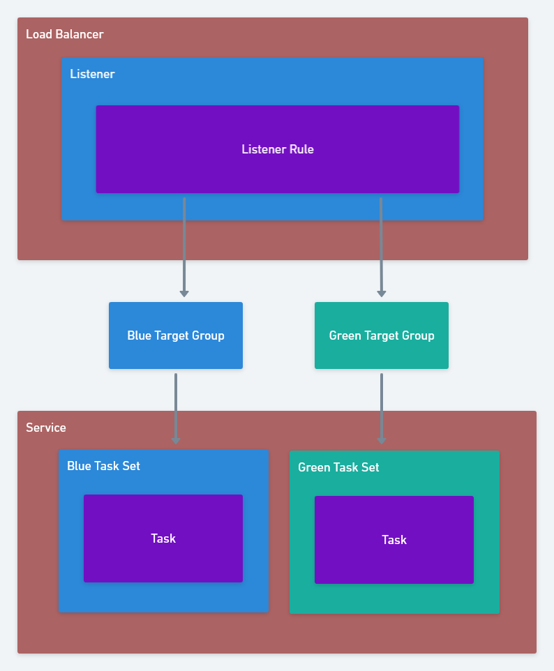
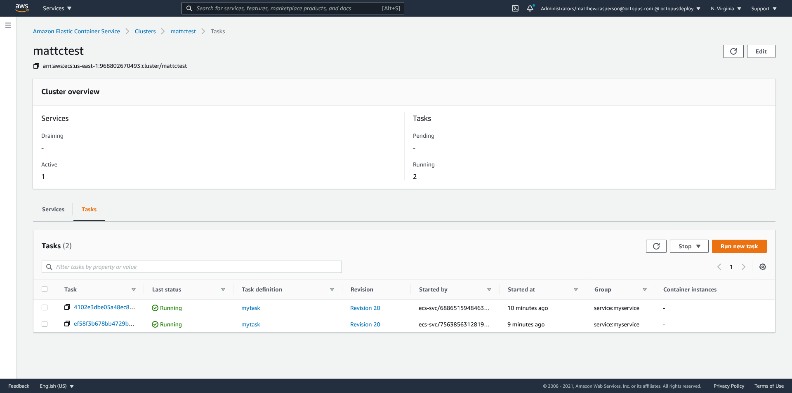

Canary deployments are a popular pattern that allow you to progressively roll out a new version of your application to an increasing number of end users. By watching for errors or undesirable effects from the new version during the rollout, it is possible to catch and revert production errors before they impact the majority of your users.

ECS has native support for [rolling updates](https://docs.aws.amazon.com/AmazonECS/latest/developerguide/deployment-type-ecs.html), where tasks in a service are progressively, but automatically, updated with a new version of the application. By integrating with CodeDeploy, it is possible to perform what ECS refers to as a [Blue/Green deployment](https://docs.aws.amazon.com/AmazonECS/latest/developerguide/deployment-type-bluegreen.html), although this deployment option can be configured to perform a Canary deployments that shifts the traffic to the new version. You can even [create your own deployment strategy](https://docs.aws.amazon.com/cli/latest/reference/deploy/create-deployment-config.html), but you are limited to a time based canary rule, which is:

> A configuration that shifts traffic from one version of a Lambda function or ECS task set to another in two increments.

Or a time based linear rule, which is:

> A configuration that shifts traffic from one version of a Lambda function or ECS task set to another in equal increments, with an equal number of minutes between each increment.

There are times though when the decision to shift more traffic to the canary deployment is not something you can easily determine over a fixed period of time. For example, you may need to have a person make the decision to move forward with a canary deployment based on a range of inputs like support requests, errors in logs, resource usage. This kind of manual intervention in the deployment requires more flexibility than the Blue/Green strategy exposed by ECS.

Fortunately, [ECS can defer the decision to progress a deployment to an external system](https://docs.aws.amazon.com/AmazonECS/latest/developerguide/deployment-type-external.html). It requires some work to set up, but is incredibly flexible.

In this blog post we'll look at how to manage an ECS canary deployment with Octopus.

## ECS CloudFormation resources

Our ECS deployment will be created and managed via CloudFormation, and will make use of the following resources:

* [`AWS::ECS::TaskDefinition`](https://docs.aws.amazon.com/AWSCloudFormation/latest/UserGuide/aws-resource-ecs-taskdefinition.html) - Task definitions configure the containers to be executed by ECS.
* [`AWS::ECS::Service`](https://docs.aws.amazon.com/AWSCloudFormation/latest/UserGuide/aws-resource-ecs-service.html) - A service keeps one or more instances of a task definition (or many task definitions, when using task sets) running in the ECS cluster.
* [`AWS::ECS::TaskSet`](https://docs.aws.amazon.com/AWSCloudFormation/latest/UserGuide/aws-resource-ecs-taskset.html) - A service can contain many task sets, with each task set configured with its own task definition. Multiple task sets allow a single service to manage tasks created from multiple task definitions.
* [`AWS::ElasticLoadBalancingV2::Listener`](https://docs.aws.amazon.com/AWSCloudFormation/latest/UserGuide/aws-resource-elasticloadbalancingv2-listener.html) - A listener defines the port and protocol that it will receive load balancer traffic on.
* [`AWS::ElasticLoadBalancingV2::ListenerRule`](https://docs.aws.amazon.com/AWSCloudFormation/latest/UserGuide/aws-resource-elasticloadbalancingv2-listenerrule.html) - A listener rule defines the high level rules, such as path, query string, header matching etc, that must be satisfied to deliver traffic to a target group.
* [`AWS::ElasticLoadBalancingV2::TargetGroup`](https://docs.aws.amazon.com/AWSCloudFormation/latest/UserGuide/aws-resource-elasticloadbalancingv2-targetgroup.html) - A target group binds downstream services, like ECS clusters, to a load balancer listener rule.

The resulting architecture looks like this:



## The sample application

To demonstrate a canary deployment, we'll use the Docker image created from the code at https://github.com/OctopusSamples/DockerHelloWorldWithVersion. This is a simple "hello world" Node.js application that also prints the value of the `APPVERSION` environment variable in response to a HTTP request.

## The `AWS::ECS::TaskDefinition` resource

The task definition configures the sample application to listen to traffic on port 4000. It also defines an environment variable called `APPVERSION`, which will be displayed in the response.

We'll update the `APPVERSION` environment variable as a way of simulating new application versions being deployed.

Here is the first task definition. Note the resource name has a random string appended to it. Each time this template is deployed, the task definition will have a distinct name. This means CloudFormation will create a new task definition, but not delete any previously deployed task definition:

```json
    "MyTask19a1ac4cbba79425494fdc2a7a9498783": {
      "Type": "AWS::ECS::TaskDefinition",
      "Properties": {
        "ContainerDefinitions": [
          {
            "Cpu": 256,
            "Image": "octopussamples/helloworldwithversion",
            "Memory": 512,
            "MemoryReservation": 128,
            "Name": "mycontainer",
            "Environment": [
              {
                "Name": "APPVERSION",
                "Value": "1.0.0"
              }
            ],
            "PortMappings": [
              {
                "ContainerPort": 4000,
                "HostPort": 4000,
                "Protocol": "tcp"
              }
            ]
          }
        ],
        "Cpu": "256",
        "Family": "mytask",
        "Memory": "512",
        "RequiresCompatibilities": [
          "FARGATE"
        ],
        "NetworkMode": "awsvpc"
      }
    }
```

## The `AWS::ElasticLoadBalancingV2::TargetGroup` resources

Target groups define the downstream services that respond to a network request. We don't define any services here as ECS itself will place tasks into target groups as they are created and remove tasks as they are destroyed.

The two target groups below will hold the blue (or existing deployment) tasks, and the green (or new deployment) tasks:

```json
    "GreenTargetGroup": {
      "Type": "AWS::ElasticLoadBalancingV2::TargetGroup",
      "Properties": {
        "HealthCheckEnabled": true,
        "HealthCheckIntervalSeconds": 30,
        "HealthCheckPath": "/",
        "HealthCheckPort": "4000",
        "HealthCheckProtocol": "HTTP",
        "HealthCheckTimeoutSeconds": 10,
        "HealthyThresholdCount": 5,
        "Matcher": {
          "HttpCode": "200"
        },
        "Name": "OctopusGreenTargetGroup",
        "Port": 4000,
        "Protocol": "HTTP",
        "TargetType": "ip",
        "UnhealthyThresholdCount": 5,
        "VpcId": "vpc-04fb5b2e72c17ca68"
      }
    }
```

```json
    "BlueTargetGroup": {
      "Type": "AWS::ElasticLoadBalancingV2::TargetGroup",
      "Properties": {
        "HealthCheckEnabled": true,
        "HealthCheckIntervalSeconds": 30,
        "HealthCheckPath": "/",
        "HealthCheckPort": "4000",
        "HealthCheckProtocol": "HTTP",
        "HealthCheckTimeoutSeconds": 10,
        "HealthyThresholdCount": 5,
        "Matcher": {
          "HttpCode": "200"
        },
        "Name": "OctopusBlueTargetGroup",
        "Port": 4000,
        "Protocol": "HTTP",
        "TargetType": "ip",
        "UnhealthyThresholdCount": 5,
        "VpcId": "vpc-04fb5b2e72c17ca68"
      }
    }
```

## The `AWS::ECS::TaskSet` resources

With a standard rolling deployment, an ECS service would reference only one task definition, and the service resource would define all the associated settings like networking and task counts. 

Task sets provide a more flexible method of defining task definitions in a service. When task sets are used, [the service resource defines very few settings](https://docs.aws.amazon.com/AmazonECS/latest/developerguide/deployment-type-external.html#deployment-type-external-workflow), and exists mostly as a parent resource for its child task sets.

In this example, each task set points to the same task definition. This means for the initial deployment, the blue and green half of the stacks will be the same. Later in the post we'll look at how this template is updated with a new task definition for the green stack to perform a canary or blue/green deployment:

```json
    "GreenTaskSet": {
      "Type": "AWS::ECS::TaskSet",
      "Properties": {
        "Cluster": "arn:aws:ecs:us-east-1:968802670493:cluster/mattctest",
        "ExternalId": "OctopusGreenStack",
        "LaunchType": "FARGATE",
        "NetworkConfiguration": {
          "AwsvpcConfiguration": {
            "AssignPublicIp": "ENABLED",
            "SecurityGroups": [
              "sg-043789abf52c12d9a"
            ],
            "Subnets": [
              "subnet-0af41f8e0404d7b23",
              "subnet-0c2515119bdf77d4c",
              "subnet-09d1a3362fac596a9"
            ]
          }
        },
        "LoadBalancers": [
          {
            "ContainerName": "mycontainer",
            "ContainerPort": 4000,
            "TargetGroupArn": {
              "Ref": "GreenTargetGroup"
            }
          }
        ],
        "Scale": {
          "Unit": "PERCENT",
          "Value": 100
        },
        "Service": "myservice",
        "TaskDefinition": {"Ref": "MyTask19a1ac4cbba79425494fdc2a7a9498783"}
      },
      "DependsOn": [
        "MyService",
        "GreenTargetGroup"
      ]
    }
```

```json
    "BlueTaskSet": {
      "Type": "AWS::ECS::TaskSet",
      "Properties": {
        "Cluster": "arn:aws:ecs:us-east-1:968802670493:cluster/mattctest",
        "ExternalId": "OctopusBlueStack",
        "LaunchType": "FARGATE",
        "NetworkConfiguration": {
          "AwsvpcConfiguration": {
            "AssignPublicIp": "ENABLED",
            "SecurityGroups": [
              "sg-043789abf52c12d9a"
            ],
            "Subnets": [
              "subnet-0af41f8e0404d7b23",
              "subnet-0c2515119bdf77d4c",
              "subnet-09d1a3362fac596a9"
            ]
          }
        },
        "LoadBalancers": [
          {
            "ContainerName": "mycontainer",
            "ContainerPort": 4000,
            "TargetGroupArn": {
              "Ref": "BlueTargetGroup"
            }
          }
        ],
        "Scale": {
          "Unit": "PERCENT",
          "Value": 100
        },
        "Service": "myservice",
        "TaskDefinition": {"Ref": "MyTask19a1ac4cbba79425494fdc2a7a9498783"}
      },
      "DependsOn": [
        "MyService",
        "BlueTargetGroup"
      ]
    }
```

## The `AWS::ECS::Service` resource

The service will ensure the desired number of tasks are run, and continue to run. Typically we would configure the service to reference a task definition directly, but in our case we will use task sets to link a service to a task definition. This means our service is quite sparse:

```json
  "MyService": {
      "Type": "AWS::ECS::Service",
      "Properties": {
        "Cluster": "arn:aws:ecs:us-east-1:968802670493:cluster/mattctest",
        "ServiceName": "myservice",
        "DeploymentController": {
          "Type": "EXTERNAL"
        }
      }
    }
```

## The `AWS::ElasticLoadBalancingV2::Listener` resource

Listeners are attached to load balancers, and define the rules used to direct traffic to a target group. The listener below is configured to receive HTTP traffic on port 80, and has a default rule to respond with a HTTP 404 status code if no other custom rule matches the incoming request.

Note here that we have hard coded the ARN of an existing [ALB](https://docs.aws.amazon.com/elasticloadbalancing/latest/application/introduction.html) or [NLB](https://docs.aws.amazon.com/elasticloadbalancing/latest/network/introduction.html). The requirement here is that the existing load balancer does not already have a listener configured to use port 80:

```json
    "MyListener": {
      "Type": "AWS::ElasticLoadBalancingV2::Listener",
      "Properties": {
        "DefaultActions": [
          {
            "FixedResponseConfig": {
              "StatusCode": "404"
            },
            "Order": 1,
            "Type": "fixed-response"
          }
        ],
        "LoadBalancerArn": "arn:aws:elasticloadbalancing:us-east-1:968802670493:loadbalancer/app/mattctest/3a1496378bd20439",
        "Port": 80,
        "Protocol": "HTTP"
      }
    }
```

## The `AWS::ElasticLoadBalancingV2::ListenerRule` resource

A listener rule is attached to a listener, and provides fine grained control over how an incoming requests is matched, and how it is forwarded to a target group. The listener rule below matches all request paths (essentially matching all requests), and splits traffic between the blue and green target groups.

Modifying the weights assigned to the blue and green target groups is how we achieve a blue/green or canary deployment. A hard cut over from the blue to the blue to the green stack achieves a traditional blue/green deployment, while gradually increasing the traffic to the green stack achieves a canary deployment:

```json
    "MyListenerRule": {
      "Type": "AWS::ElasticLoadBalancingV2::ListenerRule",
      "Properties": {
        "Actions": [
          {
            "ForwardConfig": {
              "TargetGroups": [
                {
                  "TargetGroupArn": {
                    "Ref": "GreenTargetGroup"
                  },
                  "Weight": 0
                },
                {
                  "TargetGroupArn": {
                    "Ref": "BlueTargetGroup"
                  },
                  "Weight": 100
                }
              ]
            },
            "Order": 1,
            "Type": "forward"
          }
        ],
        "Conditions": [
          {
            "Field": "path-pattern",
            "PathPatternConfig": {
              "Values": [
                "/*"
              ]
            }
          }
        ],
        "ListenerArn": {
          "Ref": "MyListener"
        },
        "Priority": 10
      },
      "DependsOn": [
        "MyListener",
        "GreenTargetGroup",
        "BlueTargetGroup"
      ]
    }
```

## The complete template

Here is the complete CloudFormation template:

```json
{
  "Resources": {
    "MyTask19a1ac4cbba79425494fdc2a7a9498783": {
      "Type": "AWS::ECS::TaskDefinition",
      "Properties": {
        "ContainerDefinitions": [
          {
            "Cpu": 256,
            "Image": "octopussamples/helloworldwithversion",
            "Memory": 512,
            "MemoryReservation": 128,
            "Name": "mycontainer",
            "Environment": [
              {
                "Name": "APPVERSION",
                "Value": "1.0.0"
              }
            ],
            "PortMappings": [
              {
                "ContainerPort": 4000,
                "HostPort": 4000,
                "Protocol": "tcp"
              }
            ]
          }
        ],
        "Cpu": "256",
        "Family": "mytask",
        "Memory": "512",
        "RequiresCompatibilities": [
          "FARGATE"
        ],
        "NetworkMode": "awsvpc"
      }
    },   
    "GreenTargetGroup": {
      "Type": "AWS::ElasticLoadBalancingV2::TargetGroup",
      "Properties": {
        "HealthCheckEnabled": true,
        "HealthCheckIntervalSeconds": 30,
        "HealthCheckPath": "/",
        "HealthCheckPort": "4000",
        "HealthCheckProtocol": "HTTP",
        "HealthCheckTimeoutSeconds": 10,
        "HealthyThresholdCount": 5,
        "Matcher": {
          "HttpCode": "200"
        },
        "Name": "OctopusGreenTargetGroup",
        "Port": 4000,
        "Protocol": "HTTP",
        "TargetType": "ip",
        "UnhealthyThresholdCount": 5,
        "VpcId": "vpc-04fb5b2e72c17ca68"
      }
    },
    "BlueTargetGroup": {
      "Type": "AWS::ElasticLoadBalancingV2::TargetGroup",
      "Properties": {
        "HealthCheckEnabled": true,
        "HealthCheckIntervalSeconds": 30,
        "HealthCheckPath": "/",
        "HealthCheckPort": "4000",
        "HealthCheckProtocol": "HTTP",
        "HealthCheckTimeoutSeconds": 10,
        "HealthyThresholdCount": 5,
        "Matcher": {
          "HttpCode": "200"
        },
        "Name": "OctopusBlueTargetGroup",
        "Port": 4000,
        "Protocol": "HTTP",
        "TargetType": "ip",
        "UnhealthyThresholdCount": 5,
        "VpcId": "vpc-04fb5b2e72c17ca68"
      }
    },
    "GreenTaskSet": {
      "Type": "AWS::ECS::TaskSet",
      "Properties": {
        "Cluster": "arn:aws:ecs:us-east-1:968802670493:cluster/mattctest",
        "ExternalId": "OctopusGreenStack",
        "LaunchType": "FARGATE",
        "NetworkConfiguration": {
          "AwsvpcConfiguration": {
            "AssignPublicIp": "ENABLED",
            "SecurityGroups": [
              "sg-043789abf52c12d9a"
            ],
            "Subnets": [
              "subnet-0af41f8e0404d7b23",
              "subnet-0c2515119bdf77d4c",
              "subnet-09d1a3362fac596a9"
            ]
          }
        },
        "LoadBalancers": [
          {
            "ContainerName": "mycontainer",
            "ContainerPort": 4000,
            "TargetGroupArn": {
              "Ref": "GreenTargetGroup"
            }
          }
        ],
        "Scale": {
          "Unit": "PERCENT",
          "Value": 100
        },
        "Service": "myservice",
        "TaskDefinition": {"Ref": "MyTask19a1ac4cbba79425494fdc2a7a9498783"}
      },
      "DependsOn": [
        "MyService",
        "GreenTargetGroup"
      ]
    },
    "BlueTaskSet": {
      "Type": "AWS::ECS::TaskSet",
      "Properties": {
        "Cluster": "arn:aws:ecs:us-east-1:968802670493:cluster/mattctest",
        "ExternalId": "OctopusBlueStack",
        "LaunchType": "FARGATE",
        "NetworkConfiguration": {
          "AwsvpcConfiguration": {
            "AssignPublicIp": "ENABLED",
            "SecurityGroups": [
              "sg-043789abf52c12d9a"
            ],
            "Subnets": [
              "subnet-0af41f8e0404d7b23",
              "subnet-0c2515119bdf77d4c",
              "subnet-09d1a3362fac596a9"
            ]
          }
        },
        "LoadBalancers": [
          {
            "ContainerName": "mycontainer",
            "ContainerPort": 4000,
            "TargetGroupArn": {
              "Ref": "BlueTargetGroup"
            }
          }
        ],
        "Scale": {
          "Unit": "PERCENT",
          "Value": 100
        },
        "Service": "myservice",
        "TaskDefinition": {"Ref": "MyTask19a1ac4cbba79425494fdc2a7a9498783"}
      },
      "DependsOn": [
        "MyService",
        "BlueTargetGroup"
      ]
    },
    "MyService": {
      "Type": "AWS::ECS::Service",
      "Properties": {
        "Cluster": "arn:aws:ecs:us-east-1:968802670493:cluster/mattctest",
        "ServiceName": "myservice",
        "DeploymentController": {
          "Type": "EXTERNAL"
        }
      }
    },
    "MyListener": {
      "Type": "AWS::ElasticLoadBalancingV2::Listener",
      "Properties": {
        "DefaultActions": [
          {
            "FixedResponseConfig": {
              "StatusCode": "404"
            },
            "Order": 1,
            "Type": "fixed-response"
          }
        ],
        "LoadBalancerArn": "arn:aws:elasticloadbalancing:us-east-1:968802670493:loadbalancer/app/mattctest/3a1496378bd20439",
        "Port": 80,
        "Protocol": "HTTP"
      }
    },
    "MyListenerRule": {
      "Type": "AWS::ElasticLoadBalancingV2::ListenerRule",
      "Properties": {
        "Actions": [
          {
            "ForwardConfig": {
              "TargetGroups": [
                {
                  "TargetGroupArn": {
                    "Ref": "GreenTargetGroup"
                  },
                  "Weight": 0
                },
                {
                  "TargetGroupArn": {
                    "Ref": "BlueTargetGroup"
                  },
                  "Weight": 100
                }
              ]
            },
            "Order": 1,
            "Type": "forward"
          }
        ],
        "Conditions": [
          {
            "Field": "path-pattern",
            "PathPatternConfig": {
              "Values": [
                "/*"
              ]
            }
          }
        ],
        "ListenerArn": {
          "Ref": "MyListener"
        },
        "Priority": 10
      },
      "DependsOn": [
        "MyListener",
        "GreenTargetGroup",
        "BlueTargetGroup"
      ]
    }
  }
}
```

Deploying this stack results in a new service in ECS. 

The report of `2/1 Tasks running` might seem a little odd, but this value is the result of having two task sets each configured to run 100% of their parent service's desired task count, which is 1. This means we have two task sets, each running one task, resulting in two tasks running for the one desired task defined in the service:


The two tasks show the tasks configured in the blue and green task sets. Note that task sets are not displayed in the console, and we have to infer the task set a task belongs to:



Our load balancer listener has been configured to direct traffic to the two target groups:


The target groups have had the tasks added to them by ECS:


As this was our first deployment, the task sets both point to the same task definition, and there is nothing to switch between as part of a blue/green or canary deployment.

We will assume at this point that this initial deployment is complete. This means that the blue stack represents the currently deployed and publicly available version of the application receiving 100% of the traffic, and that the green stack is unused.

