My [previous article](link) did a deep dive into the new [Deploy Child Octopus Deploy Project](https://library.octopus.com/step-templates/0dac2fe6-91d5-4c05-bdfb-1b97adf1e12e/actiontemplate-deploy-child-octopus-deploy-project).  The article covered a variety of scenarios except for multi-tenancy.  In this article, I will do a deep dive into the multi-tenancy functionality of the [Deploy Child Octopus Deploy Project](https://library.octopus.com/step-templates/0dac2fe6-91d5-4c05-bdfb-1b97adf1e12e/actiontemplate-deploy-child-octopus-deploy-project).

:::success
This article assumes you read the previous article.  It will touch on some similar topics, but it isn't a full rehash.  
:::

## Sample Application

Like the previous article, I have a sample application where each component is an Octopus Deploy project.  


There are a few key differences:

- These projects have been updated to use [Octopus Deploy's Multi-Tenancy feature](https://octopus.com/docs/deployment-patterns/multi-tenant-deployments).
- Two additional projects have been added, a single sign-on project and a data conversion project.

The sample application is a SaaS application with the following business rules:

- Every customer gets the "core" product consisting of the Database, the Web API, and Web UI.
- Every customer gets a **Staging** and **Production** environment.  The **Staging** environment allows their engineers to test any changes before being deployed to **Production**.
- Customers can purchase the Scheduling Service, Single Sign-On app, and Data Conversion at an additional cost.
- Customers can pay extra for earlier access to changes deployed in the **Test** environment.
- Certain Customers must give their consent before a release deployment to the **Production** environment.
- Purchasing a module requires a redeployment of the core components, configuration files need to be updated, and the services need to be recycled to pick up the new functionality.
- Customers want downtime kept to a minimum.

In a nutshell, while we wish everything were simple, the real-world is messy.  

With that all in mind, let's meet our sample customers.

- **Internal**: this is an internal test customer used by everyone to test changes.  This customer exists across all four environments, **Development**, **Test**, **Staging**, and **Production**.
- **Coca-Cola**: this customer has paid for all the extra components plus access to preview releases in the **Test** environment.
- **Ford**: the bare-bones customer only has the four "core" components in the **Staging** and **Production** environments.
- **Nike**: they have purchased the scheduling service and single sign-on app for use in the **Staging** and **Production** environments.
- **Starbucks**: they have purchased the scheduling service and data conversion service for use in the **Staging** and **Production** environments.

## Multi-Tenancy and the Deploy Child Octopus Deploy Project Step Template

I've worked with customers who went the route of a single massive project to handle everything.  It deployed the software in one go, but outage windows had to be quite large because unchanged components were redeployed.  That often leads to the question, "how do I skip steps where the package hasn't changed?"  The concern with that approach is very rarely a web deployment "just" pushing out a server package.  Additional steps are needed to configure items such as branding or running integration tests.  

What is needed is each component in Octopus Deploy is assigned a unique project.  A parent project will handle the orchestration.  Up until this point, there hasn't been a step to solve several use cases seen in the real-world.

- Minimize downtime by only deploying what has changed.
- Minimize build time by only building what has changed.
- Minimize the number of decisions a person has to make.
- Single responsibility principle, each project deploys one thing to the best of its ability.
- Tenants are assigned to different projects.
- Tenants are assigned to different environments per project.
- Tenants are on different release schedules.
- Tenants require their own set of approvals, but a person should only have to approve a release once.
- Applications have to be deployed to tenants in a specific order.
- A customer might approve their change on Tuesday for a Thursday night deployment.

The new [Deploy Child Octopus Deploy Project](https://library.octopus.com/step-templates/0dac2fe6-91d5-4c05-bdfb-1b97adf1e12e/actiontemplate-deploy-child-octopus-deploy-project) step template will help solve those use cases.  You will have a parent project for your application with a single deployment process.  You shouldn't have to worry about tenant and project assignments.  It has the necessary guard clauses to ensure the same process will work for the **Internal Customer** with all the bells and whistles _and_ **Ford** with only the core components.

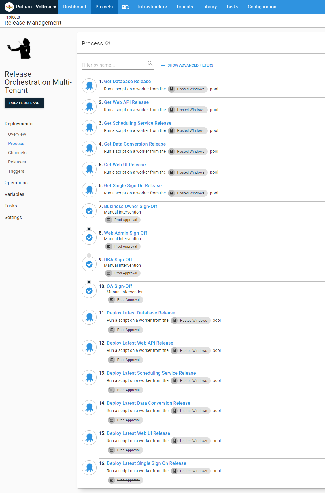

Before moving onto the scenarios, let's take a moment to examine how the step template handles different use cases for a multi-tenant parent project.

### Tenants not assigned to child projects

The step template automatically detects you are doing a deployment with a tenant.  If a tenant is detected, additional logic runs:

- Is the tenant assigned to the child project?  If no, exit the step, log a message and proceed onto the next step.
- Is the tenant assigned to the child project for that specific environment?  If no, exit the step, log a message, and proceed to the next step.
- Is the child project configured to run multi-tenant?  If no, run the child project without supplying a tenant.

### Choosing a release

One of the step templates' core business rules is to pick the last successfully deployed release in the source environment.  Multi-tenancy makes that a bit more complicated.  Consider this scenario:

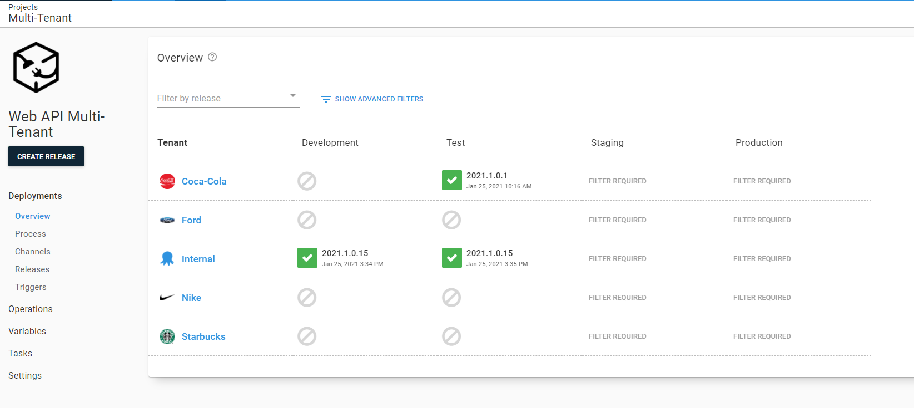

- **Internal**: has the latest bleeding-edge release, `2021.1.0.15` ready to go to **Staging**.
- **Coke**: has an older release, `2021.1.0.1` ready to go to **Staging**.
- **Ford**, **Nike**, and **Starbucks** aren't assigned to the **Test** environment.

When the step template is told to promote the latest `2021.1.0.x` release to **Staging**, which release will be picked?  The answer

- **Internal**, **Ford**, **Nike**, and **Starbucks**: 2021.1.0.15
- **Coke**: 2021.1.0.1

How the step template works is you provide it a destination environment (**Staging**), a channel (**Default** if no channel is provided), and a release number pattern (`2021.1.0.*`).  It will:

1. Use the channel's lifecycle to calculate the source environment, which is **Test**.
2. Pull all the releases for that channel matching the `2021.1.0.*` pattern.
3. Loop through those releases to find the last release successfully deployed **Test**.  Not the newest release created, the last one deployed to **Test**.

Multi-tenancy adds a bit of complexity to that.

- Not all tenants are assigned to the **Test** environment; only **Coke** and **Internal**.
- Tenants can have different releases.

The excellent news is Octopus already figures this out for us.  If were to pick the `2021.1.0.15` release from the **Filter by release** drop-down menu, the dashboard would change to this:

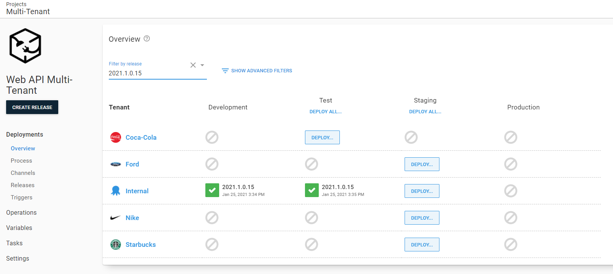

The step template hooks into that logic already provided by Octopus Deploy.  Internally the logic looks at `2021.1.0.15` for **Coke** and determines this cannot be deployed to **Staging** because the tenant is tied to the **Test** environment and that release hasn't been deployed to that environment.  Whereas with **Internal**, that release has been deployed to **Test** so it can be deployed to **Staging**.

When the step template looks at **Ford**, it sees that tenant isn't tied to the **Test** environment.  It will then pick the latest release from the **Test** environment, regardless of the tenant.  

## Using the Deploy Child Octopus Deploy Project Step Template

This section will walk through configuring some common parent project scenarios.  You can view the final project on the [samples instance](https://samples.octopus.app/app#/Spaces-603/projects/release-orchestration-multi-tenant/deployments).

### Scaffolding

There is some scaffolding to configure for users and lifecycles.  Please see the scaffolding section in the [Previous Article](LINK TO PREVIOUS ARTICLE HERE).  

Once you are finished configuring the users and lifecycles, it is time to create a project.  When you are creating the project, remember to select the new lifecycle created above.

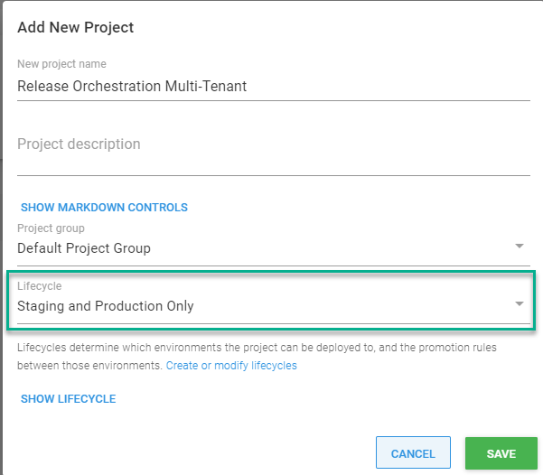

Ensure the project is configured to require a tenant for all deployments.


After that, head over to the variables screen and add in the API key and the release pattern.


For each tenant, connect the newly created project for the **Staging** and **Production** environments.  


### Scenario: Deploying the latest release for the Tenant from Test to Staging

In this scenario, we will configure that parent project to deploy all the child components from **Test** to **Staging** in a specific order.  At this stage, we are not concerned with approvals.  

#### Add the steps
Go to the newly created project's deployment process and add a `Deploy Child Octopus Deploy Project` step for each child project.


Here are the values for each parameter.

- **Octopus API Key**: the API key variable, `#{Project.ChildProjects.ReleaseAPIKey}`.
- **Octopus Child Space**: leave the default value as-is; this example isn't creating a release orchestration project in another space.
- **Child Project Name**: the name of the child project.
- **Child Project Channel**: leave the default (empty) value as-is; the child project only has one channel.
- **Child Project Release Number**: The release pattern variable, `#{Project.ChildProjects.ReleasePattern}`
- **Child Project Release Not Found Error Handle**: leave the default value as-is, which says if the release doesn't exist, skip it.
- **Destination Environment Name**: leave the default value as-is, use the same environment as the parent project. 
- **Source Environment Name**: leave the default (empty) value as-is; this example will let the step template decide the source environment.
- **Child Project Prompted Variables**: leave the default (empty) value as-is; there are no prompted variables. 
- **Force Redeployment**: leave the default value as-is; the example won't be redeploying an existing release.
- **Ignore Specific Machine Mismatch**: leave the default value as-is, not adding deployment target triggers yet.
- **Save Release Notes as Artifacts**: leave the default value as-is.!
- **What If**: leave the default value as-is; the approvals aren't getting added yet.
- **Wait for finish**: leave the default value as-is; this example will wait for the deployment to finish.
- **Wait for Deployment**: leave the default value as-is; 30 minutes should be more than enough.
- **Scheduling**: leave the default value as-is; this example requires a specific order for child projects.
- **Auto Approve Child Project Manual Interventions**: leave the default value as-is; this setting is moot right now as the example isn't dealing with manual interventions.
- **Approval Environment**: leave the default value as-is; this setting is moot right now as the example isn't dealing with manual interventions.
- **Approval Tenant**: leave the default as-is; this setting is moot right as the example isn't dealing with manual interventions. 

#### Create release and deploy it

After adding and configuring the steps, it is time to create a release.  I will be making many changes to the parent project in this article; you might see `2021.1.0-RCx` for the release numbers.  


First, deploy the release to the **Coke** tenant.  

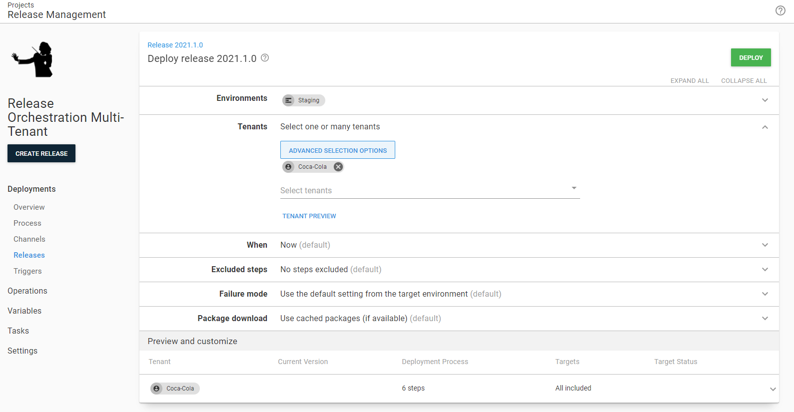

Wait for the release to finish.  For the Web API project, you should see release `2021.1.0.1` get picked up to deploy.

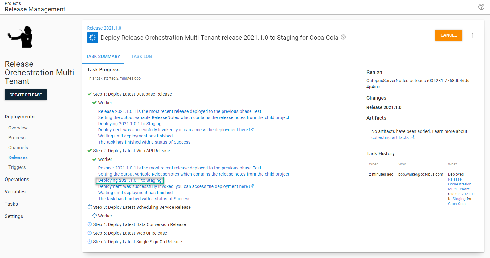

For the other projects, we should see `2021.1.0.15` get picked up.


#### Deploying the release for tenants not assigned to Test

Now let's see when the tenant is _not_ assigned to **Test**, such as the case with **Ford**, **Nike**, and **Starbucks**.

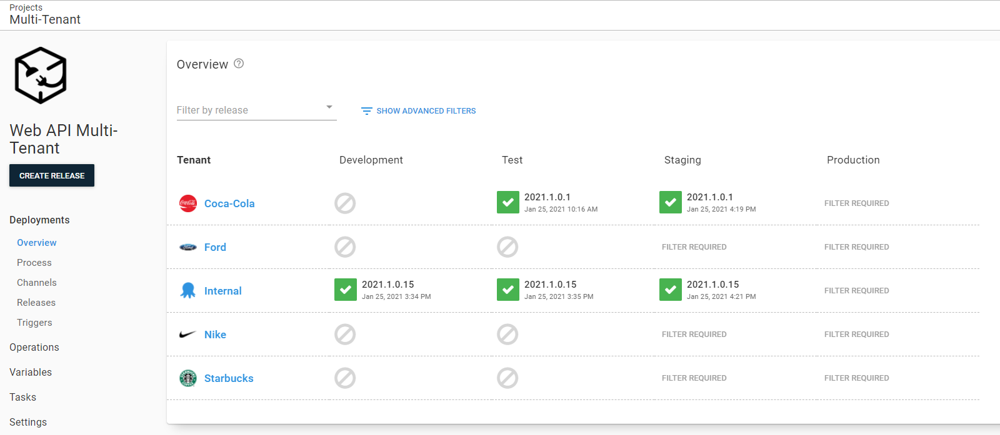

**Ford** is also not assigned to the scheduling service, single sign-on, or data conversion service projects.

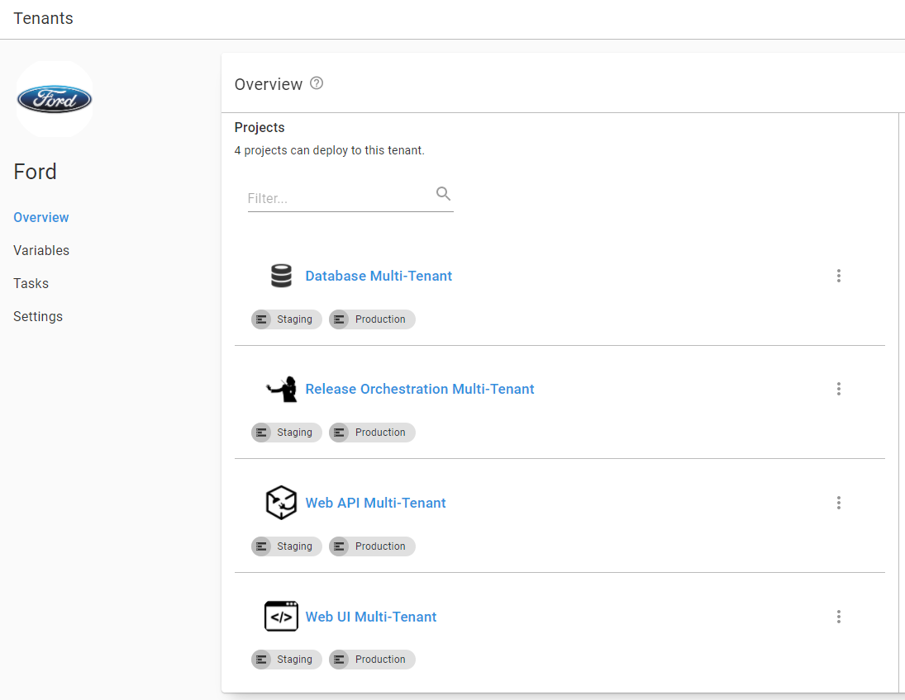

A couple of things will happen when deploying the parent project to **Staging** for **Ford**  

- Release `2021.1.0.15` for the Web API project will be selected as that is the most recent successful release to **Test**.
- The scheduling service, data conversion service, and the single sign-on projects will be skipped.

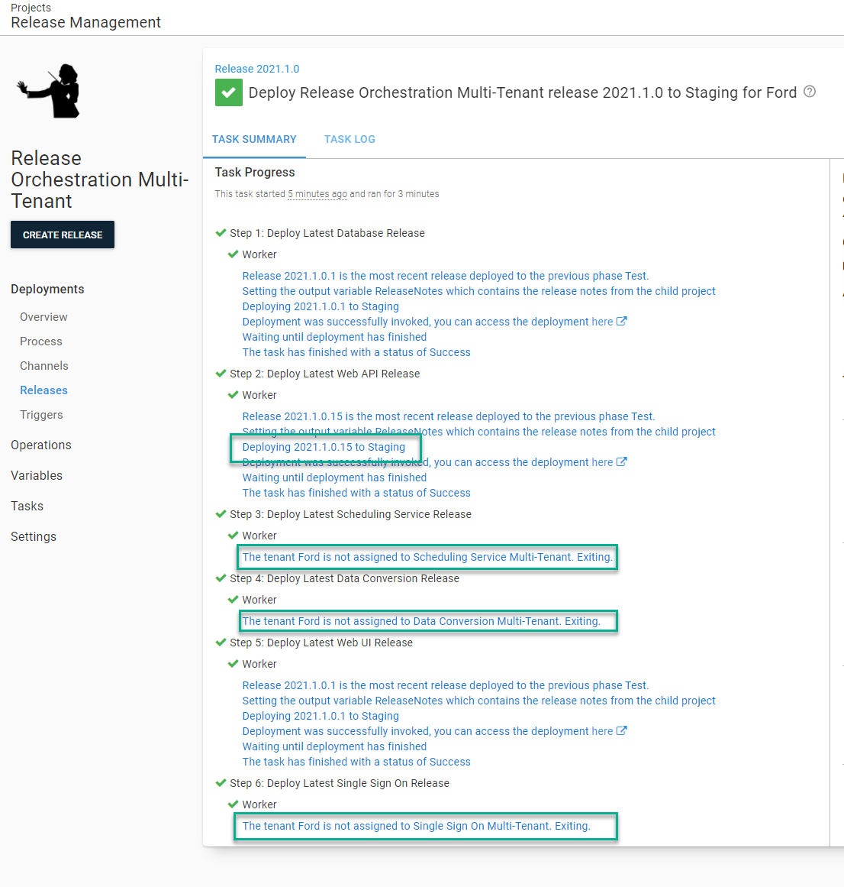

So far, we've configured the parent project to do deployments only.  If we stop here, we are in a better spot than before.  We can push out all the components assigned to a tenant in a specific order.  Also, the process will skip steps not assigned to the tenant automatically.  When managing multi-tenant applications, this alone is a win.  But we can take a step further.  Let's move to approvals.

### Scenario: Approval in the parent project

It is common to have manual interventions in child projects.  In this example application's case, each component project has two or three manual interventions.  That means we are looking at 8 to 18 approvals, depending on the tenant, to submit.  That is very, very tedious.

In an ideal configuration, all the approvals are in the parent project and flow down to the child project.

The step template was designed with this scenario in mind.  But then there is the question, what is the person exactly approving?  With Octopus Deploy, all manual interventions occur as part of a deployment.  It is a chicken/egg scenario.  The step template provides "what-if" functionality, which will do everything up to the point of doing the deployment when set.  The step template gathers all the release notes to aid in approvals.

The flow of the parent project will be:

1. Run Deploy Child Octopus Deploy Project step templates in what-if mode.
2. Do all necessary manual interventions.
3. Run Deploy Child Octopus Deploy Project step templates in normal mode.

When running in what-if mode, the following output parameters are set to be used later in the process.  

- **ReleaseToPromote**: the release number that meets all the requirements.  When no release is found, this is set to N/A.  When the release has already been deployed to the target environment, it will indicate that.
- **ReleaseNotes**: the release notes of the child project.  Includes the commit history and issues associated with the project when using build information.
- **ChildReleaseToDeploy**: indicates if there is a child release to deploy.  It will either be True or False.  Can be used for variable run conditions.

#### Create the what if steps

To configure this, you will want to first clone all the existing steps.  You can do that by clicking on the `...` next to each step.

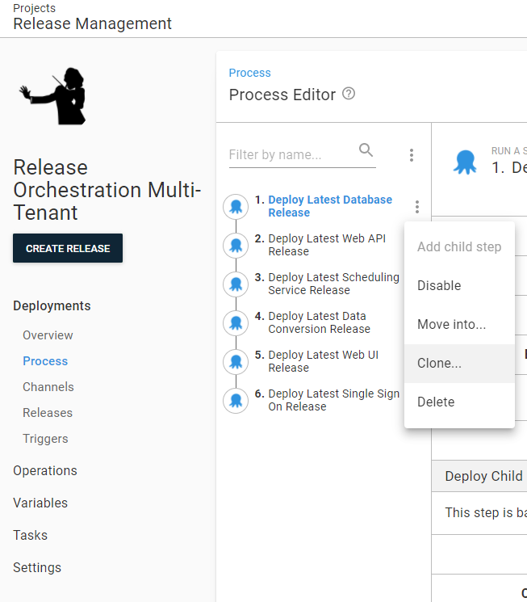

Rename each of the cloned steps.  Update the parameters in the cloned steps to be:

- **Save Release Notes as Artifacts**: Set to `Yes`.
- **What If**: Set to `Yes`. 

#### Add the manual intervention steps

Before we do anything else, add the manual intervention steps.  One of the features of the manual intervention step is being able to provide instructions to the approvers.  We can leverage the output variables from the step template to create useful instructions for our users.  For example:

```
Please approve releases for:

**Database: #{Octopus.Action[Get Database Release].Output.ReleaseToPromote}**
#{Octopus.Action[Get Database Release].Output.ReleaseNotes}

**Web API: #{Octopus.Action[Get Web API Release].Output.ReleaseToPromote}**
#{Octopus.Action[Get Web API Release].Output.ReleaseNotes}

**Scheduling Service: #{Octopus.Action[Get Scheduling Service Release].Output.ReleaseToPromote}**
#{Octopus.Action[Get Scheduling Service Release].Output.ReleaseNotes}

**Data Conversion: #{Octopus.Action[Get Data Conversion Release].Output.ReleaseToPromote}**
#{Octopus.Action[Get Data Conversion Release].Output.ReleaseNotes}

**Web UI: #{Octopus.Action[Get Web UI Release].Output.ReleaseToPromote}**
#{Octopus.Action[Get Web UI Release].Output.ReleaseNotes}

**Web UI: #{Octopus.Action[Get Sign Sign On Release].Output.ReleaseToPromote}**
#{Octopus.Action[Get Single Sign On Release].Output.ReleaseNotes}
```

I like to avoid duplicating effort. Let's add that as a variable.


With that all in place, we can add the manual interventions with the instructions sent to that new variable and only run for the **Production** environment.

:::success
The responsible teams list in the manual intervention is combined with an OR.  Anyone from any team on that list can approve the manual intervention.  If you require approval from multiple teams, you will need multiple manual intervention steps.
:::


#### Reorder the steps

After the deployment, approvals don't make sense, reorder the steps by clicking the `...` next to the **Filter by name** text box and click the **Reorder** button.  


Move all the steps you set to do a "what if" to be above the "non-whatif" steps.  When you are finished, your process should look something similar to this. 


#### See auto-approvals in action

Please create a new release and deploy it to **Staging** for one of the tenants.  Once that release is complete, promote it release to **Production**.  During this deployment, you'll see the manual interventions and auto-approvals in action.  First up, the manual intervention should have the version being deployed along with the release notes.

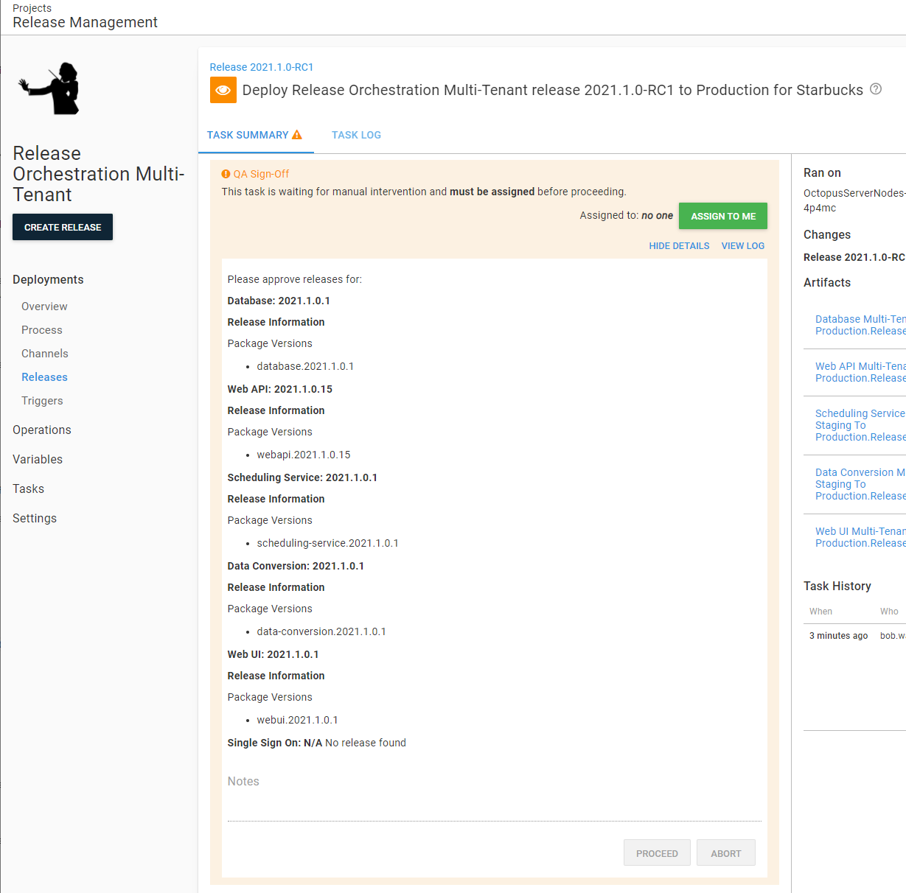

Once every group has approved the release, the deployments will kick-off.  If you go to a specific deployment, you will see a message similar to this in the child projects.


And with that, the release to **Production** is complete!  Now you have a single place to approve all the child project deployments for a specific tenant.

### Scenario: Approve Today, Deploy Tomorrow

I've worked places where specific customers are required to sign-off on a release before going to **Production**.  The chances of them approving a deployment _during_ the actual deployment is slim.  They will most likely approve on Tuesday for deployment on a Thursday (or *shudder* 3 AM Saturday).  For extra fun, let me remind you of this rule from earlier.

> Certain Customers, such as **Coke** and **Nike** must give their consent before a release is deployed to the **Production** environment.

**Coke** and **Nike** require specific approval.  All the other customers only require a single approval, which will occur for the **Internal** tenant.  

It doesn't make sense to have a deployment sitting in **Production** awaiting manual intervention for days.  A **Prod Approval** environment that sits between **Staging** and **Production** can solve this problem.  

:::success
The **Prod Approval** environment will _only_ be used for parent projects.  Child project's lifecycles will remain as-is.
:::

This scenario will walk through the steps to add the **Prod Approval** environment to a multi-tenant application to meet those rules.

#### Add the new environment and configure the lifecycle

Add the **Prod Approval** environment.  You will notice this environment in my screenshot sits between **Staging** and **Production** on this page.  I clicked the `...` to reorder the environments on this page.


Now that the new environment has been added update the lifecycle used by this release orchestration project.


:::success
Keep an eye on the **Default Lifecycle.**  By default, that lifecycle doesn't have explicit phrases defined.  Instead, it auto-generates the phases using the entire environment list.  To remove **Prod Approval** from the **Default Lifecycle**, you will need to add explicit phases.
:::

#### Update the deployment process

Next, update the approval steps to only run in the **Prod Approval** environment.  At the same time, configure the non-what-if steps to skip the **Prod Approval** environment.  The updated deployment process will look like this:

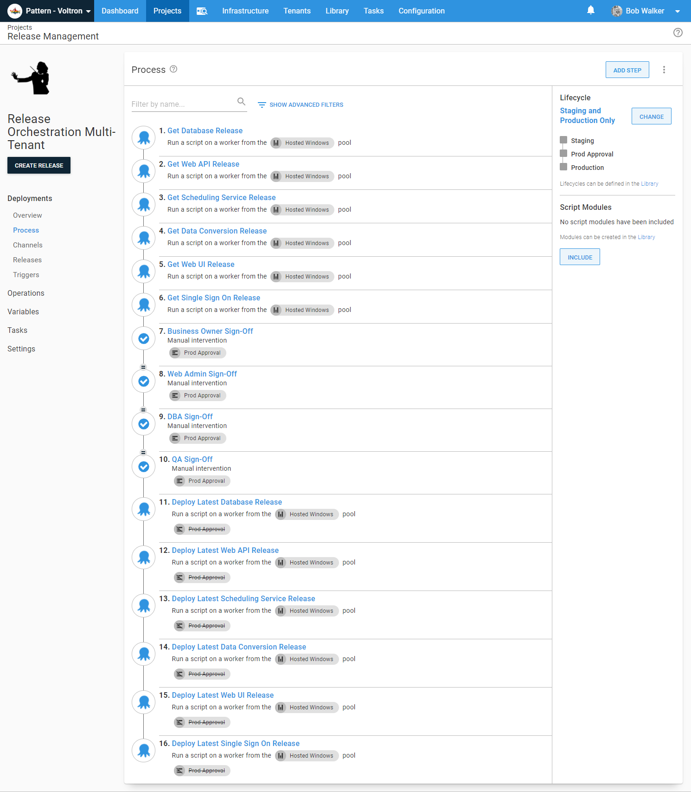

Next, head over to the variables screen and add in two new variables:

- **Project.ChildProject.Approval.Environment.Name**: stores the **Prod Approval** environment name.
- **Project.ChildProject.Deployment.Environment.Name**: stores the name of the destination environment for the deployment.  For all environments except **Prod Approval**, the name will match the current environment.  When running this on the **Prod Approval** environment, the deployment environment name is **Production**.

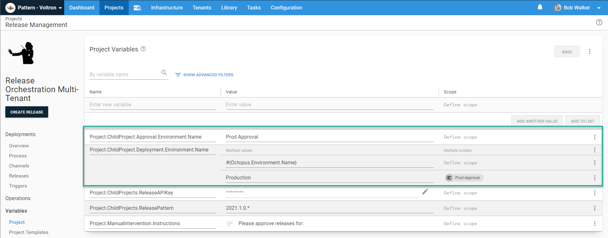

Go into each step implementing the `Deploy Child Octopus Deploy Project` and update the following parameters:

- **Destination Environment Name**: update to `#{Project.ChildProject.Deployment.Environment.Name}`
- **Approval Environment**: update to `#{Project.ChildProject.Approval.Environment.Name}`.


:::success
By doing this, we are telling the step template to pull approvals from the **Prod Approval** environment rather than the **Production** environment during a **Production** deployment.  That means we can approve at 11 AM and schedule it to deploy at 7 PM.
:::

#### Set the tenant approvals

Finally, we will want to set the approval tenant.  By default, the approval tenant is the current tenant's name.  That default will only apply to **Coke**, **Nike**, and **Internal**.  Everyone else will use **Internal**.  There are a few ways to accomplish this.  I am going to use a project variable template with the default set to Internal.

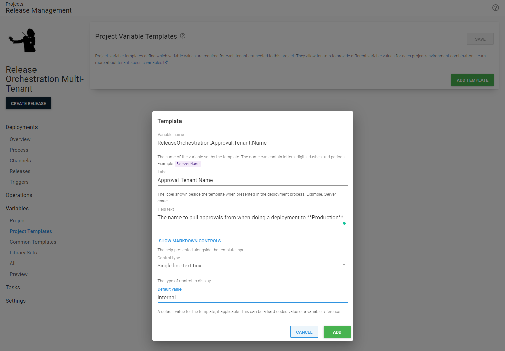

Go to **Internal**, **Coke**, and **Nike** and assign the **Prod Approval** environment for the Release Orchestration Project.

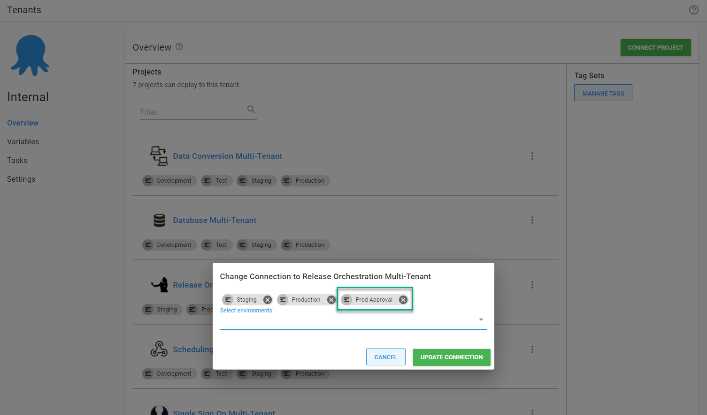

For **Coke** and **Nike**, we will change the approval tenant name to be `Octopus.Deployment.Tenant.Name` in the **Production** environment.  That is because the **Production** environment is where we need to pull the approvals.

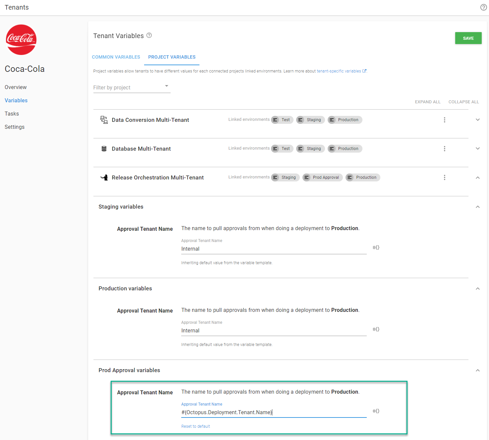

For each of the "non-whatif" steps, set the approval tenant to the variable created earlier.

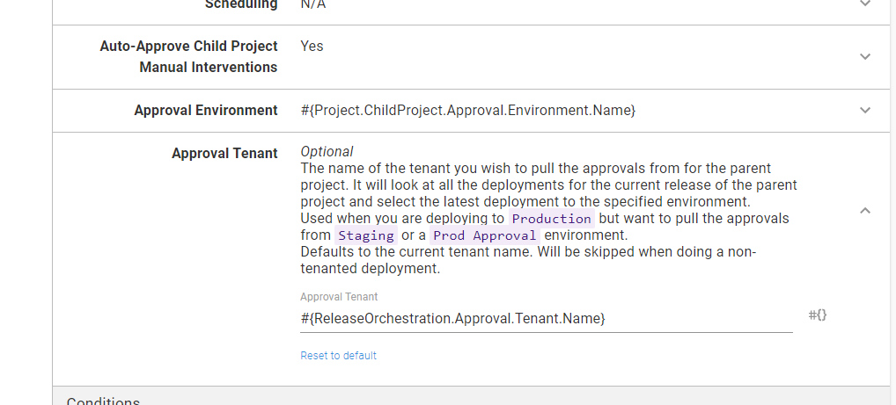

Going back to the approval screen will show **Ford** and **Starbucks** don't run on the **Prod Approval** environment.  All the other tenants do.

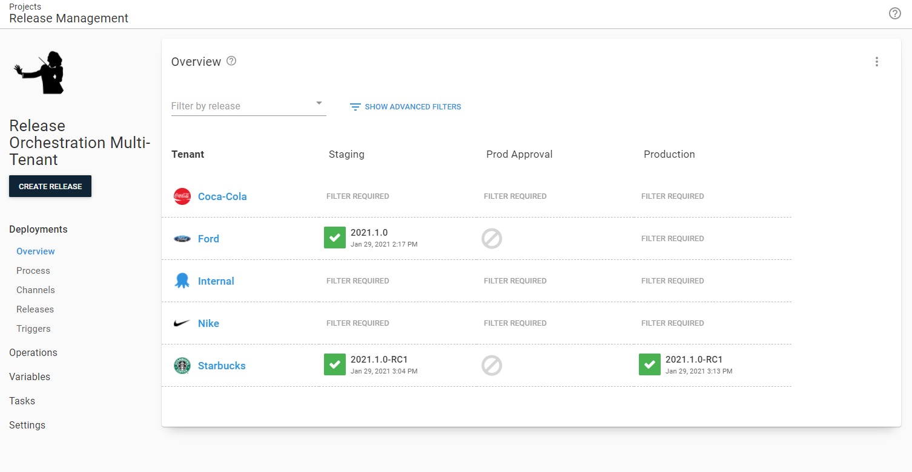

#### Seeing approvals in action

Let's see this all in action.  First, let's deploy the **Internal** through **Staging** and onto **Prod Approval**.  As you can see, only the what if steps and approval steps will run in the **Prod Approval** environment.

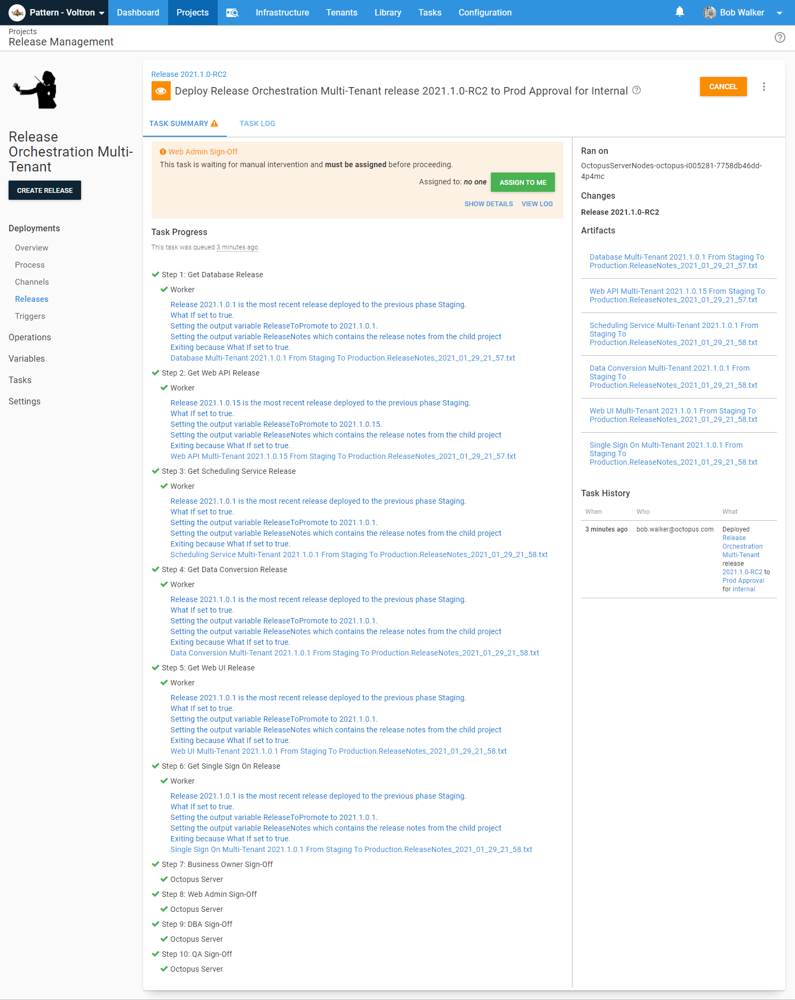

Now promote that release to **Production** for **Internal**.  The approvals are picked up from the **Prod Approval** environment for the **Internal** tenant.


Now that **Internal** has been promoted through **Prod Approval**, we can move onto **Ford** and **Starbucks**.  Promoting the release through **Staging** and onto **Production** will show the approvals will be picked up from the **Internal** tenant as well.

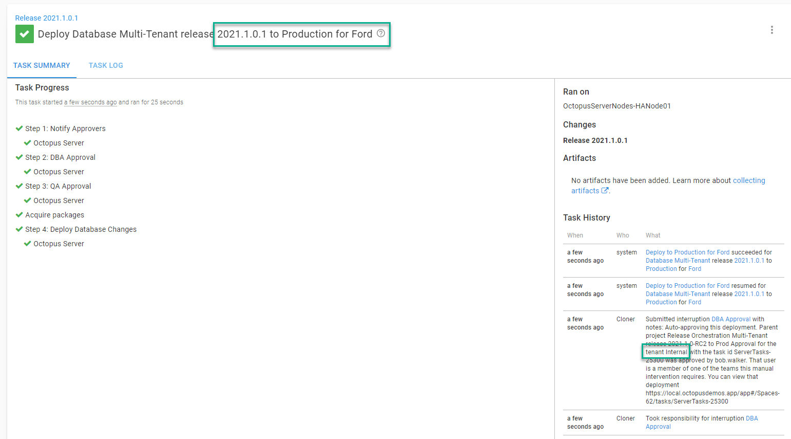

When the same release is deployed through the environments for **Coke**, we will see the approvals will come from the **Coke** tenant.


:::success
The step template looks for approvals for the current release only.  Creating a new release will require another round of approvals.  Even for a patch release, such as `2021.1.1`.  
:::

Approvals in a real-world setting are complex.  Hopefully with this functionality that process can be a bit smoother.  

## Conclusion

This article covered some of the multi-tenancy scenarios for the [Deploy Child Octopus Deploy Project](https://library.octopus.com/step-templates/0dac2fe6-91d5-4c05-bdfb-1b97adf1e12e/actiontemplate-deploy-child-octopus-deploy-project) step template.  If you want to see more scenarios, please see [my previous article](LINK).  

Octopus Deploy's multi-tenancy feature was designed to make life easier for companies who install software on distinct infrastructure.  I see and hear about all the various quirks customers run into with that model.  The more customizations offerred, the harder it is to manage a deployment.  Those quirks was a primary driver in writing this step template.  A person shouldn't need to consult a spreadsheet to know what releases to deploy to what customers.  Something like that introduces the potential for errors because of a manual process.  That is the goal of this step template, to remove as much psycholocial weight from multi-tenant deployments as possible.

I hope you find this step template useful for your multi-tenancy projects.  Until next time, Happy Deployments!