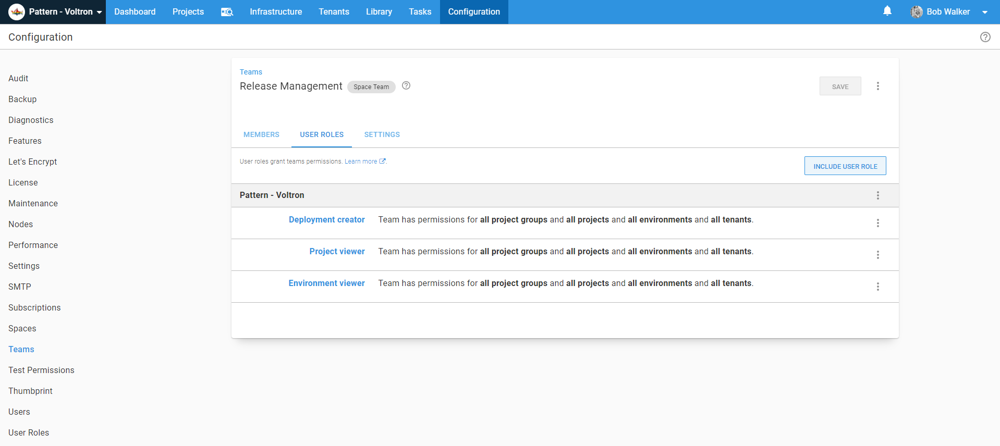

My [previous article](link) did a deep dive into the new [Deploy Child Octopus Deploy Project](https://library.octopus.com/step-templates/0dac2fe6-91d5-4c05-bdfb-1b97adf1e12e/actiontemplate-deploy-child-octopus-deploy-project).  The article covered a variety of scenarios except for multi-tenancy.  In this article I will do a deep dive into the multi-tenacy functionality of the [Deploy Child Octopus Deploy Project](https://library.octopus.com/step-templates/0dac2fe6-91d5-4c05-bdfb-1b97adf1e12e/actiontemplate-deploy-child-octopus-deploy-project).

:::success
This article assumes you read the previous article.  It will touch on some similiar points, but it won't rehash them.  
:::

## Sample Application

Just like the previous article, I have a sample application where each component is an Octopus Deploy project.  


There are a few key differences:

- These projects have been updated to use [Octopus Deploy's Multi-Tenancy feature](https://octopus.com/docs/deployment-patterns/multi-tenant-deployments).
- Two additional projects have been added, a single sign on project and a data conversion project.

The reason(s) why each component has a Octopus Project is:

- Minimize downtime by only deploying what has changed.
- Minimize build time by only building what has changed.
- Minimize the number of decisions a person has to make.
- Single responsibility principle, each project deploys one thing to the best of its ability.

A project per component helps reduce the amount of time it takes to deploy the software.  But nothing in life is free; the cost of saving time makes it harder to coordinate releases.

Back to the sample application, it is a SaaS application with the following business rules:

- Every customer gets the "core" product consisting of the Database, the Web API and Web UI.
- Every customer gets a **Staging** and **Production** environment.  The **Staging** environment allows their engineers to test any changes prior to being deployed to **Production**.
- Customers can purchase the Scheduling Service, Single Sign On app, and Data Conversion at an additional cost.
- Customers can pay extra for earlier access to changes deployed the **Test** environment.
- Customers must give their consent before a release is deployed to the **Production** environment.
- Purchasing a module requires a redeployment the core components, configuration files need to be updated, and the services need to be recycled to pick up the new functionality.

With that all in mind, let's meet our sample customers.

- **Internal**: this is an internal test customer used by everyone to test changes.  This customer exists across all four environments, **Development**, **Test**, **Staging**, and **Production**.
- **Coca-Cola**: this customer has paid for all the extra components plus access to preview releases in the **Test** environment.
- **Ford**: the bare-bones customer, they only have the four "core" components in the **Staging** and **Production** environments.
- **Nike**: they have purchased the scheduling service and single sign on app for use in the **Staging** and **Production** environments.
- **Starbucks**: they have purchased the scheduling service and data conversion service for use in the **Staging** and **Production** environments.

## Multi-Tenancy and the Deploy Child Octopus Deploy Project Step Template

Attempting to manage all these moving parts can be a headache.  So much so, you might be tempted to put everything into one large project and live with longer deployments and outage windows.  In an ideal state, you'd get the best of both worlds, an Octopus Project per component to make modularity easier, and a single deployment process.  That is what the Deploy Child Octopus Deploy Project Step Template was designed to accomplish.  It was designed to handle the following use cases: 

- Tenants are assigned to different projects.
- Tenants are assigned to different environments per project.
- Tenants are on different release schedules.
- Tenants require their own set of approvals, but a person should only have to approve a release once.
- Applications have to be deployed to tenants in a specific order.
- A customer might approve their change on Tuesday for a Thursday night deployment.

The end goal is to have a single release orchestration, or parent, project for your application.  You shouldn't have to worry about which tenants are assigned to which projects.  It has the necessary guard clauses in place to ensure the same process will work for the **Internal Customer** with all the bells and whistles _and_ **Ford** with the only the core components.


Before moving onto the scenarios, let's take a moment to examine how the step template handles different use cases for a multi-tenant parent project.

### Tenants not assigned to child projects

First off, the step template automatically detects you are doing a deployment with a tenant.  If a tenant is detected additional guard clauses are ran:

- Is the tenant assigned to the child project?  If no, exit the step, log a message and proceed onto the next step.
- Is the tenant assigned to the child project for that specific environment?  If no, exit the step, log a message, and proceed onto the next step.
- Is the child project configured to run multi-tenant?  If no, run the child project without supplying a tenant.

### Choosing a release

One of the core business rules of the step template is to pick the last successfully deployed release in the source environment.  Multi-tenancy adds an decision point when picking which release to promote.  Consider this scenario:


When the step template is told to promote the latest `2021.1.0.x` release to **Staging** for all tenants it will pick the following releases:

- **Internal**: 2021.1.0.15
- **Coke**: 2021.1.0.1 - this is the outlier
- **Ford**: 2021.1.0.15
- **Nike**: 2021.1.0.15
- **Starbucks**: 2021.1.0.15

How the step template works when not deploying a multi-tenant application is you provide it a destination environment (**Staging**), a channel (**Default** if no channel is provided), and a release number pattern (`2021.1.0.*`).  It will:

1. Use the channel's lifecycle to calculate the source environment, which in this case is **Test**.
2. Pull all the releases for that channel matching the `2021.1.0.*` pattern.
3. Loop through those releases to find the last release successfully deployed **Test**.  Not the newest release created, the last one deployed to **Test**.

Multi-tenancy adds a bit of complexity to that.

- Not all tenants are assigned to the **Test** environment, only **Coke** and **Internal** are.
- Tenants can have different releases.

The good news is Octopus already figures this out for us.  If were to pick the `2021.1.0.15` release from the **Filter by release** drop down menu the dashboard would change to this:


The step template hooks into that logic.  Internally the logic looks at `2021.1.0.15` for **Coke** and determines this cannot be deployed to **Staging** because the tenant is tied to the **Test** environment and that release hasn't been deployed to that environment.

When the step template looks at **Ford** it sees that tenant isn't tied to the **Test** environment.  It will then pick the latest release from the **Test** environment, regardless of tenant.  

## Using the Deploy Child Octopus Deploy Project Step Template

This section will walk through configuring some common parent project scenarios.  You can view the final project on our [samples instance](https://samples.octopus.app/app#/Spaces-603/projects/release-orchestration-multi-tenant/deployments).

### Scaffolding

Before jumping into the scenarios, there is some scaffolding to configure.  

#### Create a service account

First, we have to create a [service account](https://octopus.com/docs/security/users-and-teams/service-accounts) and assign that account to a team.  That is because the step template uses the Octopus Deploy API.

I recommend naming the service account "Release Conductor." Create an API key for the user and save it in a safe location.


Create a new team called "Release Management" and assign that user to it.


Assign the roles "Deployment Creator", "Project Viewer", and "Environment Viewer" to the team.  Assigning those roles will allow the service account to create a deployment and see the projects and environments, but not edit them.



If you want to leverage the auto-approval functionality, go to each manual intervention in the child projects add the release management team.


#### Create a unique lifecycle

The release orchestration project only needs to deploy to **Staging** and **Production**.  We don't want to use the default lifecycle that has all four environments in it.  Create a new lifecycle that only has **Staging** and **Production** in it.

:::success
The parent project and child project's lifecycles and channels _do not_ have to match.  The step template will determine if the selected release from the child project can be promoted to the destination environment
:::


#### Create the project

Next up is to create the project.  When you are creating the project, remember to select the new lifecycle created above.


Ensure the project is configured to require a tenant for all deployments.


After that, head over to the variables screen and add in the API key and the release pattern.


For each tenant connect the newly created project for the **Staging** and **Production** environments.  


### Scenario: Deploying the latest release for the Tenant from Test to Staging

Go to the deployment process in the newly created project and add a `Deploy Child Octopus Deploy Project` step for each child project.


Here are the values for each parameter.

- **Octopus API Key**: the API key variable, `#{Project.ChildProjects.ReleaseAPIKey}`.
- **Octopus Child Space**: leave the default value as-is; this example isn't creating a release orchestration project in another space.
- **Child Project Name**: the name of the child project.
- **Child Project Channel**: leave the default (empty) value as-is; the child project only has one channel.
- **Child Project Release Number**: The release pattern variable, `#{Project.ChildProjects.ReleasePattern}`
- **Child Project Release Not Found Error Handle**: leave the default value as-is, which says if the release doesn't exist, skip it.
- **Destination Environment Name**: leave the default value as-is, use the same environment as the parent project. 
- **Source Environment Name**: leave the default (empty) value as-is; this example will let the step template decide the source environment.
- **Child Project Prompted Variables**: leave the default (empty) value as-is; there are no prompted variables. 
- **Force Redeployment**: leave the default value as-is; the example won't be redeploying an existing release.
- **Ignore Specific Machine Mismatch**: leave the default value as-is, not adding deployment target triggers yet.
- **Save Release Notes as Artifacts**: leave the default value as-is.
- **What If**: leave the default value as-is; the approvals aren't getting added yet.
- **Wait for finish**: leave the default value as-is; this example will wait for the deployment to finish.
- **Wait for Deployment**: leave the default value as-is; 30 minutes should be more than enough.
- **Scheduling**: leave the default value as-is, this example requires a specific order for child projects.
- **Auto Approve Child Project Manual Interventions**: leave the default value as-is; this setting is moot right now as the example isn't dealing with manual interventions.
- **Approval Environment**: leave the default value as-is; this setting is moot right now as the example isn't dealing with manual interventions.
- **Approval Tenant**: leave the default as-is; this setting is moot right as the example isn't dealing with manual interventions. 

After adding and configuring the steps, it is time to create a release.  I will be making many changes to the parent project in this article; you might see `2021.1.0-RCx` for the release numbers.  


First, deploy the release to the **Coke** tenant.  


Wait for the release to finish.  For the Web API project you should see release `2021.1.0.1` get picked up to deploy.


For the other projects we should see `2021.1.0.15` get picked up.


The next question will be which release will be picked up when the tenant isn't assigned to **Test**, such as the case with Ford, Nike and Starbucks.


When that happens will be the most recent release to the **Test** environment.  In this case `2021.1.0.15`.  

Insert picture here!

### Scenario: Approval in parent project

So far we've configured the parent project to deploy all the projects in a specific order.  This works fine, until the child project has a manual intervention.  In this example application's case, each component project has two or three manual interventions.  Which means we are looking at 8 to 18 approvals, depending on the tenant, to submit.  That is very, very tedious.

In an ideal configuration, all the approvals are in in the parent project and they flow down to the child project.

The step template was designed with this scenario in mind.  But then there is the question, what is the person exactly approving?  With Octopus Deploy, all manual interventions occur as part of a deployment.  It is a chicken/egg scenario.  The step template provides "what-if" functionality, which when set, will do everything up to the point of doing the deployment.  This includes gathering all the release notes.

The flow of the parent project will be:

1. Run Deploy Child Octopus Deploy Project step templates in what-if mode.
2. Do all necessary manual interventions.
3. Run Deploy Child Octopus Deploy Project step templates in normal mode.

When running in what-if mode the following output parameters are set to be used later in the process.  

- **ReleaseToPromote**: the release number that meets all the requirements.  When no release is found this is set to N/A.  When the release has already been deployed to the target environment it will indicate that.
- **ReleaseNotes**: the release notes of the child project.  Includes the commit history and issues associated with the project when using build information.
- **ChildReleaseToDeploy**: indicates if there is a child release to deploy.  Will either be True or False.  Can use this for variable run conditions.

To configure this you will want to first clone all the existing steps.  You can do that by clicking on the `...` next to each step.


Rename each of the cloned steps.  Update the parameters in the cloned steps to be:

- **Save Release Notes as Artifacts**: Set to `Yes`.
- **What If**: Set to `Yes`.  

Next, reorder the steps by clicking the `...` next to the **Filter by name** text box and click the **Reorder** button.  

Insert reorder picture here!

Move all the steps you set to do a "whatif" to be above the "non-whatif" steps.

Insert post reorder picture here:

Next, we will want to add the manual intervention steps.  One of the features of the manual intervention step is the instructions.  The new step template will set output variables we can access.  For example:

```
Please approve releases for:

**Database: #{Octopus.Action[Get Database Release].Output.ReleaseToPromote}**
#{Octopus.Action[Get Database Release].Output.ReleaseNotes}

**Web API: #{Octopus.Action[Get Web API Release].Output.ReleaseToPromote}**
#{Octopus.Action[Get Web API Release].Output.ReleaseNotes}

**Scheduling Service: #{Octopus.Action[Get Scheduling Service Release].Output.ReleaseToPromote}**
#{Octopus.Action[Get Scheduling Service Release].Output.ReleaseNotes}

**Data Conversion: #{Octopus.Action[Get Data Conversion Release].Output.ReleaseToPromote}**
#{Octopus.Action[Get Data Conversion Release].Output.ReleaseNotes}

**Web UI: #{Octopus.Action[Get Web UI Release].Output.ReleaseToPromote}**
#{Octopus.Action[Get Web UI Release].Output.ReleaseNotes}

**Web UI: #{Octopus.Action[Get Sign Sign On Release].Output.ReleaseToPromote}**
#{Octopus.Action[Get Single Sign On Release].Output.ReleaseNotes}
```

I like to avoid duplicating effort. Let's add that as a variable.


Now add a manual intervention for each approver group.

Insert manual intervention picture here!

Reorder the deployment process once again; the new steps are between the "what-if" steps and the "non-what-if" steps.

Reorder steps picture here

Please create a new release and deploy it to **Staging**.

When you deploy to **Staging** you will see this message a lot.  That is expected, especially for this sample project.  The redeployment parameter is set to `No`, and we haven't created any new releases.

Insert already deployed message!

Promote that release to **Production**.  During this deployment, you'll see the manual interventions and auto-approvals in action.  First up, the manual intervention should have the version being deployed along with the release notes.

Insert rendered release notes!

Once every group has approved the release, the deployments will kick-off.  If the user associated with the API doesn't have permission to take ownership of the manual intervention, you will see a warning like this.  You will have 30 minutes to fix this problem, or the deployment will be canceled.


But once that is fixed, you should see a message similar to this in the child projects.


And with that, the release to **Production** is complete!

### Scenario: Approve Today Deploy Tomorrow

When your business rules require customer approval, the chances of them approving a deployment _during_ the actual deployment is slim.  Most likely, they will approve on Tuesday for a deployment on a Thursday (or next week).  It doesn't make sense to have a deployment sitting in **Production** awaiting manual intervention for days or even weeks.  What is needed is a **Prod Approval** environment that sits between **Staging** and **Production**.  This environment will _only_ be used for parent projects.

First, add the **Prod Approval** environment.  You will notice this environment sits between **Staging** and **Production** on this page.  I clicked the `...` to reorder the environments on this page.


Now that the new environment has been added, update the lifecycle used by this release orchestration project.


:::success
Keep an eye on the **Default Lifecycle.**  By default, that lifecycle doesn't have explicit phases defined.  Instead, it auto-generates the phases using the entire environment list.  To remove **Prod Approval** from the **Default Lifecycle**, you will need to add explicit phases.
:::

Next, update the approval steps to only run in the **Prod Approval** environment.  At the same time, configure the non-what-if steps to skip the **Prod Approval** environment.

Ad deployment process image here

Next, head over to the variables screen and add in two new variables:

- **Project.ChildProject.Approval.Environment.Name**: stores the **Prod Approval** environment name.
- **Project.ChildProject.Deployment.Environment.Name**: stores the name of the environment the child project should be deployed to.  For all environments except **Prod Approval**, the name will match the current environment.  When running this on the **Prod Approval** environment, the deployment environment name is **Production**.


Go into each step implementing the `Deploy Child Octopus Deploy Project` and update the following parameters:

- **Destination Environment Name**: update to `#{Project.ChildProject.Deployment.Environment.Name}`
- **Approval Environment**: update to `#{Project.ChildProject.Approval.Environment.Name}`.


:::success
By doing this, we are telling the step template to pull approvals from the **Prod Approval** environment rather than the **Production** environment during a **Production** deployment.  This means we can approve at 11 AM and schedule it to deploy at 7 PM.
:::

Let's see this all in action.  Create a new release for the parent project and pick a different tenant to deploy to.  Push that release through **Staging** and onto **Prod Approval**.  Submit everything for approval.

Insert image of approvals finished here!

Now promote that release to **Production** for that tenant.  