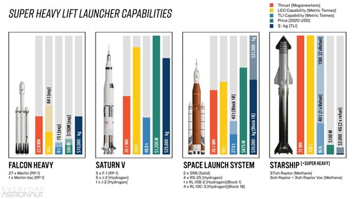
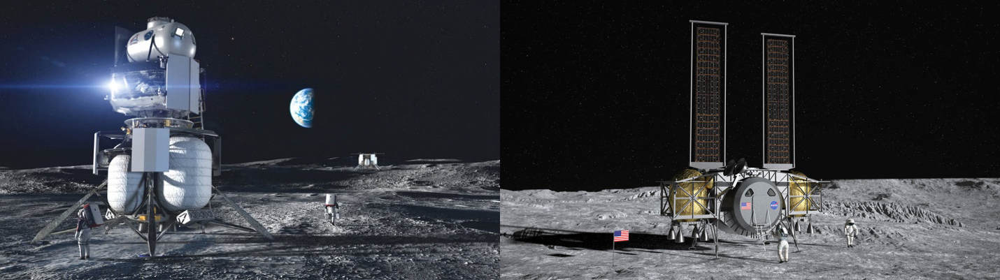
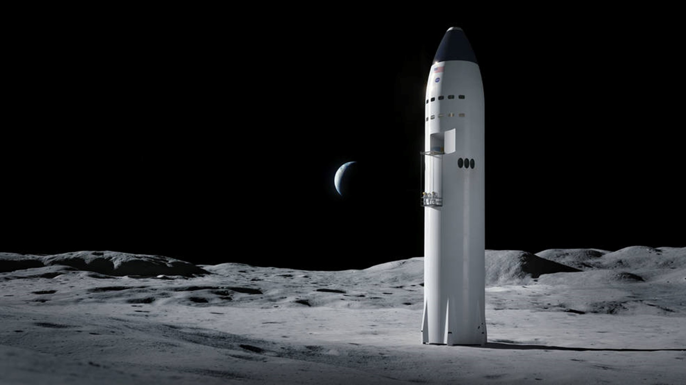

Back in December, I made a bet with my big brother.

He thought Starship SN8 (Serial Number 8) would make a clean landing. I gambled on a “RUD”, and I watched the live stream with a rather nice single malt. The “Rapid Unscheduled Disassembly” on the landing pad made for a pretty explosive climax. The following morning my brother dutifully performed his 100 sit ups.

<iframe width="560" height="315" src="https://www.youtube.com/embed/h74DxVtpcqk?start=12" frameborder="0" allow="accelerometer; autoplay; clipboard-write; encrypted-media; gyroscope; picture-in-picture" allowfullscreen></iframe>

Despite all the crashing and burning, this is not a story about failure.

I’m a fan of data, so let’s look at the stats. Tim Dodd, [The Everyday Astronaut](https://www.youtube.com/everydayastronaut) has produced the following slide. You can read about it in more detail in his epic [SLS vs Starship](https://everydayastronaut.com/sls-vs-starship/) post – which is an excellent read for anyone else who’s fascinated with space exploration. 

This slide compares four HLSs (Heavy Launch Systems / really big rockets): one existing, one historical, and two under development:

- Falcon Heavy, SpaceX’s currently operating rocket. 
- Saturn V, which took Neil, Buzz, and Michael to the moon in 1969.
- Space Launch System (SLS), under development by NASA and Boeing.
- Starship Super Heavy, under development by SpaceX.

For those readers who are not up on their space lingo, LEO means Low Earth Orbit, and TLI is Trans-Lunar Injection (a bigger orbit that gets you close to the moon).
 

There’s plenty to drill into here.

Let’s start by comparing the Saturn V to the SLS. You might think it’s a bit disappointing that in 2021 we are still designing a new rocket that’s barely an improvement on 50-year-old tech… And you’d be right. Why haven’t we improved?

Omitted from the slide above is the infamous Space Shuttle, another HLS with its own [special-kind-of-crazy design](https://www.youtube.com/watch?v=Ja4ZlswGvpE). While there’s a good argument that the SLS is a significant improvement on the Space Shuttle, the truth is that they are re-using a lot of the old tech. For example, those engines on the bottom of the SLS are the same Space Shuttle engines that were originally designed (at huge expense) to be re-usable, back in the 1970s.

(The *literal* same RS-25 engines. Not the same design. The same actual, antique engines. Physically removed from old space shuttles, reconfigured, and attached to new single-use rockets. After all that investment to make them re-usable, each engine will be used for a single mission, and then abandoned to burn up on re-entry.)

To quote Rear Admiral Grace Hopper: *"The most dangerous phrase in the language is ‘We’ve always done it this way’"*. Despite all the genuinely challenging engineering efforts, and 50 years of progress, the SLS strategy has been to rely on tried and tested tech where possible. This, combined with the fact that each new political administration has tended to move the goalposts and throw out the accomplishments of the prior administration, has resulted in an incomplete rocket that’s hardly an improvement on the 1960s Apollo rocket, both in terms of performance and cost. It’s basically doing the same thing.

Now look at Starship. Using either max payload to low-earth orbit or trans-lunar injection as the measure of performance, it’s not even close. Starship is a much more capable rocket, but the real kicker is the price. Starship will be able to take a kilo of cargo to the dark side of the moon for just $2,000 USD.

I just spent more than that on a new TV.

So how have SpaceX been able to outperform NASA/Boeing so comprehensively?

As I often do, I’m going to try and articulate it through the lens of [Simon Sinek’s Start with Why](https://www.ted.com/talks/simon_sinek_how_great_leaders_inspire_action).

## Why: Self-sustaining civilization on Mars

SpaceX started with a well-defined goal and a blank sheet of paper, rather than complicated contractual obligations and an instinct to re-use what they already had.

Everything that SpaceX does, is about creating a self-sustaining civilization on Mars. That goal won’t seem important to everyone, but to a lot of people, it’s incredibly exciting. I imagine that the folks who work for SpaceX are pretty darned engaged.

Having a clear mission is a fantastic way to focus the mind. It encourages folks to direct all their energies with “The Goal” in mind, which lends itself perfectly to [Lean development ideas](https://octopus.com/blog/devops-reading-list#goal).

## How: Solving the transportation problem

From SpaceX’s goal it’s possible to extrapolate the biggest constraint: Mars is pretty hard to get to.

If any scientific, commercial or government entity is considering doing anything on Mars, it’s significantly easier if you know that when you are ready to go, it’ll be possible to buy a ticket on a Starship for a predictable and affordable price.

Imagine if the Apollo program had the option of buying a ticket on a Starship. Sure, they would still have needed to figure out how their astronauts were going to survive on the lunar surface – but the Saturn V would not have been necessary, saving the US taxpayer a fortune.

## What: Cheap, powerful rockets

A commercially viable Mars or Moon rocket, that’s capable of supporting a base/city, would need to be significantly cheaper than the current models. It would also need to be capable of transporting significantly greater payloads over much bigger distances. There are a few key features about Starship that make this possible:

**Reusability:** 

As Elon Musk often says, “imagine, if you built a new 747 for every flight”. How much do you think the average ticket from Heathrow to JFK would set you back? Reusability is the holy grail of affordable spaceflight.

Before SpaceX, the Space Shuttle had also aimed for reusability. Unfortunately, it failed miserably. 

The big orange fuel-tank wasn’t reusable. The white side boosters parachuted back to earth and were fished out of the ocean. However, preparing them for re-use after they’d been swimming in salt-water was terribly inefficient. For the SLS, they’ve taken those side-boosters and “upgraded” them to be single use rockets, saving the “expense” of re-using them. As for the “space plane”, the astronomical cost of renovating the shuttle between launches, coupled with the maddeningly inefficient design, rendered the whole process more expensive than most single-use rockets.

In contrast, Starship is designed to be fully and efficiently reusable – including the “Super Heavy” first-stage rocket. All the rockets can land themselves on pads or drone ships. [SpaceX is even aiming to land Starships directly on the launchpad, ready to relaunch just 1 hour later](https://www.independent.co.uk/life-style/gadgets-and-tech/space/elon-musk-spacex-falcon-heavy-rocket-b1780793.html). For comparison, on average it takes 1½ to 2 hours to turn around a 747, and it took over a year to turn around a Space Shuttle.

**Engine/Fuel:** 

Starship is powered by Raptor engines. These engines are powered by oxygen and methane. 

*(If the use of methane concerns you, remember that it’s unburnt methane (cow farts) that’s especially horrible for the environment. The act of burning methane actually reduces its greenhouse effect. Burning methane contributes less to global warming than burning traditional fossil fuels. While there are no truly green rocket fuels, methane is one of the least bad. [More detail here](https://everydayastronaut.com/rocket-pollution/).)*

Methane burns cleanly, which is a significant help with the reusability goal. However, the really clever thing about using oxygen/methane is that both can be harvested on Mars. The oxygen (80% of the fuel mass) exists in the thin Martian atmosphere and the Methane could (in theory) either be generated from ice (if they can mine for it) or from a smaller batch of hydrogen that they could take with them (more realistic in the early days).

In theory, SpaceX could set up an automated propellant factory on Mars with a small quantity of nickel and roughly one Starship load of solar panels. This could give later crewed missions the confidence that their return fuel is already waiting for them before they even leave home. 

More fundamentally, the ability to harvest the return fuel on Mars makes the entire operation significantly more practical. If each rocket needed to carry the return fuel on the outbound trip, the challenge would be orders of magnitude more difficult. We would be talking about sending a couple of astronauts in a tiny lander and returning a few small rocks. By generating the return fuel on Mars, SpaceX is able to realistically talk about sending hundreds of settlers at a time to build self-sustaining cities.

**Refueling in orbit:** 

Starships are designed for refueling in orbit. Most of the fuel needed to launch a rocket to the moon/Mars will be used up in the first few minutes just to reach Earth orbit. Just look at a Saturn V rocket and think about how much of the rocket was discarded during the initial launch sequence.

Once a moon/Mars-bound Starship has made it into orbit, it would rendezvous with one or two more Starships to refuel, before plotting its course across the solar system. That makes it possible to carry much less fuel (and hence, much more payload) during the initial launch sequence.

**Putting it all together:**

Combine those three key features, and you can begin to appreciate how SpaceX is able to deliver a rocket that is such a giant leap, compared to the Saturn V, Space Shuttle, or SLS. 

As a demonstration of the sort of leap SpaceX has taken, [NASA recently selected three potential lunar landers](https://www.nasa.gov/feature/nasa-selects-blue-origin-dynetics-spacex-for-artemis-human-landers) for its upcoming moon program. Two of them (Blue Origin and Dynetics) have proposed small, light, bungalow-sized, spidery-looking vehicles that would probably travel on an SLS, Starship or Blue Origin’s New Glenn rocket. These new landers look a bit like the Apollo landers.  

*(A brief side note on Blue Origin, another SpaceX competitor, headed by Jeff Bezos: There was a time when folks dismissed SpaceX. Blue Origin was better funded. Musk was successful, but Bezos was in a different league. [Blue Origin actually managed to land it’s New Shepard rocket in Nov 2015](https://web.archive.org/web/20151125051400/https:/www.blueorigin.com/news/news/blue-origin-makes-historic-rocket-landing), a month before [SpaceX landed a Falcon 9](https://www.theverge.com/2015/12/21/10640306/spacex-elon-musk-rocket-landing-success), although the Falcon 9 was a much bigger rocket so landing it was a significantly more impressive feat. Since then, Blue Origin simply hasn’t kept up. Like the SLS, the New Glenn is less powerful than a Starship, further behind in development, and improving less quickly. For me, comparing SpaceX to Blue Origin is like comparing the Wright brothers to Samuel Pierpont Langley. If you’ve never heard of Samuel Pierpont Langley, fast-forward [that Simon Sinek TED Talk](https://www.ted.com/talks/simon_sinek_how_great_leaders_inspire_action) to 7:50.)*

Anyway: moon landers. The third “lander” option was a full-blown, skyscraper-sized, Starship. Imagine how many more people and how much more equipment something that size could ferry to the moon. If your intention is to set up a moon base, it’s easy to imagine how much more effective Starship could be.

Of course, if NASA does select Starship, that would make the SLS redundant for any such moon mission. (And the SLS was specifically designed for these sorts of missions.)

## Fun story, but what’s this got to do with DevOps?

It’s time to look at the “how” part in more detail.

When I talked about “how” above, I simply highlighted that SpaceX was going to achieve its “why” by solving the transportation problem, and then I jumped straight into the “what”, discussing some of the key features/benefits of Starship over the SLS. What I’d like to do now, is dig into SpaceX’s development philosophy, that’s delivering these revolutionary new features.

SpaceX is embracing many DevOps ideas and patterns to deliver the features it needs to reach its goal. However, when your product is a space rocket, instead of some software package, the application of these ideas looks a bit different.

Fundamentally, it comes down to having a mature relationship with risk. (And for the time being, I’m talking about uncrewed/prototype rockets, rather than crewed or commercial missions.)

**Iterative development rocks. MTBF metrics suck.**

The principle that practice beats theory is hardly rocket science. The best way to learn is to do. The best way to build a successful rocket is to build a cheap prototype, see if it works, and iterate. Spending years to design a rocket on paper, in the hope that it will launch successfully at the first attempt, is unlikely to be as effective.

However, rocket launches are expensive. When they go wrong, they make excellent clickbait. If it’s framed unkindly, all those “deployment failures” could create some bad PR. A short-sighted, but widespread, response to this PR problem is to exert far too much energy into avoiding failures and not enough energy into minimizing their consequences.

A common red flag is seeing people make their primary focus some sort of MTBF (Mean Time Between Failure) metric. It may well be desirable that rockets blow up less frequently but making MTBF the goal is counterproductive. I talked about this phenomenon in more detail last summer in my aggressively titled post, [Change Advisory Boards Don’t Work](https://octopus.com/blog/change-advisory-boards-dont-work).

As with Agile and DevOps, so with rocketry. The best way to create a safe rocket is to truly put it through its paces over and over again. In the early days, there will probably be a lot of RUDs, and they’ll make good TV. However, through those RUDs, SpaceX will learn about the tolerances and limits of their systems and become skilled at staying within those limits.

The key to this is, in the early days, put more effort into learning than MTBF. And that’s what SpaceX is doing right now with Starship.

**Focus on MTTR. Make it safe to fail.**

Of course, if each launch is prohibitively expensive, then regardless of the management mentality, a company will likely go bust if it suffers too many failures. The trick is to accept risk as a normal part of doing business. The focus then turns to minimizing the consequences of failure (perfectly practical), rather than eradicating the possibility of failure (impossible). 

At SpaceX, they are investing their efforts into building a steady stream of prototype rockets, rather than over-investing in any one specific rocket. As I write this blog post, Starship SN9 is sat on the launch pad in Boco Chica. It’s a refined version of SN8. Hopefully, it will fly before I finish writing this post.

However, the fact that SN9 is already on the pad is not the real story. SN10 is already about to be wheeled out of the hanger and SN7.2, (an updated version of one of the fuel tanks) is also hanging around following a successful pressure test earlier this week.

I think this photo best demonstrates the way SpaceX is approaching rocket design and testing like a conveyor belt.

<blockquote class="twitter-tweet">
Starship SN9, SN7.2 &amp; SN10(background)! 🚀🚀 <a href="https://t.co/NLMotW9wM5">pic.twitter.com/NLMotW9wM5</a>
&mdash; RGVAerialPhotography (@RGVaerialphotos) <a href="https://twitter.com/RGVaerialphotos/status/1352996328805175296?ref_src=twsrc%5Etfw">January 23, 2021</a></blockquote> 

***EDIT:*** *Between drafts, SN10 has been wheeled out to the pad.*

<blockquote class="twitter-tweet">
Sunset lift of Starship SN10 as Starship SN9 awaits flight <a href="https://t.co/EOW6H8AX1B">pic.twitter.com/EOW6H8AX1B</a>
&mdash; John Kraus 📷🚀 (@johnkrausphotos) <a href="https://twitter.com/johnkrausphotos/status/1355309250462019593?ref_src=twsrc%5Etfw">January 30, 2021</a></blockquote> 

It’s also become clear to observers, that since SpaceX has learned so much from SN8, they’ve scrapped the partially built SN12-14 models and have begun focusing their efforts on SN15, which will be a significant upgrade:

<blockquote class="twitter-tweet">
The current status of SpaceX&#39;s Starship &amp; Superheavy prototypes. 30th January 2021 <a href="https://t.co/C60oOcFlg6">pic.twitter.com/C60oOcFlg6</a>
&mdash; Brendan (@brendan2908) <a href="https://twitter.com/brendan2908/status/1355246058905825282?ref_src=twsrc%5Etfw">January 29, 2021</a></blockquote> 

They are pushing “[disposable infrastructure](https://martinfowler.com/bliki/ImmutableServer.html)” to the limit.

Like SpaceX, the most successful IT organizations have learned to [treat their hardware like cattle, instead of pets](http://cloudscaling.com/blog/cloud-computing/the-history-of-pets-vs-cattle/). The servers are given numbers instead of name, then when they're sick, nobody is tempted to nurse them back to health. 

This is possible because the servers, and all their config, are defined in source code. Fresh, healthy servers can be spun up a quickly and cheaply. Issues can be resolved fast by swapping sick servers out. Investigation and learning can happen later, in a calm manner, without some stakeholder standing over the engineers’ shoulders complaining about downtime, lost revenue, or PR.

These changes allow us to move away from MTBF metrics in favor of MTTR (Mean Time To Restore) metrics and promote a sane relationship with risk. Failures will happen. The mature response is to invest more energy into your ability to respond quickly, than into painful bureaucracy and red tape, in the vain hope of stopping the inevitable.

At SpaceX, they’ve invested in the ability to rapidly throw together a prototype, test it, and iterate. In IT, we’ve moved from large, fragile servers, to the source code that defines them, and the ability to redeploy them at a moment’s notice.

The SLS? They have a starting inventory of 15 antique RS-25 shuttle engines, and they plan to discard 4 engines per flight. So far, they haven’t started manufacturing any replacements, so each engine in their current inventory has a lot riding on it. If any of those engines were to become sick, I expect NASA would face an expensive bill from the rocket vet.
Frankly, my money is on NASA canceling the SLS before they need to build more RS-25s.

**Psychological Safety**

This switch from an MTBF to an MTTR mindset is only possible when employees know they will be supported if stuff goes bang. Blame, scapegoating, and job losses are not compatible with innovation. When folks cling to the safety of old deployment patterns, damaging bureaucracy and politics, it’s hard for them to accept failure as an option.

There is no doubt that cultural change is the hardest part of any transformation. However, when senior leadership acknowledge the risk and signals that they will support their teams if things fail, the engineers are significantly more likely to take risks, experiment. and learn.

Elon Musk is a perfect example. In the hours before the launch, he publicly acknowledged the risk, and reassured his employees that they should focus on reaching for the stars, rather than covering their backs: 

<blockquote class="twitter-tweet">
Probably 1/3 chance of completing all mission objectives
&mdash; Elon Musk (@elonmusk) <a href="https://twitter.com/elonmusk/status/1336141388379873282?ref_src=twsrc%5Etfw">December 8, 2020</a></blockquote> 

Immediately afterwards, despite the fireball, he congratulated his team on the success of the mission. He reinforced the message that the objective was to learn and iterate, and that this was achieved.

<blockquote class="twitter-tweet">
Fuel header tank pressure was low during landing burn, causing touchdown velocity to be high &amp; RUD, but we got all the data we needed! Congrats SpaceX team hell yeah!!
&mdash; Elon Musk (@elonmusk) <a href="https://twitter.com/elonmusk/status/1336809767574982658?ref_src=twsrc%5Etfw">December 9, 2020</a></blockquote> 

**Sharing over secrecy**

In the early days of DevOps, John Willis and Jez Humble defined the movement with the acronym Calms: Culture, automation, lean, measurements, sharing. The tweets above are a great demonstration of several of those attributes. However, the fact that the tweets exist at all is testament to the value of sharing.

In an era where many other government and commercial space programs are shrouded in secrecy, SpaceX is bucking the trend. For example, SpaceX habitually livestreams their launch attempts – even when they expect RUDs. As a result, they’ve gained a huge cult following, with thousands of rocket enthusiasts tuning in to watch their progress with each iteration.

This hype has many great consequences for SpaceX. It helps them to set expectations and it’s great marketing. It also focuses more eyes on the challenges.

If this is how open SpaceX are externally, one can only imagine how freely folks share designs and ideas internally. Innovation is far more likely when more smart people have an opportunity to mull over a problem, and when the people who are ultimately responsible for solving it are given the autonomy to freely adopt the best ideas.

Some readers might be confused about the apparent lack of effort to protect SpaceX’s IP. However, I suspect they are comfortable enough in their ability to innovate faster than any competitor piggybacking on their designs. And if you find that unlikely, [Elon has a track record for sharing his patents](https://www.bbc.co.uk/news/business-27824698), further demonstrating his devotion to the causes he’s devoted his life to.

## Starship SN9, SN10, SN15 and beyond…

SpaceX is invigorating. Their approach is reminiscent of the Apollo program, led by a fascination with learning and achieving inspirational things. You could see the development from one launch to the next. It was exciting.

However, Starship is still in development. Perhaps it won’t work. All those great statistics are wonderful in theory, but are they really achievable?

Honestly, I don’t know.

And would it be appropriate to still prioritize MTTR over MTBF once Starships start carrying commercial cargo – or even humans?

Well, this depends a bit on what we mean by MTTR. If we mean “is it OK for a Starship with human passengers to blow up”, clearly not. However, if the question is “is it OK for a Raptor engine to fail?”, well, I suspect there’s a reason SpaceX plans to strap about 40 of them to the bottom of each Starship. That’s a pretty effective HA/DR strategy.

The SLS, in contrast, is designed to have just 4 RS-25 shuttle engines. I’m no rocket scientist, but I imagine that if one or two of them fail during a launch, it would be a riskier situation for the passengers.

Perhaps the best indication of SpaceX’s ability to pull this off is to look at their track record. Since 2017, [they’ve launched 81 Falcon 9 rockets](https://en.wikipedia.org/wiki/List_of_Falcon_9_and_Falcon_Heavy_launches) with a 100% success rate, averaging about 20 launches per year. The earlier launches were tests, but the later ones were carrying commercial cargo. A couple of them even carried humans.

Compare that record to the Space Shuttle. In total the Space Shuttle launched 135 times between 1977 and 2011 (plus 5 test missions). That’s only ~20% of the launch frequency that SpaceX is delivering. In that time, the Space Shuttle suffered two tragic failures. 788 people have flown in a Space Shuttle and 14 people were killed in either Challenger or Columbia. That’s a 1/56 fatality rate, which is awful.

I’d like to finish on a positive note. As a child I watched cartoons like [Wallace and Gromit](https://www.youtube.com/watch?v=T0qagA4_eVQ&t=4s), [Looney Tunes](https://www.youtube.com/watch?v=vXB9823Qg9E) and [Mickey Mouse](https://youtu.be/urn936F_Ez4?t=179), where full-sized pointy rockets landed on the moon. As an adult, I learned to think of those cartoons as silly science-fiction. Then, on February 6th 2018, I watched this:

<iframe width="560" height="315" src="https://www.youtube.com/embed/l5I8jaMsHYk?start=85" frameborder="0" allow="accelerometer; autoplay; clipboard-write; encrypted-media; gyroscope; picture-in-picture" allowfullscreen></iframe>

Seriously, compare the link to the Mickey Mouse carton above to [this view of Starship SN8 landing attempt](https://youtu.be/h74DxVtpcqk?t=64). SpaceX fans call that the “Crazy Elon”.

SpaceX’s innovative approach to rocket engineering has redefined what’s possible with space exploration. It’s done so using many of the same techniques that the DevOps community has embraced with [demonstrably effective results](https://octopus.com/blog/devops-reading-list#accelerate).

SpaceX’s next launch attempt is likely to go ahead any day now. When it does, I’ll be watching, and so will my bother. This time, I’m betting on a successful landing. That said, whether they land the thing, isn’t important. What matters is that they keep learning, iterating, and improving.

***EDIT:*** *2nd Feb 2021: Wow, that was incredible! Check out the video below. I've already fast-forwarded to the landing on your behalf. Remember, with SN10 already sitting on the pad, the real story here is that SpaceX can iterate through giant space rockets more quickly than I can write a blog post. And I'm already pumped about SN10!*

<iframe width="560" height="315" src="https://www.youtube.com/embed/l4-PwxnJimg?start=16246" frameborder="0" allow="accelerometer; autoplay; clipboard-write; encrypted-media; gyroscope; picture-in-picture" allowfullscreen></iframe>
