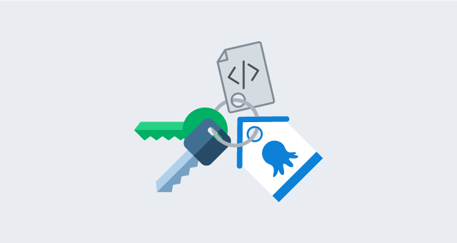
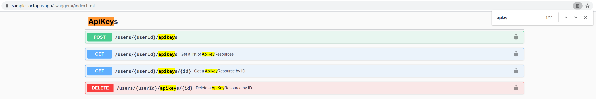
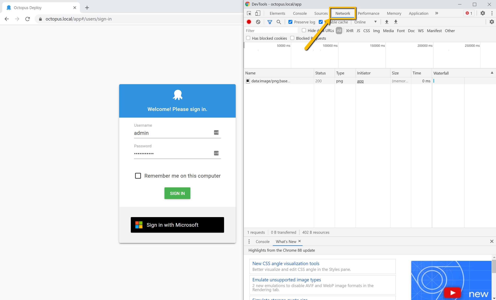
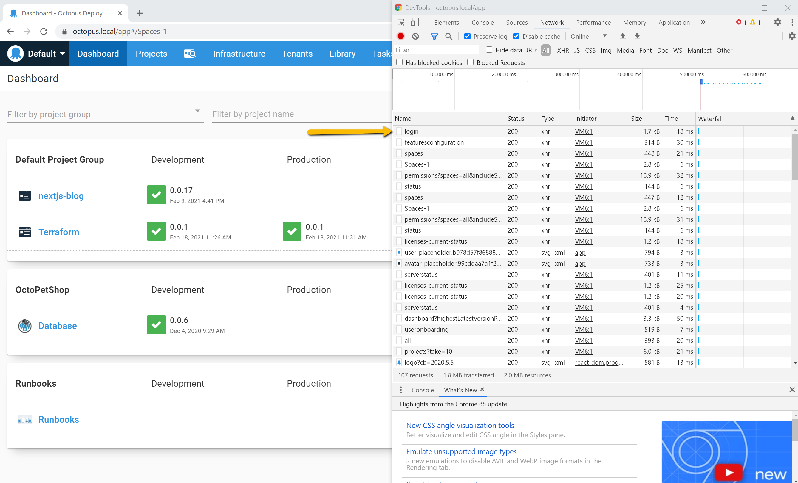
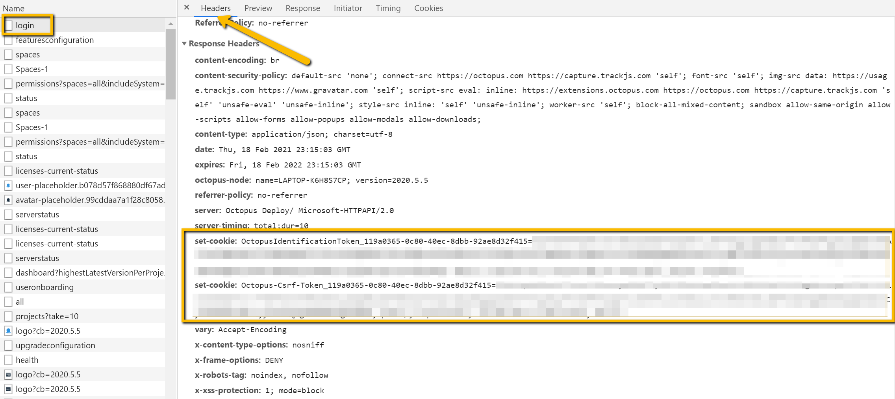
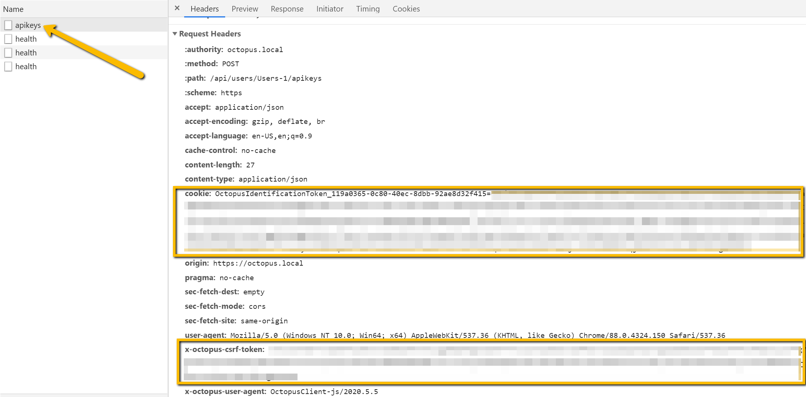

Advanced users of Octopus will already be familiar with the robust [Octopus REST API](https://octopus.com/docs/octopus-rest-api). Octopus is designed API first, so anything you can do in the Octopus Web Portal, you can do with the API. Before you can interact with the API, however, you need to create an Octopus [API key](https://octopus.com/docs/octopus-rest-api/how-to-create-an-api-key). These steps require a human, but it's possible to automate the process. 

In this blog post, I walk through scripting the creation of an API key for use with the Octopus REST API.

The final script is available in a [GitHub gist](https://gist.github.com/pstephenson02/3cf2dc3b9d68db28722ad568c9eb49eb).

## The Swagger API docs

The first place I go when I want to automate something with the Octopus API is the Swagger docs. Each Octopus Server comes with a built-in route where all API documentation is published. Just add `/swaggerui` to the base URL path of your Octopus Server. For example: [samples.octopus.app/swaggerui](https://samples.octopus.app/swaggerui).

The generated page is organized by API [resources](https://cloud.google.com/apis/design/resources), and there are lots of them. Let's do a `CTRL-F` to find `apikey`:



The first row under ApiKeys: `POST /users/{userId}/apikeys` allows us to create a new API key for the specified user. Because API keys in Octopus are associated with an Octopus user, the keys inherit the permissions assigned to that user.

:::hint
It's best practice when provisioning new API keys to set up [Octopus Service Accounts](https://octopus.com/docs/security/users-and-teams/service-accounts) dedicated to specific functions or integrations.
:::

Let's assume we know our `{userId}` and use a quick one line PowerShell cmdlet to create an API key:

```pwsh
> Invoke-RestMethod -Method Post -Uri https://samples.octopus.app/api/users/Users-561/apikeys -Headers @{'X-Octopus-ApiKey'='API-XXXX...'} -Body (@{'Purpose'='Just blogging'} | ConvertTo-Json)

Id      : apikeys-I6D74k9rh7eyoqXDlqJCvlsVgU
Purpose : Just blogging
UserId  : Users-561
ApiKey  : API-XXXX...
Created : 2/18/2021 2:25:49 PM
Expires :
Links   : @{Self=/api/users/Users-561/apikeys/apikeys-I6D74k9rh7eyoqXDlqJCvlsVgU}
```

You might notice in this example, that we already have an API to create a new API key.

## Creating an API key when you don't already have an API key

Imagine you're writing automation to provision the Octopus Server itself. You've written scripts using the [Octopus Deploy Chocolatey Package](https://chocolatey.org/packages/OctopusDeploy/), the [Octopus.Server.exe command-line tool](https://octopus.com/docs/octopus-rest-api/octopus.server.exe-command-line), or even the new [Octopus Deploy Terraform Provider](https://octopus.com/blog/octopusdeploy-terraform-provider). You don't want to break off in the middle of your provisioning automation because you need to log in to your Octopus Server, create an API key, then manually plug the key into the rest of your automation.

When you create new users in Octopus, those users don't have API keys, but the Octopus Web Portal lets them create API keys when they log in. And if the browser can do it, so can we. Here's what to do:

1. Simulate the browser login with a username and password.
2. Retrieve any necessary cookies sent back to you from the Octopus Server.
3. Use the cookies to make the same request the browser does when creating a user's first API key.

When you first [install the Octopus Server](https://octopus.com/docs/installation#install-octopus), the installer asks you to create a _Local System Account_ or _Custom Domain Account_. For simplicity, let's assume you have a Local System Account. You can also create one using the **Octopus.Server.exe** CLI's [`admin`](https://octopus.com/docs/octopus-rest-api/octopus.server.exe-command-line/admin) command.

## Inspecting browser activity with Chrome DevTools

You need to inspect what's happening in the browser when you log into your Octopus Web Portal. Let's use [Chrome's built-in DevTools](https://developers.google.com/web/tools/chrome-devtools). 

1. Navigate to your Octopus Web Portal login page.
2. Either right click on the page and select **Inspect**, or use the hot keys **Ctrl-Shift-i** to open DevTools. 
3. Select the **Network** tab shown in the screenshot.
4. After entering your username and password, click **Sign In**.



In the DevTools window you should see Chrome recording the many requests occurring during login. These requests include necessary asset files (js, css, etc.), resource requests for initializing the Octopus Dashboard, and more. Scroll back up to the top of the sequence and look for the request labeled **login**:



Click the **login** request. A window to the right of the requests list will appear, displaying the additional information. This window has its own set of tabs, you need to select **Headers**. 

Scrolling to the bottom of the Headers page shows you the exact request body used. This will be important when you build your request in PowerShell. Inspecting the **Response headers** also gives you some important information:



The Octopus Server sends back two **Set-Cookie** headers to the browser after logging in, which the browser stores in its cookie storage. Upon subsequent requests to the same domain the browser is programmed to send those cookies in the **Cookie** header. This is how the Octopus Server recognizes your unique session. 

Let's write some PowerShell to simulate part of that process:

```pwsh
$octopusUrl = 'https://samples.octopus.app'
$username = 'admin'
$password = 'your-password'

$loginPath = "$octopusUrl/api/users/login"

$response = Invoke-WebRequest -Method Post `
    -Uri $loginPath `
    -Body (@{'Username' = $username;'Password' = $password} | ConvertTo-Json) `
    -SessionVariable 'session'
```

A few things to note here: 

- We use the `Invoke-WebRequest` cmdlet here rather than `Invoke-RestRequest` because we need access to the response headers directly to get the cookies. 
- The `-SessionVariable` parameter creates a variable `$session` of type [WebRequestSession](https://docs.microsoft.com/en-us/dotnet/api/microsoft.powershell.commands.webrequestsession?view=powershellsdk-7.0.0) which makes it easy to get the cookies, as we'll see next. 
- The response body contains the `User ID`, which we'll also need for the next request. 

Let's store the variables we need:

```pwsh
$userId = ($response.Content | ConvertFrom-Json).Id
$csrfToken = $session.Cookies.GetCookies($loginPath) | Where-Object { $_.Name.StartsWith('Octopus-Csrf-Token') }
$sessionToken = $session.Cookies.GetCookies($loginPath) | Where-Object { $_.Name.StartsWith('OctopusIdentificationToken') }
```

Now, you could add these two tokens to the `Cookie` header and hope it works. But since we're using Chrome DevTools already, we can record the request made to generate an API key, and understand how the browser uses these values. 

In the Octopus Web Portal, navigate to your profile page and then the **My API Keys** page. With DevTools still open and recording, let's create an API key and look for the `apikeys` POST request shown in the screenshot below. Take a close look at the Request Headers:



If you compare the two `Set-Cookie` response headers you received after your login request, you can see exactly how the browser uses the values. Now you can complete your request:

```pwsh
$headers = @{
    'Cookie' = $sessionToken.Name + '=' + $sessionToken.Value
    'X-Octopus-Csrf-Token' = $csrfToken.Value
}

Invoke-RestMethod -Method Post `
    -Uri "$octopusUrl/api/users/$userId/apikeys" ` # $octopusUrl is defined at the top of the script
    -Headers $headers `
    -Body (@{'Purpose'='Just Blogging'} | ConvertTo-Json)
```

### The complete script

```pwsh
$octopusUrl = 'https://samples.octopus.app'
$username = 'admin'
$password = 'your-password'

$loginPath = "$octopusUrl/api/users/login"

$response = Invoke-WebRequest -Method Post `
    -Uri $loginPath `
    -Body (@{'Username' = $username;'Password' = $password} | ConvertTo-Json) `
    -SessionVariable 'session'

$userId = ($response.Content | ConvertFrom-Json).Id
$csrfToken = $session.Cookies.GetCookies($loginPath) `
    | Where-Object { $_.Name.StartsWith('Octopus-Csrf-Token') }
$sessionToken = $session.Cookies.GetCookies($loginPath) `
    | Where-Object { $_.Name.StartsWith('OctopusIdentificationToken') }

$headers = @{
    'Cookie' = $sessionToken.Name + '=' + $sessionToken.Value
    'X-Octopus-Csrf-Token' = $csrfToken.Value
}

Invoke-RestMethod -Method Post `
    -Uri "$octopusUrl/api/users/$userId/apikeys" `
    -Headers $headers `
    -Body (@{'Purpose'='Automation'} | ConvertTo-Json)
```

## Conclusion

Scripting the creation of API keys can be useful for new service users, provisioning your Octopus instance, or for use with the Octopus Terraform Provider.

Using Chrome DevTools (or the Firefox, Edge, or Safari equivalents) is a powerful way to see what's happening in the interactions between the Octopus front end Web Portal (a single page React app) and the Octopus REST API. Occasionally you may find the Swagger documentation is just slightly off or doesn't have all the information you need and using the browser's tools can give you a definitive answer.

Interested in learning more about the Octopus REST API? Check out our recent webinar:
[Using the Octopus API to save time by automating repetitive tasks](https://www.youtube.com/watch?v=ACb2sHWoZto).

Happy deployments!
