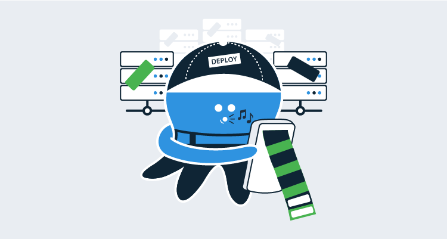

Continuous Integration (CI) typically involves three components: 

1. A source control server
1. Issue tracking
1. A build server

Tools such as Azure DevOps combine all components into a single solution whereas other configurations separate them. For instance, you might use GitHub for source control, TeamCity for build, and Jira for issue tracking. When it comes to Continuous Delivery (CD), commits and issue tracking are important to ensure the correct version of the software is deployed. With Octopus Deploy, you can include [build information](https://octopus.com/docs/packaging-applications/build-servers#build-information), such as commits and issues, as part of your release.  

:::hint
It's important to note that while commits will work in all cases, issue tracking will only function if you have one of the following integrations configured in Octopus Deploy:

- Azure DevOps Issue Tracking
- GitHub Issue Tracking
- Jira Integration
:::

In this post, I walk through configuring TeamCity and Octopus Deploy to include build information and how this can be used during the deployment process.

## Example scenario
For this demonstration, I use the scenario described above: GitHub ([OctoPetShop](https://github.com/OctopusSamples/OctoPetShop)), TeamCity, and Jira. I address these specific technologies, but the overall process is similar regardless of which tools you use.

This post assumes you already know how to create a project within Jira.

### Create an issue
We'll start off by logging a bug in Jira for the OctoPetShop application. 

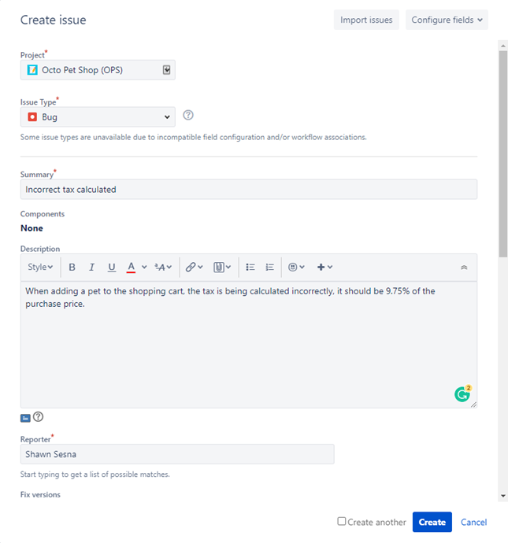
  
After the issue has been created, we need to take note of the `key` value, as we need this to correctly tag our commits.  In this case, the value is `OPS-1`.

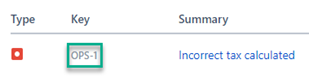


### Connect a commit to an issue

How you connect a commit to an issue varies depending on the issue tracker you are using. For Jira, your commit message needs to use the following format:

```
git commit -m "[key-value] Commit message"
```

For our example, our commit message would look like this:

```
git commit -m "[OPS-1] Fixed tax rate calculation.  Tax rate now pulled using new tax rate service"
```

## Configure the build to push build information

Octopus Deploy provides built-in integration with many [build servers](https://octopus.com/docs/packaging-applications/build-servers) in the form of plugins:

- Azure DevOps
- TeamCity
- Jenkins
- Bamboo

In addition to the available plugins, there are some community-supported integrations with online-only build servers:

- CircleCI
- GitHub Actions
- BitBucket Pipelines
- AppVeyor

For this demonstration, we're using TeamCity. 

1. Add a new step to your build definition by choosing the **Octopus Deploy: Build Information** runner. 
1. Fill in the required values:
- **Octopus URL**: URL to your Octopus server
- **API key**: API key with permissions to push build information
- **Space name**: Name of the space to push to (leave blank for default)
- **Package IDs**: List of packages to apply the build information to

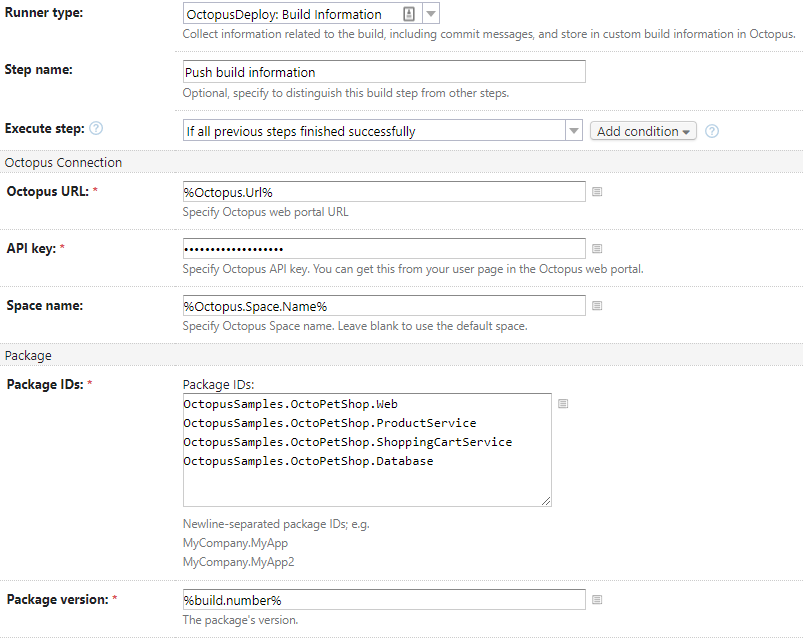

Issuing a build, we can see our change has been picked up by the build server.

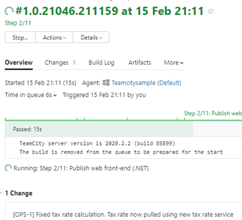

## Configure the issue tracking integration

As mentioned, issue tracking for build information will not work until you configure the corresponding integration in Octopus Deploy. For this demonstration, we need to configure the [Jira integration](https://octopus.com/docs/releases/issue-tracking/jira).  

1. Navigate to the **Configuration** tab in Octopus Deploy and click **Settings**.
1. Click `Jira` and fill in the required information:
- **Jira Instance Type**: Cloud or Server
- **Jira Base URL**: URL to Jira
- **Jira Connect App Password**: Password for the connection
- **Octopus Installation ID**: ID of your Octopus Installation from the Octopus Deploy plugin in Jira
- **Octopus Server URL**: URL to your Octopus server
- **Is Enabled**: Check-box for enabling the integration

With our integration configured, navigate to the **Library** tab and select **Build Information**.  

On this page, we can see the build information has been uploaded to Octopus Deploy for the packages for OctoPetShop. Clicking on one of these will show the commits and issues related to it.

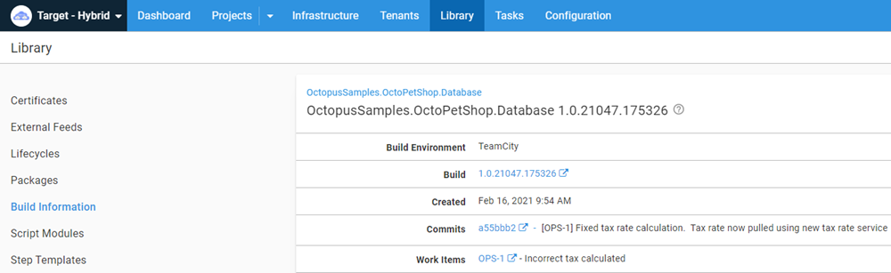

The build information contains:

- Links to the build it came from.
- The commits. 
- The work items (issues) it was associated with.

### Release Note Prefix

You may have noticed, we haven't discussed the **Release Note Prefix**. The Release Note Prefix provides a method of overriding the title of the work item. Octopus Deploy will look through the comments of a work item for the specified prefix that I've defined as `Release note:`. When it finds a comment with the prefix, it will override the title of the work item with whatever text comes after the prefix.

:::hint
All of the Octopus Deploy issues integrations contain the `Release Note Prefix` feature.
:::

The title of our issue is `Incorrect tax calculated`, which doesn't make for a terribly useful release note. Instead, we'd like it to show up as `Improved tax rate calculation based on location.`

To do this, we add a comment to the Jira issue using our defined prefix:

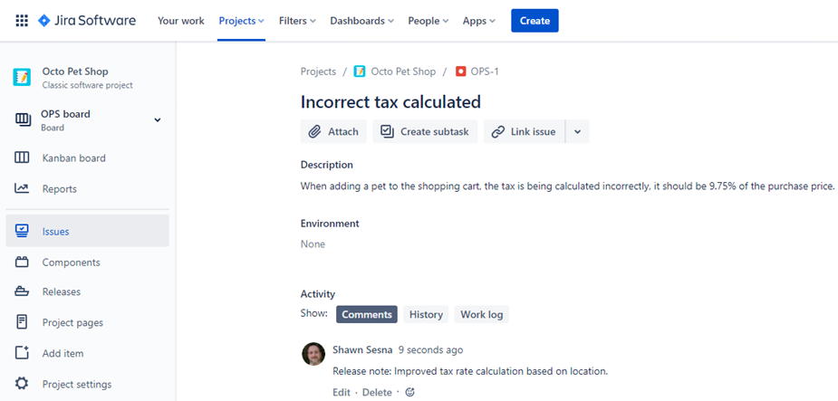

In Octopus, we can see that the title of the work item has been updated to the desired value.

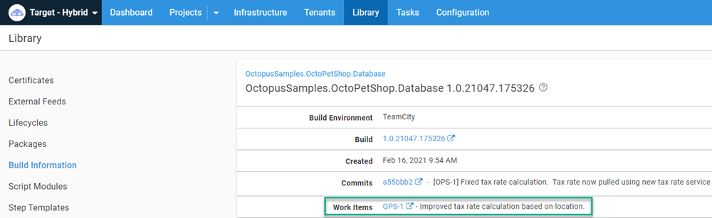

## Keeping everyone informed

So far, we've shown how the build information can be accessed via the Octopus Deploy Web Portal. However, not everyone in an organization has access to Octopus Deploy, such as Quality Assurance (QA) teams. Octopus Deploy has some built-in variables that can be used to share the build information.

### Project release notes template

In the project's settings, you can define a [release notes template](https://octopus.com/docs/releases/release-notes#Release-Notes-Templates). The template allows you to customize the display of the build information related to the packages. Here's an example template:

```
#{each workItem in Octopus.Release.WorkItems}#{if Octopus.Template.Each.First == "True"}WorkItems:#{/if}
- [#{workItem.Id}](#{workItem.LinkUrl}) - #{workItem.Description}
#{/each}

Packages:
#{each package in Octopus.Release.Package}
- #{package.PackageId} #{package.Version}
#{each commit in package.Commits}
    - [#{commit.CommitId}](#{commit.LinkUrl}) - #{commit.Comment}
#{/each}
#{/each}
```

:::warning
The `Octopus.Release.Package` variable is _only_ available for use in release notes templates. It is not available during a deployment process such as a **Run a script** step.
:::

With a template defined, the release notes are accessible during a deployment via the `Octopus.Release.Notes` variable. Using something like Slack, you can include the build information in a notification message.

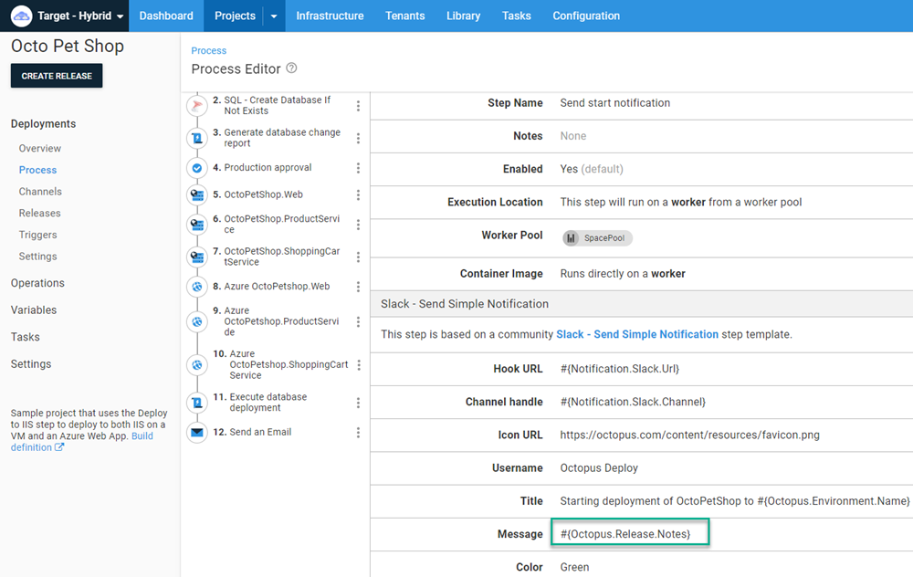

Since each package was tagged with the build information, the message will look like this:

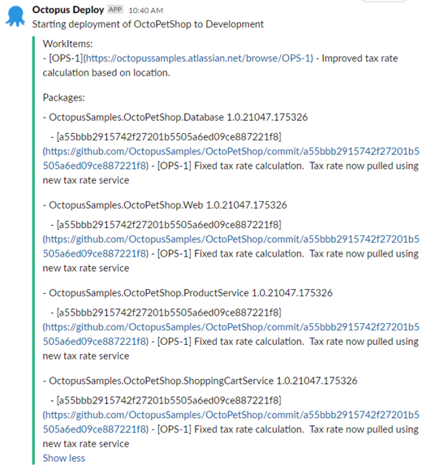

Without the Release Notes template (or manually entered release notes), the `Octopus.Release.Notes` variable is empty.

### Octopus.Deployment.Changes
Another method of accessing the build information is the `Octopus.Deployment.Changes` variable. Using a **Run a script** step, you could iterate through the changes, constructing a message and set an [Output Variable](https://octopus.com/docs/projects/variables/output-variables):

```PowerShell
$changeListRaw = $OctopusParameters["Octopus.Deployment.Changes"]
$changeList = $changeListRaw | ConvertFrom-Json

foreach ($change in $changeList)
{
    $emailBody = "Release Number: $($change.Version)`r`n"
      
    $emailBody += "    Build Information`r`n"
    foreach ($buildInformation in $change.BuildInformation)
    {
        $emailBody += "        Package: $($buildInformation.PackageId)`r`n"
        $emailBody += "        Version: $($buildInformation.Version)`r`n"
        $emailBody += "        BuildUrl: $($buildInformation.BuildUrl)`r`n"
        $emailBody += "        VCSRoot: $($buildInformation.VcsRoot)`r`n"
        $emailBody += "        VCSCommitNumber: $($buildInformation.VcsCommitNumber)`r`n"
    }

    $emailBody += "    Commit Information`r`n"
    foreach ($commit in $change.Commits)
    {
        $emailBody += "        Git Hash: $($Commit.Id)`r`n"
        $emailBody += "        Git Comment: $($Commit.Comment)`r`n"
        $emailBody += "        Git Link: $($Commit.LinkUrl)`r`n"
    }

    $emailBody += "    Work Items`r`n"
    foreach ($workItem in $change.WorkItems)
    {
        $emailBody += "        Id: $($WorkItem.Id)`r`n"
        $emailBody += "        Link Url: $($WorkItem.LinkUrl)`r`n"
        $emailBody += "        Source: $($WorkItem.Source)`r`n"
        $emailBody += "        Description: $($WorkItem.Description)`r`n"
    }
}

Set-OctopusVariable -name "EmailBody" -value $emailBody
```

Using a **Send an email** template, you can set the **Body** of the email to the value of the output variable.

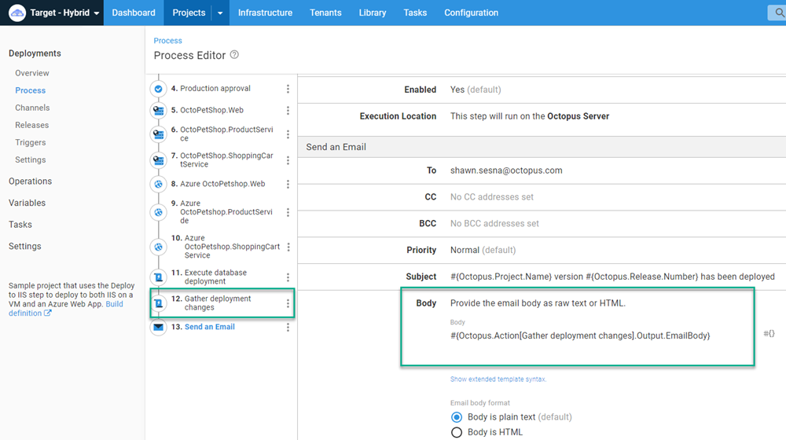

This will allow you to send an email to stakeholders informing them of the progress of the deployment.

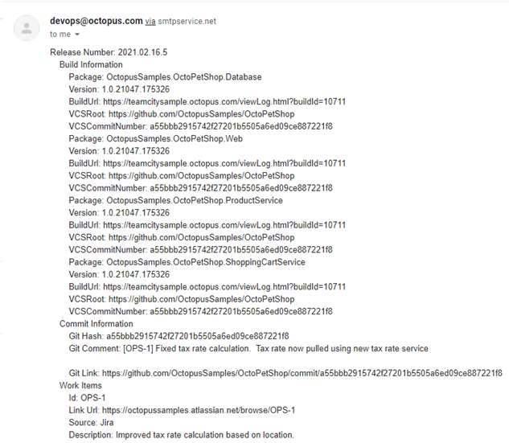

## Conclusion

Including build information in Octopus Deploy can be an incredibly powerful communication tool. I hope this post demonstrates the different ways it can be used in your CI/CD pipeline.  

Happy deployments!
