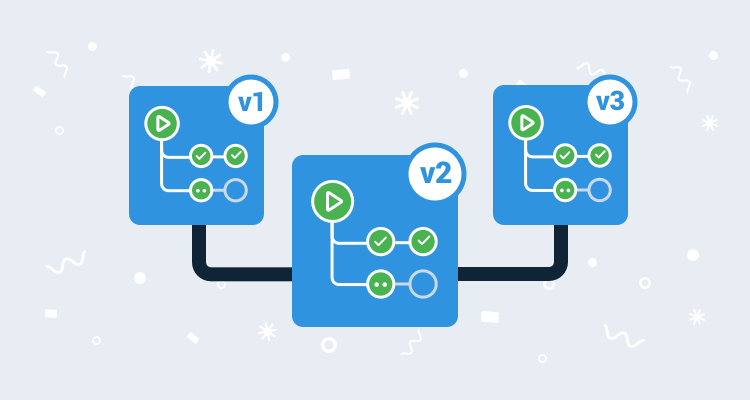

## Nightly builds and continuous deployment

We've been on a long-term mission for sometime to increase the flow of work and reduce the time to feedback across all our teams. At the start of 2021, we still faced some key constraints:

* Our deployment pipelines frequently suffered "bit rot".
* Our code changes often sat on branches that lived longer than we wanted.

As of this week, we've delivered some key changes to help us ship faster and better quality releases.

## Continuous deployment

We are now practicing [Continuous Deployment](https://en.wikipedia.org/wiki/Continuous_deployment) of Octopus Server, Tentacle, and Octopus CLI to internal customer environments, and [Continuous Delivery](https://en.wikipedia.org/wiki/Continuous_delivery) to external customer environments. 

What does this mean for you?

Well, instead of us having to make a deliberate decision to deploy a release, we now automatically create a release from every commit to a releasable branch that passes all the tests. Successful builds roll out to our internal environments and then after a suitable "bake time", onto Octopus Cloud, and then to the website. This means we are constantly "drinking our own champagne" in the pursuit of delivering a quality product.

You can read more about how we see the differences between [continuous delivery and continuous deployment](blog/2021-02/ten-pillars-of-pragmatic-deployments/index.md#continuous-integration-continuous-delivery-and-continuous-deployment).

### Nightly builds

For our older LTS releases, we found that "bit rot" was causing our pipelines to fail as we only exercised them when we needed to ship a patch to an older release. Now, in addition to our commit-triggered builds, we trigger a build every night for every potentially-releasable branch to clean all the pipes, alerting us early when something goes wrong, which in turn makes the problem easier to diagnose and cheaper to fix.

### major.minor.build versioning

Nightly builds did surface an interesting challenge for us, though. With our prior numbering scheme (`major.minor.patch`), rebuilding every night would result in multiple builds per Git commit, and our build numbers would only change if a commit had been made. This meant that we ended up with multiple builds with the same version number. Many downstream systems (e.g. nuget.org, registry.npmjs.org) don't like different packages with the same version number, which meant we needed a new plan.

We now use a `major.minor.build` numbering strategy. This means the patch numbers are much larger than we're all used to but, effectively, it's just a number. As this is now a build number, there will be gaps between version numbers, but you'll almost always want to grab the latest build. 

As a side note, our journey down this path means we've diverged quite far from what [GitVersion](https://github.com/GitTools/GitVersion) is designed to do, and we ended up writing our own version calculator, [OctoVersion](https://github.com/OctopusDeploy/OctoVersion). This handles our multiple release streams much better, and as it's laser-focused on our use case, it's much faster too.

### More accurate calculation of release notes from version `X` to version `Y` using the Git revision graph instead of GitHub milestones

Another interesting change is how we generate our release notes. We previously used GitHub milestones and assigned them before we built a release. Now, as we're building a release for every commit, we use the Git revision graph to calculate which fixes went into which release. This means more accurate release notes.

### Better handling of valid/invalid upgrade path

Now that we use the Git revision graph to calculate these release notes, we also get some good knowledge about viable upgrade paths. Previously, **{{ 2020.4.13, 2020.5.0}}** would appear to be a valid upgrade path, but would actually go back in time, as 2020.5.0 was branched before 2020.4.13 was created. This occasionally caused some bugs where the database had structural changes that weren't expected. Now, we show a warning that this isn't a viable upgrade path, meaning an entire class of bugs is avoided.

## Conclusion

We're pretty excited about these changes! They will help us focus more energy on improving Octopus, getting those improvements in Octopus Cloud customers' hands sooner, and give our customers a better experience when upgrading their self-hosted installations.
