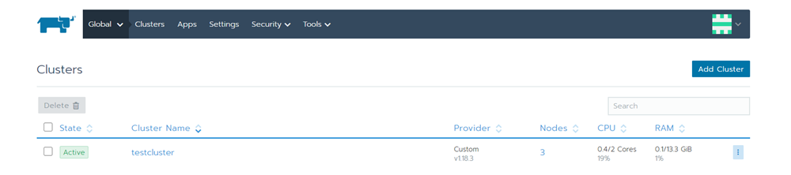
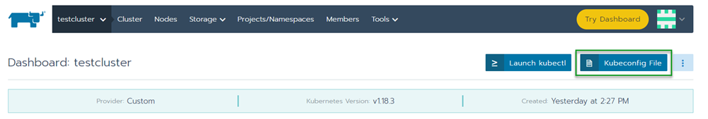
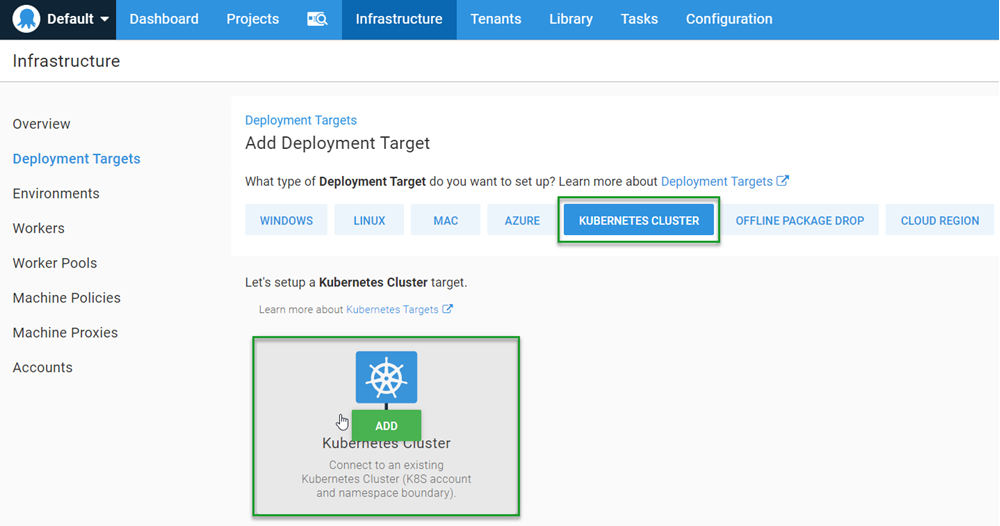
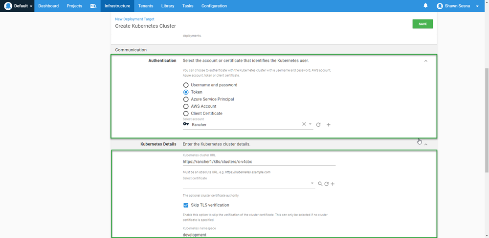

Managing Kubernetes from the command-line can be cumbersome and tedious, especially when you have multiple clusters to manage.  To ease this burden, a number of tools have been developed to easily create and manage Kubernetes clusters. [Rancher](http://www.rancher.com) is one example, and in this post, I’ll show you how to add your Kubernetes cluster that is managed by Rancher as a deployment target in Octopus Deploy and deploy to it.

## Getting started with Rancher

Rancher is a rather unique product in that it’s not actually installed anywhere.  Instead, Rancher runs within a Docker container and can run anywhere that Docker is installed.  This is all that is required to get started:

```bash
$ sudo docker run -d --restart=unless-stopped -p 80:80 -p 443:443 rancher/rancher
```

There are, of course, more advanced installations with High Availability and a range of other [options](https://rancher.com/docs/rancher/v2.x/en/installation/), but for testing it, that’s all that is needed. When the container is up and running, connect to it with a browser and set the `admin` password.  After setting the password, you’re ready to create a cluster.

## Creating clusters

Rancher can work with:

- On-premise infrastructure
- Cloud infrastructure providers
  - Amazon EC2
  - Azure
  - Digital Ocean
  - Linode
  - vShere
- Cloud Kubernetes services
  - Amazon Elastic Kubernetes Service (EKS)
  - Azure Kubernetes Service (AKS)
  - Google Kubernetes Engine (GKE)

For this post, I created two Kubernetes (K8s) to demonstrate the versatility of using Rancher with Octopus deploy; one on-premises and one using a Cloud Kubernetes service.

### The first cluster

Rancher has made the process of creating a cluster really simple and easy to follow. In the UI, click on **Add Cluster**.

I created three Ubuntu VMs for my on-premises cluster so I chose **From existing nodes (Custom)** for my first cluster:


I gave the cluster a name on the next screen and accepted the defaults, then clicked **Next**.

The final screen of the creation process presents us with three checkboxes.  Clusters managed by Rancher need to have nodes that serve three roles:

- [etcd](https://rancher.com/blog/2019/2019-01-29-what-is-etcd/)
- [Control Plane](https://kubernetes.io/docs/concepts/)
- worker.

Checking or unchecking a box updates the command on the screen to run against the members of the cluster.  It is possible to assign a single node with all three roles, but for this post, I chose one role per VM (image shows all three options selected):


As you run the commands on each node, the screen will show a pop-up indicating how many nodes have been registered to the cluster.  When you’ve finished adding nodes, click on **Done** to begin the provisioning process.  After the provisioning process has completed, you will have a brand new cluster!



### The second cluster

For the second cluster, I chose to use the Cloud Kubernetes Service of GKE:


The creation process for GKE was a bit different than on-premises.  The first step is to create the [Google Service Account](https://cloud.google.com/iam/docs/service-accounts) with sufficient permissions to create the cluster resources.  Next, create a JSON Key for the service account, this is needed for Rancher to authenticate with Google.  After you paste the JSON (or use the **Read from a file** button), click **Next: Configure Nodes**.

Unlike the on-premises setup, creating a cluster on GKE is automated.  Using the Service Account, Rancher connects to Google and provisions all the resources for you.

## Connect the clusters to Octopus Deploy

Not only does Rancher provide a centralized interface to manage Kubernetes clusters it also provides a centralized means of communication to the clusters.  This means that Octopus Deploy can connect to Rancher instead of having to connect to the clusters it manages individually.

### Authentication

Before we can add our Rancher managed cluster, we must first create a means of authenticating to it.  This can be accomplished using the Rancher UI to create a key for access.

1. Log into Rancher, then click on your Profile in the upper right-hand corner.
1. Select **API & Keys**.
1. Click on **Add Key**.
1. Give the API Key an expiration and a scope.  
1. I recommended adding a description so you know what this key will be used for then click **Create**.

After you click create, you will be shown the API Key information, *save this information, you will not be able to retrieve it later*.

### Rancher cluster endpoints

As previously mentioned, you can proxy communication to your clusters through Rancher.  Instead of connecting to the individual K8s API endpoints directly, you can use API endpoints within Rancher to issue commands.  The format of the URL is as follows: `https://<RancherUrl>/k8s/clusters/<ClusterId>`.

A quick way to find the correct URL is to grab it from the provided Kubeconfig file information.  For each cluster you define, Rancher provides a *Kubeconfig file* that can be downloaded directly from the UI.  To find it, select the cluster you need from the Global dashboard, and click the **Kubeconfig File** button:



The next screen has the Kubeconfig file which contains the specific URL we need to use to connect our cluster to Octopus Deploy:


### Add the account to Octopus Deploy

In order for Octopus Deploy to deploy to the cluster, it needs credentials to log in with. In the Octopus Web Portal, navigate to the **Infrastructure** tab and click **Accounts**.

Rancher provided us with two methods to authenticate with when we created our API Key, *Username and Password* or *Token*. You can use either of these methods, for this post, I chose token.

1. Click **ADD ACCOUNT**.
1. Select which account type you want to create.
1. Enter the values for your selection, then click **SAVE**.

Now that we’ve created an account, we’re ready to create our Kubernetes targets.

### Create a Kubernetes Deployment Target

With the prep work out of the way, you can now add your Rancher managed Kubernetes clusters to Octopus Deploy.  Adding the target is done in exactly the same way you would add any other Kubernetes target.  

1. Click **{{Infrastructure, Deployment Targets}}**.
1. Click **ADD DEPLOYMENT TARGET**.
1. Click the **KUBERNETES CLUSTER** category.
1. Then click **ADD** on the Kubernetes Cluster.



The two most important parts of the Kubernetes deployment target form are going to be:

- Authentication
- Kubernetes Details

#### Authentication

Select the radio button that corresponds with how you’ve chosen to connect to Rancher.  I chose Token.

#### Kubernetes Details

This is where we use the URL we took from the *kubeconfig file* in Rancher.  For the first cluster, it was `https://rancher1/k8s/clusters/c-v4cbx`.  My cluster is using a self-signed certificate, so I needed to select **Skip TLS verification**.  

Also, I created three namespaces for my cluster:

- development
- test
- production



Click **SAVE** and you’re done.  

To verify the configuration, you can watch for the initial health check run.

## Deploy to the clusters

Deploying to a cluster that is managed through Rancher is no different than deploying to a non-Rancher managed cluster.

To demonstrate, I’ll use the same example process from my [Beyond Hello World: Build a real-world Kubernetes CI/CD pipeline](https://octopus.com/blog/build-a-real-world-kubernetes-cicd-pipeline) post, modified to target the Rancher managed cluster instead.

When I Deploy the release, I can see it executed against both the on-premises cluster Rancher-dev and the Google Cloud cluster:


And there you have it, we’ve successfully deployed to Kubernetes clusters managed by Rancher.

## Conclusion

In this post, I demonstrated how you can define Kubernetes clusters in Rancher and then integrate Rancher with Octopus deploy to deploy your projects.  Happy Deployments!
