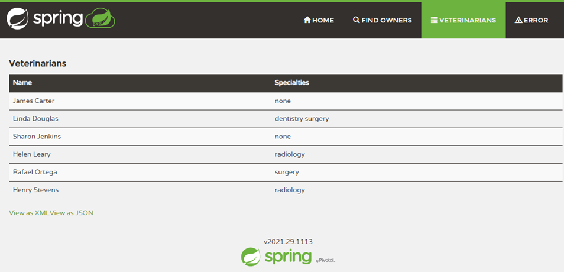

When you're developing apps in Java, you have a larger selection of web servers that you can deploy to. Octopus Deploy has built-in support for both Tomcat and Wildfly (JBoss), however, other server technologies are also supported. 

In this post, I demonstrate how to deploy the Java application, PetClinic, to a [Payara](https://www.payara.fish/) web server.

## Infrastructure
For this post, I set up a MySQL PaaS server in Azure to serve as my database back-end, and an Ubuntu VM for Payara.  I automated provisioning these resources with a [runbook](https://octopus.com/docs/runbooks), so they can be spun up and down as I need (see our [Samples instance for details](https://samples.octopus.app/app#/Spaces-642)). I chose a Linux operating system to run the web server, but Payara will also run on Windows.  

Below is the code for the Azure Resource Manager (ARM) template and the Bash automation script that installs the Octopus Tentacle and the Payara server:

### MySQL PaaS template code

```
{
    "$schema": "http://schema.management.azure.com/schemas/2014-04-01-preview/deploymentTemplate.json#",
    "contentVersion": "1.0.0.0",
    "parameters": {
        "administratorLogin": {
            "type": "string"
        },
        "administratorLoginPassword": {
            "type": "securestring"
        },
        "location": {
            "type": "string"
        },
        "serverName": {
            "type": "string"
        },
        "skuCapacity": {
            "type": "int"
        },
        "skuFamily": {
            "type": "string"
        },
        "skuName": {
            "type": "string"
        },
        "skuSizeMB": {
            "type": "int"
        },
        "skuTier": {
            "type": "string"
        },
        "version": {
            "type": "string"
        },
        "backupRetentionDays": {
            "type": "int"
        },
        "geoRedundantBackup": {
            "type": "string"
        },
        "previewFeature": {
            "type": "string",
            "defaultValue": ""
        },
        "tags": {
            "type": "object",
            "defaultValue": {}
        },
        "storageAutoGrow": {
            "type": "string",
            "defaultValue": "Disabled"
        },
        "infrastructureEncryption": {
            "type": "string",
            "defaultValue": "Disabled"
        }
    },
    "resources": [
        {
            "apiVersion": "2017-12-01-preview",
            "kind": "",
            "location": "[parameters('location')]",
            "name": "[parameters('serverName')]",
            "properties": {
                "version": "[parameters('version')]",
                "administratorLogin": "[parameters('administratorLogin')]",
                "administratorLoginPassword": "[parameters('administratorLoginPassword')]",
                "storageProfile": {
                    "storageMB": "[parameters('skuSizeMB')]",
                    "backupRetentionDays": "[parameters('backupRetentionDays')]",
                    "geoRedundantBackup": "[parameters('geoRedundantBackup')]",
                    "storageAutoGrow": "[parameters('storageAutoGrow')]"
                },
                "previewFeature": "[parameters('previewFeature')]",
                "infrastructureEncryption": "[parameters('infrastructureEncryption')]"
            },
            "sku": {
                "name": "[parameters('skuName')]",
                "tier": "[parameters('skuTier')]",
                "capacity": "[parameters('skuCapacity')]",
                "size": "[parameters('skuSizeMB')]",
                "family": "[parameters('skuFamily')]"
            },
            "tags": "[parameters('tags')]",
            "type": "Microsoft.DBforMySQL/servers"
        }
    ],
    "variables": {}
}
```

### Tentacle and Payara automation script

```bash
#!/bin/bash

# Install Octpous listening tentacle
serverUrl="#{Global.Base.Url}"   # The url of your Octous server
thumbprint="#{Global.Server.Thumbprint}"       # The thumbprint of your Octopus Server
apiKey="#{Global.Api.Key}"           # An Octopus Server api key with permission to add machines
name="PetClinic-#{Octopus.Environment.Name}"      # The name of the Tentacle at is will appear in the Octopus portal
publicHostName="#{Global.Environment.Prefix}#{Octopus.Space.Name | Replace " "}.#{Azure.Location.Abbr}.cloudapp.azure.com"      # The url to the tentacle
environment="#{Octopus.Environment.Name}"  # The environment to register the Tentacle in
role="PetClinic-Web"   # The role to assign to the Tentacle
configFilePath="/etc/octopus/default/tentacle-default.config"
applicationPath="/home/Octopus/Applications/"
spaceName="#{Octopus.Space.Name}"

sudo apt install --no-install-recommends gnupg curl ca-certificates apt-transport-https && \
curl -sSfL https://apt.octopus.com/public.key | sudo apt-key add - && \
sudo sh -c "echo deb https://apt.octopus.com/ stable main > /etc/apt/sources.list.d/octopus.com.list" && \
sudo apt update && sudo apt install tentacle -y

sudo /opt/octopus/tentacle/Tentacle create-instance --config "$configFilePath"
sudo /opt/octopus/tentacle/Tentacle new-certificate --if-blank
sudo /opt/octopus/tentacle/Tentacle configure --port 10933 --noListen False --reset-trust --app "$applicationPath"
sudo /opt/octopus/tentacle/Tentacle configure --trust $thumbprint
echo "Registering the Tentacle $name with server $serverUrl in environment $environment with role $role"
sudo /opt/octopus/tentacle/Tentacle register-with --server "$serverUrl" --apiKey "$apiKey" --name "$name" --env "$environment" --role "$role" --space "$spaceName" --publicHostName "$publicHostName"
sudo /opt/octopus/tentacle/Tentacle service --install --start

# Install JDK
sudo apt update
sudo apt install default-jdk -y

# Install Payara
wget --content-disposition 'https://info.payara.fish/cs/c/?cta_guid=b9609f35-f630-492f-b3c0-238fc55f489b&placement_guid=7cca6202-06a3-4c29-aee0-ca58af60528a&portal_id=334594&redirect_url=APefjpGt1aFvHUflpzz7Lec8jDz7CbeIIHZmgORmDSpteTCT2XjiMvjEzeY8yte3kiHi7Ph9mWDB7qUDEr96P0JS8Ev2ZFqahif2huSBfQV6lt4S6YUQpzPMrpHgf_n4VPV62NjKe8vLZBLnYkUALyR2mkrU3vWe7ME9XjHJqYPsHtxkHn-W7bYPFgY2LjEzKIYrdUsCviMgGrUh_LIbLxCESBa0N90vzaWKjK5EwZT021VaPP0jgfgvt0gF2UdtBQGcsTHrAlrb&hsutk=c279766888b67917a591ec4e209cb29a&canon=https%3A%2F%2Fwww.payara.fish%2Fall_downloads&click=5bad781c-f4f5-422d-ba2b-5e0c2bff7098&utm_referrer=https%3A%2F%2Fwww.google.co.za%2F&__hstc=229474563.c279766888b67917a591ec4e209cb29a.1519832301251.1521408251653.1521485598794.4&__hssc=229474563.7.1521485598794&__hsfp=2442083907' --output-document=payara.zip
sudo apt install unzip
sudo unzip payara.zip -d /opt

# Create password files
cat > newpassword.txt <<EOF
AS_ADMIN_PASSWORD=
AS_ADMIN_NEWPASSWORD=#{Payara.Admin.User.Password}
EOF

cat > password.txt <<EOF
AS_ADMIN_PASSWORD=#{Payara.Admin.User.Password}
EOF

# Change admin password
sudo /opt/payara5/bin/asadmin --user admin --passwordfile $PWD/newpassword.txt change-admin-password

# Create service
sudo /opt/payara5/bin/asadmin create-service --name payara

# Start the server (service creation does not start automatically)
sudo /opt/payara5/bin/asadmin start-domain

# Enable remote management
sudo /opt/payara5/bin/asadmin --user admin --passwordfile $PWD/password.txt enable-secure-admin
```

### Azure MySQL PaaS troubleshooting

There were some gotchas I encountered with the PaaS MySQL server. They're listed below along with my solutions, to help you avoid these issues.

#### Firewall
I used the Azure wizard to generate the ARM template for the MySQL PaaS server. The wizard didn't contain any Security Group (firewall) options, so when the server was provisioned, nothing could connect to it. Using the Azure Command Line Interface (CLI), I opened the firewall to allow both Octopus Deploy workers and the Payara VM to talk to it:

```
az mysql server firewall-rule create --resource-group <your resource group> --server-name '<your server name>' --name AllowAllAzureIps --start-ip-address <start range> --end-ip-address <end range>
```

#### You do not have the SUPER privilege and binary logging is enabled

If the database deployment for your application includes any functions or stored procedures, you may run into the error `You do not have the SUPER privilege and binary logging is enabled`. The PaaS version of MySQL will not allow you to create these types of objects until you turn on `log_bin_trust_function_creators`:

```
az mysql server configuration set --resource-group <your resource group> --server-name "<your server name>" --name log_bin_trust_function_creators --value "ON"
```

#### Additional JDBC querystring parameters
After I deployed the .war to Payara, there were a couple of additional querystring parameters to get the application to connect to the database:

```
?useSSL=true&serverTimezone=UTC
```

#### Username 
The Azure MySQL PaaS requires that the username also contain the hostname, so the username looks like this:

```
username@hostname
```

## Octopus Deploy
This post assumes you're familiar with [creating projects](https://octopus.com/docs/projects#add-a-project) within Octopus Deploy.

### Process

The PetClinic application is a Spring Boot Java application with a MySQL back-end. To deploy the application:

1. Create the database if it doesn't exist.
1. Deploy the database using [Flyway](https://flywaydb.org/).
1. Deploy the PetClinic application to Payara.

This post is specifically about Payara, so we'll focus on deploying to Payara.

#### Deploying to Payara

Octopus Deploy contains specific templates for deploying to Tomcat and Wildfly. Payara, however, contains an autodeploy feature that makes creating a Payara template unnecessary. By placing the .war file in a specific folder, Payara automatically deploys the application to the server.

##### Add Deploy Java Archive step
Within your Octopus Deploy project, add a **Deploy a Java Archive** step to your process.

##### Configure Deploy Java Archive step
Under **Package Details**, ensure the **Deployment** section is expanded (it should be by default on a newly added step).

To rename the package to be more user-friendly, use the **Deployed package file name** option to specify a new name. Note that the name of the file affects the URL for the application. 

If **Deployed package file name** is left blank, it will use the original file name, and the URL on the Payara server will be something like `http://PayaraServer/petclinic.web.1.0.21022.194744`. 

I entered `petclinic.war` so my URL looks like `http://PayaraServer/petclinic`.

To take advantage of the autodeploy feature of Payara, tick the box **Use custom deployment directory**.  The autodeploy folder is located in a subfolder of the domain. If you've reviewed the Tentacle and Payara automation script, you'll note that I installed Payara to `/opt/payara5`, so the full path for autodeploy is `/opt/payara5/glassfish/domains/domain1/autodeploy`.


I also enabled the [Structured Configuration Variables](https://octopus.com/docs/projects/steps/configuration-features/structured-configuration-variables-feature) feature to update the database connection information. To do this: 

1. Click on the **CONFIGURE FEATURES** button.
1. Tick the `Structured Configuration Variables` box.


The file containing the database information is `WEB-INF/classes/spring/datasource-config.xml`.


##### Configure variables
Finally, create the project variables for the datasource-config.xml file.  I needed to replace three components:

- URL
- Username
- Password

I used the following for my variables:


The `Name` of the variables are XPath expressions, which replace the necessary components.

### Deployment
Deploying to the development environment, we can see that the **Structured Configuration Variable** feature was applied and the file copied to the `/opt/payara5/glassfish/domains/domain1/autodeploy`.


If we navigate to the Payara server, we can see the PetClinic application has been deployed and is pulling data.



## Conclusion

Without a specific step template, it's easy to think that Octopus Deploy doesn't support Payara. I hope this post has demonstrated that it is indeed supported and easy to deploy to.

:::hint
Be sure to checkout the [Build a tutorial for your stack](https://octopus.com/docs/guides) feature for more in-depth tutorials.
:::

Happy deployments!
