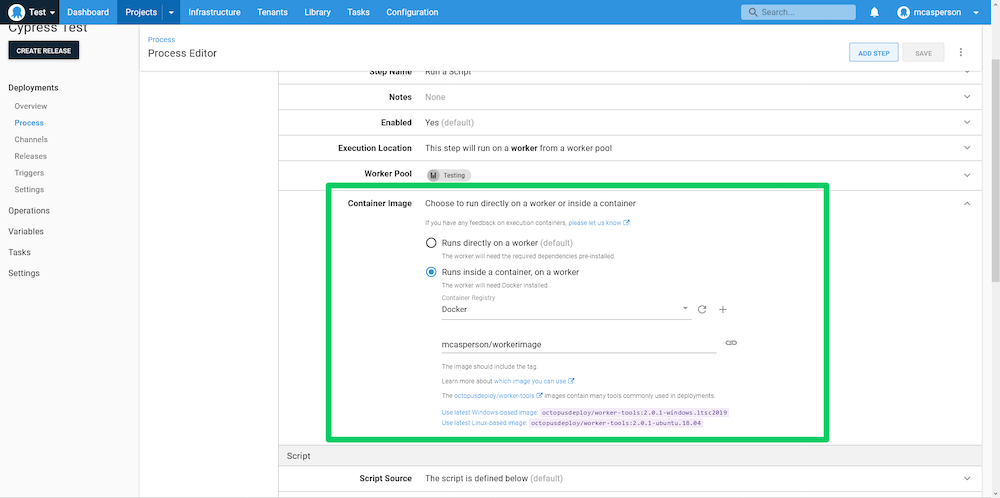
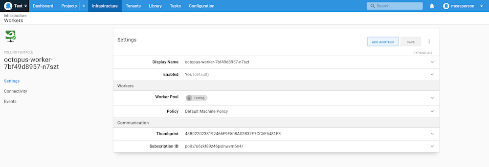

The idea of testing your code as part of your development process has won almost universal adoption. Unit tests are now a common feature of most complex codebases.

Testing doesn't stop with unit tests, though. The canonical example that describes testing patterns performed during an application's lifecycle is the testing pyramid (although there are many alternatives like [the testing honeycomb](https://engineering.atspotify.com/2018/01/11/testing-of-microservices/)) which describe certain strategies, like end-to-end tests, that often require a live running instance of your application for the tests to be performed.

One such example of end-to-end testing is via tools like Cypress, which interact with a web page in much the same way a human would. These tests necessarily require the web application to be running, which makes them an ideal candidate to include in the final stages of your deployment process after your web application is deployed and running in a test environment. 

In this blog post, we look at some practical concerns around running Cypress during an Octopus deployment. I also present a solution that allows Cypress tests to be run in most common scenarios.

## Including Cypress in your deployment process

The first and most pressing issue to resolve is getting Cypress into your deployment pipeline.

Perhaps the most obvious way to achieve this is to install Cypress and a web browser on a VM or physical machine. There are many tools like Ansible, Puppet, and Chef that can automate this process in a repeatable way.

The downside to having the tools directly installed is there's no easy way to do this when you're using dynamic workers in a hosted Octopus instance, and in platforms like Kubernetes there's no concept of a VM for you to pre-configure.

A more generic solution is to [run Cypress from a Docker container](https://github.com/cypress-io/cypress-docker-images). This is convenient because the Cypress team has already done the hard work of configuring all the required software in their Docker images. You also gain the ability to switch browser versions on a whim simply by running a different Docker image version.

## Referencing Cypress tests

The next issue we need to resolve is how the individual Cypress tests are included in the deployment.

It is possible to bake the tests into a custom Docker image, and if your tests don't tend to change much, this may be a perfectly reasonable solution.

However, I suspect most teams that invest in end-to-end testing will want to continue quickly updating their tests scripts without the burden of including them in new Docker images. Wouldn't it be nice to have a common, generic Cypress Docker image that could execute random test scripts?

When running Docker directly, this is relatively easy. You simply mount a local directory that contains your test scripts into the generic Cypress Docker image. The Cypress [documentation](https://github.com/cypress-io/cypress-docker-images/tree/master/included) provides an example for this, which mounts the current directory as the `e2e` directory in the Docker container:

```
docker run -it -v $PWD:/e2e -w /e2e cypress/included:6.4.0
```

Unfortunately, Kubernetes does not support this kind of volume mounting. [You can mount the contents of a config map as a file](https://stackoverflow.com/questions/33415913/whats-the-best-way-to-share-mount-one-file-into-a-pod), but this option [does not support directory structures](https://github.com/kubernetes/kubernetes/issues/62421). This is a distinct limitation when testing with Cypress, as the [Cypress directory structure includes many subdirectories](https://docs.cypress.io/guides/core-concepts/writing-and-organizing-tests.html#Folder-Structure).

Octopus provides a solution through [worker containers](https://octopus.com/docs/projects/steps/execution-containers-for-workers), which execute a deployment step inside a container generated from an appropriately configured Docker image. The Octopus step can then download and extract a package, and run a custom script.

In our case, we will create a custom (but still generic) Docker image based on the Cypress image that Octopus can execute inside of to extract a package containing our test script and execute Cypress.

Our Docker image is built with the following `Dockerfile`:

```
FROM cypress/included:6.4.0
RUN apt-get update; apt-get install -y libicu-dev
RUN npm install -g inline-assets
ENTRYPOINT []
```

This `Dockerfile`, which is based on the Cypress image `cypress/included:6.4.0`, installs `libicu-dev` (which is required by .NET Core applications under Linux) and installs the [inline-assets](https://www.npmjs.com/package/inline-assets) tool to process the Cypress HTML report (more on that later) and clears the `ENTRYPOINT` so Octopus can override the command used when running the image.

This Docker image can be built and published with the following command, replacing `dockerhubusername` with your own Docker Hub user name:

```
docker build . -t dockerhubusername/workerimage
docker push dockerhubusername/workerimage
```

In my case, I created an image called `mcasperson/workerimage`. We can now use this image to create the Octopus execution container.

## Creating the sample Cypress test

For this example, we will create a simple introductory Cypress test that performs no real work, but that allows us to simulate the process of running end-to-end tests. The code for this sample test can be found on [GitHub](https://github.com/OctopusSamples/simple-cypress-test).

We start with the `package.json` file, which [installs the Mochawesome reporter](https://docs.cypress.io/guides/tooling/reporters.html#Examples) to generate HTML reports:

```json
{
  "name": "cypress-test",
  "version": "0.0.1",
  "description": "A simple cypress test",
  "dependencies": {
    "mochawesome-merge": "^4.2.0",
    "mochawesome": "^6.2.1",
    "mocha": "^8.2.1"
  }
}
```

Next we have the `cypress.json` file, which configures the basic details of our tests. Note that we have enabled `<!--  -->` HTML reports:

```json
{
  "baseUrl": "https://google.com",
  "reporter": "mochawesome",
  "reporterOptions": {
    "charts": true,
    "overwrite": false,
    "html": true,
    "json": false,
    "reportDir": "."
  }
}
```

Finally, we have the test itself in the `sample_spec.js` file. This test always passes and doesn't interact with any web pages, but it proves that Cypress is running as expected:

```javascript
describe('My First Test', () => {
  it('Does not do much!', () => {
    expect(true).to.equal(true)
  })
})
```

After running `npm install` to download the Mocha reporting libraries, these files are bundled in to a ZIP file, which we can upload to the Octopus built-in feed. For convenience, the [GitHub releases page](https://github.com/OctopusSamples/simple-cypress-test/releases) has prepackaged ZIP files ready to use.

Here is the Cypress test uploaded to the Octopus built-in feed:


## Running the test

We are now ready to run the test as part of our deployment. In a **Run a script** step, we configure the script to execute inside our worker image under the **Container Image** section:



Next, we run the following Bash script:

```bash
cd cypresstest
cypress run > output.txt
RESULT=$?
inline-assets mochawesome.html selfcontained.html
new_octopusartifact "${PWD}/selfcontained.html" "selfcontained.html"
exit ${RESULT}
```

The first lines enter the directory where our Cypress test package will be extracted and runs `cypress`. The output is directed to a file called `output.txt`:

```bash
cd cypresstest
cypress run > output.txt
```

We then capture the Cypress' exit code, which will determine if the step succeeded or failed:

```bash
RESULT=$?
```

In order to allow the results of the test to be easily viewed in Octopus, we need to bundle all the individual files that make up the HTML report (the HTML, CSS, and script files) into a single, self-contained HTML file. This is where the `inline-assets` tool we installed in our worker image comes in. It will read the report HTML file, inline all the external resources, and create a self-contained HTML file called `selfcontained.html`:

```bash
inline-assets mochawesome.html selfcontained.html
```

We capture the report file as an Octopus artifact:

```bash
new_octopusartifact "${PWD}/selfcontained.html" "selfcontained.html"
```

The exit code of our script is then set to the exit code of Cypress:

```bash
exit ${RESULT}
```

Finally, we configure the step to download and extract the package containing the Cypress script:


When this script is run, our self-contained HTML report file is captured as an artifact and exposed as a link in the **TASK SUMMARY**:


We can open this report directly in the browser:


With that, we now have a way to run custom Cypress tests inside the container created by a generic, shared Docker image. To update the tests, we simply upload a new package to Octopus and they will be included in our next deployment.

## Testing in Kubernetes

One of the reasons we chose to use worker containers is that it allowed us to run the same tests inside a Kubernetes cluster. To verify this, we need to run an Octopus worker inside a Kubernetes cluster. The following deployment starts a Tentacle in a Kubernetes cluster:

```yaml
apiVersion: apps/v1
kind: Deployment
metadata:
  name: octopus-worker
  labels:
    app: tentacle
spec:
  selector:
    matchLabels:
      octopusexport: OctopusExport
  revisionHistoryLimit: 1
  replicas: 1
  strategy:
    type: RollingUpdate
  template:
    metadata:
      labels:
        app: tentacle
        octopusexport: OctopusExport
    spec:
      containers:
        - name: worker
          image: index.docker.io/octopusdeploy/tentacle
          env:
            - name: Space
              value: Test
            - name: ACCEPT_EULA
              value: 'Y'
            - name: TargetWorkerPool
              value: Testing
            - name: ServerUrl
              value: 'https://mattc.octopus.app'
            - name: ServerApiKey
              value: API-xxx
            - name: ServerPort
              value: '10943'
          securityContext:
            privileged: true
```

To run this worker in your own cluster, make sure to change the `ServerUrl`, `ServerApiKey`, `TargetWorkerPool`, and `Space` environment variables to match your server configuration.

Importantly, the pods created by this deployment have the `privileged` flag set to `true`. This is required to support Docker-in-Docker, which is enabled in the Linux Tentacle image. Docker-in-Docker allows our Tentacle to execute worker containers in much the same way a Tentacle on a VM would.

When this deployment is applied to the cluster, your Octopus instance will show a new polling worker similar to this:



At this point, we can run the same script step against this Kubernetes based worker in exactly the same way we would run tests on a VM based worker. Because Octopus is responsible for transferring the test scripts, we neatly work around the limitation of having to somehow mount scripts inside a pod.

## Conclusion

Just as testing code is now common practice, verifying a deployment via end-to-end tests is increasingly common to ensure this stage of an application's lifecycle is working as expected. We are spoiled for choice these days with high quality testing platforms like Cypress, and by laying a little groundwork with custom worker images, it is easy to run end-to-end tests across multiple platforms.

In this blog post, we discussed why worker containers were such a useful tool for running tests, created a custom worker image to execute our tests in, looked at a simple Cypress test script, and wrote a simple bash script to run the test and collect the results. We then saw how to run a worker in a Kubernetes cluster configured to run the same tests using Docker-in-Docker.

The result is a reusable testing process that allows Cypress test scripts to be quickly developed, deployed, and executed across multiple platforms. With a few small tweaks, it's possible to verify your web application deployments with end-to-end tests, ensuring each stage of an application's lifecycle is tested and verified before it reaches end users.

Happy deployments!
