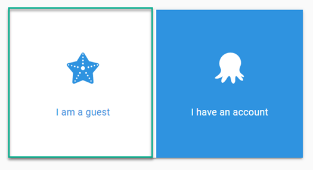
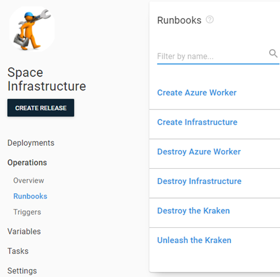

Though it may not seem like it at first glance, Octopus Deploy is a huge product.  The product is so large that people who have worked at Octopus for years still don't know it all.  To address the vastness of our product, we have developed extensive documentation and produced a wide variety of videos demonstrating common usage.  However, not everyone enjoys poring through documentation or searching videos that might address what they're trying to accomplish.  Some people just want to get their hands on the product to figure things out. To that end, we've created the [Octopus Samples](https://samples.octopus.app) instance.

## Samples

The Samples instance is meant for people who have experience using Octopus Deploy and are looking to see how to solve specific problems.  The examples in Samples are modeled after real-world scenarios and are often somewhat complex, meaning new users can find it overwhelming to digest.

## Signing in

Samples is a publicly available instance for anyone to use. Open https://samples.octopus.app in a browser and select Guest (the **I have an account** option is for members of the Solutions Team.)

Guest access makes all available spaces and the projects within the instance available, allowing you to view all aspects of the project, including deployment processes, step details, runbooks, and variables.  Release creation and executing deployments are restricted, however.

## Navigation

The examples in the Samples instance have been spread across multiple Spaces to make it easier to find what you're looking for.  The naming convention prefixes either _Pattern_ or _Target_ to each space name, for instance:

- Pattern - Tenancy
- Pattern - Voltron
- Target - Docker
- Target  - Hybrid

### Pattern

Spaces prefixed with _Pattern_ demonstrate different types of patterns you can implement.  Examples include:
- [Blue/Green deployments](https://samples.octopus.app/app#/Spaces-302)
- [Canary deployments](https://samples.octopus.app/app#/Spaces-542)

Multi-project deployment orchestration
- [Pattern - Voltron](https://samples.octopus.app/app#/Spaces-603)
- [Pattern - Monolith](https://samples.octopus.app/app#/Spaces-362)

These are just a few of the pattern spaces that are available.

### Target

Spaces prefixed with _Target_ demonstrate how to deploy to specific technologies such as different database types:
- [MySQL](https://samples.octopus.app/app#/Spaces-242)
- [Postgres](https://samples.octopus.app/app#/Spaces-243)
- [SQL Server](https://samples.octopus.app/app#/Spaces-106)

Or web servers:
- [IIS](https://samples.octopus.app/app#/Spaces-202)
- [Tomcat](https://samples.octopus.app/app#/Spaces-203)
- [Wildfly](https://samples.octopus.app/app#/Spaces-85)

Again, this is not an exhaustive list of what is available.

## Runbooks

All examples in the Samples instance are fully functional and perform the deployments to actual targets.  We use runbooks to provision and configure the targets for deployment.  Space-wide infrastructure is created in the **Space Infrastructure** project of the space:

Runbooks that create project specific infrastructure are contained within the project itself.  It is in these runbooks you can find different ways to implement Infrastructure as Code running on Cloud services such as Amazon AWS (CloudFormation), Microsoft Azure (ARM templates) and even Google Cloud Platform.

## Build servers

Most of the examples in the Samples instance are backed by a build from a compatible build server.  Each project contains a link back to the build definition that built it.  We've implemented examples for:

- Azure DevOps
- TeamCity
- Jenkins
- Bamboo
- CircleCI
- GitHub Actions
- BitBucket Pipelines

## Conclusion

Octopus Deploy does its very best to give its customers the tools they need to be successful.  Whether your learning style is reading, visual, or by example, Octopus has you covered.

