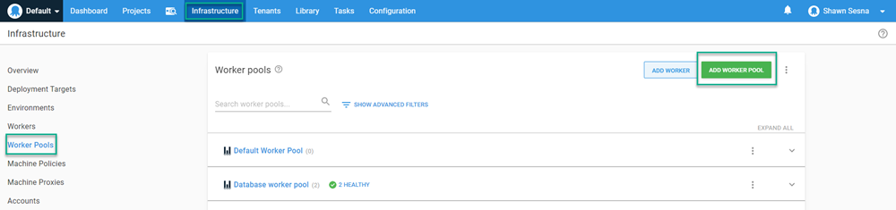
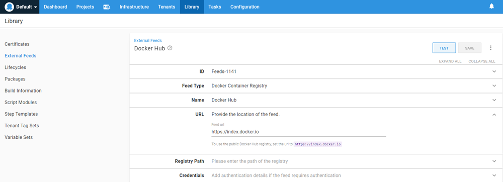
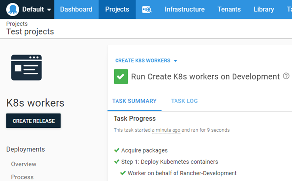
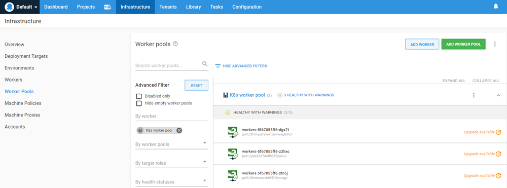
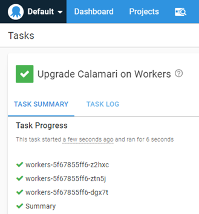

An increasingly common question we receive is can I run an Octopus worker within a Kubernetes (K8s) cluster?  There are a couple of reasons why you would want to do this; create a dedicated worker for that cluster, or simply create a bunch of workers to use with Octopus Deploy.  Using the [Tentacle image](https://hub.docker.com/r/octopusdeploy/tentacle), not only is this possible, but you can deploy it using Octopus itself!  In this post, I will demonstrate the second scenario, deploying Tentacle containers to be used as workers on an Octopus instance.

## Create a worker pool
The first thing we'll need to do is create a new worker pool for our container workers.  Navigate to the `Infrastructure` tab, select `Worker Pools`, then click **ADD WORKER POOL**.

Give the pool a name and click **SAVE**.  With our pool created, we can move on to the runbook.

## Create an External Feed
In order to configure Octopus Deploy to deploy images, we first need to create an [External Feed](https://octopus.com/docs/packaging-applications/package-repositories) as the built-in repository is only a NuGet feed type.  For this post, I created an external feed that pointed to Docker Hub (other docker feeds are also supported such as Artifactory and Nexus).

## Create a runbook
Infrastructure activities are recommended to be done using [Runbooks](https://octopus.com/docs/runbooks).  This post assumes you are framiliar with creating [Projects](https://octopus.com/docs/projects) within Octopus so we'll skip that part.  Create a runbook in your project, I called mine `Create K8s workers`.  Add a `Deploy Kubernetes containers` step to your process.  This step template is quite large, we'll go over the minimum components to get this to work.

### Deployment section
At a minimum, fill in the following:
- Deployment name: Name of the deployment within K8s.
- Replicas: Number of containers to run, I set mine to 3 so I'd have three workers.

### Containers section
Click the **ADD CONTAINER** button and fill in the following components:
- Name: Name of the container
- Package Image: 
  - Package feed: Select the feed you've configured for the image (Docker Hub in my case)
  - Package ID: octopusdeploy/tentacle
- Environment Variables: Click the **ADD ENVIRONMENT VARIABLE** button and add the following:
  - ServerApiKey: API key to register the worker with
  - ServerUrl: Url to your Octopus instance
  - ACCEPT_EULA: Y
  - TargetWorkerPool: Name of the pool to add to
  - ServerPort: 10943 (setting this environment variable configures the worker for Polling mode)
  - Space: Name of the space to add the worker too (the OctoStache variable of #{Octopus.Space.Name} will retrieve the name of the current space)

And that's it!  Anything not listed above uses the defaults of the form.  

## Execute the runbook
Click on the **RUN** button to run the runbook in the environment of your choice.

Once the runbook has completed successfully, click on the Infrastructure tab and you should see workers have been added to worker pool!

We can verify functionality by upgrading Calamari on our workers by choosing the `Upgrade Calamari on 3 Workers` option using the ellipsis menu.

## Conclusion
In this post I demonstrated how you can deploy Workers to a Kubernetes cluster using Octopus Deploy.  Happy Deployments!
