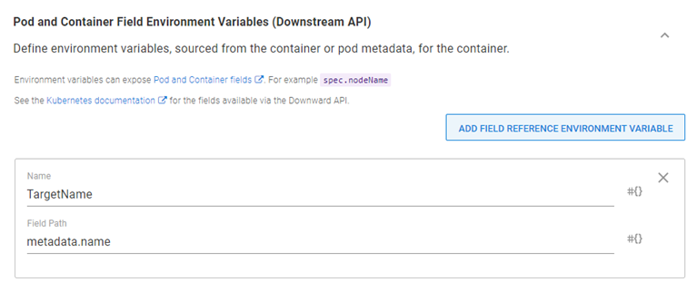

Customers often ask if they can run an Octopus worker within a Kubernetes (K8s) cluster. There are a couple of reasons you'd want to do this; to create a dedicated worker for that cluster, or simply to create a bunch of workers to use with Octopus Deploy. Using the [Tentacle image](https://hub.docker.com/r/octopusdeploy/tentacle), this is possible, but you can even use it to deploy Octopus itself. 

In this post, I demonstrate deploying Tentacle containers to be used as workers on an Octopus instance.

## Create a worker pool
First we need to create a new worker pool for our container workers:

1. In the Octopus Web Portal, navigate to the **Infrastructure** tab.
1. Select **Worker Pool**.
1. Then click **ADD WORKER POOL**.
1. Give the pool a name and click **SAVE**.  

With our pool created, we can move on to the runbook.

## Create an external feed

To configure Octopus Deploy to deploy images, we first need to create an [external feed](https://octopus.com/docs/packaging-applications/package-repositories) as the built-in repository is only a NuGet feed type.  

For this post, I created an external feed that points to Docker Hub. Other docker feeds are also supported, such as Artifactory and Nexus.

## Create a runbook

Infrastructure activities should be undertaken using [Runbooks](https://octopus.com/docs/runbooks). This post assumes you're familiar with creating [projects](https://octopus.com/docs/projects) within Octopus, so we'll skip that part.  

1. Create a runbook in your project. I called mine **Create K8s workers**.
1. Add a **Deploy Kubernetes containers** step to your process.

This step template is large, so we'll go over the minimum components to get this working.

### Deployment section
At a minimum, fill in the following:

- **Deployment name**: Name of the deployment within K8s.
- **Replicas**: Number of containers to run. I set mine to 3 so I have three workers.

### Containers section
Click **ADD CONTAINER** and fill in the following components:

- **Name**: Name of the container
- **Package Image** 
  - **Package feed**: Select the feed you've configured for the image (Docker Hub, in my case)
  - **Package ID**: `octopusdeploy/tentacle`
- **Environment Variables**: Click **ADD ENVIRONMENT VARIABLE** and add the following:
  - **ServerApiKey**: API key to register the worker with
  - **ServerUrl**: URL to your Octopus instance
  - **ACCEPT_EULA**: `Y`
  - **TargetWorkerPool**: Name of the pool to add to
  - **ServerPort**: `10943` (setting this environment variable configures the worker for Polling mode)
  - **Space**: Name of the space to add the worker to (the OctoStache variable of `#{Octopus.Space.Name}` will retrieve the name of the current space)

:::hint
Windows K8s clusters limit the hostname to 16 characters. If you're using Windows K8s, use the Downstream API feature and add an additional environment variable, **TargetName**: metadata.name

:::

Anything not listed above uses the form defaults.  

## Execute the runbook
Click **RUN** to run the runbook in the environment of your choice.

After the runbook has completed successfully, select the **Infrastructure** tab and you will see workers have been added to **Worker Pools**.

We can verify functionality by upgrading Calamari on our workers. Choose the **Upgrade Calamari on 3 Workers** option using the ellipsis menu.

## Conclusion

In this post I demonstrated how you can deploy workers to a Kubernetes cluster using Octopus Deploy.  

Happy deployments!
