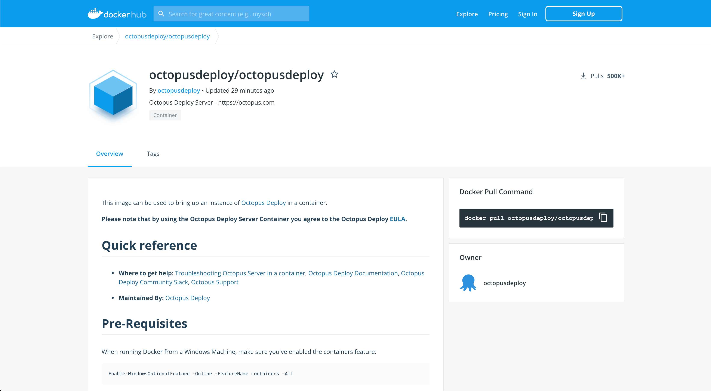
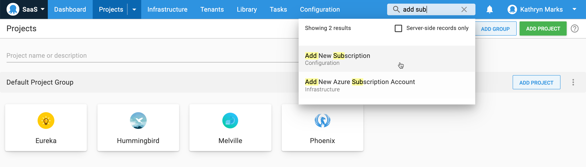
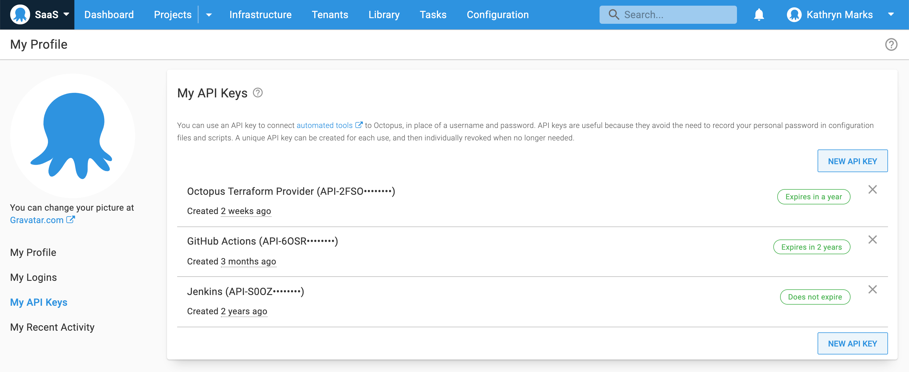
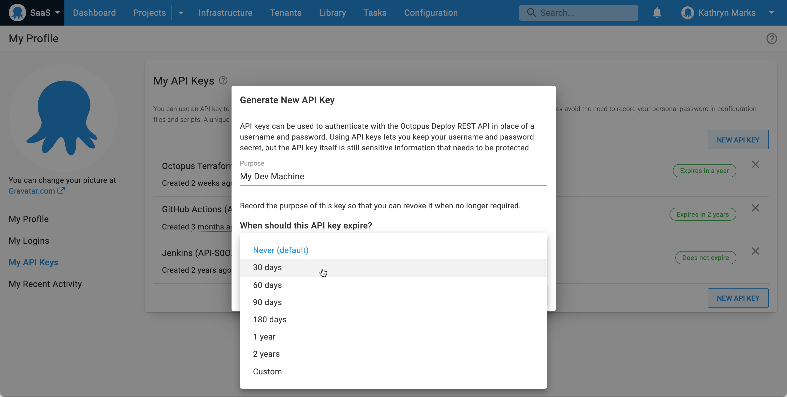

We're pleased to announce our first release of 2021. This year we're shifting to a quarterly cadence, with four Octopus Server releases instead of six.

This year's releases are:

- Q1: Octopus Server 2020.6
- Q2: Octopus Server 2021.1 
- Q3: Octopus Server 2021.2
- Q4: Octopus Server 2021.3

This update brings together two exciting features for Linux users that allow you to:

- Self-host the Octopus Server on Linux. 
- Run the Tentacle agent on ARM and ARM64 hardware. 

We joined the [Linux Foundation](https://www.linuxfoundation.org) in 2020, and we care deeply about making DevOps automation excellent on both Windows and Linux platforms. Octopus Cloud uses our Linux Docker image to power the deployments for thousands of customers. It's a stable and secure platform for all your deployment and runbook automation, and now it's available to self-hosted customers as well.

This release also includes new Global Search and API key management features that benefit all users of Octopus Server.

## Included in the Q1 release

- Octopus Server 2020.6
   - Octopus Server Linux Docker image
   - Tentacle for ARM/ARM64
   - Global Search
   - Improved API key management
   - [Additional improvements and bug fixes](https://octopus.com/downloads/whatsnew/2020.6)
- Tentacle 6.0.490
- Octopus Server Docker Images: `latest` or `octopusdeploy/octopusdeploy:2020.6`

## Long term support

The following table shows the Octopus Server releases with long term support. 

| Release               | Long term support           |
| --------------------- | --------------------------- |
| Octopus 2020.6        | Yes                         |
| Octopus 2020.5        | Yes                         |
| Octopus 2020.4        | Expired                     |

## Release Tour

<iframe width="560" height="315" src="https://www.youtube.com/embed/RlpyOqjQffo" frameborder="0" allowfullscreen></iframe>

## Octopus Server Linux Docker image {#octopus-server-linux-docker-image}

Octopus Server Docker images allow you to self-host Octopus on a Linux operating system of your choice. They also make it easier to try Octopus for the first time, since a simple Docker Compose file is all you need to be up and running in minutes. 

We're proud to announce this feature has reached _release to web_ (RTW) status after shipping to [early access](https://octopus.com/blog/octopus-release-2020-3) in Octopus 2020.3. We've removed the pre-release tag so it's now fully supported for production workloads for all of our customers.

Special thanks to the members of the Octopus community who tested our Docker images during the public preview and reported issues. This helped us reach RTW status with confidence.

Check out our [Docker Hub repository](https://hub.docker.com/r/octopusdeploy/octopusdeploy) to get started. For more detailed instructions and a thorough example you can read the blog post [Introducing the Octopus Server Linux Docker image](https://octopus.com/blog/introducing-linux-docker-image).

## Tentacle for ARM/ARM64 {#tentacle-for-arm-arm64}

The Octopus Tentacle agent now supports ARM and ARM64 hardware. This update makes it possible to deploy your apps and services to Raspberry Pi 3 and 4, AWS A1 EC2 instances, and any ARM hardware that can run [.NET Core 3.0 or later](https://devblogs.microsoft.com/dotnet/announcing-net-core-3-0/#platform-support).

Learn more in our blog post: [Octopus Tentacle on ARM/ARM64](https://octopus.com/blog/tentacle-on-arm).

## Global Search {#global-search}

We've introduced a search field to the Octopus Web Portal to help you:

- Navigate Octopus faster.
- Find and invoke actions with a few keystrokes.
- Quickly find server-side resources within a space and go directly to them with ease. 

Global Search benefits all Octopus users. It helps first-time users gain confidence with Octopus and find what they need even when they don't know where to look, and it allows advanced users to navigate even faster than before.

Please let us know what you think of the new Global Search and how we can improve it.

You can also learn more by reading about the [issue on GitHub](https://github.com/OctopusDeploy/Issues/issues/6703).

## Improvements to API key management {#api-key-management}

The Octopus API is one of our most popular features, but we recognized an opportunity to improve API key management. In this release we have: 

- Introduced optional expiration dates for API keys.
- Added API key subscription events.
- Made improvements to audit logging of API key events.

This update makes it easier to track who created a given API key.

### API key expiration ###

The API key expiration date is optional and the default value is `Never`. Expiration is set during key creation and checked every time the key is used.

When generating a new key you can select a time period such as:

- 30, 60, 90 or 180 days.
- 1 or 2 years.
- A custom date. 

The expiration date appears in the audit log as part of the API key creation event.

### Audit log filtering ###

We've improved the filter for the API Key document type to ensure API key creation and deletion events are included. API keys created for a service account are included when the log is filtered by the service account and/or the API Key document type.

### API key subscription events ###

You can now subscribe to notifications for API key expiration events. Receive a notification of the event before it's a problem and update the key accordingly, saving you the frustration of an integration breaking unexpectedly.

The new API key subscription events include:

- Key expired.
- Key within 10 days of expiring.
- Key within 20 days of expiring.

### Display of API keys ###

From now on, the first four characters of the API key are displayed in Octopus, including audit logs and the list of API keys for a given user. An example is `API-WXYZ••••••••`. This ensures API keys can be matched in the user interface.

Note that this change only applies to new keys. Existing keys are already hashed so the first four characters are not available.

Learn [how to create an API key](https://octopus.com/docs/octopus-rest-api/how-to-create-an-api-key) in our documentation.

## Breaking changes

This release includes two breaking changes:

1. **[Channels now require the `ProjectView` permission](https://github.com/OctopusDeploy/Issues/issues/6690)**. Performing operations on Channels requires the `ProjectView` permission in addition to the existing permissions. 
2. **[Change to support for Windows Server 2008](https://octopus.com/docs/infrastructure/deployment-targets/windows-targets/requirements)**. Microsoft no longer supports Windows 2008. For this reason Octopus does not actively test against Windows 2008, and certain operating system specific issues may not be fixed.

## Upgrading

Octopus Cloud users are already running this release, and self-hosted Octopus customers can [download the latest version](https://octopus.com/downloads/2020.6.0) now.  

As usual, we encourage you to review the [steps for upgrading Octopus Server](https://octopus.com/docs/administration/upgrading). Please see the [release notes](https://octopus.com/downloads/compare?to=2020.6.0) for further information.

## What’s coming in future releases?

Check out our [public roadmap](https://octopus.com/roadmap) to stay informed and register for updates.

## Conclusion

Octopus 2021 Q1 offers Linux Docker images, Tentacle support for ARM/ARM64, Global Search, and improvements to API key management. We look forward to shipping more great features in the next release.

Feel free to leave a comment and let us know what you think! 

Happy deployments!

## Related posts

- [Octopus Tentacle on ARM/ARM64](https://octopus.com/blog/tentacle-on-arm)
- [Introducing the Octopus Server Linux Docker image](https://octopus.com/blog/introducing-linux-docker-image)
- [Octopus 2020.3: Runbooks++, Jenkins Pipelines, and Octopus Linux Docker image](https://octopus.com/blog/octopus-release-2020-3)
