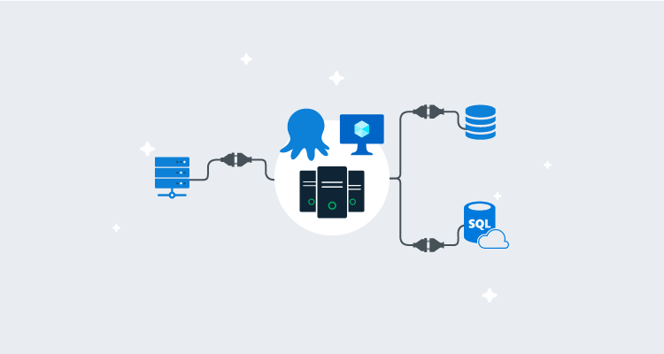

We recently updated our [high availability](https://octopus.com/docs/administration/high-availability) documentation to provide more information and options for hosting Octopus High Availability.

In this blog, I set up Octopus High Availability on Azure, evaluate different options you can use, and take you through the different components of a highly available Octopus Deploy setup on [Microsoft Azure](https://azure.microsoft.com/en-us/).

!toc

## The benefits of Octopus High Availability

[High availability](https://octopus.com/docs/administration/high-availability) lets you run multiple Octopus Servers, distributing load and tasks between them. High availability has several benefits:

- Higher resilience for business-critical workloads.
- Easier maintenance tasks such as [server patching](https://en.wikipedia.org/wiki/Patch_(computing)).
- Performance and scalability.
- Less downtime.
- There's no extra charge for using Octopus High Availability.

## Octopus High Availability components

An Octopus HA configuration requires four main components:

- **A load balancer**: Load balancers direct user traffic bound for the Octopus web interface between the different Octopus Server nodes.
- **Octopus Server nodes**:  These run the Octopus Server windows service. They serve user traffic and orchestrate deployments.
- **A database**: Most data used by the Octopus Server nodes are stored in this database.
- **Shared storage**: Some larger files (like [NuGet packages](https://octopus.com/docs/packaging-applications/package-repositories), artifacts, and deployment task logs) aren't suitable to be stored in the database and must be stored in a shared folder available to all nodes.

## Octopus virtual machines

When creating a highly-available configuration, you'll need to provision a minimum of two virtual machines in Azure to host Octopus. We don't have a one-size-fits-all spec for Octopus as it will depend on:

- [Number and type of deployment targets](https://octopus.com/docs/infrastructure/deployment-targets).
- [Retention policies](https://octopus.com/docs/administration/retention-policies/).
- [Number of concurrent tasks](https://octopus.com/docs/support/increase-the-octopus-server-task-cap/).

If you have a reasonably small workload in Octopus, you can choose a smaller virtual machine. Still, the Azure D Series Virtual Machines are a great place to start as they are general purpose and fit most scenarios reasonably well. 

Our recommendation is to consider your workload and then use one of the D Series VMs and see how well it performs for your requirements.


In this instance, I spun up two virtual machines, called **Octo1** and **Octo2** using **D2s V2**, which has two vCPU and 8GB of memory using **Server 2019**. This specification is a great place to start, and you can change the D Series to other sizes. 

In theory, you can increase resources and decrease resources as required. You could use some form of automation here to scale horizontally or vertically.

### Virtual machine disks

You need to consider what type of storage you want for your Octopus virtual machines, and you can see a full list of [availability disk types](https://docs.microsoft.com/en-us/azure/virtual-machines/disks-types). There are a few to consider:

- [Ultra Disk](https://docs.microsoft.com/en-us/azure/virtual-machines/disks-types#ultra-disk): Azure's fastest disks.
- [Premium SSD](https://docs.microsoft.com/en-us/azure/virtual-machines/disks-types#premium-ssd): A great solution for most workloads.
- [Standard SSD](https://docs.microsoft.com/en-us/azure/virtual-machines/disks-types#standard-ssd): A solution that gives you fast disks within a reasonable budget.
- [Standard HDD](https://docs.microsoft.com/en-us/azure/virtual-machines/disks-types#standard-hdd): Generally best kept for low-performance workloads or Dev and Test environments.

It's critical to remember this is only for the VM, and I selected **Standard SSD** because the cost and performance match my requirements. Octopus isn't very disk-intensive, which means you're unlikely to get many benefits using Ultra Disks. You should consider Premium SSD if you're using Octopus with thousands of projects, as this can be beneficial.

### Azure Availability Sets vs. Azure Availability Zones

Please check out the [Azure docs](https://docs.microsoft.com/en-us/azure/virtual-machines/availability) for a complete list of availability options for Azure Virtual Machines, as we won't cover all of these.

- [Azure Availability Zones](https://docs.microsoft.com/en-us/azure/availability-zones/az-overview#availability-zones) are separate data centers within Azure Region, with dedicated power, cooling, and networking. With this option, when using Availability Zones, you are ensuring Octopus remains resilient to failure in your primary Azure Region. For resiliency, there's a minimum of three separate zones in all enabled regions. Azure offers a **99.99% uptime SLA** for this option.
- [Azure Availability Sets](https://docs.microsoft.com/en-us/azure/virtual-machines/availability-set-overview) is a logical grouping of VMs that provide redundancy and availability. Azure offers a **99.95% uptime SLA** for Availability Sets, and there are no costs for this, apart from the virtual machine costs.

When designing and configuring Octopus on Microsoft Azure, I went for the **Azure Availability Zones** option purely for the increased SLA. It's also what Microsoft generally recommends for high availability. 

I set up my two virtual machines **Octo1** and **Octo2** in **Availability Zone 1** and **Availability Zone 2**. This gives me tolerance in Octopus HA as it's using different logical data centers and the benefits of having low-latency access to the storage and the SQL database.

Most Octopus High Availability configurations will contain two virtual machines. If you're using three or more, you will need to place them into their zones.

An example configuration for multi-VM Octopus High Availability would be:

- Octo1 in AZ1, Octo2 in AZ2
- Octo1 in AZ1, Octo2 in AZ2, Octo3 in AZ3
- Octo1 in AZ1, Octo2 in AZ2, Octo3 in AZ3, Octo4 in AZ1

We only test Octopus to eight nodes, but you can separate these over as many of the Availability Zones as you wish.

## Octopus SQL database

Octopus is underpinned by a SQL database that stores environments, projects, variables, releases, and deployment history. You will need to spin up a SQL server in Azure. There are two options to consider, and Octopus works natively with both:

- [SQL Server on a virtual machine](https://docs.microsoft.com/en-us/azure/virtual-machines/windows/sql/virtual-machines-windows-sql-server-iaas-overview/)
- [Azure SQL Database as a Service](https://docs.microsoft.com/en-us/azure/sql-database/sql-database-technical-overview/)

If you have access to a Database Administrator, you should seek their expertise, as they may provide further insight.

### SQL Virtual Machine vs. Azure SQL

Most organizations are using virtual machines when they provision their SQL workload in the cloud. In this section, I go through the benefits of picking SQL VMs and some of the drawbacks.

As we need a highly available configuration for Octopus, we need to factor in high availability at the SQL level. This means you need a minimum of three SQL servers, preferably in a [SQL cluster in Azure](https://techcommunity.microsoft.com/t5/Premier-Field-Engineering/Configure-SQL-Server-Failover-Cluster-Instance-on-Azure-Virtual/ba-p/371464), or an [Always On Availability Group](https://docs.microsoft.com/en-us/azure/virtual-machines/windows/sql/virtual-machines-windows-portal-sql-availability-group-tutorial) in Azure. 

Mostly, I will keep this part high-level as there's great content available on these topics, and you may have a Database Administrator who will carry this out for you. If you already have this on Azure, I recommend using that setup to host Octopus, preferably on a dedicated SQL instance.

The benefits of using SQL Virtual Machines over Azure SQL:

- Greater flexibility.
- More control.
- Hosting multiple databases without additional cost.

The drawbacks of using SQL Virtual Machines over Azure SQL:

- Higher total cost of ownership.
- Increased set up time.
- Maintaining infrastructure and database(s).

I do many proof of concepts, and I'm a big fan of anything [PaaS](https://en.wikipedia.org/wiki/Platform_as_a_service). I particularly like [Azure SQL Database Service](https://docs.microsoft.com/en-us/azure/sql-database/sql-database-technical-overview), as I don't need to invest much time spinning up virtual machines, network security groups, configuring SQL, firewall rules, maintenance plans, etc. 

I can log on to the [Azure Portal](https://portal.azure.com/) and spin up a new SQL Server, database, and connection strings in minutes. If you have [ARM templates](https://azure.microsoft.com/en-gb/resources/templates/) in place for this, it can take a few moments. [Infrastructure as code](https://en.wikipedia.org/wiki/Infrastructure_as_code) is a huge time saver, but I realize this may not be everyone's preference just yet.

When spinning up a database on Azure SQL, I can create a geo-replicated or locally-replicated database in a few moments, and that's my database highly available. Then I simply configure the connection string for Octopus, and I'm good to go.

There are many benefits of using Azure SQL over SQL Virtual Machines:

- It's easier to configure.
- Spin up and tear down as you require in seconds/minutes.
- Making the database highly available is a couple of commands or clicks away.
- Managed back up and maintenance tasks.
- Great Azure AQL analytics and monitoring built-in.

Some of the drawbacks of using Azure SQL over SQL Virtual Machines:

- Less control.
- Restoring a back up when something goes wrong takes considerably longer.
- Refactoring SQL scripts.
- Trying to understand what a [DTU](https://docs.microsoft.com/en-us/azure/sql-database/sql-database-service-tiers-dtu) is.

Both options have their merits and drawbacks. You should give this some thought when choosing the right solution for you and your organizational needs.

### SQL Database selection

Here's what I did in my example:

- Selected Azure SQL Server in West Europe as this is my primary region for all.
- Selected Azure SQL Server in North Europe for my Geo-Replicated Octopus database for disaster recovery needs.
- Created a database named **Octo-HA** in the primary region and SQL Server.
- Browsed to Geo-Replication on the Primary Azure SQL Database and enabled replication.
- Let it replicate to the secondary database server and region.

At this point, you have a primary database server and database, and it's synced cross-region to a secondary server and database.

:::info
Zone Redundant Databases are currently in preview in Azure. Had this been available, I would have used Zone Redundant Databases as this is the same level of redundancy I have set for my Azure Virtual Machines.
:::

### SQL Database specifications

This part of the blog covers options for SQL Server performance. I recommend reviewing the [high availability SLA](https://docs.microsoft.com/en-us/azure/azure-sql/database/high-availability-sla) doc to select the correct sizing of the database and server.

In my example, I selected:

- General purpose.
- Provisioned, which provides computer resources that are pre-allocated and billed per hour.
- 2 vCores.
- Max Data Size of 30GB.
- Zone Redundancy turned on (Zone Redundancy adds about 20% to the cost).

These specifications are a great place to start in a highly-available configuration. You may need to consider your workload though, as this may be too big for your requirements if you own a small Octopus instance.

If you own a large instance, I'd consider the HyperScale and Business Critical loads in Microsoft Azure. Find the right fit for your requirements for SQL, as you don't want a slow-performing Octopus instance, but you probably also don't want to size it too big and pay too much for your database hosting.

## Octopus storage

In a single node setup, you typically host Octopus on [local storage](https://en.wikipedia.org/wiki/Local_storage) on either `C:\Octopus` or `D:\Octopus.` You need some local storage for Octopus unless you decide to present an Azure File Share as a mapped drive or as a symbolic link to the server. 

We recommend hosting your Octopus logs and configuration locally on the server. This avoids potential file locking issues that could cause Octopus to stop responding.

### Artifacts, packages, and task logs

Octopus stores several files that are not suitable to store in the database. These include:

- NuGet packages used by the [built-in NuGet repository](https://octopus.com/docs/packaging-applications/package-repositories) inside Octopus. These packages can often be substantial.
- Artifacts collected during a deployment. Teams using Octopus sometimes use this feature to collect large log files and other files from machines during a deployment.
- Task logs which are text files that store all of the log output from deployments and other tasks.

As with the database, you tell the Octopus Servers where to store these as a file path within your operating system from the Octopus perspective. Octopus doesn't care what technology you use to present the shared storage; it could be a mapped network drive or a UNC path to a file share. Each of these three types of data is stored in a different place.

Whichever way you provide the shared storage, there are some considerations:

- To Octopus, it needs to appear as a mapped network drive (e.g., `D:\`) or a UNC path to a file share (e.g., `\\server\path`).
- The service account that Octopus runs as needs full control over the directory.
- Drives are mapped per-user, so you should assign the drive using the same service account that Octopus is running under.

### Azure Files

If your Octopus Server is running in Microsoft Azure, there is only one solution (unless you have a [DFS Replica](https://docs.microsoft.com/en-us/windows-server/storage/dfs-replication/dfsr-overview) in Azure). That solution is [Azure File Storage](https://docs.microsoft.com/en-us/azure/storage/files/storage-files-introduction) which presents a file share over SMB 3.0 that is shared across all of your Octopus servers.

Once you have created your file share, add the Azure File Share as a [symbolic link](https://en.wikipedia.org/wiki/Symbolic_link) and then add this to `C:\Octopus\` for the artifacts, packages, and task logs which need to be available to all nodes.

Run the following **before installing Octopus**:

````powershell
# Add the Authentication for the symbolic links. You can get this from the Azure Portal.

cmdkey /add:octostorage.file.core.windows.net /user:Azure\octostorage /pass:XXXXXXXXXXXXXX

# Add the Symbolic Links. Do this before installing Octopus.

mklink /D C:\Octopus\TaskLogs \\octostorage.file.core.windows.net\octoha\TaskLogs
mklink /D C:\Octopus\Artifacts \\octostorage.file.core.windows.net\octoha\Artifacts
mklink /D C:\Octopus\Packages \\octostorage.file.core.windows.net\octoha\Packages

# Now add the Octopus folders to the new symbolic links:

New-Item -ItemType directory -Path C:\Octopus
New-Item -ItemType directory -Path C:\Octopus\Artifacts
New-Item -ItemType directory -Path C:\Octopus\Packages
New-Item -ItemType directory -Path C:\Octopus\TaskLogs
````

[Install Octopus](https://octopus.com/docs/installation) and then run the following:

````powershell
# Set the path
& 'C:\Program Files\Octopus Deploy\Octopus\Octopus.Server.exe' path --artifacts "C:\Octopus\Artifacts"
& 'C:\Program Files\Octopus Deploy\Octopus\Octopus.Server.exe' path --taskLogs "C:\Octopus\TaskLogs"
& 'C:\Program Files\Octopus Deploy\Octopus\Octopus.Server.exe' path --nugetRepository "C:\Octopus\Packages"
````

## Load balancing

When you configured the first Octopus Server node and each of the subsequent nodes, you configured the HTTP endpoint that the Octopus Web Portal is available on. 

The final step is to configure a load balancer to direct user traffic between each of the Octopus Server nodes.

Octopus can work with any load balancer technology, including hardware and software load balancers. Azure has the following load balancers available to us:

- [Azure Traffic Manager](https://docs.microsoft.com/en-us/azure/traffic-manager/traffic-manager-overview)
- [Azure Application Gateway](https://docs.microsoft.com/en-us/azure/application-gateway/overview)
- [Azure Load Balancer](https://docs.microsoft.com/en-us/azure/load-balancer/load-balancer-overview)
- [Azure Front Door](https://docs.microsoft.com/en-us/azure/frontdoor/front-door-overview)
- [Kemp LoadMaster](https://kemptechnologies.com/uk/solutions/microsoft-load-balancing/loadmaster-azure/)
- [F5 Big-IP Virtual Edition](https://www.f5.com/partners/technology-alliances/microsoft-azure)

After evaluating the options in Azure, my preference is the Azure Load Balancer option, as this is a feature-rich load balancer that meets my requirements. If you want to compare all of the Azure options for load balancing, check out [choose a load balancing service](https://docs.microsoft.com/en-us/azure/architecture/guide/technology-choices/load-balancing-overview).

:::tip
Create your Azure Load Balancer before you create the virtual machines, as you can select the load balancer during provisioning.
:::

### Load balancer session persistence

We typically recommend using a round-robin (or similar) approach for sharing traffic between the nodes in your cluster, as the Octopus Web Portal is stateless.

However, each node in the cluster keeps a local cache of data, including user permissions. There is a known issue that occurs when a user's permissions change. The local cache is only invalidated on the node where the change was made.

To work around this issue in the meantime, you can configure your load balancer with **session persistence**. This will ensure user sessions are routed to the same node.

## Authentication providers

If you're migrating from on-premises to Azure, you will need to consider your authentication providers. You're likely using **Active Directory** on-premises, and generally, this isn't something that's supported in Octopus in Azure because you need a Domain Controller in the same network as your Octopus installation to allow for authentication of your Active Directory users.

If you have Domain Controllers in Azure that are contactable, you can continue to use Active Directory authentication.

If you do not have Domain Controllers that are contactable in Azure, you need to consider switching to:

- [Azure Active Directory](https://octopus.com/docs/security/authentication/azure-ad-authentication)
- [GoogleApps](https://octopus.com/docs/security/authentication/googleapps-authentication)
- [Okta](https://octopus.com/docs/security/authentication/okta-authentication)
- [Built-in Users and Teams](https://octopus.com/docs/security/users-and-teams)

### Moving authentication providers

If you have used Active Directory on-premises and you are moving to Azure, and you can't continue using Active Directory, you can associate multiple external identities to a single user in Octopus. The most common migration is likely from Active Directory to Azure Active Directory. In this example, assuming I have a user named **Derek.Campbell** on a domain called **work.local** and an Active Directory tenant of **worklocal.onmicrosoft.com**, I would:

- Setup [Azure Active Directory](https://octopus.com/docs/security/authentication/azure-ad-authentication).
- Add my **Derek.Campbell@Worklocal.OnMicrosoft.com** account to the Octopus Deploy user that also has my **Derek.Campbell@Work.local** user.
- Remove **Derek.Campbell@work.local** from the user.
- Test authentication.
- Rinse and repeat for all users.

:::info
Please check out [this script](https://github.com/OctopusDeploy/OctopusDeploy-Api/blob/master/REST/PowerShell/Users/AddAzureActiveDirectoryLoginToUsers.ps1) as it could help with migrations from on-premises to Azure if you are switching to Azure Active Directory.
:::

## Networking

Networking is a contentious issue at the best of times, and your configuration will depend heavily on your existing network topology and standards. I'd implement one or some of the below to help protect your Azure workload:

- [Azure Bastion](https://azure.microsoft.com/en-gb/services/azure-bastion/): A fully platform-managed PaaS service you can use to provide secure and seamless RDP/SSH connectivity to your servers.
- [VPN Gateway](https://azure.microsoft.com/en-gb/services/vpn-gateway/): A service that connects your on-premise network to Azure services.
- [ExpressRoute](https://azure.microsoft.com/en-gb/services/expressroute/): A way to have a dedicated line direct to Azure over a private link.
- [A Jump Box](https://en.wikipedia.org/wiki/Jump_server): A way to enable a single route into your Azure services from a secured server.

Consider using existing methods to connect to Azure if you already have them in place. If you have ExpressRoute, then this is the best approach, however it is the most expensive. 

If you have a VPN Gateway, a jump box, or even Azure Bastion service, I recommend using these to your advantage.

The most important recommendation is to reduce your [attack surface](https://en.wikipedia.org/wiki/Attack_surface), while keeping your networking as straightforward as you can without causing any potential security issues.

- Where possible, use [internal IPs and networks](https://en.wikipedia.org/wiki/Private_network) over public IPs, particularly for your SQL configuration.
- Use a VPN or a Jump/Bastion box. Preferably both.
- Secure Octopus to use HTTPS only with a valid certificate.

### Polling Tentacles

Listening Tentacles require no special configuration for high availability.  Polling Tentacles, however, poll a server at regular intervals to check if there any tasks the Tentacle needs to perform. 

In a high availability scenario, Polling Tentacles must poll all of the Octopus Servers in your configuration. You could poll a load balancer, but there is a risk, depending on your load balancer configuration, that the Tentacle will not poll all servers promptly.  

You could also configure the Tentacle to poll each server by registering it with one of your Octopus Servers and then adding each Octopus Server to the Tentacle.config file. There are two options to add Octopus Servers, via the command-line or by editing the Tentacle.config file directly:

**Tentacle.config**

Configuring the Tentacle via the command-line is the preferred option with the command executed once per server. An example command using the default instance can be seen below:

```powershell
C:\Program Files\Octopus Deploy\Tentacle>Tentacle poll-server --server=http://my.Octopus.server --apikey=API-77751F90F9EEDCEE0C0CD84F7A3CC726AD123FA6
```

For more information on this command, please refer to the [Tentacle Poll Server options document](https://octopus.com/docs/octopus-rest-api/tentacle.exe-command-line/poll-server).

Alternatively, you can edit Tentacle.config directly to add each Octopus Server (this is interpreted as a JSON array of servers). This method is not recommended as the Octopus service for each server will need to be restarted to accept incoming connections via this method:

```xml
<set key="Tentacle.Communication.TrustedOctopusServers">
[
  {"Thumbprint":"77751F90F9EEDCEE0C0CD84F7A3CC726AD123FA6","CommunicationStyle":2,"Address":"https://10.0.255.160:10943","Squid":null,"SubscriptionId":"poll://g3662re9njtelsyfhm7t/"},
  {"Thumbprint":"77751F90F9EEDCEE0C0CD84F7A3CC726AD123FA6","CommunicationStyle":2,"Address":"https://10.0.255.161:10943","Squid":null,"SubscriptionId":"poll://g3662re9njtelsyfhm7t/"},
  {"Thumbprint":"77751F90F9EEDCEE0C0CD84F7A3CC726AD123FA6","CommunicationStyle":2,"Address":"https://10.0.255.162:10943","Squid":null,"SubscriptionId":"poll://g3662re9njtelsyfhm7t/"}
]
</set>
```

Notice there is an address entry for each Octopus Server in the high availability configuration. Depending on your configuration and network topology, you can use the private IP or the public IP and/or FQDN for each Octopus node. An example below shows what it would be like to register to **octo1.domain.com**, **octo2.domain.com**, and **octo3.domain.com** on port **10943**:

```xml
<set key="Tentacle.Communication.TrustedOctopusServers">
[
  {"Thumbprint":"77751F90F9EEDCEE0C0CD84F7A3CC726AD123FA6","CommunicationStyle":2,"Address":"https://octo1.domain.com:10943","Squid":null,"SubscriptionId":"poll://g3662re9njtelsyfhm7t/"},
  {"Thumbprint":"77751F90F9EEDCEE0C0CD84F7A3CC726AD123FA6","CommunicationStyle":2,"Address":"https://octo2.domain.com:10943","Squid":null,"SubscriptionId":"poll://g3662re9njtelsyfhm7t/"},
  {"Thumbprint":"77751F90F9EEDCEE0C0CD84F7A3CC726AD123FA6","CommunicationStyle":2,"Address":"https://octo3.domain.com:10943","Squid":null,"SubscriptionId":"poll://g3662re9njtelsyfhm7t/"}
]
</set>
```

In the following example, I use the public IP instead of an FQDN or a private IP:

```xml
<set key="Tentacle.Communication.TrustedOctopusServers">
[
  {"Thumbprint":"77751F90F9EEDCEE0C0CD84F7A3CC726AD123FA6","CommunicationStyle":2,"Address":"https://1.2.3.4:10943","Squid":null,"SubscriptionId":"poll://g3662re9njtelsyfhm7t/"},
  {"Thumbprint":"77751F90F9EEDCEE0C0CD84F7A3CC726AD123FA6","CommunicationStyle":2,"Address":"https://1.2.3.5:10943","Squid":null,"SubscriptionId":"poll://g3662re9njtelsyfhm7t/"},
  {"Thumbprint":"77751F90F9EEDCEE0C0CD84F7A3CC726AD123FA6","CommunicationStyle":2,"Address":"https://1.2.3.6:10943","Squid":null,"SubscriptionId":"poll://g3662re9njtelsyfhm7t/"}
]
</set>
```

## Migration

If you're migrating an instance of Octopus to Azure, our recommended approach is:

- Set up the infrastructure.
- Set up the Octopus folders and storage location.
- Run through highly-available Octopus installation.
- Do a proof of concept move to the new instance.
- Test authentication and deployments.
- Plan a production move when confirmed.
- Plan downtime.
- Migrate using [moving the Octopus Server and database](https://octopus.com/docs/administration/managing-infrastructure/moving-your-octopus/move-the-database-and-server).
- Switch to the new Azure setup.

## Conclusion

As much as high availability in Azure is straightforward, there's a lot to consider when moving from on-premises to Azure hosting for Octopus Deploy. In this blog, I explained and recommended some technologies to use, to help when you're configuring Octopus High Availability on Microsoft Azure.

I hope these tips make it easier to set up Octopus High Availability on Microsoft Azure.

Happy deployments!
