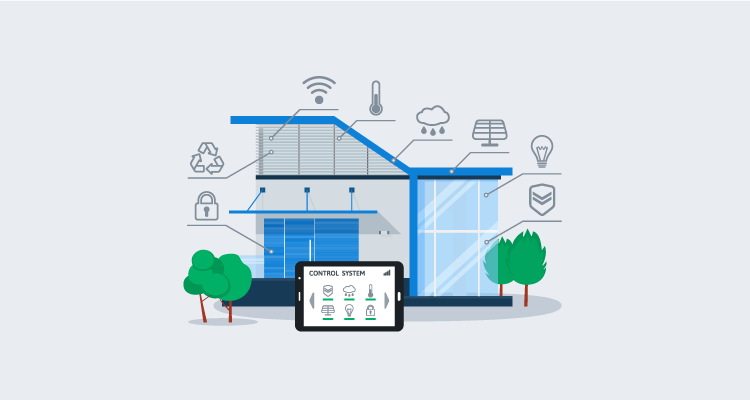
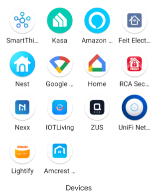

At Octopus Deploy, we're obsessed with automation. As you might expect, this obsession goes beyond deployments, with many of us dabbling in the world of home automation.  

Home automation allows us to do things like have our garage door open automatically when our car enters the driveway, or unlock the door from a phone if someone's locked out. 

While home automation is a fun hobby, it comes with challenges as well. In this post, I go over some lessons I've learned while implementing smart products around my household.

## Lesson 1: Z-Wave, Zigbee and WiFi

Perhaps one of the most important lessons I learned was that not all smart devices communicate the same way, and they may require special equipment to operate.  

Smart devices fall into three distinct communication categories:

- Z-Wave
- Zigbee
- WiFi

Z-Wave and Zigbee don't connect directly to your home network. They need something in the middle to receive and transmit instructions. These devices often come in the form of a hub, which is a piece of hardware that connects to your network, either wired or wireless. 

Some hubs are brand specific, such as Phillips Hue, and do not communicate with anything but their brand. Other hubs are more generic and are compatible with most things, and may include both Z-Wave and Zigbee functionality. Samsung SmartThings is a good example of this.

While hubs are the most common device, it is possible to communicate with Z-Wave and or Zigbee devices with USB adapters. I'll go into that later in this post.

### Z-Wave
Z-Wave is a mesh network technology that uses low-energy radio waves, usually the 900 MHz band, for communication.  Being a mesh network technology, Z-Wave devices that are connected to constant power, such as a smart plug or a smart bulb, and they can act like a repeater, allowing you to place devices further away from the hub.

### Zigbee
Zigbee is similar to Z-Wave in that it's also a low-energy radio wave mesh network technology. Zigbee, however, uses the 2.4 GHz band for communication, similar to the B/G/N bands of WiFi.  

As mentioned, Zigbee devices also require the use of a hub in order to communicate. Just like Z-Wave, devices attached to constant power act as repeaters to extend the range of the Zigbee network.

### WiFi
WiFi devices are the only one of the three that do not require a hub to communicate. These devices are attached to your WiFi network, so it's easier to communicate with things like Google Home Assistant or Amazon Alexa.  

Most WiFi enabled smart devices operate on the 2.4 GHz band, which makes sense as their data needs are often small and 2.4 has a greater range. Unlike Z-Wave and Zigbee, WiFi devices are dependent on access point location and do not offer range extending capabilities.

## Lesson 2: Mesh network parent devices
Both Zigbee and Z-Wave devices attach themselves to a parent device on the mesh network. Once connected, they don't actively seek a "better" parent until communication with the first one is broken. 

To update Z-Wave to use a new parent, you may need to remove the device from your network and re-add it (some apps have 'repair network' functionality that will force it to seek a new parent).  

Zigbee, however, can find a new parent if you power off the old one, forcing it to find something else. 

The lesson I learned: if the child can still communicate with the parent, it "thinks" it's still online, even if the parent no longer communicates to its parent or the hub. 

## Lesson 3: There's an app for that
One of the early issues in my home automation journey was that each brand of device required its own app to control them, or at least, perform initial setup. It quickly became tedious setting up an account for each brand to configure the device.

My recommendation is to determine what you'd like to do with your home automation and research the available brands, to minimize the number of apps you'll need. Most WiFi devices are compatible with Google Home or Amazon Alexa, so once configured, you won't necessarily need their app to control the device.

## Lesson 4: Beware of app requirements
I came across a smart plug being advertised for a low price. Before purchasing, I read the reviews and found that its app *required* access to your contacts. That was a red flag for me.

## Lesson 5: Google Home, Amazon Alexa, and Apple HomeKit compatibility
The two most popular voice-control devices are Google Home and Amazon Alexa. The vast majority of WiFi enabled smart devices will pair with both technologies. There are some that don't, however, so double-check before purchasing. 

Apple HomeKit has a smaller ecosystem, so if this is your automation platform, do your research on the device(s) you're considering.

In terms of Zigbee or Z-Wave, just because your hub is compatible, it doesn't mean that Google, Amazon, or Apple will work with the devices attached to them. 

For example, I have a Samsung SmartThings hub to control my Z-Wave and Zigbee devices. My hub is connected to some door sensors for simple open/close detection. While my SmartThings hub is connected to both Google Home and Amazon Alexa, only Alexa can use the open/close functionality.  Google shows the door sensors as devices, but doesn't know what to do with them (without advanced configuration).

## Lesson 6: Basic routine/automation
There are multiple ways to perform basic automation (often referred to as **routines**) with smart devices:

- The device's app
- Amazon/Google

### The device's app
As referred to in lesson 3, each brand of device comes with its own app.  These apps allow you to set up different types of automations, however, they'll only work with their brand. For example, I can set up a routine that turns on my TP-Link smart bulbs at dusk, using the Kasa app. However, if I wanted my Feit Electric lights to turn on too, I'd need to set up the same automation in the Feit Electric app.

### Amazon/Google
Amazon Alexa and Google Home allow you to link the individual brand accounts to their platforms and authorize them to control your devices.  This gives you more flexibility, as you can create a single automation to control multiple devices across brands.

:::warning
Routines running in Google or Amazon have increased latency between action and trigger, due to all the communication required. For example, I have a routine that turns on a smart bulb in a closet when the door sensor is in an open state. Both devices are Zigbee attached to a SmartThings hub.  If the routine is defined in the SmartThings app, the light turns on nearly instantly. If the routine is set up in Alexa, it takes a full second before the light turns on.  
:::

## Lesson 7: Advanced automation
Device apps, Google, and Amazon give you the ability to do common, basic automation, like above with the door sensor and the smart bulb. However, none of them allow you to do advanced or complex automations such as leave the bathroom light on if the door is closed and motion is detected, or if the door is closed and no motion is detected but humidity is above a certain threshold, don't turn off the light (it is likely someone is taking a shower). For this level of automation, you'd need to implement something like [IFTTT](https://ifttt.com/) or [Home Assistant](https://www.home-assistant.io/).

### IFTTT
IFTTT stands for **If This Then That** and is a well known advanced home automation platform.  

IFTTT is an app for Apple and Google products that you can use to define advanced routines for your smart devices. It comes in both free (with limitations) and paid variants.

### Home Assistant
Home Assistant is an application that runs in a Docker container, with configurable storage options such as SQLLite, MySQL, or PostgreSQL. (Mine runs in a Docker Swarm on a Raspberry Pi with a MySQL back-end, since SQLLite and CIFS don't get along.) 

Home Assistant is highly regarded. It has a large following and adds more integrations with each iteration. Home Assistant can control Z-Wave or Zigbee devices with the use of USB adapters instead of a hub.

Troy Hunt recently wrote an [article about Home Assistant](https://www.troyhunt.com/iot-unravelled-part-1-its-a-mess-but-then-theres-home-assistant/) covering additional problems it can solve.

## Lesson 8: Cost
As with most hobbies, home automation can be expensive. Even basic smart devices, such as a plug or bulb, can range from $15 to $40 each (prices often depend on communication type) and hubs can be upwards of $100.

## Lesson 9: Be cognizant of others
While home automation and advanced routines are fun to configure, they can be equally frustrating when they don't work. Just imagine the bathroom light turning off mid-shower!

## Conclusion
Home automation is a fun hobby and can be a tremendous time sink if you delve into the advanced automation realm. I hope the lessons I've shared help you on your home automation journey.
