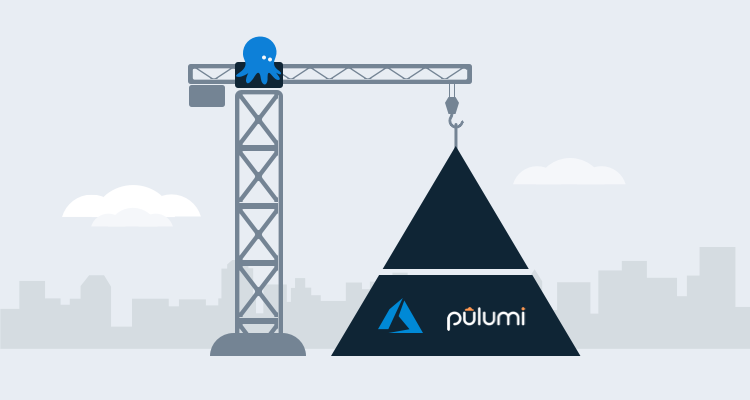
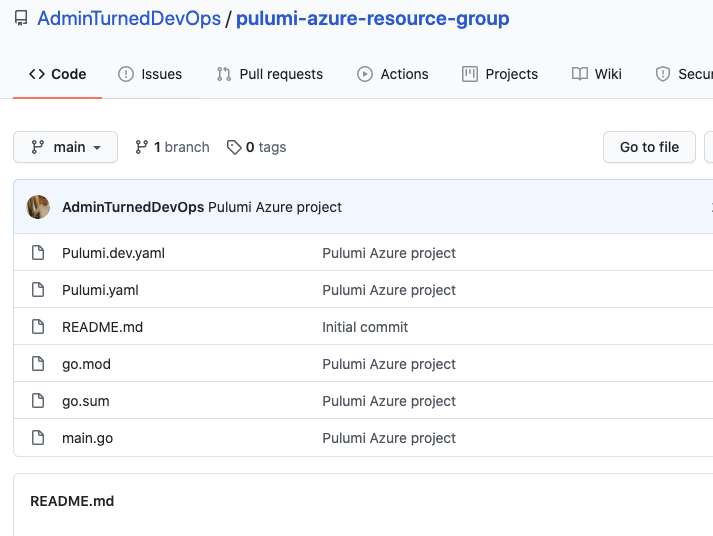
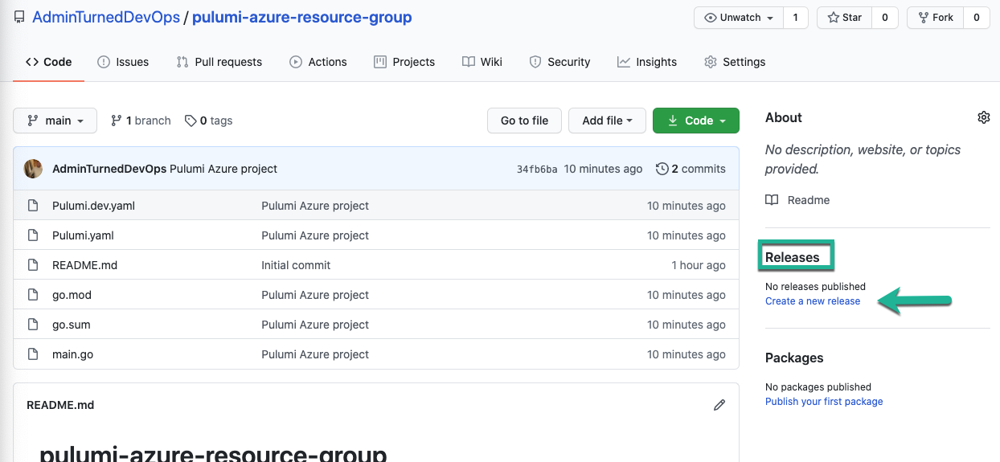

In [part one](/blog/2021-04/iac-azure-octopus-pulumi-part-1/index.md) of this series about infrastructure development with Pulumi and Octopus Deploy, I showed you how to configure Pulumi with a new project and write code with the Pulumi SDK that specifies Azure using Go.

In this post, I discuss deployment and show you how to package and deploy the Go code from [part one](/blog/2021-04/iac-azure-octopus-pulumi-part-1/index.md) with Octopus Deploy.

## Using a GitHub repo

There are different scenarios that can be used to build and package an application:

- A build server.
- Pulling a package from an artifact repo.
- Zipping up a package.
- Plus many others.

For this post, we're using GitHub, which covers a free and common scenario.

### Creating a GitHub Repo

First, create a new GitHub repo:

1. Log in to [github.com](https://www.github.com).
2. Under repositories, click **New**.
3. Give the repository a name, for example, I used the name `pulumi-azure-resource-group`.
4. Because this repository doesn't have any sensitive information, it's okay to keep it `public`.
5. Click **Create repository**.

### Pulling down the repo locally and pushing the code

1. Clone the GitHub repo and copy your Pulumi project (from [part one](/blog/2021-04/iac-azure-octopus-pulumi-part-1/index.md)) into your local repo.
2. Commit and push the code to the GitHub repo.

### Create a version

For Octopus Deploy to pull in the external feed from GitHub, the GitHub repo needs a release that's built from the code inside the repo.

1. In the GitHub repo, under **Releases**, click **Create a new release**. 

2. Give the release a name and version number. 
2. Click **Publish release**. This will create a release.

## Configuring an Octopus project for Pulumi

The code is now written, pushed to GitHub, and ready to be packaged for deployment using Octopus Deploy. To do this, create a new project and use the Pulumi community step template.

### Create an external feed

1. Log into the Octopus Web Portal.
2. Go to **{{Library, External Feeds}}**.
3. Click **ADD FEED**.
4. For **Feed Type**, choose **GitHub Repository Feed**.
5. Give it the name `Pulumi Azure Resource Group`.

You don't have to add any credentials as the repo is public.

### Create a new project and project group

1. Navigate to **Projects**.
2. Click **ADD GROUP**.
3. Name the group `Pulumi`.
4. Within the new group, add a new project called **Golang-Pulumi**.

### Creating project variables

For the Pulumi step template to deploy to Azure, it needs authentication for Azure. Allow this by using a project variable of type **Azure Account**.

1. Navigate to the project you created and under **Variables**, click **Project**.
2. Create a new variable of account type **Azure Account**. Ensure the variable name is **Azure** because the step template searches the project variables for a variable name of **Azure**.
3. Select the Azure account that has access to deploy resources.
4. Save the variable.

### Add a Deploy a Package step

1. From your project select **Process** and click **ADD STEP**.
1. Select **Package**, then select **Deploy a Package**. 
1. Click **CONFIGURE FEATURES**, and select **Custom Installation Directory**.
1. Uncheck **.NET Configuration Variables** and **.NET Configuration Transforms** and click **OK**.
1. Specify the name, target roles, and package details. Ensure the package details are pointing to the GitHub feed and the repo where you stored the Pulumi Azure project.
1. For the custom installation directory, choose where the Pulumi Azure code will reside. This is also where the Pulumi step will create the Azure resource group.
1. Save the step.

### Add a Run Pulumi (Linux) step

1. From your project, select **Process** and click **ADD STEP**.
1. Select **{{Community Steps, Pulumi, Run Pulumi (Linux)}}** and install the step. 
1. Specify the name and target roles. 
1. Add the parameters for the Run Pulumi (Linux) step template:
   - **Stack Name**: The full name of the project in Pulumi using the following format: `OrganizationName/ProjectName/StackName`. For example, mine is `AdminTurnedDevOps/azure-go-new-resource-group/dev`. You can find the information for your stack name in the Pulumi portal.
   - **Create Stack**: You can ignore this option because a stack already exists.
   - **Command**: Pulumi has several commands, but you just need `pulumi up`. You don't have to type the full command, just type `up`.
   - **Command Args**: The command arg `--yes` is required. When you run Pulumi, for example, from the command-line, there's an option to create a resource. The two options are `yes` or `no`. Because we don't have those pop-ups in the step template, we use the `--yes` flag.
   - **Pulumi Access Token**: This is an API key you can generate in the Pulumi portal under settings.
   - **Pulumi Working Directory**: The working directory is where you copied the code to, from the **Deploy a Package** step.
   - **Restore Dependencies**: This step is for use with NodeJS to restore dependencies. You're not using NodeJS, so uncheck the box.

5. When complete, save the step.

## Deploying the code

Now it's time to create a new release and run the continuous deployment process to create a new Azure Resource Group using Pulumi and Octopus Deploy.

1. In the Octopus project, click **CREATE RELEASE**.
2. Click **SAVE**.
3. Deploy to the environment of your choosing, by clicking **DEPLOY TO** and selecting the environment. 
4. Click **DEPLOY**.

You have now successfully created an Azure Resource Group using Octopus Deploy and Pulumi.

## Conclusion

Combining tools like Octopus Deploy and Pulumi allows you to automate an entire workflow from start to finish, without manual processes.

## Watch the webinar

<iframe width="560" height="315" src="https://www.youtube.com/embed/SA3-efF5PWk" title="YouTube video player" frameborder="0" allow="accelerometer; autoplay; clipboard-write; encrypted-media; gyroscope; picture-in-picture" allowfullscreen></iframe>

We host webinars regularly. See the [webinars page](https://octopus.com/events) for an archive of past webinars and details about upcoming webinars. 

Happy deployments!
