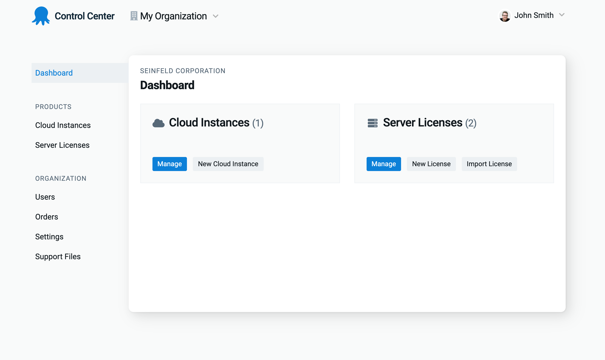

At Octopus Deploy, we don't just want to build the world's best deployment tool; we want every interaction with us to be world-class. 

We knew we could do better with the Octopus Account, so we re-imagined it, to make it more useful for you, and giving us a strong foundation for future features.

## How the Octopus Account evolved

The Octopus Account was pieced together over time. We built the first iteration in July 2018, when we released Octopus Cloud V1. 

We needed a place for account management tools, like billing. Next came Octopus ID, then self-service features like server license management, and we continued adding features one at a time, without pausing to consider the overall experience.

As a customer, you should enjoy every touch-point across Octopus, so now that the Octopus Account is well established, we’ve taken the time to redesign it and consider the whole experience.

## What's changed?

- It’s now called the Control Center, better identifying its purpose.
- The Control Center has more indicators to help with navigation, including:
   - Descriptive page titles, signposting for nested pages, and active states to assist with orientation. 
   - We’ve exposed the organization you’re viewing on all pages, so you maintain context.
   - Details of your Cloud instances are on separate pages to allow for more robust user management features in the future.

We’ve shipped the new design across the Control Center, and all existing functions and features continue to work as they did previously.

## Conclusion

The Control Center is now a distinct space to manage your account, with intuitive navigation to make finding what you need even easier. These changes also pave the way for future features we decide to implement.

We hope the redesign makes it more enjoyable to use. Please let us know if you have suggestions for further improvements. 

Happy deployments!
