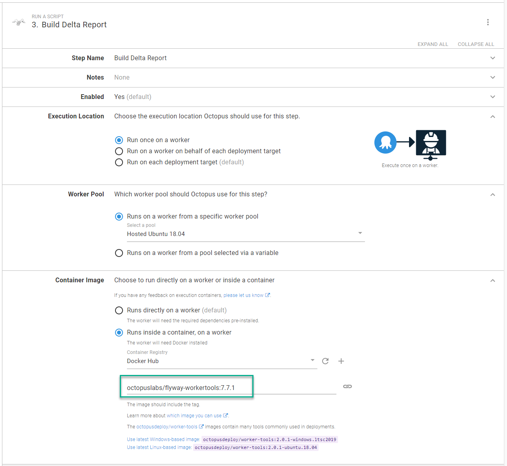
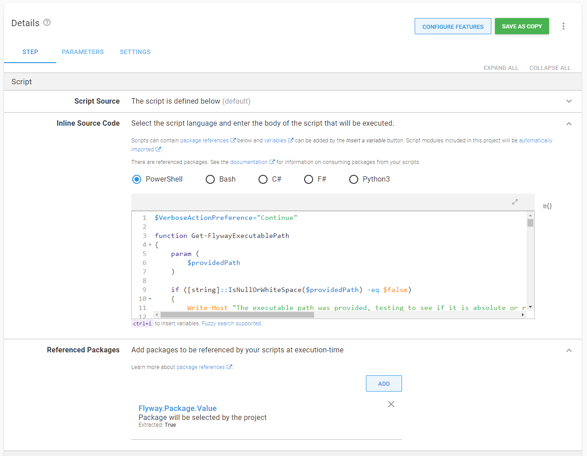
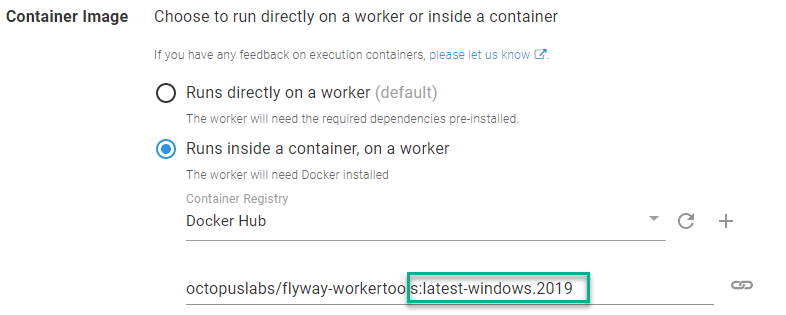
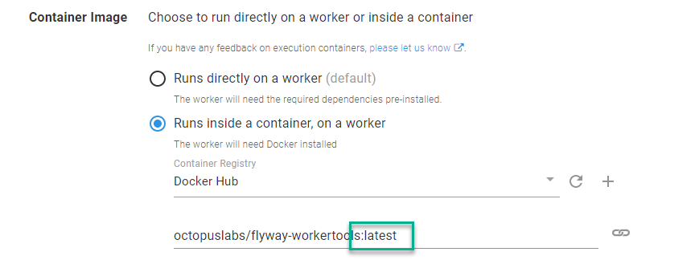
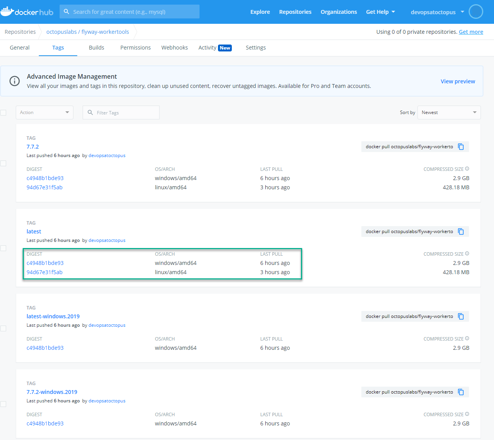
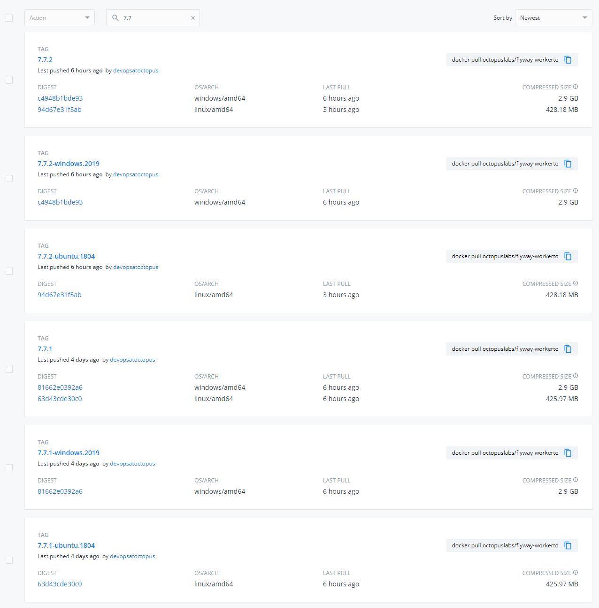

[Execution containers](https://octopus.com/blog/octopus-release-2020-2) are a hidden gem in Octopus Deploy. I recently completed a deep dive into them to assist a customer. This involved creating a custom Docker image for use with the execution container feature. I learned a few tips and tricks I want to share, to help you write your custom images.

## Execution container benefits
When [workers](https://octopus.com/docs/infrastructure/workers) were released in 2018, I was excited by the ability to off-load deployment tasks from the Octopus Server.  I started creating worker pools. One problem I ran into when configuring a worker, was needing to pre-install software.  In certain instances, some software, such as Terraform, is not compatible between versions.  Running side by side is technically possible, but it can cause issues, and I couldn't upgrade to the newest version without having to fix a bunch of deployments.

I ended up with worker pools like this:

- Terraform 11 worker pool
- Terraform 12 worker pool
- etc.

Execution containers solved the problem. I can create Docker images with the software I need pre-installed. Now in my deployment process, I specify a Docker image to download and run.



The version is part of the deployment process. Upgrading my deployment process to the newest tooling requires changing both the version number assigned to the Docker image and any steps running that process. There are no surprises, as the version of the required tooling is part of the deployment process.

## Tip 1: Referencing packages with execution containers

Database deployments are a common use case for workers.  A database deployment involves at least one package containing the desired state or the migration scripts, but how do package references work with execution containers?

Firstly, steps that run on execution containers are typically derived from the **Run a script step**.  The **Run a script step** provides the ability to [reference packages](https://octopus.com/docs/deployments/custom-scripts/run-a-script-step#referencing-packages). This mounts the necessary directories as volumes onto that Docker container.



You can easily pass the contents of a package to an execution container, which should make it a seamless transition from running directly on the server to an execution container.  That is applicable for the [Octopus Deploy supplied images](https://hub.docker.com/r/octopusdeploy/worker-tools) or your custom images.

## Tip 2: Image requirements

When creating custom execution container images, there are a few requirements:

1. Linux images should be Ubuntu-based with `wget unzip apt-utils curl software-properties-common` installed.  That's the software Calamari  requires to run correctly.
2. No entry points can be defined in the Dockerfile.  Octopus owns the lifecycles of the container; an entry point could end the container prematurely.
3. Linux containers run on Linux hosts, Windows containers run on Windows hosts.  No Linux containers on Windows hosts.
4. Assuming you tag images with multiple architectures (more on that below), a worker pool can consist of either Windows hosts or Linux hosts.  

## Tip 3: Understanding the working directory and configuring executable paths

The `docker run` command also leverages the workdir, or `-w` [parameter](https://docs.docker.com/engine/reference/run/#workdir) to set the working directory in the container to match the working directory in the host. 

Normally, the working directory in a container isn't significant. If the script runs successfully, it doesn't matter if it runs from the root or a random folder, except when you need to install custom software on your Docker image. It doesn't use a package manager such as Chocolatey for Windows, APT or YUM for Linux distros.  

I recently ran into this issue building an execution container for Flyway. Package manager is helpful because it adds the necessary paths to the environment variables.  Instead of `C:\Flyway\flyway.exe info` to run the info command, I can use `flyway info`. At the time of writing, there is only a Maven repo, which you can use to download a .tar or .zip file.  

For Linux based distros, the commands for this are:

```Dockerfile
ARG FLYWAY_VERSION=7.7.1

# Change the workdir to Flyway to install flyway binaries
WORKDIR /flyway

# Install flyway
RUN curl -L https://repo1.maven.org/maven2/org/flywaydb/flyway-commandline/${FLYWAY_VERSION}/flyway-commandline-${FLYWAY_VERSION}.tar.gz -o flyway-commandline-${FLYWAY_VERSION}.tar.gz \
  && tar -xzf flyway-commandline-${FLYWAY_VERSION}.tar.gz --strip-components=1 \
  && rm flyway-commandline-${FLYWAY_VERSION}.tar.gz \
  # Make the /flyway/flyway command an executable
  && chmod +x /flyway/flyway \
  # Make it so any user can call /flyway/flyway 
  && ln -s /flyway/flyway /usr/local/bin/flyway

# Octopus expects to start in the default directory
WORKDIR /
```

This extracts the Flyway package's contents to the `/flyway` directory, making `/flyway/flyway` an executable, then adding it the appropriate path.  All I need to do in my script is invoke `/flyway/flyway info` to run the [flyway info command](https://flywaydb.org/documentation/command/info).

For Windows containers, the commands for this are:

```Dockerfile
SHELL ["powershell", "-Command"]

ARG FLYWAY_VERSION=7.7.1

# # Install Flyway
RUN Invoke-WebRequest "https://repo1.maven.org/maven2/org/flywaydb/flyway-commandline/${env:FLYWAY_VERSION}/flyway-commandline-${env:FLYWAY_VERSION}-windows-x64.zip" -OutFile flyway-cli.zip; `
    & '.\Program Files\7-Zip\7z.exe' x .\flyway-cli.zip; `
    rm .\flyway-cli.zip;
   
RUN $old = (Get-ItemProperty -Path 'Registry::HKEY_LOCAL_MACHINE\System\CurrentControlSet\Control\Session Manager\Environment' -Name path).path; `
    Write-Host $old; `
    $flywayPath = ';C:\flyway-' + ${env:FLYWAY_VERSION}; `    
    $new = $old + $flywayPath; `
    Write-Host $new; `
    Set-ItemProperty -Path 'Registry::HKEY_LOCAL_MACHINE\System\CurrentControlSet\Control\Session Manager\Environment' -Name path -Value $new; `
    refreshenv
```

The script downloads and extracts the Flyway executable to `C:\flyway-[version number]` then adds that directory to the environment path.  All I need to do in my script is invoke `flyway info` to run the [flyway info command](https://flywaydb.org/documentation/command/info).

## Tip 4: Creating base images

I recommend creating base images that contain the basics for any child image to leverage.  I created [base images](https://github.com/OctopusDeployLabs/workertools) for the Flyway execution container image:

- Windows 2019 Image
    - PowerShell Core
    - Chocolatey
    - Python
    - 7Zip
- Ubuntu Image
    - .NET Core required software (Calamari is a self-contained .NET Core app) 
    - Curl
    - Unzip
    - PowerShell COre
    - Python3

This way the child image only has to pull the base image and install the necessary software.  Base images keep build times down for the child images, as core images rarely change.  

Before moving to base images, my builds for Linux and Windows were approximately 13 minutes.  Moving to base images reduced them to 5 minutes.

## Tip 5: Using Docker manifest for cross-platform images

Requiring a person to pick the Windows or Linux image is an additional cognitive load, especially if the tooling is cross-platform.  It forces the user to think _where_ the container will run.  

Instead of this:


Make it possible to do this:


That can be done using a [Docker manifest](https://docs.docker.com/engine/reference/commandline/manifest/).  

:::success
Docker provides [buildx](https://docs.docker.com/buildx/working-with-buildx/) as an alternative to the manifest command.  At the time of writing, buildx doesn't easily support Windows containers and Linux containers.  
:::

To leverage `docker manifest`, you have to turn on experimental features in Docker.  There are plenty of examples of how to [do this for Linux](https://github.com/docker/cli/blob/master/experimental/README.md).  If you are using Docker Desktop for Windows, run this PowerShell command as an admin and restart the Docker engine:

```
[Environment]::SetEnvironmentVariable("DOCKER_CLI_EXPERIMENTAL", "enabled")
```

How the manifest works:

1. Build the image for Windows: `docker build ./windows-2019 --tag octopuslabs/flyway-workertools:$FLYWAY_VERSION_TO_BUILD-windows.2019 --tag octopuslabs/flyway-workertools:latest-windows.2019`.
2. Push the image for each tag for Windows: `docker push octopuslabs/flyway-workertools:$FLYWAY_VERSION_TO_BUILD-windows.2019`.
3. Change to Linux containers.
4. Build the image for Linux:  `docker build ./ubuntu-1804 --tag octopuslabs/flyway-workertools:$FLYWAY_VERSION_TO_BUILD-ubuntu.1804 --tag octopuslabs/flyway-workertools:latest-ubuntu.1804`.
5. Push the image for each tag for Linux: `docker push octopuslabs/flyway-workertools:$FLYWAY_VERSION_TO_BUILD-ubuntu.1804` .
6. Build the manifest: `docker manifest create octopuslabs/flyway-workertools:latest octopuslabs/flyway-workertools:latest-windows.2019 octopuslabs/flyway-workertools:latest-ubuntu.1804`.
7. Push the manifest: `docker manifest push octopuslabs/flyway-workertools:latest`.

You will build and tag an image for each architecture (Windows and Linux).  The tags are unique to the architecture.  When you build the manifest for the `latest` tag, you can "combine latest-windows.2019 and latest-ubuntu.1804" into one tag.  When complete, your tags will look like this on Docker Hub.

:::success
The images must be pushed prior to building the manifest.  Otherwise you'll receive an error about not finding the image, because the manifest is not looking at the local computer.
:::



I've made the GitHub action to [build the Flyway execution container public](https://github.com/OctopusDeployLabs/flyway-workertools/blob/main/.github/workflows/docker-build-push.yml) so you can see this in action.

## Tip 6: Leveraging Docker build arguments

You'll notice in my Dockerfile examples I'm using the `ARG` command:

```dockerfile
ARG FLYWAY_VERSION=7.7.1
```

When a new version of Flyway is ready to be installed, and assuming everything else is consistent, I just pass in a `--build-arg` switch in my `docker build` command.

```
docker build ./ubuntu-1804 --tag octopuslabs/flyway-workertools:$FLYWAY_VERSION_TO_BUILD-ubuntu.1804 --tag octopuslabs/flyway-workertools:latest-ubuntu.1804 --build-arg FLYWAY_VERSION=$FLYWAY_VERSION_TO_BUILD
```

To create a new version of the Docker image, I only change a single spot in my pipeline, rather than in multiple places.

## Tip 7: Name and version the Docker image based on the key software

I've been using Flyway as my example container.  That is the key software for the container.  Other software, such as the Java Runtime Environment (JRE), are required for it to work correctly.  The name for the image is `flyway-workertools`, and the versioning is based on the Flyway version.



The goal is to reduce ambiguity for the image consumers.  Anyone who runs `7.7.2` of the `flyway-workertools` image knows they will get `7.7.2` of Flyway.

## Tip 8: Scheduling builds to check for new versions

The final tip is related to ongoing maintenance.  Execution containers are great, but staying up to date on the newest versions of all the tooling can be time-consuming.  Flyway publish a manifest file that I can have my build check.  My script will:

1. Check the latest version in the Flyway manifest file.
2. Pull all the tags from Docker Hub and search for the latest version.
3. If the latest version is found as a tag, then stop the build.
4. If the latest version is _not_ found as a tag, then build a new version.

The script below is from the [GitHub action used to build the Flyway worker tool image](https://github.com/OctopusDeployLabs/flyway-workertools/blob/main/.github/workflows/docker-build-push.yml).  Because it's a GitHub action, it's setting output variables to be used by later actions and steps.


```PowerShell
$manifestDataRaw = Invoke-WebRequest "https://repo1.maven.org/maven2/org/flywaydb/flyway-commandline/maven-metadata.xml"
$manifestData = [Xml]$manifestDataRaw
$latestFlywayVersion = $manifestData.metadata.versioning.latest
$workerToolsTags = Invoke-RestMethod "https://registry.hub.docker.com/v1/repositories/octopuslabs/flyway-workertools/tags"
$matchingTag = $workerToolsTags | Where-Object { $_.name -eq $latestFlywayVersion }
echo "::set-output name=CURRENT_FLYWAY_VERSION::$latestFlywayVersion"
if ($null -ne $matchingTag)
{
    Write-Host "Docker container already has latest version of flyway"
    echo "::set-output name=Continue::No"
}
else
{
    Write-Host "We need to upgrade the flyway container to $latestFlywayVersion"            
    echo "::set-output name=Continue::Yes"
}     
```

With that script, I can schedule a daily build to check for a new version and build a new container when one is found.  As long as consumers are referencing a specific version number (for example, `7.7.2`), they won't notice the new image.

The logic is different for package managers and will [depend on the package manager itself](https://stackoverflow.com/questions/18885820/how-to-check-the-version-before-installing-a-package-using-apt-get).  

## Conclusion

Execution containers in Octopus Deploy make it easier to manage dependencies. Octopus provides images to help as many people as possible get started with execution containers. They should work for most, but the images can include additional software you don’t need, resulting in bloat and longer download times. 

I hope the tips provided help you craft images to fit your specific needs.

Happy deployments!
