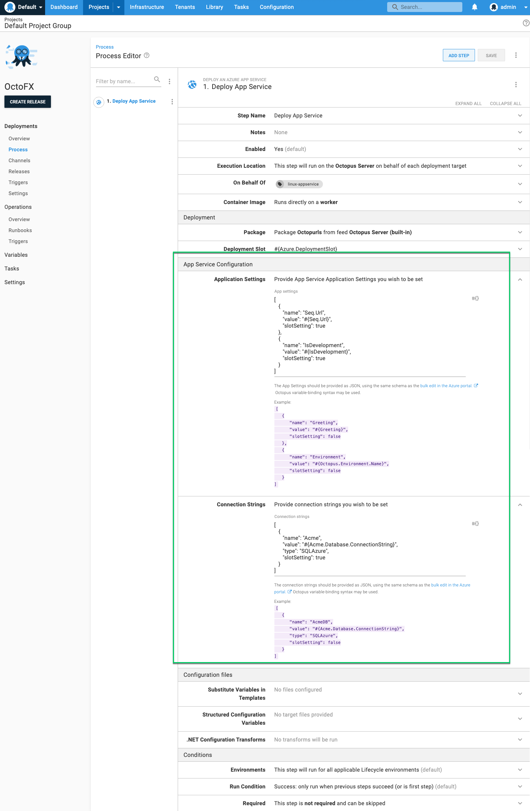

Octopus 2021.1 includes a new _Deploy an Azure App Service_ step, bringing some major improvements for deploying Azure web applications including:

- Deploying to Linux app service plans (without obscure configuration hacks) 
- Deploying container images 
- Executing deployments on Linux Octopus workers
- Configuring application settings and connection strings

The _Deploy an Azure App Service_ step is designed to supercede the existing _Deploy an Azure Web App_ step, though the original step is still available. The _Deploy an Azure Web App_ step relied on [Microsoft Web Deploy](https://www.iis.net/downloads/microsoft/web-deploy) as the deployment mechanism. This restricted the step to executing on Windows workers, required special configuration to work with Linux app service plans, and didn't support container images.  The new step relies on the [zip deploy API](https://docs.microsoft.com/en-us/azure/app-service/deploy-zip#rest) for file-based packages (zip, nupkg, war) and also supports container images. 

The new step also brings the ability to configure the Azure application settings and connection strings. 

This is done by supplying the settings and/or connection strings as JSON. Using the JSON format brings a couple of benefits: 
It is the same JSON format as used by the [bulk-edit feature in the Azure portal](https://docs.microsoft.com/en-us/azure/app-service/configure-common#edit-in-bulk), making it easy to move existing app settings into Octopus.  These fields also allow including [Octopus variable expressions](https://octopus.com/docs/projects/variables/variable-substitutions), allowing advanced scenarios such as conditionally including values, and iterating over collections of Octopus variables to build the app settings or connection strings.  

In the future we hope to also add a friendlier UI over these fields, maintaining the JSON configuring as an 'advanced' mode. 

When deploying applications packaged as zip, nupkg, or war files, then multiple options are available for transforming configuration files within the package.  Octopus will extract the package and perform these transforms before pushing to Azure.

The following options for transforming configuration files are provided: 

- Performing [variable substitution](https://octopus.com/docs/projects/steps/configuration-features/substitute-variables-in-templates#:~:text=The%20Substitute%20Variables%20in%20Files,Octopus%20Variables%20into%20any%20file.) on templated files, containing Octopus variable expressions (e.g. `#{MyVariable}`) 
- Using [structured configuration variables](https://octopus.com/docs/projects/steps/configuration-features/structured-configuration-variables-feature) to transform YAML, JSON, XML, and other structured configuration files.  
- Performing [.NET XML configuration transforms](https://octopus.com/docs/projects/steps/configuration-features/configuration-transforms)

The new _Deploy an Azure App Service_ step is available now in both Octopus Cloud instances and in Octopus 2021.1 available on the self-hosted [downloads page](https://octopus.com/downloads). 